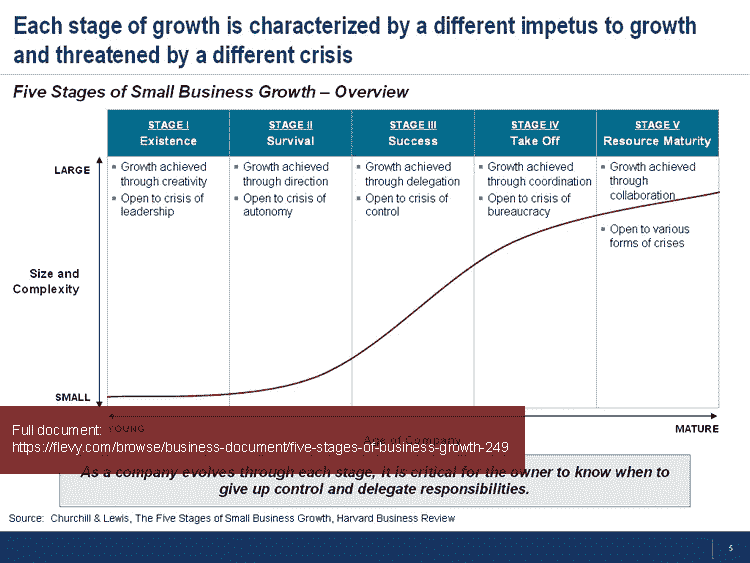
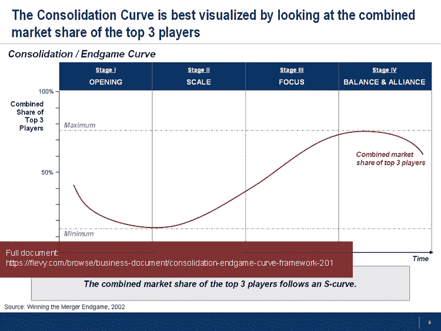

# 帮助您的中小型企业成长为企业的 3 个框架

> 原文：<https://medium.datadriveninvestor.com/3-frameworks-to-help-your-smb-grow-into-an-enterprise-b6a7a84c0f3e?source=collection_archive---------21----------------------->

*注:本文由我的同事***原创发布。**

**

*每个小企业都梦想成长为价值 1 亿美元的中型企业，而每个中型企业都梦想有更大的销售额。随着公司的成长，它会经历不同的成长阶段。事实上，每个成长阶段的公司都有特定的特征。了解、理解和预测这些特征将使任何企业为那个阶段做好最好的准备，并帮助它进入下一个阶段。*

*有几个经过时间考验的业务框架专注于 SMB 增长这一主题。这些都是管理咨询公司在为客户的增长挑战提供建议时使用的框架。在本文中，我们将讨论 3 个这样的框架。请注意，每个框架都与在 [Flevy](https://flevy.com/) 上出售的特定文档相关联。*

***业务增长的五个阶段***

*让我们先从框架开始，[业务增长的五个阶段](https://flevy.com/browse/business-document/five-stages-of-business-growth-249)。这一框架是基于这样一个事实，即所有企业在其发展的相似阶段都会遇到共同的问题。它更倾向于业务的独特方面，而不是行业。*

*熟悉企业成长的五个阶段，可以让企业主和企业顾问形成宝贵的见解，包括:*

*   *知道在什么阶段关注什么；*
*   *每个阶段适当的管理风格；*
*   *预测不同点的关键挑战；*
*   *公司发展的关键成功因素；*
*   *业主在不同阶段的参与；和*
*   *评估政府法规和政策的影响。*

*每个增长阶段都有不同的增长动力和不同的危机威胁。参考下图，形象化地描述这五个阶段是什么以及它们之间的区别。*

**

*每个阶段还需要不同的管理风格、不同的战略重点，并具有不同的系统和流程状态。例如，在“生存”的初始阶段，所有者管理每件事和每个人。没有已定义的业务流程，大多数流程都是临时的，不会重复。随着组织的成长，组织的管理和报告变得更加复杂；到阶段 3，“成功”，管理是功能性组织的；到了阶段 4，“起飞”，这是分裂；最后，在最后的“资源成熟”阶段，是生产线和员工。到最后阶段，本组织正在考虑实施一个全面的企业资源管理系统，以更好地管理其系统和流程。*

*有关该框架的更多信息，请访问此处:[https://flevy . com/browse/business-document/five-stages-of-business-growth-249](https://flevy.com/browse/business-document/five-stages-of-business-growth-249)*

***盘整曲线(或残局曲线)***

*[**整合曲线**](https://flevy.com/browse/business-document/consolidation-endgame-curve-framework-201) ，或 [**残局曲线**](https://flevy.com/browse/business-document/consolidation-endgame-curve-framework-201) ，是一个基于所有产业通过开放、规模、聚焦、平衡&联盟 4 个阶段进行整合并遵循相似路线的理论框架。该框架基于对全球 25，000 家公司的研究，代表全球市值的 98%，由科尔尼的全球战略咨询公司[进行。](http://www.atkearney.com/)*

*先前的框架隔离了业务的特征，而整合曲线框架将业务置于其行业的背景中。例如，这一框架表明，合并行动和合并趋势是可以预测的。当该行业处于规模阶段时，由于最大的参与者争夺市场份额，整个行业的 M&A 活动猖獗，推动了行业的增长。*

*通过查看前 3 名玩家的市场份额总和，可以最好地形象化整合曲线。请参考下图了解这一描述。*

**

*使用整合曲线作为指导，企业可以加强其整合策略，并促进合并整合。一个利基玩家也可以确定适当的利基战略使用和何时是最佳时机被收购。每一项重大的战略和运营举措都应根据行业在整合曲线中所处的阶段进行评估。同样，残局定位也为投资组合优化提供了指导。*

*曲线的持续时间因行业而异。例如，汽车工业已经有 100 多年的历史了，只是在第二阶段(规模)结束时才出现。也就是说，它通常持续 20-25 年。*

*这个框架的一个关键含义是，一个企业要想在行业的发展中生存，就必须收购或合并。它不能仅仅依靠有机增长。以下是一些额外的增长影响:*

*   *这不是最佳或最大的公司规模-为了生存，公司必须不断增长。*
*   *有机增长不是成功增长的途径。如果一家企业想超越竞争对手，合并是不可避免的。*
*   *几乎没有可保护的利基市场——随着所有行业的全球化，利基参与者将在聚焦、平衡和联盟阶段得到整合。*
*   *在曲线的各个阶段都有成功的利基策略可供公司采用。*
*   *每个阶段都意味着特定的战略和行动需要。*
*   *学习如何成功整合收购或合并伙伴正迅速成为成功的终端玩家(即前 3 名公司)的核心能力。*
*   *公司应努力优化不同阶段的子公司和业务单位的总体组合。*
*   *合并或收购应该沿着曲线推进产生的实体。*

*有许多精明的企业主直观地意识到这个框架概述的模式。然后，他们挑选行业，在早期开放阶段，在这些行业内开展业务。他们的目标仅仅是在接下来的规模化阶段被收购，这样就可以快速套现。*

*有关此框架的更多信息，请访问此处:[https://flevy . com/browse/business-document/consolidation-end game-curve-framework-201](https://flevy.com/browse/business-document/consolidation-endgame-curve-framework-201)*

***增长战略***

*所有企业——无论是小型、中型还是大型企业——都面临着实现可持续增长的挑战。增长通常受到缺乏突破性想法、平衡成本和利润权衡以及执行挑战的抑制。*

*这份[最后的框架文件](https://flevy.com/browse/business-document/growth-strategy-208)提出了许多与增长战略相关的公认管理模式。您可以认为这是关于该主题的一个更全面的工具包。*

*随着企业的发展，它必须跨越三个发展阶段，每个阶段都有不同的侧重点:*

*   *地平线 1:延伸和捍卫核心业务。*
*   *地平线 2:建立新兴业务。*
*   *地平线 3:为未来发展创造可行的选择。*

*每个领域都有不同的目标，需要不同的管理人员来管理和促进其发展。例如，初始阶段需要强有力的运营经理和领导者。最后一个阶段需要远见卓识和非传统的思想家。*

*欲了解更多关于增长战略的信息，请查阅本文:[https://flevy . com/browse/business-document/growth-strategy-208](https://flevy.com/browse/business-document/growth-strategy-208)*

*上述文件包括顶级管理咨询公司使用的业务概念和分析模型。它构建了“增长挑战”的各种视野，并深入到各种增长战略框架中——从波特的五种力量到蓝海。它还包括案例、完整的增长战略计划分解以及关键增长战略工作产品的列表。*

****您的业务是否严重依赖直销团队？*** [下载关于菲阿卡布林诺选拔过程的免费入门](https://flevy.com/fiaccabrino-selection-process)。这是 Charles Fiaccabrino(又名“罗氏先生”)在帮助罗氏诊断公司从一家小企业成长为价值数十亿美元的企业时开发和使用的方法。*

*如果你想了解更多关于业务框架的知识，看看[完整的业务框架参考指南](https://flevy.com/browse/business-document/complete-business-frameworks-reference-guide-644)和我们的[推荐文档列表](https://flevy.com/blog/recommended-documents-by-business-topic/)。*

*请在下面的评论中分享你的中小企业成长经验和理论。谢了。*

# *想在战略发展方面取得卓越成就吗？*

*获取知识，发展专业技能，成为战略发展专家。我们的框架基于领先的咨询公司、学者和公认的主题专家的思想领导力。[点击此处了解全部详情。](https://flevy.com/browse/stream/strategy-development)*

*“没有战术的战略是最慢的胜利之路。没有战略的战术，是战败前的噪音。”——孙子*

*为了有效的战略发展和战略规划，我们必须掌握战略和战术。我们的框架涵盖战略的所有阶段，从战略设计和制定到战略部署和执行；以及各个层面的战略，从公司战略到商业战略再到“战术”战略。这些方法中有许多是由全球战略咨询公司编写的，并且已经在他们的财富 100 强客户组织中成功实施。*

*这些框架包括波特的五种力量、波士顿咨询公司的增长份额矩阵、格雷纳的增长模型、能力驱动战略(CDS)、商业模式创新(身体质量指数)、价值链分析(VCA)、残局利基战略、价值模式、价值创造的综合战略模型、情景规划等等。*

*[点击此处了解我们的**战略发展最佳实践框架**。](https://flevy.com/browse/stream/strategy-development)*

*在 [**企业家精神和创业**](https://app.ddichat.com/category/entrepreneurship) **:** 中安排一次对话*

* [## 专家-企业家精神和创业- DDIChat

### DDIChat 允许个人和企业直接与主题专家交流。它使咨询变得快速…

app.ddichat.com](https://app.ddichat.com/category/entrepreneurship) 

在这里申请成为 DDIChat 专家。
与 DDI 合作:[https://datadriveninvestor.com/collaborate](https://datadriveninvestor.com/collaborate)
点击此处订阅 DDIntel [。](https://ddintel.datadriveninvestor.com/)*