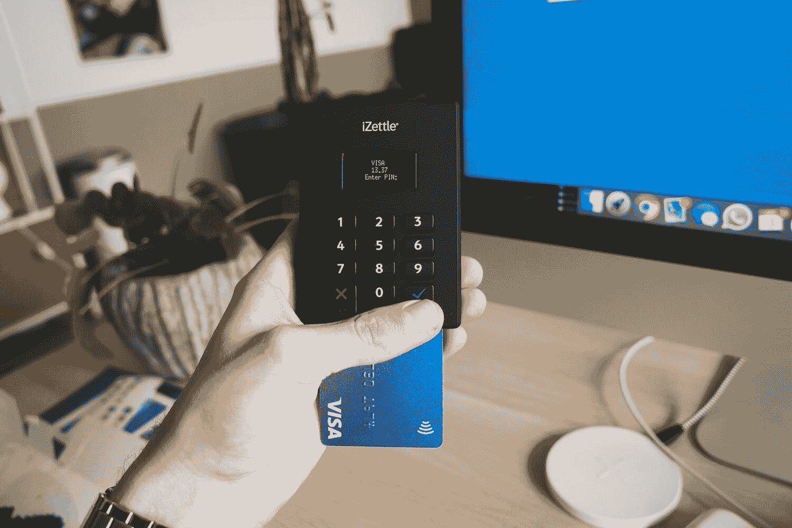
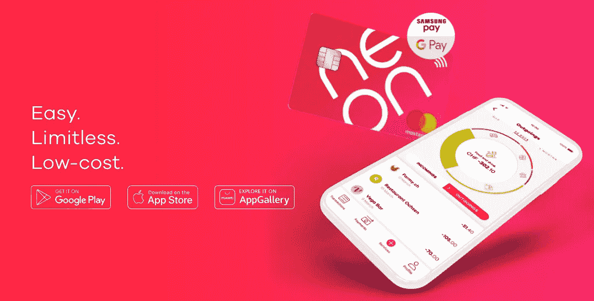
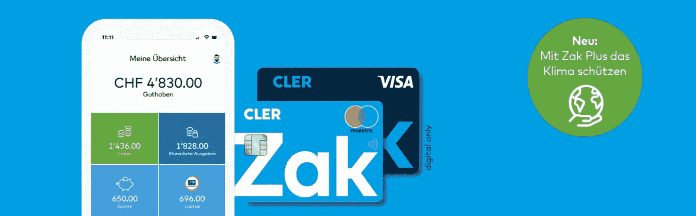
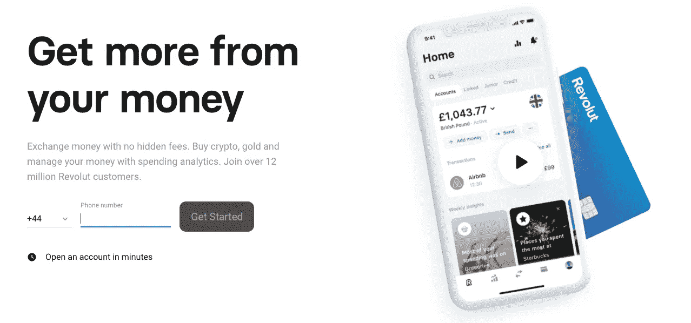

# 瑞士的 3 项免费银行服务

> 原文：<https://medium.datadriveninvestor.com/3-free-banking-services-in-switzerland-84e07675bfac?source=collection_archive---------7----------------------->

## 瑞士的银行业务比新加坡贵得多，虽然你可能会说每月 10 或 20 瑞士法郎不算多，但如果你把所有的借记卡、信用卡和外汇费用加起来，这可不是个小数目。但是，对于那些不想在付费选项上“浪费”钱的人，瑞士有免费的银行服务。

Photo by [CardMapr](https://unsplash.com/@cardmapr?utm_source=unsplash&utm_medium=referral&utm_content=creditCopyText) on [Unsplash](https://unsplash.com/s/photos/credit-card?utm_source=unsplash&utm_medium=referral&utm_content=creditCopyText)

我已经习惯了新加坡的零手续费卡，在那里你可以申请零手续费的借记卡和信用卡。一旦你用够了卡，你可以申请费用减免。很容易超出你需要在卡上花费的金额，实际上每年都是免费的。对于借记卡，只要你有一个低的最低余额，每月的费用是免费的。当我搬到瑞士时，我对银行收费如此之高感到震惊。

例如，如果你在瑞士联合银行或瑞士瑞信银行银行开了一个账户，并有一张借记卡，那么你每年需要支付[50 瑞士法郎](https://www.ubs.com/ch/en/private/accounts-and-cards/debitcards.html)，而在[开账户每年需要支付 15-20 瑞士法郎](https://www.ubs.com/ch/en/private/accounts-and-cards/debitcards/_jcr_content/mainpar/col1_copy/toplevelgrid/col1/linklist/link_copy_copy.0840612067.file/bGluay9wYXRoPS9jb250ZW50L2RhbS91YnMvY2gvc3dpc3NiYW5rL3ByaXZhdGUvemFobGVuLXVuZC1zcGFyZW4va29udGVuL3NlcnZpY2VzLWFuZC1wcmljZXMucGRm/services-and-prices.pdf)，这取决于你是需要电子银行对账单还是纸质对账单。拥有一个借记卡账户，每年的费用约为 230 瑞士法郎。如果你需要信用卡，基本信用卡每年要多付 100 瑞士法郎。你可能会争辩说，拥有一张信用卡可以帮助你积累航空公司的积分，如果你真的做了计算，你会看到为这张卡支付的数百美元是否值得你赢得的积分。有的可能，大部分人可能觉得不值得。

瑞士的州银行和其他大银行也收取同样的费用。即使从外国银行收到钱，你也要支付额外的费用。这些费用还没有用完。我曾经亲自去银行转钱到国外，他们犯了一个错误，不知何故钱被退回到我的账户。我被扣了 5 分！我又收到了一笔来自国外的 50 瑞士法郎的汇款，但是是同样的货币，然后我的银行收了我 9 瑞士法郎。我真的受够了所有的费用，所以我决定去非主流的金融科技公司服务。

# 1.霓虹灯银行

从 app 上，你可以清楚地看到你的钱从哪里来，去了哪里。你可以看到你的消费类别。它拥有所有的标准功能，但令人惊叹的是它的设计。

neon

它非常人性化，你不必在应用程序的数百个按钮中无休止地搜索功能。收款和转账都不收手续费。你可以在应用程序中轻松找到你的银行详情、有霓虹灯的朋友、报表、数字卡信息。没有基本费用，第一张卡的塑料价格为 10 瑞士法郎。但是，如果您使用**代码 14AV8V** ，当您打开您的帐户时，您可以免费获得您的卡，并在您的帐户中获得额外的 CHF10 奖金。因此，当你开立一个账户时，除了你想向国外转账时，一切都是免费的，这将需要你支付 0.8-1.7%的平均汇率费用，没有汇率附加费。更多价格信息，你可以在这里找到[。当您在国外使用该卡时，您只需支付一点额外的费用，没有其他银行额外的固定附加费，如瑞士法郎。](https://www.neon-free.ch/en/pricing/)

Neon 为其用户提供许多合作折扣，如支柱 3a、保险和其他服务。

总之，氖是伟大的

*   零费用账户
*   零手续费银行卡:使用代码 **14AV8V** 时获得现金奖励 CHF10 和免费卡一张，否则需要花费 CHF10。
*   零费用国内转账
*   境外用卡费用低:0.8-1.7%的汇率费用，无汇率附加费
*   易于使用的出色用户界面
*   每月两次免费 ATM 取款

> 使用代码 **14AV8V** 获得 CHF10 现金奖励和一张免费卡

# 2.班克勒扎克

[Zak](https://www.cler.ch/de/info/zak) 是来自 Bank Cler 的 app。它类似于 Neon，提供低费用和出色的数字银行体验。

该应用程序的主登录页面显示了不同的资金类别，这是一个很好的预算设计。因此，您可以将资金分配到每个存储桶，并在预算内支出。您可以根据需要创建任意多个存储桶。账户是免费的，基本卡也是免费的。Zak plus 卡每月收费 8 瑞士法郎。使用 plus 卡，您在瑞士从非银行信用卡的自动柜员机提款时将免于支付 2 瑞士法郎的费用，在国外提款时将免于支付 5 瑞士法郎的费用，并且在国外使用该卡付款时不收取任何费用。

使用基本卡，您已经可以免费享受您通常需要的服务，例如

*   开户 **30 天**内使用代码 **S9KX66** 时，免费账户有 CHF25 现金奖励，只需将代码输入 app 即可。
*   使用虚拟卡进行免费移动支付
*   使用虚拟卡在国外免费在线支付
*   在银行的自动柜员机上免费提取现金，否则在其他银行的自动柜员机上提取现金时，基本 Zak 卡需要 2 瑞士法郎。
*   瑞士法郎现金提取附加费，否则 Zak plus 卡免费。
*   在他们的网站上没有找到关于汇率的信息。

更多 Zak 和 Zak plus 的费用对比可以在[这里](https://www.cler.ch/de/-/media/files/bc/zak/zak_factsheet_de.pdf)找到。在应用程序中，你还可以找到 Zak 商店，那里有促销活动，保险，插件和其他银行 Cler 产品，如抵押贷款。

> 使用代码 **S9KX66** 开立一个免费账户，并获得 25 瑞士法郎的现金奖励。

*必须在开户后 30 天内将代码输入您的 Zak 应用程序，才能在您的帐户中获得 25 瑞士法郎的奖金。

# 3.革命报

[Revolut](https://revolut.com/referral/yasin2n9!20210121s) 是我第一次尝试的数字银行服务，因为我迫切需要低费用的国外支付服务。我过去经常出差，为了工作去不同的国家，每当我看到我在国外的信用卡支付在我的账户上产生额外的附加费时，我就感到刺痛。尤其是基于每笔交易的固定附加费。如果我买一杯咖啡，我必须支付附加费，如果我支付一个酒店房间，我必须支付附加费。而且，在国外旅行时，手头有现金并不总是最方便或最安全的方式。Revolut 刚出的时候，我好激动要办卡。我试用了基本卡，并支付了几年的高级卡，因为我享受了国外免费取现、国外免费转账和低汇率的好处。近年来，Revolut 限制了免费转账的上限，即使使用基本卡，它仍然有很多好处:

*   免费账户
*   免费基本卡
*   简单的注册流程
*   巨大的汇率
*   多种货币账户
*   卡的应用内控制:冻结或解冻
*   用于安全在线支付的数字卡
*   机场候机室服务:您可以直接从您的应用程序购买候机室机票。
*   每月 1250 法国法郎的外汇交易免收手续费，此后收取 0.5%的手续费。
*   每月 200 法郎零手续费 ATM 取款

> [注册并通过此**链接**](https://www.revolut.com/referral/yasin2n9!20210121s) 获得一张免费的革命卡

如果我再次开始频繁旅行，我将升级回高级帐户。ATM 取款限额更高，国外转账没有限额，当您的航班延误超过 1 小时时，您可以直接在您的 app 中获得 2 张机场贵宾室的机票，以及其他许多针对国际旅行者的优惠。

我会用 Neon 或 Zak 进行国内支付，用 [Revolut](https://www.revolut.com/referral/yasin2n9!20210121s) 进行国外或其他货币的支付。

## 免费银行服务

如你所见，瑞士的免费银行服务有多种选择。您可以用最少的费用满足国内和国外的支付需求。那么，为什么你仍然想为同样的服务每年支付数百美元呢？

可能有这样的情况，你是大银行的重要客户，他们可以为你签署费用豁免，因为你在银行的资产为他们创造了更多的利润。另一个好处是可以得到专门银行家的个人服务，当涉及到抵押贷款和融资时，他们可以提供很大的帮助。

如果你没有从银行获得那些额外的服务，只是需要一个日常使用的基本银行账户，你可以考虑换成那些免费的。把节省下来的钱用于投资，这可能会在未来产生更大的金额，所以为什么要浪费你的钱呢？

*原载于 2021 年 1 月 23 日*[*https://www . fast track . life*](https://www.fasttrack.life/blog/3-free-banking-services-in-switzerland)*。*