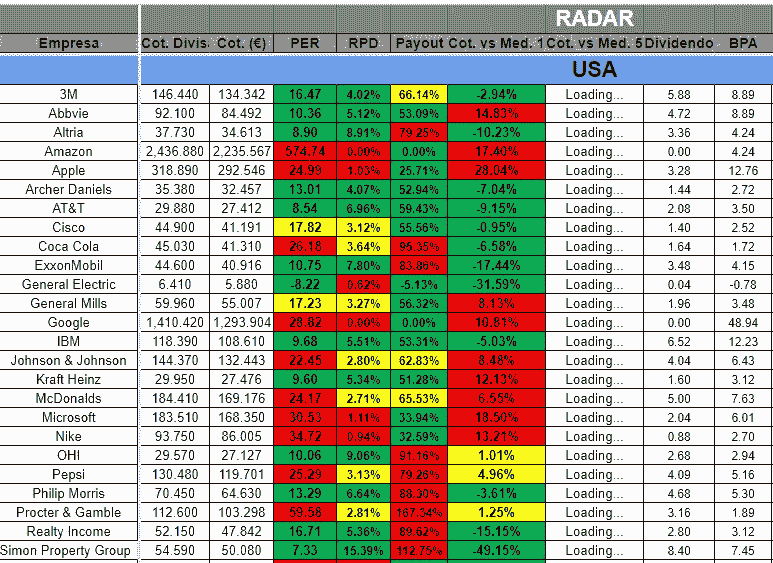

# 关于如何管理股票的 3 个想法——进行明智的投资。

> 原文：<https://medium.datadriveninvestor.com/3-ideas-on-how-to-manage-your-stocks-make-smart-investments-83eba4a0f748?source=collection_archive---------8----------------------->

## 智能股票跟踪

## 如何让你开始在股票市场上？

Photo by [Progressive Insurance](https://unsplash.com/@progressive/likes)

我们已经一次又一次地看到，投资股市的人在其他事情上不像他们通常那样消息灵通。正如[孔科达指出的](https://medium.com/concoda/the-key-to-not-losing-money-in-the-stock-market-according-to-peter-lynch-14c9ae001913)，当我们投资时，我们倾向于假设我们受到不同实体的保护(例如银行、政府、股票经纪人)，但是没有什么东西是*无风险投资*。所以我们不会花时间去获得正确的信息。

当我们买一辆汽车时，我们做许多研究，对吗？我们比较价格，看评论，与人交谈等等。随着我们了解的越来越多，我们对什么是适合我们的有了更好的理解。

股票投资不会出现这种情况。因此，让我们来看看 3 条建议，它们可以帮助我们在投资之前、之中和之后了解更多。

# 提示 1:找一个在线追踪器

不同的网站/应用程序让你建立自己的股票、债券和交易所交易基金*投资组合*。他们帮助你一个接一个地设定你的持仓，跟踪市场和你自己的股票走势。你会对自己的头寸有所了解，并将它们与市场发展进行比较。

这些*追踪器*应该易于操作，能够在不超过 15 分钟的延迟内更新价格，并帮助你追踪单个资产。此外，你应该从这个软件的免费版本*开始。这些追踪器大部分都有你免费需要的必备工具，所以没必要在这里浪费钱。至少在开始的时候。*

*以下是一些可能会用到的追踪器:*

*   *[**Sharesight**](https://www.sharesight.com/)**:**你可以跟踪全球 30 多个市场的股票。此外，你还可以跟踪货币(加密货币)、私募股权、债券等资产。*
*   *[**M1 财经**](https://www.m1finance.com/) **:** 基于饼状图。你把你的资产视为一块馅饼的一部分。它很容易导航，您可以尝试免费版本，看看它是否符合您的需求。*
*   *[**Betterment**](https://www.betterment.com/)**:**你可以下载 app，像其他任何平台一样做平常的事情。此外，您还可以同步您的外部帐户(例如银行帐户)，这样您就可以从一个地方监视一切。*
*   *[**地位金钱**](https://statusmoney.com/) **:** 这是基于同行的比较。它们充当你的基准，你可以在保持匿名的情况下进行比较。它更像是一个金融社交媒体，如果你喜欢社区分享，这很有趣。*

*你可以在购买资产之前*使用它。如果你不确定买哪只股票，你应该搜索你熟悉的行业。当你了解这个行业是如何运作的，并且对它充满热情时，你会更倾向于学习和保持更新。**

* [## 利用股市相关性的最佳方式|数据驱动的投资者

### 当阿尔弗雷德·温斯洛·琼斯开创了世界上第一个“对冲”基金(后来“d”被去掉了)时，他让其他投资者大吃一惊…

www.datadriveninvestor.com](https://www.datadriveninvestor.com/2020/02/02/the-best-way-to-use-stock-market-correlations/) 

例如，我喜欢搜索可再生能源行业的公司。我相信他们对环境有益，并希望投资于一个在世界范围内拥有各种绿色能源的未来。我要他们无处不在！

为了获得更好的信息，我会建议你在 [**上搜索华尔街**](https://simplywall.st/about) 上已经拥有的股票和未来的可能性。视觉上很吸引人。这些信息通过各种有见地的图表非常清晰地呈现出来。比起那些对你没有吸引力的来自其他网站的没完没了的文本、数字和公式，你会更好地消化这些数据(除非你是这方面的书呆子)。你也可以比较两个或更多的公司，并轻松地查看不同的指标。它让你很好地了解了这个特定行业是如何运作的，以及你能从中获得什么。

另外，看看这些投资组合追踪器是否能让你设置自动提醒。这些警报可以通过电子邮件或短信发送。他们会告诉你，如果你的一个或多个股票期权跌破你之前设定的某个阈值。* 

# *提示 2:跟随市场趋势*

*每当你试图预测未来时，你很可能会失败。股票经纪人和专家也会失败。所以要小心你从那里学到的信息。这并不意味着你不应该知道国内和国际市场上正在发生的事情。*

*你可以查看许多财经新闻网站:[金融时报](https://www.ft.com/)，[福布斯](https://www.forbes.com/)，[彭博](https://www.bloomberg.com/)等。*

*现在，你在找什么？你会听到大量的谣言、重大的新闻标题和专家的意见，所有这些都会让你比你需要的更焦虑。不要屈服于它，保持冷静。*

*对于所有忙碌的人来说，你应该关注 4 件事:*

*   ***利率:**如果利率很高，你会看到股价下跌。资金成本更高，因此当公司贷款时，成本更高，这反过来会减少他们的收益。收益越低，股价越低。另一方面，如果利率较低，公司会降低成本(支付的利息较少)，从而改变成本/收益比。广义而言，更高的收益转化为更高的股价。*
*   ***商品:**追踪原材料价格随时间的变化。寻找燃料(想想交通运输)、粮食或肉类等生食(生存的基本必需品)、矿产品(例如铜对智利经济非常重要)，以及其他可能影响你将投资(或已经投资)的行业的基本资源。*
*   *一般新闻:你必须意识到外面正在发生什么。例如，冠状病毒的情况和政府对它的态度。想想这种情况如何影响你的投资组合。当 Avianca 宣布破产时，Zoom 蓬勃发展。同样的情况对公司的影响可能大相径庭。沿途连接一些点。*
*   *财务报表:这适用于公司的季度新闻和年度报告。去公司网站上的“*投资者板块*”你会找到你需要的信息。你也可以关注公司的季度会议报告。直播时可能不会，但你可以去他们的网页下载那个季度所谓的“*电话会议*”(或者他们给它起的名字)。或者获取 PDF 版本。如果你想了解这个想法，这里有一个例子。

    在这些报告中搜索*以下内容*:如果有潜在的大型收购或资产出售，他们的信贷对未来增长的影响，以及他们计划如何增加收入。你会看到公司的立场以及从现在开始你的期望。*

# *技巧 3:学习基本的股票信息*

*最后要考虑的是，在选择股票时要知道要寻找什么。你如何以一种有意义的方式来消化它，并帮助你做出决定？让我们来看看几件事，它们能让你更好地了解你正在买入的股票类型:*

*   ***股票波动率:**价格如何随时间变化？当你比较股票在一个交易日、一周和/或一个月的最高价和最低价时，你可以观察短期的可变性。巨大的差距意味着巨大的机会，但也意味着巨大的风险。如果波动范围很窄，这是一个更安全的赌注(收益也更少)。了解价格区间相对于市场及其特定行业的变化情况。

    与市场的平均波动性相比，股票处于什么样的位置？高端(收益大，风险大)还是低端(收益低，风险小)？*
*   ***市盈率:**市盈率告诉你一家公司的价值，让你发现它是被高估还是被低估。

    1。一种思考方式是:你可以看到我愿意为当前收入的 1 美元支付多少。如果市盈率是 4，我将为 1 美元的年收入支付 4 美元。这个可能被低估了。如果是 20，那么我必须投入更多的钱来得到 1 美元。也许不值得这么麻烦，它可能被高估了。

    2。*另一种思考方式*:看看如果收益保持不变，需要多少年才能收回股价。如果 P/E 是 6，我将花 6 年时间收回我的钱，因为这种虚构的股票是 18 美元，每年每股收益 3 美元。或者股票价格可能是 12 美元，年收入是 2 美元。或者任何其他能给你带来 6 倍市盈率的组合。
    *注:将市盈率与公司经营所在行业的平均市盈率进行比较。总是把它放在上下文中。**
*   ***股息:**公司通过向持有其公司股票的股东支付报酬来回报他们。它基于公司上一年度的净利润，通常每季度支付一次。一般来说，公司不会把所有的净利润都分发给股东，所以你需要知道分出去的比例。寻找股利支付率。例如，可口可乐 2019 年的支付率为 76.67%。*

*还有许多其他股票信息可以帮助你更好地浏览股票市场。如果你和任何一家经纪公司合作，他们会给你大量的信息、图表和新闻，让你对你的投资组合有一个很好的了解。有时你会得到比你能咀嚼的更多的信息，所以你也可以考虑有你自己的摘要 Excel 表格。这里有一个例子可以说明这种情况:*

**

*[Screenshot of Investing Little by Little Blog [Original: “Invirtiendo Poco a Poco”]](https://www.invirtiendopocoapoco.com/radar-empresas/)*

*这对夫妇写了一篇关于通过长期股票投资实现财务独立的综合性博客。他们展示了他们所做的事情，这样你就有了第一手的经验。如果你懂西班牙语，我建议你去看看。*

*在这里，他们提供了一些股票指标，如市盈率(西班牙语为 PER)、股息率(西班牙语为 RPD)、股息支付等。这是彩色编码，所以你可以很容易地跟踪它，你可以看到每个股票本身。我会按行业对它们进行分类，这样你就能更好地比较和了解这个特定市场。但是任何人都可以按照自己喜欢的方式去做。重要的是，它必须与你相关，否则你永远也不会去看它(或者更新它！).*

*股票市场上有很多机会，但如果你不做出明智的决定，这些机会就没用了。风险总是存在的，但是你可以通过学习股票市场的方法来显著降低风险。*

*这三个建议可以帮助你完成这个任务，一旦你开始使用它们，你会对你的决定感到更加舒服。让我们回顾一下:*

1.  ***买一个在线追踪器**:在构建你的投资组合时，你会希望对你资产的涨跌有一个好的概念。一个在线或应用程序可以为你做这些工作，有很多好的选择可以帮助你。*
2.  ***跟踪市场趋势**:任何股票都是大局的一部分，所以你必须记住这些国内和国际事件是如何影响股市的。了解在哪里寻找什么。*
3.  ***学习基本的股票信息**:一旦你学会了如何跟踪股票，什么影响它们的价格，你就必须能够知道你拥有什么样的股票。这里是不同的比率和公式派上用场的地方，你会更好地了解你的股票的主要特征。*

*掌握所有这些需要时间，但这会给你一个好的开始。*

*记住，熟能生巧。*

*如果你喜欢阅读这样的故事，并愿意支持 Medium 上的作者，考虑注册成为 Medium 会员。每月只需 5 美元，你就可以无限制地阅读世界各地优秀作家的文章。*

*你可能想看看你的大脑是如何欺骗你做出糟糕的决策的。我建议您查看这篇文章:*

* [## 想投资？记住这种常见的心理错误

### 不要放松警惕。

medium.com](https://medium.com/makingofamillionaire/want-to-invest-keep-in-mind-this-common-psychological-mistakes-db5f459ab9cd)*