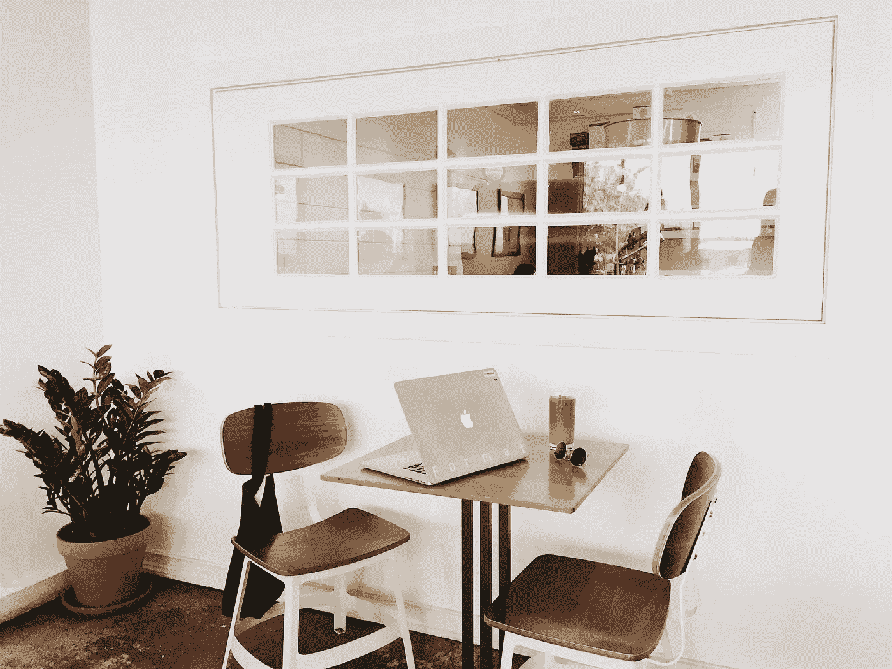

# 当你陷入困境时，坚持下去的 3 个方法

> 原文：<https://medium.datadriveninvestor.com/3-ideas-to-keep-going-when-youre-feeling-stuck-f2bc291ad38a?source=collection_archive---------29----------------------->

## 当事情充满挑战时，你如何应对？

By [Format](https://www.pexels.com/@format-380633) from [Pexels](https://www.pexels.com/photo/1029138)

当有恐惧和不确定时，你如何保持冷静？

在一个理想的世界里，保持冷静和专注于你的呼吸是保持脚踏实地的一种方式。事实上，有时候你会感到不平静，但这没关系。

回想起来，当我没有保持冷静和镇定时，我对自己很严厉。我也必须提醒自己，我们是在疫情，给自己一些恩典。

日常生活中有太多不确定的时刻。随着每日新冠肺炎病例数量的上升，我们被要求呆在家里，但仍有一些东西需要外出。例如，修理我的电池。我尽可能多地通过电话与技术人员联系，当需要更换电池时，我必须把它带到商店。在商店里，员工对不清楚的信息产生了极大的恐惧。由于沟通不畅，它制造了更多针对我的恐惧和愤怒。想想沟通不畅的后果。有一段时间，我不知道发生了什么，也不知道是否有可能与患有新冠肺炎的人有过互动。这造成了恐惧，因为信息不清楚，我不得不不断要求澄清情况。谢天谢地，结果是负面的，尽管想想一个人必须经历的精神压力。

在这些有压力的时刻，很容易就放弃了，什么都不做。为了每个人的利益，清晰是非常关键的。

 [## 你的 COVID 等级是多少？为疫情安全设计办公空间|数据驱动投资者

### 自从新冠肺炎·疫情席卷美国，迫使工人逃离办公室，走向孤立无援的境地…

www.datadriveninvestor.com](https://www.datadriveninvestor.com/2020/11/23/whats-your-covid-rating-designing-office-spaces-for-pandemic-safety/) 

如果你感到停滞不前和不确定，这里有 3 个想法可以探索:

1.  **断开。**在不知所措的状态下，我不得不尽最大努力断开手机和持续不断的提醒。在很多情况下，我把它放在不同的房间里以切断能量。我也一直在切断能量线来释放情感的电荷。在如上所述的情况下，我被恐惧和不确定性包裹得如此之深，以至于我忘记了切断能量线，这就发生了。我可以感觉到“逃跑或战斗”的感觉，在同一周，还有另一种潜在的间接互动的情况，谢天谢地，结果是负面的。经历了这一切，我感到筋疲力尽，必须想办法充电。
2.  **低冲击运动。通过打乱我的日常工作，我发现自己又回到了 Chris 的[气功](https://sheltonqigong.com/)视频中，让我思考的大脑休息一下。随着天气越来越冷，白天的时间越来越少，我已经错过了一些日常散步。散步是晒晒太阳、晒晒大自然的好方法。我有时认为这是我每天的散步冥想，以摆脱我的头脑，回到我的身体。散步还能帮助我重新定位，专注于周围的环境。有些日子我可以挤出时间散步，而有些日子，我转向[瑜伽](https://www.youtube.com/user/yogawithadriene)或气功，这样我可以让我的身体活动起来，让身心感觉更好。**
3.  放下对“完美”的需求。我们正处于一个不确定的时代，有些我想要的答案并不总是存在。即使我没有完美的信息，也可以采取行动，这是一项正在进行的工作。一个很好的提醒是*“我正在尽我所能利用现有的资源。”随着事情的不断变化，我必须接受新信息，并利用现有信息。否则，如果我被卡住了，我不会采取行动。采取一个小小的行动给了我更多的信息。即使我在精神上认为我做得不够，我也必须记住，这是一段时间以来采取的小行动的复合效应。*

请记住，在这些充满挑战的时刻，你并不孤单。

**订阅** [**卡罗琳咨询**](https://www.carolynconsulting.com/) **了解更多更新。**

## 访问专家视图— [订阅 DDI 英特尔](https://datadriveninvestor.com/ddi-intel)