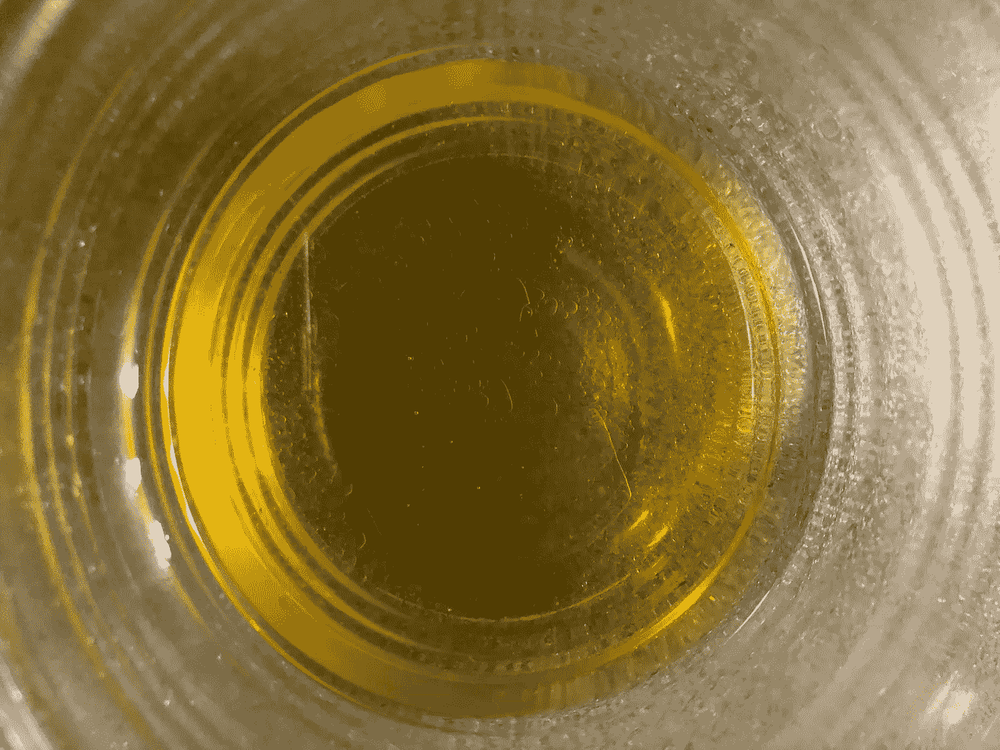
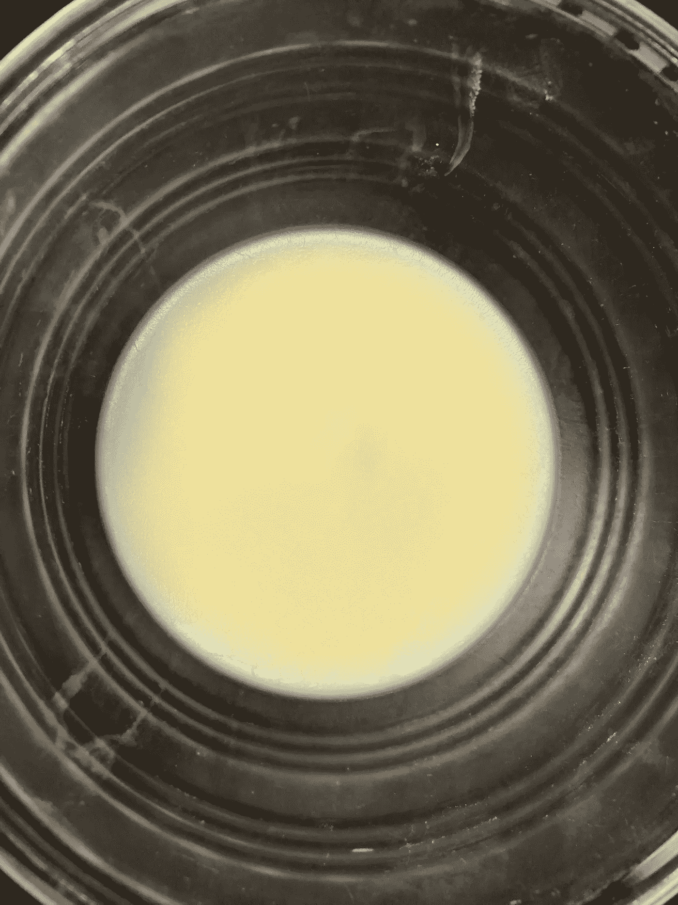

# 消除不舒服感觉的 3 个方法

> 原文：<https://medium.datadriveninvestor.com/3-ideas-to-move-through-uncomfortable-feelings-33e462c475cd?source=collection_archive---------14----------------------->

## 保持能量流动

By Karolina Grabowska from Pexels

> "逆境中走出**机遇**"—本杰明·富兰克林

经历不适的感觉会让你感到痛苦。日日夜夜的担心、不确定和沮丧是具有挑战性的。我个人也经历过这种情况，对我来说，这种感觉很强烈。我一直在尽最大努力将能量移出我的身体，并允许它释放。

退一步说，这不仅仅是一个挑战，我经常怀疑我正在做的事情是否真的有用。有时候，会变得更糟，变得更好，变得更好。

有那么多天我没有选择投降。

在这些情绪被放大的时候，我提醒自己，我可以选择关注我的身体和它需要什么。是的，感觉不方便，没有生产力。

 [## 后疫情经济中的基本 GTM 变革策略|数据驱动的投资者

### 新冠肺炎以一种新的不可想象的方式开展业务。这个疫情甚至强迫…

www.datadriveninvestor.com](https://www.datadriveninvestor.com/2020/08/11/an-essential-gtm-change-strategies-in-the-post-pandemic-economy/) 

这里有三个方法可以帮助你克服这些日常不舒服的感觉:

1.  **采取日常小行动**。做一件让你自我感觉更好的事情。每个人都是不同的，所以找到适合你的。让我的身心得到休息让我恢复了活力。去公园有助于释放能量。观看关于网飞的新节目和纪录片有助于我集中精力学习新事物。
2.  **充分体验情绪。我一直在说出我的真实感受，尊重我的感受。这是一个充满挑战的过程。通过对自己更加诚实，承认即将发生的事情，我可以在沟通不清楚时提出更好的问题来获得澄清。这对我来说是重要的一课。为我澄清问题，并(不断地)放下对他人想法的担忧，这给了我一种自由感。这也提醒了我要把焦点带回到自己身上。**
3.  相信逆境的恩赐。老实说，这个很棘手。我是一个不完美的人，我必须一遍又一遍地记住这一点。通过做一些研究和测试配方，我学会了自制天然皮肤疗法(见下图)。我利用自己的能力不断寻找解决方案。它们可能不会马上奏效，尽管至少我知道我在尽我所能做到最好。我正在采取行动，让自己保持动力，改变心态。

Melting the oils and letting the compound settle at room temperature. Then move it into the fridge.

After taking the homemade cream out of the fridge. Shea butter, squalane, vitamin E, jojoba oil and a few drops of essential oils.

**访问专家视图—** [**订阅 DDI 英特尔**](https://datadriveninvestor.com/ddi-intel)