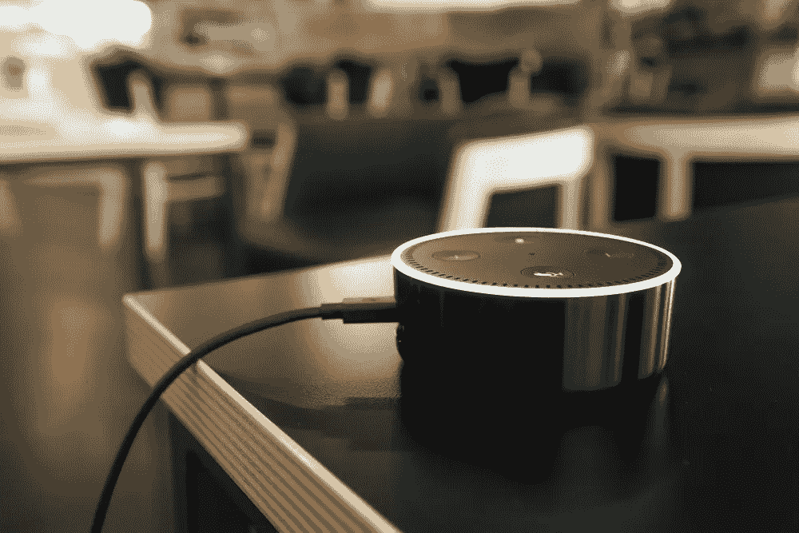

# 3 个行业使用 Alexa 技术实现目标

> 原文：<https://medium.datadriveninvestor.com/3-industries-crushing-their-goals-using-alexa-technology-80cd4f6349f2?source=collection_archive---------25----------------------->

某些行业已经利用了语音识别技术的力量，这是我们从未见过的

亚马逊 [Alexa Technologies](https://www.thesunflowerlab.com/alexa-echo-application-development/) 是每个人的下一件大事！从完美的办公室助手到经典的省电爸爸，Alexa 技术无处不在。Alexa 是一个非常有才华的年轻人…呃，发展…但它总是安全的吗？在本文中，你将了解利用 Alexa 技术的三种方式，以及亚马逊为确保信息安全和用户舒适性而设置的设置/功能。

# Alexa 技术如何工作

Alexa 是亚马逊开发的语音控制虚拟助理人工智能技术。它有许多敏感的麦克风，每当说出“Alexa”、“好吧，谷歌”和“嘿，Siri”时，它就会“醒来”。Alexa 技术感觉到它正在被调用来执行任务，并“开始倾听”用户的语音命令。该设备收集所有语音命令，并将它们发送到自然语音识别软件系统——一个名为 [Alexa 语音服务](https://developer.amazon.com/en-US/alexa/alexa-voice-service)的亚马逊云服务。它解释命令，执行相关的动作，并向用户发回适当的响应。关于 Alexa 技术如何工作的更多信息，[点击这里](https://www.thesunflowerlab.com/blog/how-amazon-alexa-works/)。

 [## 新的健康技术如何让我们活过 100 岁？数据驱动的投资者

### 不久前，我们都在看一台黑色电视，不得不带着天线跑遍整个公寓，以确保…

www.datadriveninvestor.com](https://www.datadriveninvestor.com/2020/08/12/how-new-health-technology-makes-us-live-past-100-years/) 

# 面向办公室和地方政府的 Alexa 技术

在如此短的时间内有如此多的事情要做，办公室优化可能不是一个优先事项。这款时尚智能的设备能够节省您的时间，减少昂贵的人力，并且只需几句话就能削减公用事业成本:“嘿，Alexa…”。

*   增加安全性:[犹他州](https://www.govtech.com/civic/7-State-or-Local-Governments-Using-Amazon-Alexa.html)是首批采用亚马逊 Alexa 来增强政府服务的州之一，而且是以一种非常有创意的方式。这个蜂窝州正在利用这个平台来教育居民练习驾照考试。Alexa 可以利用犹他州屡获殊荣的创新，就州驾驶规则对学生进行测验。
*   降低成本:没有身体，没有利益。这个方便的小桌面配件可以同步你的谷歌日历，存储你的约会，并以较低的一次性成本第六次提醒你首席财务官妻子的名字。
*   安全能源:当所有人都不在办公室时，Alexa 可以做任何事情，从关灯到降低恒温器的温度。

关于 Alexa 技术如何帮助地方政府的更多信息，[点击这里](https://www.thesunflowerlab.com/blog/3-ways-alexa-skills-can-save-money-for-local-government-plus-one-bonus-benefit/)。

安全预防措施:在 NSFW 谈话中失言？或者你可能想确保机密信息没有记录在你的 Alexa 上。你可以随时在 [Alexa 隐私设置](https://www.amazon.com/hz/mycd/myx?redirectAnchors=%2F%23%2Fhome%2FalexaPrivacy%2Fhome%3Fref%3Dkinw_apd_from_alexaPrivacyHub)或 Alexa 应用程序中查看、听到和删除你的语音记录。通过语音删除，你也可以说“Alexa，把我刚才说的删掉”或者“Alexa，把我今天说的都删掉。”

# Alexa 在家吗

家里的 Alexa 技术可以让你在舒适的沙发上订购披萨，检查披萨的交付状态，控制吊扇的速度，等等。使用简单的语音命令来询问类似“Alexa，外面的温度是多少？”以及“Alexa，现在影院在放什么电影？”[物联网](https://www.thesunflowerlab.com/iot-application-development-company/)技术使 Alexa 能够通过简化你的日常事务，如开灯、拔掉电器插头和设置恒温器，让你的家变得更加智能和自动化。智能家居设备新手？查看[设置页面](https://www.amazon.com/gp/browse.html/ref=s9_acss_bw_cg_JanSH_1a1_w?node=18379216011)。

安全预防措施:你的家是一个私人的地方。如果您不喜欢在家里使用带摄像头的 Echo 设备上的已启用摄像头，您可以通过按一个按钮来关闭摄像头和麦克风。[内置快门](https://www.amazon.com/b/?node=19149155011&tag=googhydr-20&hvadid=352456913466&hvpos=&hvnetw=g&hvrand=12074319095981451261&hvpone=&hvptwo=&hvqmt=e&hvdev=c&hvdvcmdl=&hvlocint=&hvlocphy=9014923&hvtargid=kwd-627945252893&ref=pd_sl_9g20ttlk7a_e)可让您轻松盖住相机，让您更加安心。

# 用于房地产的 Alexa 技术

[住宅房地产委员会](https://crs.com/)来到向日葵实验室，寻求一种替代方法来帮助他们的用户使用自然语言搜索全国 28，000 多名认证住宅专家(CRS)设计者。像 Alexa 和 Google Home 这样的语音设备将会出现在 T2 70%的美国家庭中。这为构建支持语音的设备的应用程序提供了巨大的市场机会。于是，“找一个 CRS”诞生了。

该搜索允许用户首先通过他们的位置，然后通过他们的专业、称号、认证、他们说的语言等来找到 CRS 代理。根据结果的数量，用户可以选择通过 Alexa 大声朗读来收听个人资料，或者收到一封包含更多详细信息的电子邮件，包括 CRS 代理的联系信息。“查找 CRS”——Alexa 和 Google Home 应用程序可以搜索顶级房地产代理商。要阅读更多关于房地产行业的 Alexa 技术，[点击这里](https://www.thesunflowerlab.com/portfolio/alexa-find-a-crs/)。

安全预防措施:你对找房子感兴趣，但还没有准备好你的房子上市？你与 Alexa 的所有互动在传输到亚马逊的云端时都会被加密，并安全地存储在那里。

# 亚马逊技术的力量

一次又一次，Alexa 技术帮助向日葵实验室的客户扩展他们的产品，整合信息，并即时、轻松、准确地创建工作场所凝聚力。我们不仅在整个过程中提供逐步支持，而且我们的服务由严格的培训计划和充满激情的设计师和开发人员提供支持，他们致力于以创新的方式释放新的机会。

**进入专家视角—** [**订阅 DDI 英特尔**](https://datadriveninvestor.com/ddi-intel)