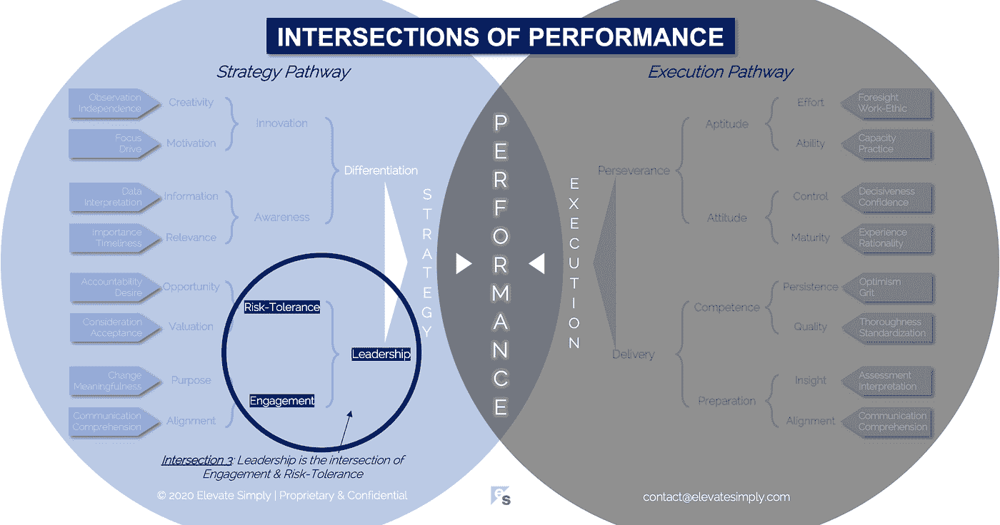

# 领导力:参与和风险承受的交集

> 原文：<https://medium.datadriveninvestor.com/3-leadership-the-intersection-of-engagement-risk-tolerance-f8c887e6c1d3?source=collection_archive---------15----------------------->

Image from 123rf.com

你认为谁是好领导？你欣赏他们的领导能力的哪一点？我认为领导者是天生的，也是后天培养的，这意味着领导力可以是天生的，也可以是后天习得的。我经历过出色的领导和糟糕的领导。有趣的是，出色的领导者并不总是成功，糟糕的领导者也不总是失败。这是因为领导力不仅仅是观察者的主观看法。

对领导力的认知并不总是与相关的领导力现实相平衡。随着权力和控制而来的是责任和义务。随着表扬和认可而来的是评判和隐私的缺失。随着受欢迎和受欢迎而来的是孤独和压力。

我的观点不是建议我们应该为领导者感到遗憾，或者奖励他们更多，而是认识到这一点很重要，就像生活中的许多其他事情一样，领导力不仅仅是“看得见”的东西。从视觉上看，我喜欢漂浮冰山的形象，在水面上只能看到整体的一小部分。领导力通常以一些过度使用的术语来描述(例如，可见的冰山一角)，但这些术语并不能说明全部情况。

**什么是领导交集？**

领导力是敬业度和风险承受能力的交集*(见下图交集 3)*。大多数时候，领导力是从如何完成、结果如何或一个好领导者的特质来描述的。然而，这个“交集”是关于领导力的先决条件，通常不会被分析。

*订婚*

领导力需要两种类型的参与。首先是领导者的自我参与。如果领导者没有参与到公司、工作、流程或任务中，那么被领导的人会感觉到、看到和/或听到。脱离不需要被明确地陈述甚至贴上标签，因为即使是我们当中观察力最差的人也很容易发现。敬业的领导者散发出乐观、可能性和潜力。通常他们不会愚蠢到保证结果，而是以身作则，激励他人效仿。

这导致了第二种类型的参与，即团队的参与。敬业的领导者更容易让团队参与进来。团队参与不仅仅是一种“能行”的态度，而是要创造一种环境，在这种环境中，进步和成功是现实的结果，服务于与人们产生共鸣的目的*(这是未来交集的一个小伏笔)*。属于一个有着共同目标的团体，并有能力去追求它是一种强大的动力。

当领导者和团队都参与时，领导力是最成功的。

交叉点 3:领导力=参与+风险承受能力

Image by [Brett Simpson](https://medium.com/u/191cf90a65d7?source=post_page-----f8c887e6c1d3--------------------------------)

*风险承受能力*

与参与类似，领导力需要两种风险承受能力。首先是领导者和每个团队成员的个人风险承受能力。在不知道确切结果甚至后果的情况下，冒险或做一些以前没有做过的事情的意愿和能力可能是可怕的。领导者和公司创造的文化和工作环境类型将决定个人表现出的风险规避程度。

这导致了第二种类型的风险承受能力。个人的集体宽容决定了团队宽容的水平。以我的经验 1+1 > 2，当谈到团队的风险承受能力时。一个渴望抓住机会(有时合理，有时不合理)的团队是特殊的。在任何情况下，他们都不会总是成功，但他们消息灵通的无畏精神是一个领导者的有力工具，可以用来推动公司以一种在更不利于风险的环境下不可能实现的速度前进。

**理想的领导力**

当敬业度与风险容忍度相匹配时，领导力就产生了。领导是领导的过程，从这些先决条件开始，随着有关各方的参与而继续，并以结果而结束，这些结果将不可避免地在不同程度上被判断为成功或不成功。

虽然这是一个过程，但很难复制，因为正如没有两个人是相同的，也没有两个团队、公司或情况是相同的。每一个领导力的例子都必须由领导者定制，这当然是具有挑战性的，而且(有时)令人筋疲力尽，但这也是我们对领导者和领导力着迷的原因。有些人让它看起来很容易，而其他人似乎从来没有得到它的权利。

因为有很多因素会影响理想的领导力，破坏或阻止它比创造它更容易，因为不可能控制所有的变量。

**领导者能做什么？**

领导者必须愿意学习。虽然有些人天生就有领导能力，但每个领导机会的动力都是不同的和不断发展的，所以学习是不断发生的。优秀的领导者会向他们的上级、下级和周围的人寻求领导力的最佳实践。

这些领导者也明白领导力是一个过程，他们努力影响每个阶段，以提高成功的机会并降低风险。

**总结&下一个**

当谈到领导力时，参与和风险承受能力可能不会被普遍想到，但它们是良好领导力运作的基础设施的关键部分。

下一次，我们将检查性能的第四个交叉点，即**差异交叉点**。

在这一系列文章中，我们探索了性能*的交叉点，共有 30 个。*绩效的交叉点*框架是基于*[*Brett Simpson*](https://www.linkedin.com/in/brettjsimpson/)*[*的常务董事*](https://www.linkedin.com/company/elevatesimply/) *的经验和见解，他在大大小小的组织中担任了 20 多年的领导，并且是一名企业家、顾问和投资者。**

***绩效-文章链接的交集***

*1.[业绩:战略的交集&执行](https://medium.com/the-innovation/1-performance-the-intersection-of-strategy-execution-2bf06329f8d4)*

*2.[战略:领导力的交叉点&差异化](https://medium.com/the-innovation/2-strategy-the-intersection-of-leadership-differentiation-a568b17731ab)*

*3.[领导力:参与的交集&风险承受能力](https://medium.com/the-innovation/3-leadership-the-intersection-of-engagement-risk-tolerance-f8c887e6c1d3)*

*4.[差异化:创新的交叉点&意识](https://medium.com/@brettjsimpson/4-differentiation-the-intersection-of-innovation-awareness-a21d053ecf12)*

*5.[啮合:目的交点&对准](https://medium.com/@brettjsimpson/5-engagement-the-intersection-of-purpose-alignment-953747437c26)*

*6.[风险承受能力:机会的交叉点&估值](https://medium.com/@brettjsimpson/6-risk-tolerance-the-intersection-of-opportunity-valuation-29cf4d9a0ac)*

*7.[认知:信息的交集&关联性](https://medium.com/@brettjsimpson/7-awareness-the-intersection-of-information-relevance-f0fd5322bcb7)*

*8.[创新:创造力的交汇点&动机](https://medium.com/@brettjsimpson/8-innovation-the-intersection-of-creativity-motivation-7c1a12e0d5e2)*

*9.[目的:变化的交集&意义的交集](https://medium.com/@brettjsimpson/9-purpose-the-intersection-of-change-meaningfulness-9f12b0153e1)*

*10.[估价:对价的交集&验收](https://medium.com/@brettjsimpson/valuation-the-intersection-of-consideration-acceptance-eebe7b15e763)*

*11.[机会:欲望的交汇&责任](https://medium.com/the-innovation/opportunity-the-intersection-of-desire-accountability-7e81adb1e195)*

*12.[相关性:重要性的交集&及时性](https://medium.com/@brettjsimpson/relevance-the-intersection-of-importance-timeliness-56cc748eb066)*

*13.[信息:数据的交集&解读](https://medium.com/@brettjsimpson/information-the-intersection-of-data-interpretation-62acc94ba8bf)*

*14.[驱动:焦点的交点&驱动](https://medium.com/@brettjsimpson/14-motivation-the-intersection-of-focus-drive-d9ebd3ca9951)*

*15.[创造力:观察的交集&独立性](https://medium.com/@brettjsimpson/15-creativity-the-intersection-of-observation-independence-57f7294acb2b)*

*16.执行力:毅力与交付的交集*(即将推出！)**

*17.交付:准备与能力的交集*(即将推出！)**

*18.毅力:天资与态度的交汇*(即将推出！)**

*19.准备:洞察力和一致性的交集*(即将推出！)**

*20.能力:坚持与质量的交汇点*(即将推出！)**

*21.态度:控制与成熟的交集*(即将推出！)**

*22.资质:努力与能力的交汇点*(即将推出！)**

*23.洞察力:评估与解释的交集*(即将推出！)**

*24.质量:彻底性和标准化的交汇点*(即将推出！)**

*25.坚持:乐观与勇气的交汇*(即将推出！)**

*26.成熟:经验与理性的交集*(即将推出！)**

*27.控制:果断与自信的交汇*(即将推出！)**

*28.能力:能力与实践的交集*(即将推出！)**

*29.努力:远见和职业道德的交集*(即将推出！)**

*30.对齐:传播与综合的交汇点*(即将推出！)**