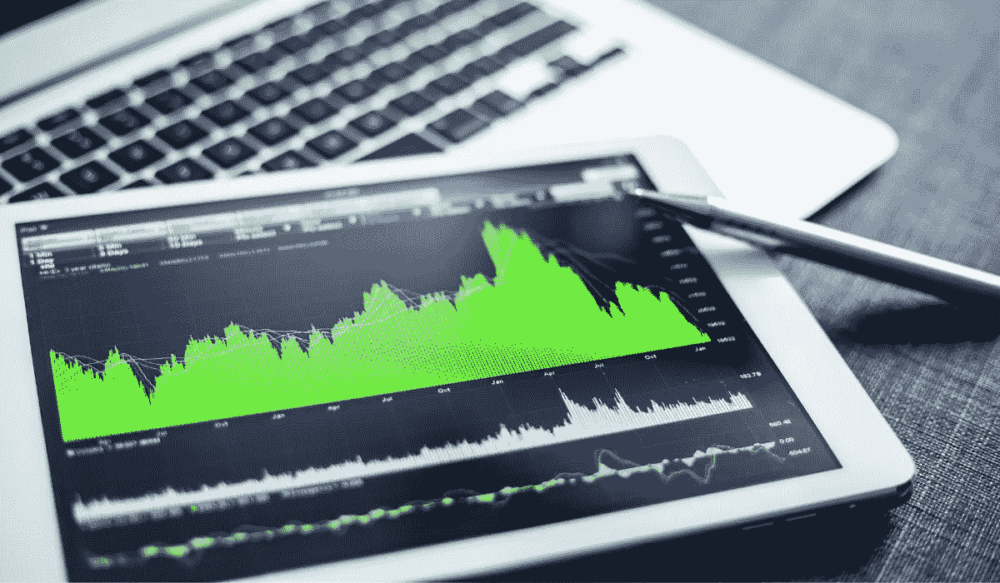

# 3 为更高的股市回报的思维转变

> 原文：<https://medium.datadriveninvestor.com/3-mindset-shifts-for-higher-stock-market-returns-c107597b3a92?source=collection_archive---------8----------------------->

## 如果你想成为一名成功的投资者，就要像他一样思考

股票市场给投资者提供了一个看着他们的钱增值的绝佳机会。一些投资者利用股市作为成为百万富翁的途径，你现在或将来都可能成为这些人中的一员。

为了从你的股票中获得更高的回报，你必须改变三种心态。在经历了这些心态转变后，你会以不同的眼光看待每只股票，在经历了这些心态转变后，你会以不同的眼光看待机会。

# #1:比股价更关心估值

大多数新手投资者认为亚马逊很贵，因为它的股价超过了 3000 美元。虽然一股亚马逊股票的价格远高于一股 Workhorse 股票(在撰写本文时大约在 20 美元左右)，但亚马逊看起来很贵。

然而，当你看到亚马逊的市净率为 4.55，而 Workhorse 的市净率超过 3000 时，很明显哪只股票的估值更高。

估值过高带来了更高的风险。如果 Workhorse 没有获得美国邮政的合同(其高价格的主要催化剂)，倍数可以收缩，它的收缩将对股票产生毁灭性的影响。

市盈率是比较盈利价值股的一个很好的方法，而市盈率更适合那些更关注增长和缩小亏损的成长型公司。

我个人更喜欢使用市净率，而不是市盈率，因为市净率低于 1 几乎总是意味着便宜。在判断一家公司是贵还是便宜时，这些比率远比股价重要。

# #2:看看市值

当我们投资股票时，我们会考虑我们的钱会发生什么。每一次选股的目标都是看到非凡的收益。虽然这是显而易见的，但它回避了一个微妙但重要的问题…

我们如何看待这些非凡的收获？

股票市场没有任何保证，但有一些方法可以从统计数据上增加你在股票市场获得惊人收益的机会。

其中一个方法是，在你购买之前，先看看每只股票的市值。大多数人听到市值的方式是当一个企业集团达到一个新的里程碑。

当你听到苹果成为一家价值 2 万亿美元的公司时，他们在谈论市值。截至发稿时，苹果股票价格为每股 123.05 美元，是一家市值 2.09 美元的公司。

当大多数人想到股票价值翻倍时，他们会想到 123.05 美元的股票变成了 246.10 美元的股票。虽然这种数学方法肯定是正确的，但我们应该看看市值。

要让苹果股票的价值翻倍，一家市值 2.09 吨的公司必须成为一家市值 4.18 吨的公司。苹果必须创造足够的收入，并有足够的增长机会，以使其市值再增加 2.09 万亿美元。虽然这是可能的，但这是一个艰巨的壮举，需要苹果公司去任何公司都没有去过的地方。

那么，如果股价达到 4.18 美元，该股就必须达到 8.36 美元的市值，才能再次翻番。

现在让我们来看看 Magnite，这是一只在 CTV 市场上相对不知名的股票，其 2B 市值约为 100 美元。要想股价翻倍，2B 的市值必须从 10 亿美元升至 40 亿美元。这比让你的市值增加额外的 2 万亿美元要可行得多。

要想扩大到 10 倍，它必须成为一家价值 200 亿美元的公司。比起苹果成为一家 20T 美元的公司，我更喜欢这些可能性。

大多数跑赢市场的人围绕中盘股票建立投资组合，因为它们有更大的增长空间。与市值 1 万亿美元的公司相比，市值低于 1 万亿美元的 1B 公司要实现市值翻番所需的努力要少得多。

 [## 首次创业的 4 个资金管理技巧|数据驱动的投资者

### 超过 82%的企业倒闭是由于财务管理不善和现金流问题。开始新的…

www.datadriveninvestor.com](https://www.datadriveninvestor.com/2020/10/23/4-money-management-tips-for-first-time-entrepreneurs/) 

# #3:在市场崩盘时不要恐慌

当股票价格下跌时，要明白公司并没有改变(除非有关于公司的重大消息，如收益报告)。

对于一些公司来说，如果公司没有任何消息，股价可能会上涨或下跌 10%或更多。

这意味着，即使你处于亏损状态，你购买的投资也是一样的。明白这个道理会让你避免高买低卖的经典错误。

在市场崩盘时，不要惊慌失措(这同样适用于修正)，这样你就不会像我一样损失超过 40000 美元。我在下面的文章中更多地谈到了那次经历和发生的事情。

 [## 我 19 岁时买了第一只股票。以下是我从那以后学到的东西

### 成功、错误和巨大的遗憾

medium.com](https://medium.com/datadriveninvestor/i-bought-my-first-stock-at-19-heres-what-i-ve-learned-since-then-5490b6041286) 

当一家稳健的公司除了股价下跌之外保持不变时，这是一个巨大的买入机会。

买入机会并不总是出现，所以利用你得到的每一个买入机会，不要在逢低时恐慌。

[***想学习如何投资股市赚钱？确保你订阅了我的 YouTube 频道***](http://bit.ly/2W4ag01)

## 访问专家视图— [订阅 DDI 英特尔](https://datadriveninvestor.com/ddi-intel)