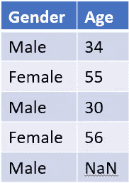
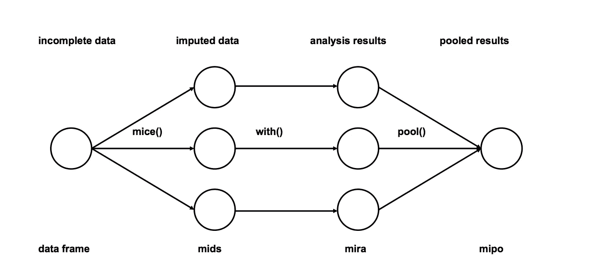
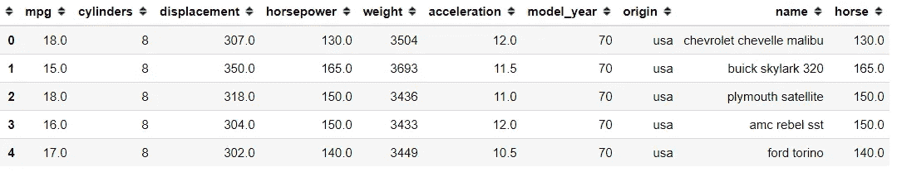
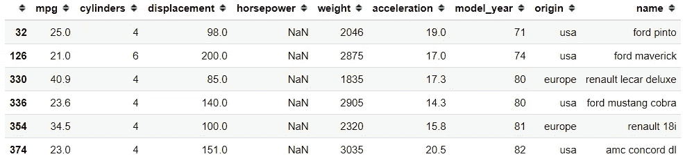

# 3 种缺失的数据类型及处理建议

> 原文：<https://medium.datadriveninvestor.com/3-missing-data-types-and-the-suggestion-to-handle-it-75eb10bfdf3b?source=collection_archive---------4----------------------->

## 知道关于丢失的数据应该知道什么


Photo by [Volodymyr Hryshchenko](https://unsplash.com/@lunarts?utm_source=medium&utm_medium=referral) on [Unsplash](https://unsplash.com?utm_source=medium&utm_medium=referral)

在数据清理和探索过程中，我相信每个人都会同意经常会遇到缺失数据。此外，我通常会从人们那里得到“我应该如何处理丢失的数据？”。对于这个问题，让我们定义缺失数据和缺失数据分类。

# **缺失数据**

在统计学中，缺失数据是指变量或观测值中不存在数据值的情况。它不同于“无”或“无”或其他任何类别，表明该数据属于某个类别。丢失的数据只是丢失，没有价值。

缺失数据可以根据缺失原因进行分类，它们是:

1.  **完全随机地失踪(MCAR)。**这是导致任何特定数据项丢失的事件相互独立的地方。与任何可观察的项目或其他变量无关。它随机发生，没有任何模式。MCAR 的伟大之处在于，分析总是不带偏见的，但很少有 MCAR 的案例。
2.  **随意失踪(MAR)。**这是指缺失数据不是随机的，但缺失数据可能与其他变量或观察值有关。比如有一个问题“你生病了吗？如果是，请说明你的症状”。如果我对这个问题回答是，那么症状的数据就会出现；因此，如果我说不，那么症状的数据将会丢失，因为我们没有填写这些数据。这就是为什么缺失数据被归类为随机缺失**的原因，因为它与其他变量相关。**
3.  **不随意遗漏(MNAR)。**这里缺失的数据既不是马尔也不是 MCAR。原因可能是受一些假设值的影响(年轻人出于安全原因往往不填写电话号码)或间接受其他变量值的影响(主管不太可能填写薪水列，这里缺少的值与职业值有关)。MNAR 的缺失与缺失的内容特别相关，MNAR 数据案例通常很难解决。它需要领域知识和对数据的深入理解，以获得一个无偏的参数。

我经常问，“你会怎么处理丢失的数据？”对于数据科学新手来说，大多数时候，他们的答案是“删除数据”虽然这样做没有错，但这取决于丢失数据的原因。

在 **MNAR** 条件下删除缺失数据可能导致偏差，而在 **MCAR** 条件下删除缺失数据将是安全的。毕竟真的要看病情。

那么，如何处理丢失的数据呢？移除还是插补？让我们看看我们能做的一些方法。

# **删除**

## 1.列表式删除(完整案例分析)

到目前为止，这是最简单的方法，许多人都使用它。您需要做的是**删除包含丢失数据**的行。

如果有足够大的样本，其中功率不是问题，并且满足 MCAR 假设，则列表式删除是安全的；然而，当没有大样本或者 MCAR 的假设不满足时。列表式删除不是最佳策略。在这种情况下，你也会引入偏见。

## **2。丢弃变量**

如果变量中缺少太多数据，删除变量是另一个可行的选择；然而，我认为保留数据比丢弃数据好得多。为什么？因为你还是要看看我们处理的是什么样的缺失数据。取决于我上面解释的分类；如果分类正确，缺失数据本身就是数据。

在我看来，插补是比删除数据好得多的方法。

# **插补**

## **1。经典方式:均值、中值或众数**

这是填充缺失数据的基本统计方法；基本上，您使用变量的平均值、中值或众数来填充缺失的数据**。它填充数据，假设丢失的数据将跟随变量最频繁的数据。**

还有一种方法，您可以根据另一个变量填充缺失的变量，例如，在下表中。



Image created by Author

年龄变量中有缺失的数据，我们想填充它。我们可以用**年龄代表男性**，而不是年龄的平均值。

这种方法的缺点是，当我们自己获取数据时，我们会减少变量内的方差。

## **2。经典方式:零或定值**

填充缺失值的另一种方法是用 0 或某个常数填充它。它适用于分类变量，但遗憾的是，如果你将它用于数值变量，就会引入很多偏差。

## 3.基于机器学习的 K-NN

基于机器学习，有许多方法可以估算缺失值，但我将只讨论 K-NN。K-NN 或 *k-nearest-neighbors* 是一种用于简单分类的算法，通过使用**特征相似度**来预测任何新数据点的值。预测来自新数据点与训练数据的接近程度。

K-NN 方法需要选择最近邻的数量和距离度量。我们将 K 设置为整数，并基于变量设置适当的距离度量。

距离度量，例如:
1。**连续数据**:常用的有欧几里德、曼哈顿、余弦
2。**分类数据**:汉明距离

## 4.**小鼠(通过链式方程进行多变量插补)**



[MICE Imputation method](http://www.stefvanbuuren.nl/publications/mice%20in%20r%20-%20draft.pdf)

这种插补的工作原理是使用多重插补(MIs)概念多次填充缺失数据。多重插补优于单一插补，因为它能更好地衡量缺失值的不确定性。关于算法的更多信息，你可以查看 R [的研究论文](https://www.jstatsoft.org/article/view/v045i03/v45i03.pdf)

我们可以通过一个数据集例子来测试这个方法。如果您没有`impyute`模块，您应该先安装它。

```
pip install impyutefrom impyute.imputation.cs import mice
import seaborn as snsmpg = sns.load_dataset('mpg')
mpg.head()
```



这是我们拥有的 mpg 数据集；如果我们进一步检查，“马力”变量包含缺失的数据。

```
mpg[mpg['horsepower'].isna()]
```



然后，我们可能希望通过使用马力和重量信息来填充缺失的数据，因为它们是相关的。

```
# start the MICE training
imputed_training=mice(mpg[['horsepower', 'weight']].values)mpg['horsepower'] = imputed_training[:, 0]
```

完成后，您可以再次检查缺失的数据，它肯定会由 MICE 填充。

# **结论**

有三种缺失数据:

1.  **完全随机缺失(MCAR)，**
2.  **随机缺失(三月)，**
3.  **非随机缺失(MNAR)，**

你如何填充缺失数据取决于缺失数据的分类和你想要的权衡。

希望有帮助！

# 如果您喜欢我的内容，并希望获得更多关于数据或数据科学家日常生活的深入知识，请考虑在此订阅我的[简讯。](https://cornellius.substack.com/welcome)

> 如果您没有订阅为中等会员，请考虑通过[我的推荐](https://cornelliusyudhawijaya.medium.com/membership)订阅。