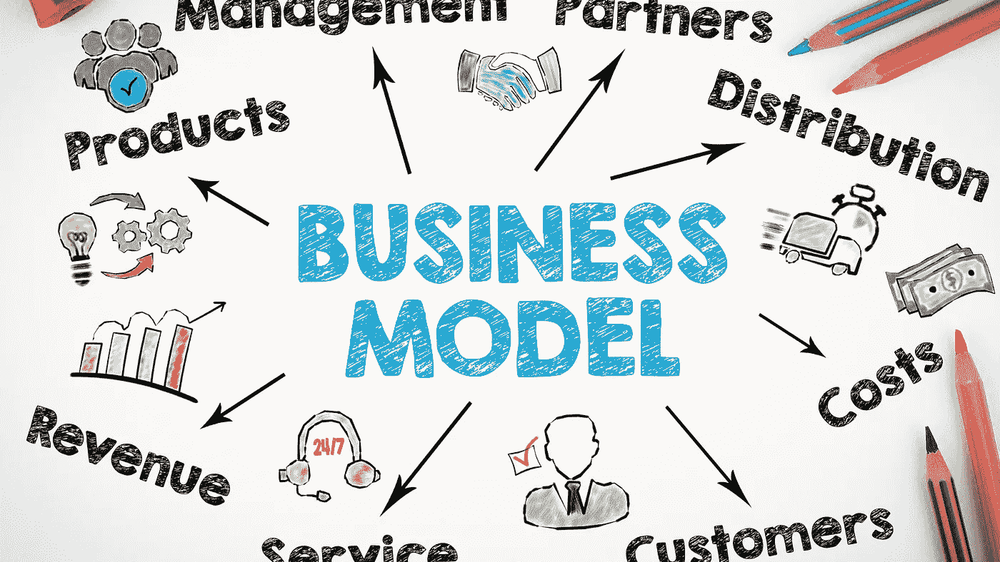

# 初创企业和扩大规模企业可以利用的 3 个资金篮子

> 原文：<https://medium.datadriveninvestor.com/3-money-baskets-a-start-up-and-scale-up-can-tap-into-d74d9f107f7a?source=collection_archive---------21----------------------->

## 资金是如何从这些篮子流入企业的

All pictures in the Article are Canva Pro Images

“你疯了吗？”我的一个朋友说。“你是个彻头彻尾的白痴。”，另一位指出。

不。别担心，我的朋友都是很好的人。我在 2006 年做了一件完全古怪的事情。在奥地利。

我从一个安全且收入丰厚的行业领导角色，变成了一家初创公司。

最重要的是，它不是一家有前途的互联网、移动行业或数字空间初创公司。

那是生命科学。在他们看来，更糟糕的是:在我做出决定的几周前，奥地利生命科学的旗舰企业之一——Igeneon——破产了。

我的朋友们试图说服我保住我的安全工作，坚持去我习惯的河流。别追瀑布就好。你可能会受伤。

我有自己的主见，丝毫不后悔自己的决定。这是艰难的 15 年——每一分钟都值得过。

在这些年里，我学会了如何为公司融资，因为基本上唯一卖的东西是一堆千兆字节的数据，有时是一小瓶液体。

我在数字健康领域看到了与药物开发领域在筹资方面的相似之处，这里有一些初创企业可以从中获得资金的想法:

# 生命科学商业模式

生命科学产业的商业模式是 B2B 模式。企业对企业。它意味着一家公司向另一家公司提供某物。

这是一个很棒的地方。我的团队开发了一个原型，然后卖给一个工业合作伙伴。我可以继续让团队专注于创新的新项目，合作伙伴可以进一步为市场开发原型。

双方都做自己擅长的事情。

行业背景是创造创新。所有这些创新都源于科学——从基础研究到市场。专利保护所有相关的创新。

这篇文章关注这些类型的企业。B2C 企业和他们的价值链可能有一些相似之处和一些不同之处。我的陈述很可能不适用于非科学的 b2c 商业模式。

从我在数字健康领域看到的情况来看，具有科学根基的数字 B2B 商业模式与其兄弟姐妹 B2B 药物开发和医疗设备公司有着相似的机制。在筹资和价值链方面。

在那种商业模式下，资金从何而来？

让我们从显而易见的开始:

# 制药行业

最终目标是向工业合作伙伴销售产品。在这样的事件发生之前，也有可能开始和这个伙伴一起工作。

复杂产品的交易构建流程通常需要时间。这些产品大多耗资数亿美元，并附有大量文档。许多技术诀窍根本没有被记录下来——团队固有的技术诀窍。

## 研究合作

在这条道路上，有可能与一些合作伙伴进行研究合作。这种合作不会带来巨大的回报，但通常可以支付部分研发费用。

作为交换，制药公司可以选择。如果它在研究合作结束前和一些额外的时间内感兴趣，它就有权获得产品或获得许可。

## 许可证

通常情况下，这部分是不针对早期公司的。它需要一种高级产品。

为了吸引早期进入的投资者，瞄准许可交易是必要的。这种许可交易创造了一个流动性事件，投资者可以赚回他的投资资本。

此外，公司获得新的资金来进一步开发其他产品或服务。

公司、投资者和制药合作伙伴的三赢局面。

## 获得物ˌ获得

出于几个原因，对各方来说，收购可能比许可更有吸引力。一个例子是创始人和高管希望退休。我所说的 B2B 公司通常都有小团队。该公司的大部分业务实际上都是由外部供应商建立起来的——招聘人手。

对于那些想要继续改变世界的创始团队来说，收购可以为下一家公司提供启动资金。

 [## 拜登任期-创业公司的 5 个关键变化|数据驱动的投资者

### 这不是一篇讨论政治的文章，任何不恰当的评论都将被删除。相反，这是一个数据驱动的…

www.datadriveninvestor.com](https://www.datadriveninvestor.com/2020/11/15/the-biden-presidency-5-key-changes-we-can-expect-for-startups/) 

## 如何与工业合作伙伴合作:

通常，每个行业都是建立在关系和信任之上的。没有任何阴谋。这种设置的原因很简单:一种高度复杂的技术。改变游戏规则的人不容易找到，也不容易理解。这些团队和技术做的事情与众不同。

拥有值得信赖的长期合作伙伴对评估如此复杂的项目大有帮助。你如何遇到合适的人:

*   贸易展览会:工业伙伴的侦察兵总是在市场上做市场调查。交易会(在非疫情的环境中)是认识这些球探的好地方。尝试与他们接触。
*   **投球事件:**投球事件是一个古老行业中的新事物。
*   **加速项目:**通常，产业合作伙伴会资助这类项目，作为一个寻找平台。他们与公司打交道，有时会选择其中一家。
*   人员:让有良好记录和人脉的人进入公司的执行、监督和顾问委员会。你需要付钱给他们来进入他们已经建立的关系世界。

建立能带来交易和现金流的关系是一场长期的游戏，以获得正确的预期。不要期望它是事务性的。第一次接触可以导致进一步的接触。很少情况下，这是快速交易的捷径。

保持耐心。

# 风险资本/私募股权——投资者的世界

第二个桶是投资者的世界。它们有多种形式和大小。

他们有一个共同点:

> 他们投资是为了赚钱。

## 投资模型

句号。不管你认为他们做什么，算了吧。这项投资附带了在 5-10 年内至少获得 10 倍回报的条件。有些人的期望甚至更高。他们想要至少 20 倍的回报。

为什么？他们承担投资风险，回报投资者，并创造超过标准普尔 500 平均 10%的年回报率。

在吸引投资者之前，创造一个合理的推销故事。怎么会？阅读我的文章:

 [## 如何创建推介平台

### 你需要说服投资者的结构

medium.com](https://medium.com/the-innovation/how-to-create-a-pitch-deck-f8f6221eb49) 

在定义你想提供给投资者的投资案例时要特别小心。它需要 5 个部分:

*   **收益用途:**你需要多少钱，你想怎么花？
*   **里程碑:**你打算通过投资实现什么价值拐点？这一点必须是重要的，并且在你的行业内被普遍接受。
*   **退出可能性:**在里程碑处会发生什么？你需要另一轮投资吗？你能把 IPO 创造成一个流动性事件吗？你能把一个产品或者公司卖给或者授权给一个工业伙伴吗？
*   **估值:**你为了得到的钱付出了多少股权？
*   **估值提升:**在达到下一个里程碑时，你期望的估值提升是多少？这如何转化为投资者的现金回报？

我个人的经验是:只有当我看到估值明显上升 10 至 20 倍时，我才会与投资者进行交易谈判。

除此之外，我喜欢询问投资者的意见，学习他们的经验。它有助于以正确的方式构建投资故事。

## 交易结构

投资模型非常简单。

*   **股权:**你拿现金，投资人拿公司的提成。
*   **可转换贷款:**这是一种投资和贷款的混合体。该公司获得资金，然后放弃股权投资或有息贷款。这笔交易的走向将在稍后决定。
*   **风险债:**是银行向风险投资支持的公司提供专项贷款的特殊产品。它有很多附加条件。投资周期短—通常为 12-24 个月。高利率。大多在 20%以上。和特殊条款以防公司面临破产的风险。如果一家公司无法从新老投资者那里筹集股本，或者无法从主要是现有投资者那里获得可转换贷款，这种工具是最后的手段。

## 你如何与投资者接触？

基本原则与与工业合作伙伴合作是一样的。

*   如今，有许多特殊的展会，它们的使命是将投资者与初创企业和扩大规模的企业联系起来。去那里弄清楚你是去联系还是有交易要提供。
*   **孵化和加速项目:**通常，投资者会资助这类项目作为一个搜索平台。他们与公司打交道，有时会选择其中一家。
*   **人:**这里也一样。寻找那些已经完成融资的人，把他们放在你的工资单上，作为高管、董事或顾问。通常，投资者会回到那些已经为他们做了好交易的人身边。

# 公款

与此同时，全世界的政治家们都接受了支持下一代企业家的必要性。特别是对于在创建公司的早期阶段的第一次创业者来说，资金是稀缺的。

一旦一个团队形成，它就可以交付，并且公司的产品已经达到了一定的阶段，每个人都想跳上这辆行驶的列车。

为了让火车开动起来，政府组织了公共基金。他们的角色是承担第一个风险，用第一笔投资、赠款和贷款支持企业家。

## 交易结构:

*   一些政府已经建立了种子投资基金。他们表现得像个风投。公共基金拿的是纳税人的钱，通常比风险投资承担更多的风险。它们在种子阶段进入。他们也用金钱换取股权。
*   格兰特:这是最好的一个。这是几乎没有附加条件的钱。通常，公共组织同意具有特定目标的里程碑计划。一旦目标达成，总资金的一部分会被支付出去。还款不是预期的，也不是交易的一部分。
*   **贷款:**公共组织也发放贷款。它们是可以偿还的。与风险债务相比，它们的利率非常非常低。在公司破产的情况下，公共贷款通常可以重新谈判，并转换为无需偿还的赠款。原因是政府希望支持企业家，而不是摧毁他们。

这些是我在过去 15 年里见过的典型资金来源。它们似乎被专业组织普遍接受和提供。

任何非典型的交易结构我都非常怀疑。我的建议总是一样的:

在你需要钱之前，去市场上与投资者、公共基金和工业伙伴联系。向他们学习。他们通常很乐意倾听一家公司的意见，即使他们不需要马上达成交易。

通过这样做，你也对潜在的合作伙伴进行了尽职调查。选择那些 100%符合你公司使命的人，你们相处得很好。

在你和新合伙人签订协议后，你们通常要一起工作更长时间。

作为企业家，你在协调相关合作伙伴的利益方面做得越好，你的公司就会越成功。

如果您喜欢这篇文章，请在我的其他频道上关注我。

自 1999 年以来，我是各行各业公司的执行官、顾问和教练。我专攻企业发展和金融。从种子轮到 IPO 级别。我从 2006 年开始关注生命科学。

# 读者(部分德语):

 [## 孔库尔斯的 Krebsforschungsfirma Igeneon

### 这是一家生物技术公司，位于美国大爹的维也纳

www.derstandard.at](https://www.derstandard.at/story/2521370/krebsforschungsfirma-igeneon-in-konkurs)  [## 风险债务

### 风险债务或风险贷款(相关的:“风险租赁”)是一种债务融资提供给风险支持的…

en.wikipedia.org](https://en.wikipedia.org/wiki/Venture_debt) 

## 获得专家视图— [订阅 DDI 英特尔](https://datadriveninvestor.com/ddi-intel)