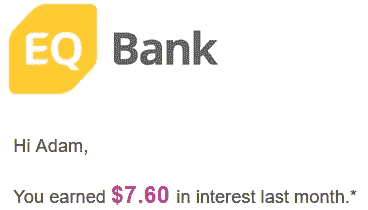

# 3 款日常使用的赚钱应用

> 原文：<https://medium.datadriveninvestor.com/3-money-making-apps-i-use-daily-9d4d9debe25f?source=collection_archive---------9----------------------->

## 有人说低努力赚钱吗？

在这个时代，有一个疯狂的钱可以在网上赚，这个全球疫情只是给了我们一个多元化收入的理由。有时创造一个新的收入来源可能像学习一个全新的技能一样复杂，但其他时候可能像下载一个新的应用程序一样简单。我们很幸运，因为每天都有新的应用程序被开发出来，它们要么是为了节省我们的钱，要么是为了让我们更省钱。在过去的两年里，我使用了超过 **50** 种不同的赚钱/管理/投资应用程序，我选择了我的**前三名**，它们被证明是最有用和/或最赚钱的(*全部免费*)。让我们来看看这个列表(所有这些我已经用了至少 6 个月了)。

第一个 app 是 [**陆丹蓝**](https://moka.ai/en/) 。陆丹蓝帮助人们省钱和赚钱，因为它有两个有用的特点。第一个功能叫做“综述”，在我使用它的第一个月就为我节省了 400 多美元。第二个特点是设置它，忘记它投资。**rounds**做起来就像它听起来的那样，它会在你每次消费时将额外的零钱凑整。例如，如果你买了 19.50 美元的东西，陆丹蓝会把它四舍五入到 20.00 美元，然后把多出的 0.50 美分存入你的储蓄账户或投资账户。这意味着每次你花钱的时候，你也会节省一些！

Roundups

该应用程序还有一个功能，可以让你把它凑起来的钱数增加 2 到 3 倍。例如，如果您将应用程序设置为 3 倍的取整，而不是从 19.50 美元到 20.00 美元只取 0.50 美分，它会将取整倍数增加到 1.50 美元。
这款应用是希望建立账户的人的必备之物，对于声称自己*不擅长储蓄*的人来说非常有用。通过使用陆丹蓝的自动综合功能，你可以想都不用想就能省钱。

在陆丹蓝应用中投资也非常简单。如果你喜欢自己挑选股票，这可能不适合你，因为你不会做买卖。这种投资风格是为了长期收益，而不是日内交易。在您的投资账户中，您将有一位投资组合经理，您可以随时通过电子邮件联系他。由于这些经理不能免费工作，每个月的投资费用很低，只有几美元(T2)。当你注册陆丹蓝投资公司时，你将回答一系列关于你目前资金状况的问题，以及你对市场的了解程度。根据你的回答，陆丹蓝将决定你的经理将采用何种投资风格(进取型、保守型等)。你也可以随时查看你的投资明细，看看你的钱到底去了哪里。

See Where Your Money Is Going Withing Moka Investing

第二个 app 是[**薄荷**](https://www.mint.com/) 。这是一个应用程序，旨在帮助普通人了解每个月钱的实际去向。

Mint Tracking Your Spending (blurred)

这款应用不仅以一种清晰易懂的方式显示用户的支出，还让**预算**变得简单，只需点击几个按钮。设定每个月的预算，以及设定特定类别的预算，例如:*快餐、服装等*。只要你在日常生活中购买了一些东西，Mint 就会将其组织到一个类别中，这就是为什么该应用程序可以非常容易地看到你在什么东西上花了多少钱。如果你检查你的一个预算，应用程序会通知你你做了什么，有时它会让你感到内疚，这实际上是一件好事…你可以回顾你前几个月的情况，看看你做得更好或更差。Mint 还有一个“*账单提醒*”功能，提醒你通常在每月某个时间支付的账单。再说一次，薄荷是 100%免费的，我已经用了将近 2 年了。

Mint Monthly Budgeting

我们最终的 app 是[**情商**](https://www.eqbank.ca/personal-banking/features-rates?gclid=CjwKCAiA4o79BRBvEiwAjteoYOoGsNiMGWmEJZTYGvbI36a71lzgqouuabC4E0xHwIcVeDt7UhcMEBoCVooQAvD_BwE) **银行**。你可能会想，“它只是一家银行吗？”。简而言之，是的，但是它有一个特殊的功能，可以用来存放你的钱。

EQ Bank’s Home Page

这个特点就是目前极高的利率 **1.50%** 。正常情况下，这一利率实际上高达 2.75%，但由于全球环境不得不降低。即使是 1.50%，这个利率也比普通银行的储蓄账户利率高出 1000 倍(T2)。这家银行的一个很棒的方面是它全部在线，并且可以在 15 分钟内设置好。不需要人际交往或银行访问，这正是我推荐这家银行的原因。最后，最好的部分是 **0 费**。这是正确的这是字面上的自由和被动收入，你所要做的就是注册。

My Monthly Earnings for October

再说一次，这些应用程序是免费的，我会认为下载它们是一件很容易的事情。祝每个人在赚钱的旅途中好运！