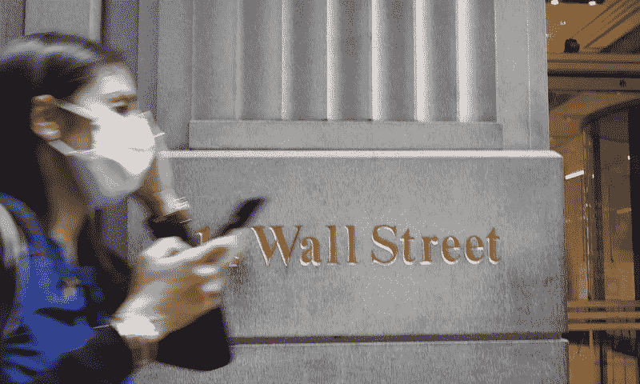

# 道琼斯指数中的 3 只新股票——了解谁、什么和为什么

> 原文：<https://medium.datadriveninvestor.com/3-new-stocks-in-the-dow-jones-find-out-who-what-and-why-3640d21f835a?source=collection_archive---------29----------------------->

In this June 30, 2020 file photo, a woman wearing a mask passes a sign for Wall Street during the coronavirus pandemic. (AP Photo/Mark Lennihan, File)

# 发生了什么事

道琼斯委员会刚刚向投资界抛出了一个曲线球。在 2013 年以来最大的一次调整中，该指数的权重再次洗牌。

三只股票进了三只出了。

该指数是价格加权的，试图反映美国经济。这些年来，股票确实经常在不同的时间点跌入或跌出指数。

首先，三个股票被删除；

*   辉瑞
*   埃克森美孚
*   雷神公司

这其中最令人震惊的是埃克森美孚。2011 年，埃克森美孚是世界上最大的公司。9 年前，它处于与苹果目前相同的位置。时代变了。

该公司自 1928 年以来一直在指数中。埃克森美孚是该指数中最老的股票，有 92 年的历史。下一个最古老的是 1932 年加入的宝洁公司。它的消失是石油巨头影响力和盈利能力下降的大趋势的一部分。气候焦虑、大型科技的绝对优势以及信息时代的诞生，给基于大宗商品的企业带来了全面压力。

雷神被移除也很有趣，因为它刚刚完成了与联合技术公司的重大合并，使其成为一家大得多的公司。

## 对投资者而言

作为一名投资者，如果你拥有一只跟踪指数的 ETF，指数的变化应该不会对你有太大影响。

ETF 将卖出被移除股票的头寸，并买入被增加的股票。短期内，这将增加股票作为 ETF 的买卖压力，共同基金将做出改变。所有被添加的股票价格都上涨了，被删除的股票价格下跌了。

 [## 开始投资股票的 12 条简单规则|数据驱动型投资者

### 如何投资而不亏本呢？问题是从未投资过的人害怕投资。它可能…

www.datadriveninvestor.com](https://www.datadriveninvestor.com/2019/10/17/12-simple-rules-to-start-investing-in-stocks/) 

该指数目前的价格也不会改变。该指数使用一个除数，这意味着价格将保持不变的基础上，股票价格在市场开放的一天。因此您仍然可以像以前一样轻松地跟踪它。

## 对于添加的公司

对这些公司来说，唯一增加的是声望和作为全球广泛关注的一部分的认可。

没有什么能让这些公司与公告前一天和今天有所不同。都是强势业务。但他们只能在高层呆上几年，就像在他们之前的一些公司一样。

在他们寻求发展业务的时候，现在会有更多人关注他们。

## 对于被移除的公司

这些公司基本上也没有什么变化。但这是时代变迁的警示信号。在随后的几十年里，许多从指数中除名的公司都相继倒闭。未来一年肯定不会，这些公司依然庞大且盈利。

如果你拥有这些股票，目前应该不会太担心。美国电话电报公司在 2015 年被从该指数中移除，该公司仍然是一棵摇钱树，利润非常高，同比增长。

辉瑞和雷神也依然稳固。不过，大型石油公司的未来看起来并不太乐观。小心点。

# 为什么会这样

促使这一举动的是苹果公司宣布 4:1 的股票分割。

因为该指数是价格加权的，这意味着该指数的构成将发生变化。按照苹果目前的价格，科技公司占据了该指数的 25%左右，与 S&P500 指数相似。

苹果占其中的 12%，IBM、英特尔和思科也是如此。股票分割后，这意味着该指数只有 20%的股票权重。为了重新平衡这一点，并更好地反映美国经济，他们决定做出一些改变。

8 月 31 日这一日期的变化与苹果股票的拆分相吻合。

# 谁进来了

## 销售力量

Salesforce 是一家位于硅谷的云计算软件公司。他们的业务涵盖营销自动化、销售管理和各种其他软件即服务产品等领域。冠状病毒留在家中的订单以及许多科技行业的订单极大地提振了他们的收益。

自声明发布以来，他们的股价已经飙升了 26%，这是由于它的加入和一份轰动的 Q2 收益报告。

 [## 来自 Salesforce.com 的 CRM 软件

### 客户关系管理领域的领导者 Salesforce 提供的 CRM 软件解决方案和企业云计算…

www.salesforce.com](https://www.salesforce.com/uk/) 

## 安进

Amgen 是一家生物技术公司，自 20 世纪 80 年代开始运营，是世界上最古老和最大的公司之一。不同于那些不时用“革命性”产品点亮一些投资者眼睛的时髦新品，安进拥有稳定的产品目录，并获得可观的利润。该公司在 2019 年获得了 70 亿美元的净收入。

该公司主要致力于解决关节炎、肿瘤预防和克罗恩病治疗等常见问题的生物学主导解决方案。

他们研究和开发药物来帮助世界各地的人们。

 [## 安进

### 数字细胞生物学由 Berkeley Lights 发明，并在 Amgen 的早期投入下得到发展，具有直接的应用…

www.amgen.com](https://www.amgen.com/) 

## 霍尼韦尔

2020 年并不是霍尼韦尔第一次进入道琼斯指数。它于 1999 年进入。但后来在 2008 年被雪佛龙公司(Chevron)逐出，至今仍占据着那个地方。

但是霍尼韦尔:这是一支优秀的股票。该公司与雷神公司相似，都是一家在国防领域占很大比重的企业集团。该公司生产供使用的化学品和工业原材料，是一家主要的军事承包商。其收入的很大一部分来自美国政府。

 [## 首页|霍尼韦尔

### 未来是我们创造的。在霍尼韦尔，我们正在改变世界的工作方式，解决您的业务…

www.honeywell.com](https://www.honeywell.com/en-us) 

市场令人兴奋的变化！你对新的内含物有什么看法？

如果你喜欢读这篇文章，请考虑注册我的邮件列表，让我的文章直接发送到你的收件箱。

 [## 时事通讯注册—千禧净值之旅

### 注册我们的邮件列表，了解我们最新的帖子和深入的投资新闻和分析。我们…

millennialnetworthjourney.com](http://millennialnetworthjourney.com/newsletter-sign-up/) 

**进入专家视角—** [**订阅 DDI 英特尔**](https://datadriveninvestor.com/ddi-intel)