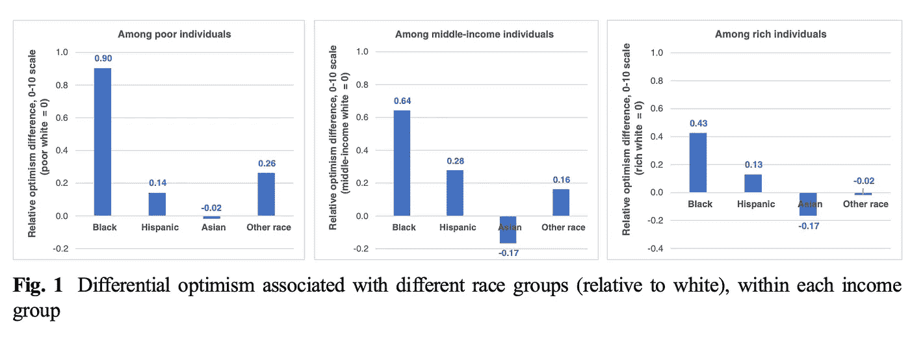
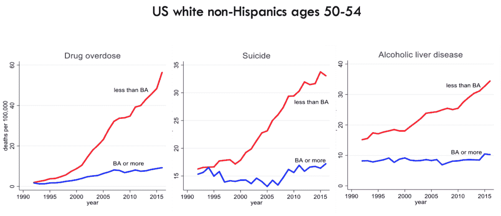
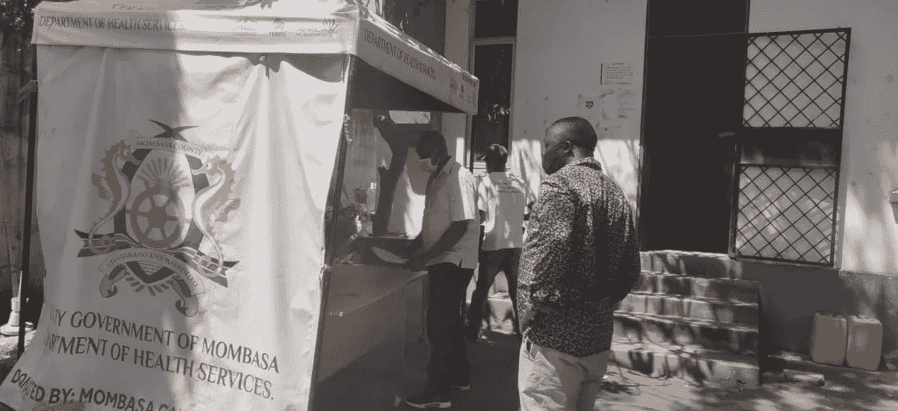
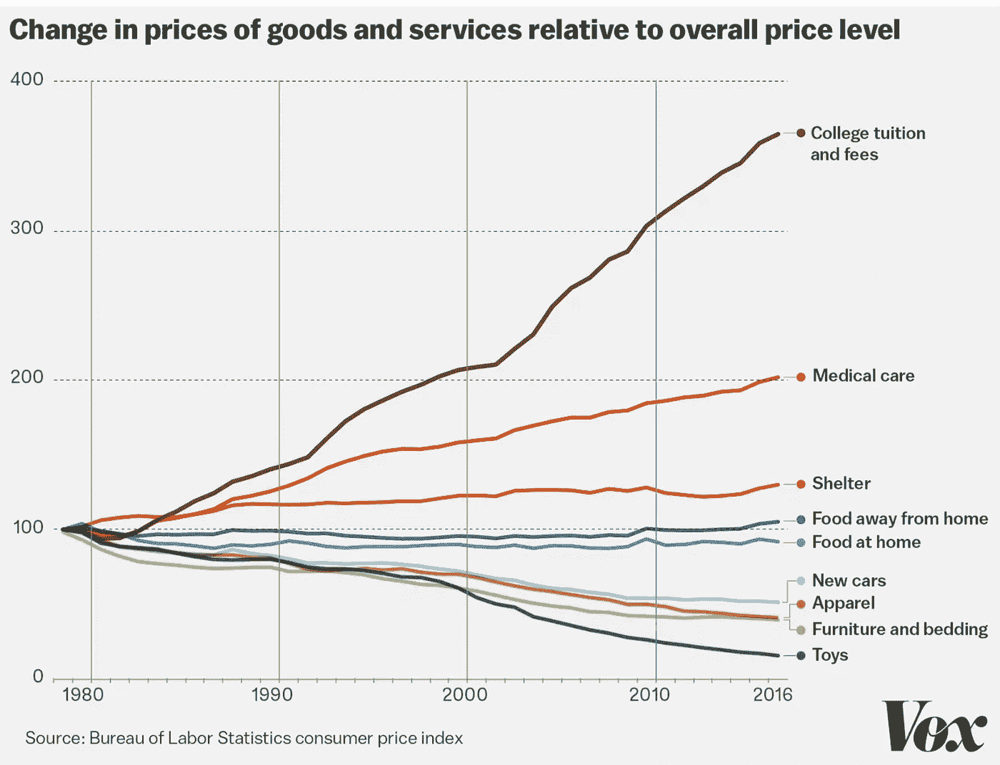

# 2021 年要知道的 3 个新词:怪异*、UHI**、骆驼***

> 原文：<https://medium.datadriveninvestor.com/3-new-words-to-know-in-2021-weird-uhi-and-camels-d102aee150f2?source=collection_archive---------3----------------------->

Camel Theory is about being productive, frugal and responsible in a harsh environment, without losing strength and focus ([John Kamara](https://coinnewsextra.com/the-camel-theory/), 2020)

西方的，受过教育的，工业化的，富裕的，民主的；* *全民健康收入；***资本充足率、资产质量、管理、收益、流动性和敏感度

对于我们大多数人来说，2020 年将作为 [*可怕的一年*](https://en.wikipedia.org/wiki/Annus_horribilis)*而当我们继续争论什么是抗击新冠肺炎的最佳措施时，我们都同意的一件事是，我们的回应[尤其是在美国](https://voxeu.org/article/us-excess-mortality-rate-covid-19-substantially-worse-europe-s?utm_source=sfmc&utm_medium=email&utm_campaign=2732953_Agenda_weekly-2October2020&utm_term=&emailType=Newsletter)是[糟糕透顶的](https://www.cdc.gov/mmwr/volumes/69/wr/mm6942e2.htm?s_cid=mm6942e2_w)。*

*不管这种弱点是资本主义固有的还是领导缺位的结果，州政府和联邦政府需要做什么来控制疫情的建议始终很简单:(1)限制旅行，(2)加强社会距离，(3)增加个人防护设备的可用性(如下)。*

**

*The least effective interventions are: short term testing measures to improve case detection, intrusive tracing and tracking, land border and airport health checks and environmental cleaning ([source](https://www.nature.com/articles/s41562-020-01009-0))*

> *那么，我们为什么不遵循这些建议呢？*

# *#1:疫情在西方肆虐，因为我们很怪异(白人，受过教育，工业化，富裕和民主)*

*许多原因可以解释为什么疫情，特别是在美国，处理得如此糟糕。*

1.  *[公共卫生的长期资金不足](https://khn.org/news/us-public-health-system-underfunded-under-threat-faces-more-cuts-amid-covid-pandemic/)和*的及时*供应链使得许多医院准备不足，容易受到[腐败采购行为的影响](https://www.nytimes.com/2020/11/17/magazine/n95-masks-market-covid.html?campaign_id=61&emc=edit_ts_20201117&instance_id=24193&nl=the-great-read&regi_id=61116760&segment_id=44713&te=1&user_id=304c85cc8cc3e99ed36059bf944873c5)。*
2.  *长达几十年的社会安全网的瓦解暴露了一个数字鸿沟，迫使数百万重要工人从事低薪、冒着生命危险的工作。*
3.  *社交媒体平台传播党派偏见和错误信息，已经成为阴谋论的载体。*
4.  *种族主义政策使得美国土著和黑人特别容易受到 COVID 19 的影响，迫使他们在没有政府支持的情况下处理健康和经济后果。*

> *但是这些社区的恢复能力(见下)表明需要什么来限制病毒的传播。*

**

*Optimism found among African Americans is complex and includes a history of overcoming adversity, having strong community ties, and a continued belief in the promise of education at a time that it has faded among low-income whites. ([source](https://www.brookings.edu/wp-content/uploads/2017/06/working-paper-104-web-v2.pdf))*

*在最近的一本书中 [*世界上最古怪的人*](https://www.amazon.com/WEIRDest-People-World-Psychologically-Particularly-ebook/dp/B07RZFCPMD) ，约瑟夫·亨利克解释道:*

> *“……古怪的人是高度个人主义的、自我迷恋的、控制导向的、不墨守成规的和善于分析的。他们关注自己——他们的品质、成就和抱负——而不是他们的关系和社会角色……”*

*这种 [*咄咄逼人的*行为](https://www.nature.com/articles/d41586-020-02205-8)(国会*的反义词*)争强好胜，总是赢，不惜一切代价保持正确，高估自己的能力，只顾自己的利益而不顾及他人，根据亨利克的说法，这种行为导致了孤独、不适和精神痛苦的增加。*

*因此，非白人社区在教育和预期寿命方面的差距正在逐渐缩小，而贫穷的白人正以流行的速度死于所谓的“绝望之死”(见下文)。*

**

*For the white working class, adults without a degree are literally dying from pain and despair. ([source](https://www.amazon.com/Deaths-Despair-Future-Capitalism-Anne/dp/069119078X))*

> *但不仅仅是美国的土著和非洲裔美国人社区对疫情表现出非凡的适应力，非洲本身也是如此。*

# *#2:非洲比你想象的更有弹性，已经为全民健康收入做好了准备(UHI)*

*特雷弗·诺亚在一个有趣的片段中(如下)以:*“事实证明，有一个地方他们似乎确实能更好地管理病毒，而那个地方可能会让你大吃一惊……”**

*Africa is leading the overall global response to the pandemic ([source](https://www.usnews.com/news/best-countries/articles/2020-08-17/what-africa-can-teach-the-us-about-pandemic-response))*

*特雷弗·诺亚是对的。非洲对 COVID 反应良好。*

*为什么？*

*毫无疑问，非洲之前应对伊波拉病毒和 T2 马尔堡病毒的经验有助于应对新冠肺炎病毒。非洲政府一直在通过公共卫生政策应用[科学](https://www.brookings.edu/blog/africa-in-focus/2020/07/08/learning-from-the-best-evaluating-africas-covid-19-responses/?utm_campaign=Brookings%20Brief&utm_medium=email&utm_content=91132176&utm_source=hs_email)，教育他们的公民 (70%的人不到 30 岁)，并且[表现出采用和部署新技术的强烈意愿。](https://www.brookings.edu/opinions/africa-is-more-resilient-than-you-think/?utm_campaign=Brookings%20Brief&utm_medium=email&utm_content=90258386&utm_source=hs_email)*

* [## 如何通过使用 SCENARIO | Data Driven Investor 实现数字化，在新冠肺炎经济衰退中茁壮成长

### 如果数字化是避免新冠肺炎破产的解药会怎样？一百万人死亡，三十八…

www.datadriveninvestor.com](https://www.datadriveninvestor.com/2020/11/13/how-to-thrive-in-the-covid-19-recession-by-going-digital-using-scenario/) 

事实上，今年健康信息技术(HIT)的使用激增，并已将非洲大陆变成了一个数字健康热点或者如非洲联盟专员 Amani Abou-Zeid 所强调的:

> “新冠肺炎危机已成为数字化转型的最大催化剂，并已将数字化从利基市场推向大众接受”。

这种大规模采用的一个很好的例子是 [*AfyaRekod*](https://www.afyarekod.com/) (斯瓦希里语的健康记录)，他开发了一种自主的、患者所有的便携式电子健康记录，允许用户以及获得许可的医生和卫生机构实时捕获、存储和访问健康数据(如下)。

AfyaRekod, with its COVID-19 geofencing capabilities is downloaded here for free in Mombasa and serves dozens of community hospitals treating millions of Kenyans ([source](https://www.globalsistersreport.org/news/coronavirus/column/kenyan-sisters-support-health-workers-during-pandemic))

将 *AfyaRekod* 与[在美国和欧洲发现的其他电子健康记录](https://hbr.org/2020/06/its-time-for-a-new-kind-of-electronic-health-record)区别开来的是，这些健康数据由患者的**所有，并在智能和功能手机上秘密安全地传输。**

> 将健康数据与自我主权身份联系起来的想法是将数据用作有尊严的劳动的概念的核心，这给了患者获得额外收入的机会，我称之为:全民健康收入(UHI)。

UHI 的想法很有吸引力，不仅因为它是急需的收入来源，更因为它是一种激励公民参与预防性健康行为的方式，这种行为对个人和社会都有好处。换句话说:

> …UHI 将人们从被动的健康服务消费者转变为主动的健康和财富生产者…

包括他们和医疗工作者，在一个目前只对公司和中介开放的数据经济中。

UHI 不同于全民健康保险(这里不讨论)或全民基本收入(UBI)。 [UBI](https://www.visualcapitalist.com/map-basic-income-experiments-world/) 是一项政府计划，提供*无条件*足以(或应该)满足一个人基本需求的收入。本质上，它类似于新冠肺炎经济影响支付("[刺激支票](https://www.axios.com/newsletters/axios-future-0daff0af-290f-4e61-ad4f-2de0104ab315.html?chunk=0&utm_term=emshare#story0)")，一些人主张只为[金融危机](https://www.forbes.com/advisor/personal-finance/stimulus-packages-throw-money-at-financial-crises-but-do-they-actually-help-the-economy/)预留资金，而另一些人则将其视为福利项目的[替代品。](https://www.cato.org/publications/commentary/universal-basic-income-might-fix-our-broken-welfare-system-give-it-serious)

讨论 UBI 与[普遍基本服务](https://www.theguardian.com/commentisfree/2020/may/03/universal-basic-income-coronavirus-shocks)的[优点](https://www.technologyreview.com/2020/09/09/1008226/smart-stimulus-cash-as-code/)和[限制](https://medium.com/hackernoon/universal-basic-income-the-basic-trade-offs-fffdab13b5e6)超出了本文的范围，然而，政府直接扶贫转移支付可以用*有条件的*转移支付[取代或补充](https://www.nytimes.com/2020/09/10/business/economy/unemployment-benefits-hiring.html?campaign_id=2&emc=edit_th_20200910&instance_id=21977&nl=todaysheadlines&regi_id=61116760&segment_id=37742&user_id=304c85cc8cc3e99ed36059bf944873c5)当前项目，就净支出收入而言[不令人满意](https://newatlas.com/science/universal-basic-income-pandemic-covid19-kenya-mit-trial/?utm_source=New+Atlas+Subscribers&utm_campaign=51a4eb5ebc-EMAIL_CAMPAIGN_2020_11_18_03_06&utm_medium=email&utm_term=0_65b67362bd-51a4eb5ebc-92040905)。

**另一方面，UHI 旨在鼓励健康行为**(如[疫苗接种](https://www.nytimes.com/2020/09/09/business/pay-people-vaccine-coronavirus.html?campaign_id=29&emc=edit_up_20200910&instance_id=22065&nl=the-upshot&regi_id=61116760&segment_id=37783&te=1&user_id=304c85cc8cc3e99ed36059bf944873c5)、产前护理、定期或年度体检)和劝阻危险行为(如吸烟、[成瘾](https://www.nytimes.com/2020/10/27/health/meth-addiction-treatment.html?campaign_id=61&emc=edit_ts_20201027&instance_id=23531&nl=the-great-read&regi_id=61116760&segment_id=42464&te=1&user_id=304c85cc8cc3e99ed36059bf944873c5)、不坚持治疗或在 COVID- [的情况下避免社交距离](https://www.bloomberg.com/news/articles/2020-07-08/lacking-powers-in-virus-fight-japan-s-paying-businesses-to-shut))。

> 但是为什么我们需要付钱给人们去做‘正确的’事情呢？

# #3:我们需要开始像骆驼一样思考，而不是独角兽

因为人们，尤其是现在，需要的不仅仅是“轻推”。他们需要收入。

新冠肺炎的预期经济影响是毁灭性的。极端贫困率的增加，尤其是不平等性的增加，将会使几十年的反贫困政策付之东流，全球经济可能再也不会像以前一样了。

这就是为什么现在是重新想象我们当前的经济模式并试图治愈威廉·鲍莫尔在 1965 年所预言的事情的好时机: [*鲍莫尔成本病*](https://www.vox.com/new-money/2017/5/4/15547364/baumol-cost-disease-explained) 。本质上，他假设制造业工人生产率的提高，加上技术进步，将降低商品成本，但同时将劳动密集型服务的成本——教育、法律、医疗、媒体——提高到不可持续的水平(见下文)。

This price split between manufacturing and service sectors is an unavoidable side effect of rising affluence ([source](https://www.washingtonpost.com/))

鲍莫尔是对的。

50 年无休止的增长竞赛造成了财富前所未有地集中在少数人手中，这威胁着资本市场的生存(“T2”K 形复苏“T3”)。新冠肺炎加速了这一趋势，如今的企业家(“就业创造者”)发现获得早期资本[几乎是不可能的](https://rockhealth.com/reports/digital-healths-platform-wars-are-heating-up/?mc_cid=9c347e7f7e&mc_eid=c644)，特别是对于非美国初创公司。

此外，硅谷已经培养了一种叙事[，这种叙事将创新和个人自由提升到建设集体利益之上。因此，这鼓励了对主要高估值公司的投资——独角兽公司(1B)、Decacorns 公司(100 亿美元)和 Hectocorns 公司(1000 亿美元)，这种投资只在牛市期间有效，在后 COVID 时代是不可持续的。](https://hbr.org/2020/09/whats-next-for-silicon-valley)

不用说，我们需要一种不同的方法，马可·卢奇纳称之为:骆驼理论。Lucchina 认为，每个专业人士背后都有一个人，因此，有一套价值观，其中不惜一切代价的增长仅次于同理心和社会责任感。

另一方面， [Alex Lazarow](https://hbr.org/2020/10/startups-its-time-to-think-like-camels-not-unicorns?utm_medium=social&utm_campaign=hbr&utm_source=twitter) 认为*骆驼理论*是初创企业在**熊市**中生存的可持续方式，并建议通过*资本充足率、资产质量、管理、收益、流动性和敏感度来管理增长。对于 Lazarow 来说，生活是马拉松，而不是短跑，骆驼公司应该抵制“闪电式增长”，并采取长远的观点。*

我亲爱的朋友约翰·卡马拉(John Kamara)进一步发展了这种在胁迫下持续繁荣的想法，他是 [ADA Labs](https://adalabsafrica.com/) 的首席执行官，ADA Labs 是一家孵化器和融合实验室，包括 Healthtech、Fintech、Edutech、Agritech、广告和动画初创公司(见下文)。

ADALabs houses startups that provide peer-to-peer micro savings, lending, health, influencers and knowledge ([source](https://adalabsafrica.com/))

> AdaLab 通过创造[社会技术](https://medium.com/@samo.burja/social-technology-84c0372fe25b) —服务社会的技术，体现了非洲企业家精神( [kanju](https://www.amazon.com/Bright-Continent-Breaking-Making-Change/dp/0547678312) )、平衡增长和弹性的价值观。

Ada Lab 的目标是鼓励创业公司之间的[共同创造](https://cocreation-foundation.org/)，并通过其[人工智能卓越中心(AICE)](https://aiceafrica.com/about.html) 培训 10 万名工程师，创造非洲需要的 100 万个[高质量工作岗位](https://www.brookings.edu/blog/africa-in-focus/2020/09/08/young-africans-need-more-and-better-jobs-not-more-training/?utm_campaign=Brookings%20Brief&utm_medium=email&utm_content=94923018&utm_source=hs_email)。

# 最后的想法

两年半前，我写道，阿片类药物危机不是一种流行病，而是一种综合征，是一系列流行病的集合，是在贫困、压力、失业和结构性不公正导致的健康差距下发展起来的。

毫无疑问，新冠肺炎也不是疫情，而是一个 syndemic。然而这一次，它不仅杀死我们的身体，也杀死我们的灵魂。

> 希伯来语中的灵魂被称为“nefesh”或“neshama”，来自词根“呼吸”，新冠肺炎剥夺了我们太多人的呼吸。

是时候彻底改变了，或者用教皇弗朗西斯最近的话来说:

> “……冷漠病毒的抗体……提醒我们，我们是通过奉献自己而成长的，不是保存自己，而是在服务中失去自己……”* 

**(读这篇文章时，世界上已有 58 人死于新冠肺炎病毒)**

**如果你喜欢你所读的内容，* ***继续在下面“鼓掌”，这样其他人也会看到(最多允许 50 次鼓掌！)****

**卡哈纳博士是 ADA 实验室的董事会成员**

## *获得专家视图— [订阅 DDI 英特尔](https://datadriveninvestor.com/ddi-intel)*