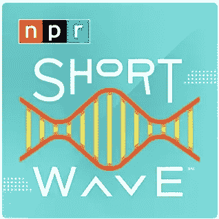
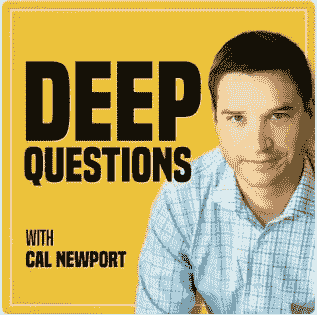

# 3 个播客会让你更聪明

> 原文：<https://medium.datadriveninvestor.com/3-podcasts-that-will-make-you-smarter-c451597e8a49?source=collection_archive---------6----------------------->

## 播客

## 让你乐在其中。

Photo by [Jason Rosewell](https://unsplash.com/@jasonrosewell?utm_source=unsplash&utm_medium=referral&utm_content=creditCopyText) on [Unsplash](https://unsplash.com/s/photos/podcasts?utm_source=unsplash&utm_medium=referral&utm_content=creditCopyText)

似乎现在每个人都开始播客了。根据最近的[研究，](https://www.oberlo.com/blog/podcast-statistics#:~:text=As%20of%20January%202020%2C%20there,years%20ago%20in%20February%202018.)在 2020 年初有超过 850，000 个活跃播客和超过 *3，000 万个可用剧集。这是好消息。*

坏消息是有这么多选择，很难找到表明你喜欢*并带来价值的节目。*

 [## SpaceX vs 维珍银河——太空旅游业务主导地位的竞赛|数据驱动的投资者

### 只有 566 个人去过太空。这些人 85%以上来自三个民族。超过一半的…

www.datadriveninvestor.com](https://www.datadriveninvestor.com/2020/11/25/spacex-vs-virgin-galactic-the-race-to-a-space-tourism-business-dominance/) 

下面是一个快速列表，可以帮助你充分利用你的倾听时间。

[**商务休闲**](https://www.businesscasual.fm/)

商务休闲装脱胎于晨酿通讯帝国。每周，主持人金赛·格兰特都会和各种各样的客人讨论所有与商业有关的事情。

从游戏，到教育的未来，再到企业家精神，这个豆荚涵盖了很多领域。

它有很多东西，但绝不无聊——我还没有学完一集而不学到东西。

[**NPR 的短波**](https://www.npr.org/podcasts/510351/short-wave)

短波是 NPR 对科学的最新尝试。每个工作日都有新的节目，主持人 Maddie Sofia 和工作人员会讨论不同的相关主题(最近的一集讨论了对抗冠状病毒的最新情况)，以及堂吉诃德式的主题(蝙蝠粪？).

这个节目的超能力是把你可能不太理解的主题提炼成容易理解的部分。

[**深度问题**](https://podcasts.apple.com/us/podcast/deep-questions-with-cal-newport/id1515786216)

在多本书和一个博客之后，这位时间管理和数字极简主义的领先专家终于进入了播客的世界。世界因此变得更美好。新剧集每周下集两次，一个长一点，一个短一点。在每一期杂志中，纽波特都会回答读者提出的问题，并解决从如何最好地管理研究生院到如何兼顾 Zoom 电话和家庭教育等一系列问题。一位评论家曾将他描述为“生产力的查克·诺里斯”确实。

有没有一个播客总能让你惊喜和/或开心？请在评论中告诉我！我很想去看看。

## 获得专家观点— [订阅 DDI 英特尔](https://datadriveninvestor.com/ddi-intel)