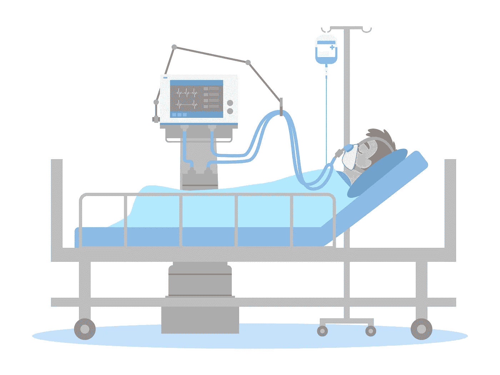
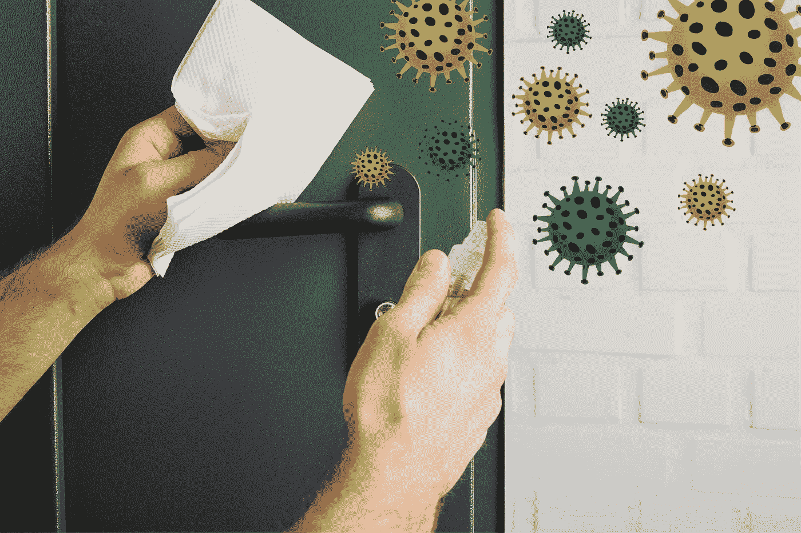
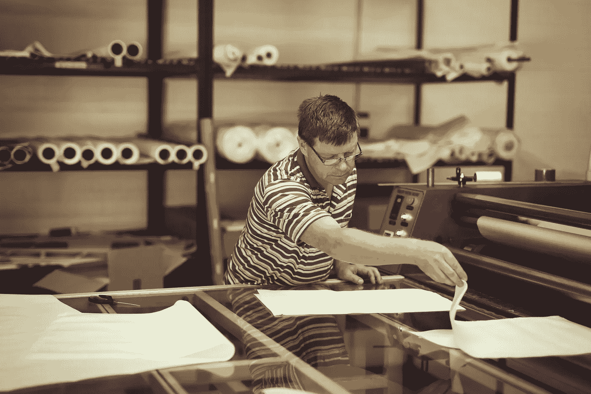

# 受新冠肺炎启发的 3 项重大发现

> 原文：<https://medium.datadriveninvestor.com/3-powerful-discoveries-inspired-by-covid-19-1c83d013e7ad?source=collection_archive---------11----------------------->

## 紧急通风器、免提门把手和抗病毒织物有助于塑造我们在疫情中前进的方式。

Source: [kentoh](https://depositphotos.com/portfolio-2228340.html) / [Depositphotos.com](http://www.depositphotos.com)

## 困难中的积极

随着世界继续努力减少新冠肺炎的传播，特定的个人和组织正在接受这种情况，认为这是一个发展其产品的机会。新产品将永远改变我们所知的生活。然而，像这样的创新并非史无前例。在过去，流行病一直是创造力的跳板。在这个充满挑战的时代，发现、发明甚至著名的理论都应运而生。

这些天来，我们亲眼目睹了疾病的爆发是如何改变我们与周围生活的互动和感知的。当恐惧和绝望使许多人瘫痪时，其他人却被激励着为我们新的困难提供可行的解决方案。

 [## 认知计算——一套被广泛认为是……

### 作为它的用户，我们已经习惯了科技。这些天几乎没有什么是司空见惯的…

www.datadriveninvestor.com](https://www.datadriveninvestor.com/2020/02/19/cognitive-computing-a-skill-set-widely-considered-to-be-the-most-vital-manifestation-of-artificial-intelligence/) 

流行病不会突然发生。我们学习和发展得越多，我们对未来的准备就越充分。在本文中，我们将讨论一些帮助我们在全球战争中获胜的创新，以及它们可能的实现。

## 疾病和发明的传奇历史

历史显示了一些关于流行病如何引发新的[医疗程序](https://www.newyorker.com/news/q-and-a/how-pandemics-change-history)的介绍。15 世纪，天花启发了疫苗的发展，这一过程被称为[变异或接种](https://www.ncbi.nlm.nih.gov/pmc/articles/PMC3407399/)。这种方法包括通过使用取自患者或最近接种过疫苗的个体的材料使个体免于感染。尽管这是一种危险的做法，但它仍然是现代疫苗的工作原理和创造的基础。

在英国大瘟疫期间(1665 年至 1666 年)经历了与我们现在相似的早期隔离经历，艾萨克·牛顿爵士形成了他的引力理论。他将自己与世隔绝的一年称为“奇迹之年”

如你所见，艰难时期可以激发创造力。

## 受新冠肺炎启发的发明

Source: [PoiNatthaya](https://depositphotos.com/portfolio-16662656.html) / [Depositphotos.com](http://www.depositphotos.com/)

## 1.应急通风机

随着全球新冠肺炎病例数量的上升，ICU 呼吸机的可用性比以往任何时候都更加重要。为了应对这一新挑战，来自威尔士卡马森 Glangwili 医院的创新思想家 Rhys Thomas 博士与 CR Clark & Co(一家工程公司)合作，创造了一种临时呼吸机，可以帮助呼吸并清除病房中的病毒颗粒“…确保患者只呼吸净化的空气。”托马斯医生表示，他的[紧急呼吸机](https://www.itv.com/news/wales/2020-03-24/welsh-doctor-designs-ventilator-that-could-save-the-lives-of-thousands-of-coronavirus-patients/)不是 ICU 呼吸机的替代品，但当遇到大量有需要的患者时，它肯定是有用的。最近，威尔士拉内利的一名康复中的新冠肺炎患者使用这种紧急呼吸机管理和治疗他的感染。

[威尔士政府](https://eandt.theiet.org/content/articles/2020/03/wales-greenlights-emergency-ventilation-device/)已经下令紧急通风设备的大规模生产。

Source: [AntonMatyukha](https://depositphotos.com/portfolio-13349494.html) / [Depositphotos.com](http://www.depositphotos.com/)

## 2.免提门把手

每个人持续使用门把手已经被认为是将新冠肺炎从一个人转移到另一个人最常见的方式之一。

当我们继续重新审视和想象我们对待个人卫生的方式时，肮脏的门把手成了一个难题。嗯，免提门把手怎么样？这项发明的灵感来自一位名叫温·格里菲斯的绅士的妻子。她去了一家医院，尽管她虔诚地清洗了双手，还是从门把手上感染了新冠肺炎病毒。

格里菲斯设计了一个原型“手臂”，它连接到一个现有的手柄上，带有一个开门的钩子。如果普遍使用，他的发明将减少手和门之间的接触，从而使我们更安全地免受感染。他甚至将自己的设计[放到网上](https://www.materialise.com/en/hands-free-door-opener)，这样任何感兴趣的人都可以 3D 打印出来。

Source: [nd3000](https://depositphotos.com/portfolio-5392356.html) / [Depositphotos.com](http://www.depositphotos.com/)

## 3.杀毒 snood(或面膜)

英国工作服公司正在生产[防病毒防护罩](https://www.innovationintextiles.com/workwear-manufacturer-wearwell-manufactures-antivirus-snoods/)。该产品旨在捕捉并杀死 96%的病毒，其特点是结合了专利抗病毒织物，可以抵御新冠肺炎病毒等病原体。它配备了抗病毒涂层，可以杀死接触的细菌，触摸安全，并保护关键的渗透点，如耳朵，嘴巴和鼻子。

虽然自 2011 年以来，这些 snoods 中使用的令人难以置信的技术就已经存在，但最近它被大规模部署，以应对新冠肺炎的传播。

## 结论

新冠肺炎给全球带来了不确定性和痛苦。然而，并非所有来自疫情的东西都是负面的。一如既往地富有创造力和创新精神，人类正在发明一些奇妙的东西，这些东西将改变我们所知道的生活。

*如果你想看到更多这样的帖子或亲自与我联系，你可以在* [*LinkedIn*](https://www.linkedin.com/in/sohail-merchant-370aaa59/) *，*[*Twitter*](https://twitter.com/smerchantMD)*上添加我，或在下面发表评论。也可以在* [*中等*](https://medium.com/@smerchant40k) *上查看我的帖子。*

*这个故事最初发表在* [*www。aim blog . io*T25*。*](https://www.aimblog.io/2020/06/26/3-powerful-discoveries-and-changes-inspired-by-covid-19/)

**访问专家视图—** [**订阅 DDI 英特尔**](https://datadriveninvestor.com/ddi-intel)