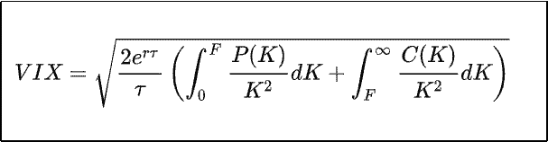

# 简化波动指数的 3 个快速要点(VIX)

> 原文：<https://medium.datadriveninvestor.com/3-quick-points-to-simplify-the-volatility-index-vix-576ca954710b?source=collection_archive---------7----------------------->

## 股票市场的关键波动指标

Photo by [Priscilla Du Preez](https://unsplash.com/@priscilladupreez?utm_source=medium&utm_medium=referral) on [Unsplash](https://unsplash.com?utm_source=medium&utm_medium=referral)

波动率指数，也称为 VIX，是一个实时市场指数，代表市场预期的 30 天前瞻性波动。今天，它的价值来自标准普尔 500 指数期权的价格输入。VIX 用于提供市场风险和投资者情绪。它有时被称为恐惧指数，因为它在市场下跌时上升。

VIX 是由芝加哥期权交易所()创建的。1993 年，CBOE 召开新闻发布会，宣布推出实时报告的 CBOE 市场波动指数，这是 VIX 的第一次迭代。决定 1993 年版 VIX 的公式是为标准普尔 100 指数期权价格量身定做的。直到 2003 年，CBOE 在与 T4 的高盛合作后引入了 VIX 的现代方法，使用标准普尔 500 指数期权价格。

以下 3 点将进一步简化 VIX:

VIX 如何衡量波动性

投资者为什么使用 VIX

VIX 是如何交易的

**VIX 如何衡量波动性**

对于像股票这样的证券来说，波动性是其交易价格在一段时间内变化程度的统计度量。如果一只股票的价格波动很大，它就是高度不稳定的。如果一只股票的价格紧张，它的波动性就低。

就 VIX 而言，它的公式提供了一种衡量市场波动性的方法，在此基础上可以预测未来股票市场的波动性。如前所述，它是一个实时市场指数，代表市场预期的 30 天前瞻性波动，来自标准普尔 500 指数期权的价格。

 [## 收盘，但没有雪茄-股票市场目标在停滞的 COVID 救济中创新高|数据驱动…

### 专家聊天程序:一个协作市场，在这里人们可以和能够解决他们问题的专家聊天。是……

www.datadriveninvestor.com](https://www.datadriveninvestor.com/2020/08/18/close-but-no-cigar-stock-market-targets-record-highs-amidst-stalled-covid-relief/) 

以下是 VIX 的公式:

Courtesy of [Wikipedia](https://en.wikipedia.org/wiki/VIX)

公式中， *T* 为一个月(30 天)的平均天数， *r* 为无风险利率， *F* 为 S & P 500 的 30 天远期价格， *P(K)* 和 *C(K)* 为履约价格 *K* 的看跌期权和看涨期权价格，考虑 30 天到期。有了解出的公式，我们就得到了波动性的度量。

**投资者为什么使用 VIX**

投资者在做出投资决策时，使用 VIX 来衡量市场的风险、恐惧或压力水平。如前所述，VIX 有时被称为恐惧指数，因为如果它上涨，市场可能会下跌。

例如，今年 3 月，随着新冠肺炎和政府要求锁定利率的上升，标准普尔 500 跌至 2237.40 点的低点，VIX 达到 65.54 点的高点。这是 VIX 自 2008 年金融危机以来的最高水平。当 VIX 上涨时，积极的投资者通常会通过做空市场来对冲其持有的股票，例如做空标准普尔 500 交易所交易基金，如 SPDR 标准普尔 500 交易所交易基金。当 VIX 下跌时，积极的投资者会密切关注市场，增加他们的多头头寸。

**VIX 如何交易**

VIX 是一个指数，这意味着你不能直接交易它。VIX 可以通过期货、期权、ETF 等证券进行交易。 [VIX 期货](https://www.cboe.com/products/futures/vx-cboe-volatility-index-vix-futures)于 2004 年在 CBOE 期货交易所推出。它们为市场参与者提供了交易基于 VIX 的流动性波动产品的能力。VIX 期权于 2006 年在 CBOE 期权交易所推出，为市场参与者提供了另一种管理波动性的工具。

谈到 ETF，有多个 VIX ETF，如 ProShares Ultra VIX 短期期货 ETF ( [UVXY](https://finance.yahoo.com/quote/UVXY?p=UVXY&.tsrc=fin-srch) )、ProShares Short VIX 短期期货 ETF ( [SVXY](https://finance.yahoo.com/quote/SVXY?p=SVXY&.tsrc=fin-srch) )和 ProShares VIX 短期期货 ETF ( [VIXY](https://finance.yahoo.com/quote/VIXY?p=VIXY&.tsrc=fin-srch) )。VIX 交易所交易基金允许市场参与者交易与 VIX 挂钩的证券。谈到交易 VIX，研究和尽职调查是非常重要的。

在很大程度上，VIX 让我们知道股市何时出现恐慌。当 VIX 上涨时，这意味着股市可能会下跌。当 VIX 下跌时，这意味着股市可能处于上升趋势。VIX 和股票市场之间的反比关系使其成为投资者的一个重要工具，这些投资者喜欢更好地了解他们如何对冲风险。在理解什么是 VIX 以及它是如何工作的过程中，你进一步巩固了你的金融知识。

[查看 Tunji 信，保持联系](https://tunji.substack.com/)。

## 获得专家视图— [订阅 DDI 英特尔](https://datadriveninvestor.com/ddi-intel)