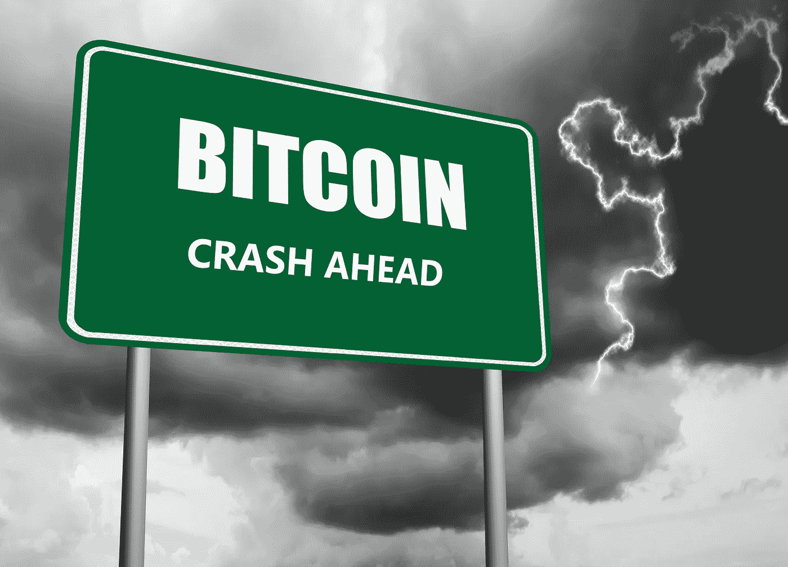
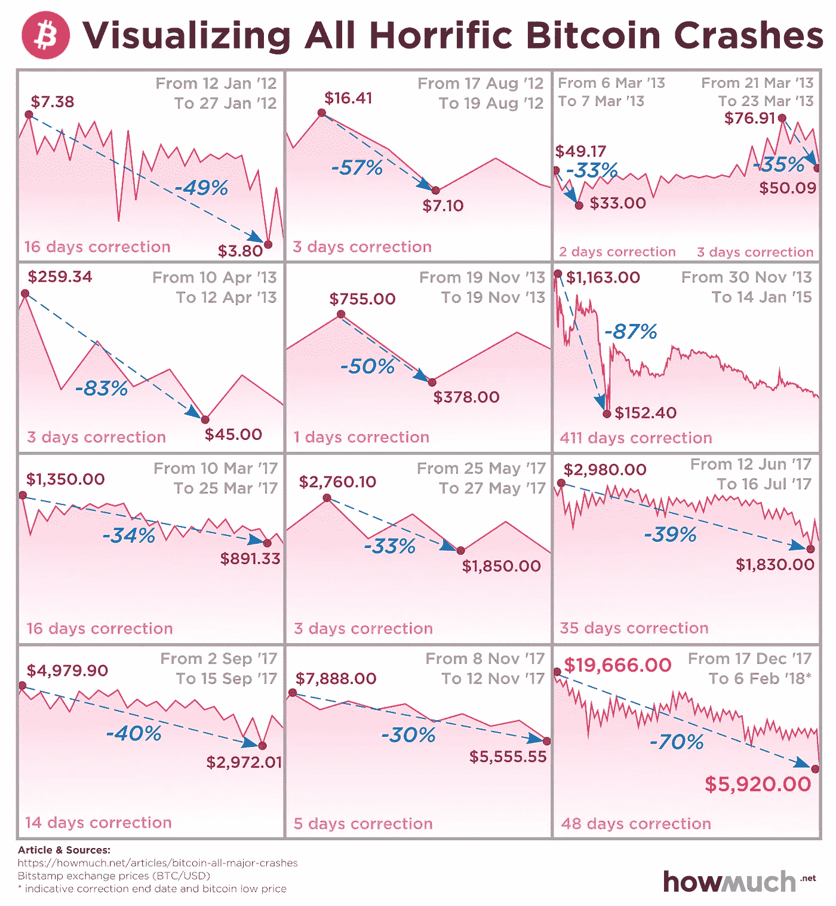
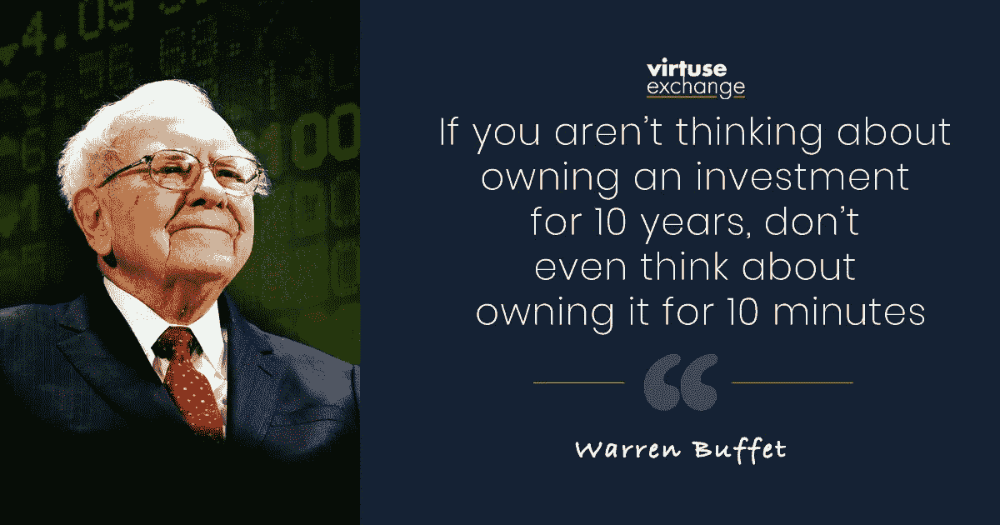

# 不用担心比特币崩盘的三个理由

> 原文：<https://medium.datadriveninvestor.com/3-reasons-not-to-worry-about-a-bitcoin-crash-447b6c167e4?source=collection_archive---------17----------------------->

## 比特币崩溃是自然现象。你需要做好驾驭它们的准备。

比特币崩溃带来伤害。

虽然这是一个令人兴奋和有争议的媒体话题，但它们不需要成为持续焦虑的来源。

这里有三个原因。

# 1.波动性是不可避免的罪恶

*猜猜比特币历史上崩溃过多少次？*

*1？4?8?*

**试** **13。**

其中一些非常可怕。例如，2013 年，比特币在三天内损失了 87%的价值。

不要误会我；**波动**令人恐惧，通常**会吓跑很多人。**但是**聪明的钱**却不受其影响。

*为什么？*

精明的投资者知道，你需要波动来获得价格升值。

聪明的投资者也知道创新几乎总是会导致波动。作为本世纪最好的金融科技创新之一，比特币因此而繁荣。

# 2.这也会过去的

# 比特币在其 12 年历史中的行为强调了一点:

崩溃不会持续太久。

有时市场会以闪电般的速度复苏。其他时候，崩盘的逆转需要数年时间。

以 2017 年的崩盘为例。比特币花了三年多时间才回到巅峰水平。

比特币总是会复苏的。

但是，不要搞错了。崩溃是游戏的一部分，它们是不可预测的。避免受其影响的唯一可靠方法是完全远离比特币。

然而，有一个更好的方法来处理崩溃。

 [## 完美的加密交易策略|数据驱动的投资者

### 如果你在交易游戏中已经有一段时间了，你可能听说过“支点”和“VWAP”前者听起来像…

www.datadriveninvestor.com](https://www.datadriveninvestor.com/2020/08/31/the-perfect-crypto-trading-strategy/) 

**长期投资，忽略短期价格波动。**

正如传奇投资家沃伦·巴菲特所说，“如果你不想拥有一项投资 10 年，那就别想拥有它 10 分钟。”

# 3.崩溃创造机会

比特币价格暴跌并不罕见。

所以，让媒体和政客来支持或反对他们吧。你的工作是**保持双手稳定**并在每次下跌后积累更多的比特币。

精明的投资者对它们的出现垂涎三尺。

近年来很明显，逢低买入是增加利润的一个简单方法。

大幅下跌导致高回报，反之亦然。

# 做好准备

理解这一点很重要。

崩盘对于市场就像海浪对于海洋一样。

就像海洋一样，对于没有准备的人来说，市场是一个危险甚至致命的地方。

但对于懂得乘风破浪的人来说，浪越大越好。

这种比较的目的是表明比特币崩溃是自然现象。

你需要做好驾驭它们的准备。

如果你喜欢这篇文章，请在左下角“鼓掌”50 次，这样会有更多人分享。你也可以随时 [*给我发微博*](https://twitter.com/RasVasilisin) *告诉我你的想法或者关注我*[*LinkedIn*](https://www.linkedin.com/in/rastislav-ras-vasilisin-11bb5819/)*订阅*[*Virtuse News*](https://www.virtuse.com/)*我把这些消息发给了全球 15，000 多名投资者。*

## 获得专家观点— [订阅 DDI 英特尔](https://datadriveninvestor.com/ddi-intel)