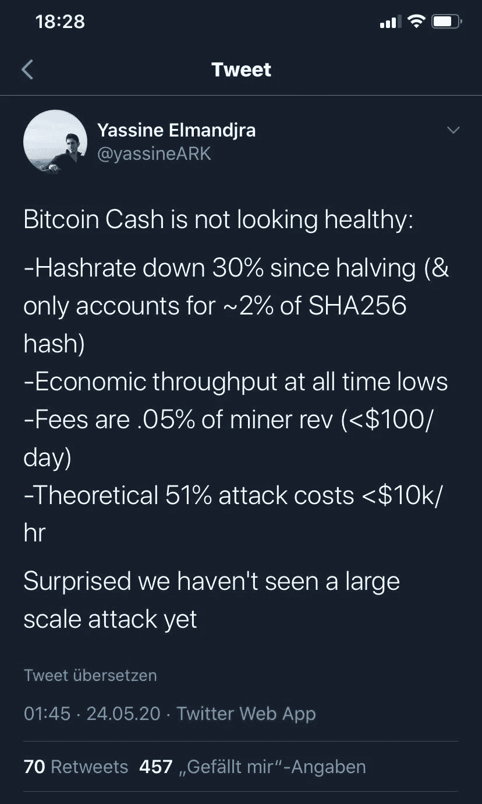

# 比特币现金已死的 3 个原因

> 原文：<https://medium.datadriveninvestor.com/3-reasons-why-bitcoin-cash-is-dead-4dce21272032?source=collection_archive---------1----------------------->

比特币减半已经过去了几周，我们已经感受到了一些根本性的变化。

Photo by [M. B. M.](https://unsplash.com/@m_b_m?utm_source=medium&utm_medium=referral) on [Unsplash](https://unsplash.com?utm_source=medium&utm_medium=referral)

由于块奖励减半，过去几周比特币价格大幅下跌。这反过来导致更长的封锁时间和交易费用增加。在此期间，交易费用在短时间内增加了 1250%。这将在下一次难度调整时再次正常化。

# 比特币减半后的比特币现金

比特币现金在比特币减半之前就已经表现出了疲软的一面。这主要是因为比特币现金减半发生在比特币减半之前几周。相应地，轮挡奖励从 12.5 降低到 6.25。因此，一些矿工已经转到 BTC 工作，享受更高的集体报酬。

 [## 加密货币行业是死是活？数据驱动的投资者

### 九月初，我们在 X-Order 内部就代币市场的未来进行了一场辩论。有趣的是，我们的观点是…

www.datadriveninvestor.com](https://www.datadriveninvestor.com/2019/12/12/will-the-cryptocurrency-industry-be-dead-or-alive/) 

但是现在两种加密货币的块奖励都调整了，比特币现金怎么办？许多 BTC 矿工换回比特币现金了吗？Twitter 上的一位分析师发表了一篇简短的分析，从基本面对 BCH 项目提出了强烈质疑。

# 分析师用比特币现金结算

ARK Invest 的密码分析师 Yassine Elmandjra 最近评估了比特币现金的一些网络基本面，发现它们自 4 月 8 日减半以来已经恶化。Elmandjra 说，BCH 网络“看起来不健康”，特别是由于一些基本面已经恶化。

比特币现金矿工在 BCH 减半的前几天已经脱困。只有当比特币减半、大宗奖励调整时，一些矿商可能会回来，BCH 的杂凑率才会在短时间内飙升。然而，转入比特币现金的交易仍比预期的要少。

# 矿工的安全保障不足，条件恶劣

其次，Elmandjra 认为 BCH 网络的经济吞吐量处于历史最低点。网络交易数量从 90，000 下降到 56，000。经济产出的惊人下降导致了矿工收入的减少。

目前，BTC 现金矿商仅从交易费用中获得 0.05%的收入。相比之下，对 BTC 矿商来说，交易费约占其收入的 10%。这对网络的长期安全非常重要。在某个时间点，将不会有或只有很少的块奖励。

比特币现金网络最令人担忧的一个方面可能是目前的安全性。较低的哈希速率使 BCH 网络更容易受到攻击。Elmandjra 指出，邪恶的矿工可以轻松地对网络发起 51%的攻击。这种对比特币现金的恶意攻击的成本目前约为每小时 1 万美元。他甚至说他“很惊讶我们还没有看到重大袭击”。

# 对比特币现金价格的影响

当然，在这一点上，有一两个人会问，价格会如何影响这些疲软的基本面。我们在过去已经看到，即使基本面相对糟糕的消息对比特币现金价格的影响也很小或没有影响。然而，这并不意味着它必须保持这种状态。

举个例子，如果一次成功的 51%的攻击发生了，那么网络中目前无论如何都没有那么高的信任度就完全没有了。如此多的投资者会尽快在市场上出售他们的 BCHs。这将导致极端的价格崩溃。健康的需求也会消失。从长期来看，比特币现金价格可能会趋近于零。

可怕的是，理论上这可能随时发生。唯一的保障是开采 BCH 区块链的矿工的额外收入。只要这里有钱可赚，我想没有人会攻击。根本就没有足够的动力。但一旦比特币现金无法产生更多收入，这个网络很可能会被忽视。

比特币现金将永远无法以这样的基本面确立其作为支付手段的地位。对于分散的资金，我们需要尽可能高的安全性，目前只有比特币能提供这种安全性。因此，如果未来几个月或几年基本面没有改善，t **他的加密货币将会慢慢死去。**

我在每月一期的 [**简讯中分享了更多私密的想法，你可以在这里查看**](https://mailchi.mp/bf8f8e8ed697/keep-in-touch-with-lukas) 。请在评论中告诉我，并在各种社交媒体平台上加入我:

[**推特**](https://twitter.com/WiesfleckerL)●[**insta gram**](https://www.instagram.com/lukaswiesflecker/)●[**脸书**](https://www.facebook.com/lukaswiesfleckerr)●[**Snapchat**](https://www.snapchat.com/add/luggooo)**●[**LinkedIn**](https://www.linkedin.com/in/lukas-wiesflecker-1b11251a5/)**

**无论你做什么，都要带着爱和激情去做！**