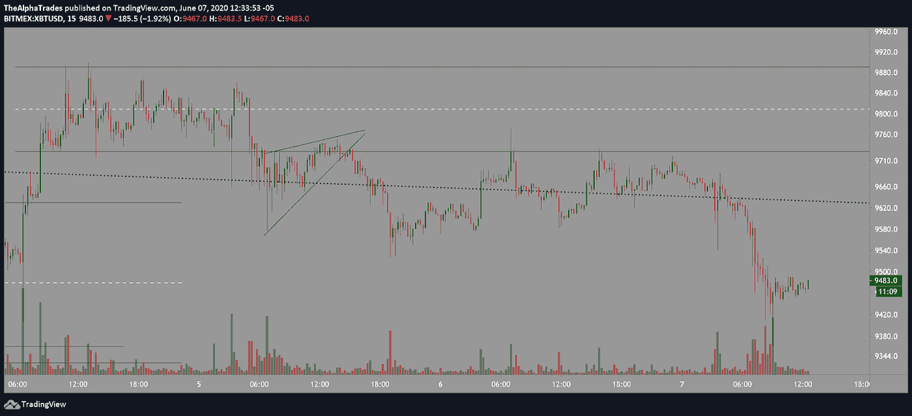
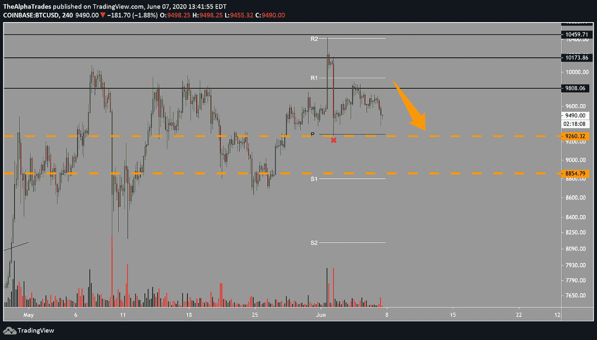
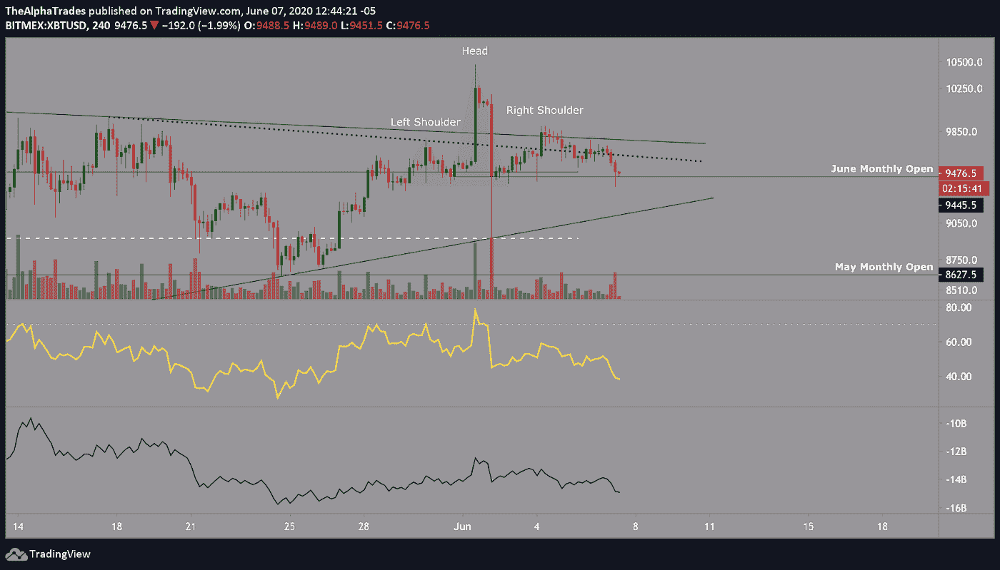
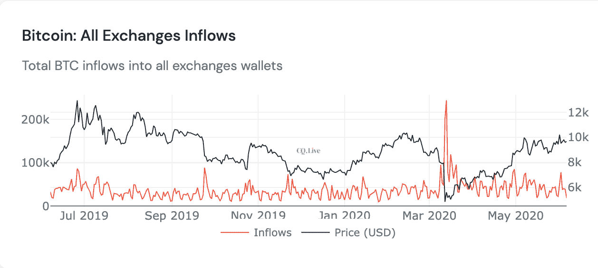

# 比特币没有见底的 3 个原因——每日回顾

> 原文：<https://medium.datadriveninvestor.com/3-reasons-why-bitcoin-hasnt-bottomed-daily-review-c59f49b68a31?source=collection_archive---------9----------------------->

## 熊市格局完整，矿工卖，系绳打印机去 brrr

Bitcoin, blockchain, Image by xresch from Pixabay

大家下午好，周日快乐。让我们深入比特币的技术分析。

在 15 分钟图上，我们看到在之前的盘整期间形成的牛市旗未能令人信服地向上突破，然后在几次测试之前范围的底部后，价格未能在该结构中重新站稳脚跟。这对空头来说是一个积极的信号，因为价格继续打印更低的低点和更低的高点。

 [## 加密货币行业是死是活？数据驱动的投资者

### 九月初，我们在 X-Order 内部就代币市场的未来进行了一场辩论。有趣的是，我们的观点是…

www.datadriveninvestor.com](https://www.datadriveninvestor.com/2019/12/12/will-the-cryptocurrency-industry-be-dead-or-alive/) 

比特币价格结构的这种变化已经打破了我在今天早上的视频中提到的水平(不要忘记这些，因为我们比书面内容提前几个小时发布这些内容！)的 9525，现在价格从 15 分钟的角度来看正在形成熊市旗。请记住**这些较低的时间框架比在较高的时间框架**发生的事情更不重要，所以在考虑这种类型的价格行为时，请确保不要只见树木不见森林。

Bitcoin fails to re-enter the channel, now downtrending; Source: Alpha Trades, LLC

比特币基地交易所反映了现货市场的动向，因为该交易所没有像我们在 BitMEX 等衍生品交易所看到的那样，出现近期的大幅下跌。我们希望看到下图中 x 标记的低点被剔除。一旦出现这种情况，向下到 8680 至 8500 点的关键水平就一帆风顺了。

Spot exchanges like Coinbase reflect key levels to watch; Source: Alpha Trades, LLC

形成三角形形态上限的虚线和实线趋势线最近用尖芯测试了 10，400 和 10，500 区域(取决于交易所)，但是动量不支持三角形上方的价格。正如今天上午的公开视频中提到的，随后的 4 小时收盘低于虚线趋势线，进一步加强了对 6 月月度开盘 9445 的看跌势头。图表在下面的部分。

# 比特币的头肩顶模式仍在发挥作用

对 BTC 头肩顶形态的分析与之前现货交易图上的 S1 中枢点相吻合，大约在 8850 点。

Bitcoin confluence across spot and derivatives exchanges shows a break of the head and shoulders pattern would lead the price towards the S1 pivot point; Source: Alpha Trades, LLC

# 矿池比特币供应外流到交易所可能意味着看跌波动

随着[矿商继续出售](https://cointelegraph.com/news/capitulation-by-unknown-miner-caused-the-dip-says-cryptoquant-ceo)他们的比特币，要么是因为投降，要么是因为找到了理想的市场价格出售，这些个人或矿池继续将他们的比特币供应转移到交易所出售，从而增加了可用供应，导致比特币价格下跌。我们在最近的一篇文章中详细讨论了这个问题[。](https://medium.com/datadriveninvestor/bitcoin-to-20-000-not-so-fast-bloomberg-2881f779be39)

Exchange inflows, Bitcoin miners, Source: CryptoQuant

# 大规模系绳印刷是对比特币卖家涌入的回应

我一直认为，在过去的几个月里，我们看到这么多系绳印刷的原因是因为希望退出加密货币市场的卖家数量增加，而系绳就是他们这样做的手段。作为一家公司，Tether 必须印刷足够多来满足需求。这个话题是一个潘多拉的盒子，我们不会在这里讨论，但是@SBF 阿拉米达在这个推特风暴中把它分解了:

@SBF_Alameda Tether money printing is bearish for crypto

与此同时，股市过度向上延伸，一旦开始滚动，比特币也将被迫向那个方向移动。比特币似乎也在引领股市。例如，当比特币在 2020 年 2 月 13 日左右见顶时，股市在大约一周后见顶。同样，股市在 3 月 23 日见底，但比特币在 3 月 13 日左右见底，相差 10 天。按照这种逻辑，比特币可能只是预测了未来 7 到 10 天内已经严重超买的股市的顶部。

# 优势会员不会错过今天的高级炉边谈话:

**今天，前花旗集团对冲基金经理奥斯汀·阿什拉夫(Austin Ashraf)加入我们，讨论他对本周及未来几周市场的看法。我们已经决定将这些对话转移到我们业务的高端，我们本月将对这些服务进行大幅折扣。[订阅 Discord 服务器](https://bit.ly/2KJ1oor)了解更多关于高级会员第一个月 50%折扣的信息(优惠将于 6 月 15 日结束)。在下面的视频中了解更多信息。**

3 Reasons Why Bitcoin hasn’t bottomed — Daily Review by Alpha Trades, LLC

不要错过，因为我们正在考虑**继续使用我们迄今为止免费提供的大部分内容**，以便为我们的优势群体专注于更高质量的内容、新闻和数据。

# 放弃

Alpha Trades，LLC 提供的信息不用于制定任何财务决策，也不是购买、持有和/或销售特定产品、数字资产或 ICO 的请求或建议。

访问我们的完整服务条款:[https://bit.ly/3faVeeV](https://bit.ly/3faVeeV)