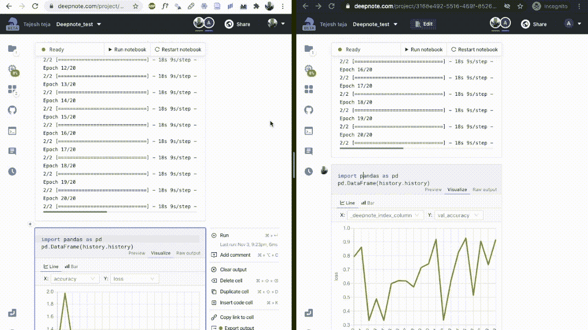
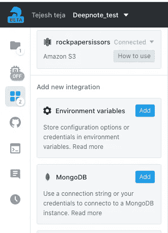
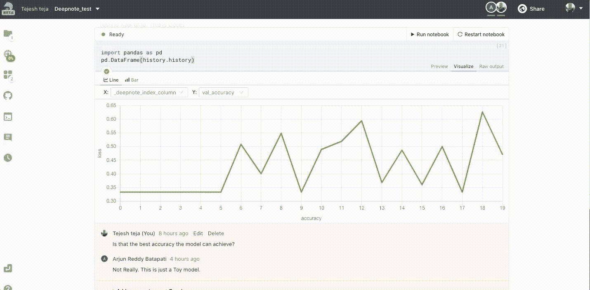

# Deepnote 比著名的 Jupyter 笔记本强大的 3 个原因

> 原文：<https://medium.datadriveninvestor.com/3-reasons-why-deepnote-is-powerful-than-famous-jupyter-notebooks-43aee38419f5?source=collection_archive---------0----------------------->

deep note——一个在浏览器中具有**实时协作**的 Python 笔记本。

Photo by [Mathilde Decourcelle](https://unsplash.com/@mathilde_34?utm_source=medium&utm_medium=referral) on [Unsplash](https://unsplash.com?utm_source=medium&utm_medium=referral)

你曾经在你的数据科学项目中使用过 Jupyter Notebook 或者 Google Colab 吗？我知道这是一个问数据科学考生的愚蠢问题。

Jupyter 笔记本非常有名，大多数(如果不是全部的话)数据分析师和数据科学家每天都在使用它。

Jet brains 在 2018 年做了一项调查，看看他们发现了什么—

> Web 开发人员对编辑器的偏好与数据科学家略有不同。他们比数据科学家更喜欢 PyCharm、VS Code、Vim 和 Sublime text，**而许多数据科学家更喜欢 Jupyter Notebook 作为他们的主要工具。**【1】

这意味着每个人都喜欢它吗？原来有人讨厌数据科学中的笔记本式编程。不仅仅是因为他们的个人偏好，还因为一些令人信服的原因。

[Alexander Mueller](https://medium.com/u/e5ad433afc41?source=post_page-----43aee38419f5--------------------------------) 写了一篇名为【jupyter 笔记本烂的 5 个理由的帖子。其中他提到了 Jupyter Notebooks 的一些问题，例如维护代码版本的困难、没有代码风格修正，以及最重要的非线性工作流，其中代码单元可以以任何顺序运行并产生意想不到的结果。

听听 Joel Grus 的反对 jupyter 笔记本的案例，他强调了笔记本中的细胞状态可能会导致意想不到的结果。

[Podcast](https://towardsdatascience.com/the-case-against-the-jupyter-notebook-d4da17e97243) By [Joel Grus](https://medium.com/@joelgrus?source=user_popover)

Deepnote 的团队专注于其中的一些问题，并试图解决它们。Deepnote 是一款基于云的笔记本，具有所有基本的 Jupyter 功能以及实时协作。Deepnote 基本上就像是 Google Colab 的改进版，包含了更多的功能。

在对 Deepnote 的可用性、适应性和未来做出任何结论之前，我想强调的是，改变并不容易，也不会很快。很难适应任何变化。

但事实是，当变化不可避免时，你需要走出你的舒适区，重新调整你的习惯，以适应进步。现在真正的问题是，Deepnote 是否强大到足以迫使改变，或者只是不够强大到足以产生影响？

在我看来，Deepnote 比著名的 Jupyter 笔记本更强大的三大原因是:

1.  实时协作
2.  易于集成
3.  内置数据帧可视化

# 1.实时协作:

让我们看两个场景

1.  当您想与同事分享笔记本中的结果时，您会怎么做？

你可以下载笔记本或上传到 Git 并分享，或者你可以在 Zoom 中呼叫你的同事并分享屏幕。这是理想的吗？不，绝对不是。

2.现在，您如何与您的团队共享 excel 表格或 word 文档呢？

*最好的方法是使用谷歌文档/谷歌工作表或使用 SharePoint，因为你团队中的每个人都可以同时编辑或实时查看变化。*

在笔记本电脑中实现实时协作不是很好吗？Deepnote 团队也问了同样的问题，并制作了一款具有实时协作功能的笔记本。

深度笔记的免费版本使您能够与多达 3 名其他团队成员共享笔记本。

我真的很喜欢这个功能。这将使我作为数据科学家的生活变得轻松一些。

下面自己看结果。我和我的一个朋友分享了我的笔记本，我们可以同时编辑笔记本。

Image By Author

# 2.易于集成:

Image By author

对于任何数据分析师或数据科学家来说，轻松集成来自其他来源的数据是一项基本任务，例如亚马逊 S3、谷歌云存储、Postgre SQL、MongoDB 和其他不同来源。

Deepnote 提供了一个界面选项，让您可以提供必要的详细信息，只需点击 connect 按钮即可进行连接，从而使集成变得非常快速和简单。

# 3.可视化:

你运行模型，训练在漫长的 12 小时后结束。最后，您希望可视化并检查结果。或者您刚刚将数据集上传到笔记本中，下一步您会做什么？你想象它。你是怎么做到的？你写一段代码。

您可能已经注意到，每次上传数据集并想要可视化要素时，代码几乎都是相同的。我知道在这里写代码并不难，但是一种更简单的方式来运行可视化肯定会有所帮助。

关键是如果没有必要，你不必写代码。您可能已经在 Kaggle 内核中看到过，其中数据帧的特性会自动显示在数据帧的标题中。

在 Deepnote 中，他们更进了一步，只要你加载数据帧，笔记本就会智能地识别，并自动生成一个图形，供你选择更改 X 轴和 Y 轴。

Image By Author

您可以看到我是如何轻松地将我的模型输出可视化的。

T 通过实时共享的 eam 协作、与不同来源的轻松集成以及自动数据框可视化是我最喜欢的 Deepnote 的三大功能。

> 免费的 GPU 访问和智能自动代码完成是 Deepnote 提供的其他一些很酷的功能。

# Deepnote 的未来

看起来 Deepnote 团队正在他们的小窝里计划更多的功能，而我最期待的是版本控制。

## 版本控制:

笔记本在探索性分析中非常有用，但不适合部署到生产中。这就是为什么数据工程师讨厌使用在笔记本上构建和共享的机器学习模型。

版本控制功能将是笔记本电脑上最酷的事情。

查看 Deepnote ( [RastaRobbie](https://www.reddit.com/user/rastarobbie1/) )的 PM 对 Reddit 中用户评论之一的回复

> Git 对于软件工程师来说是一个很好的工具，但是它不适合数据科学的探索性质。有了 Deepnote，您将获得开箱即用的更改跟踪。

此外，他们试图引入一些特性来帮助你遵循好的工程特性[2]。

让我知道你是否尝试过 Deepnote，让我知道你对它的想法。你可以使用这个[链接](https://deepnote.com/)免费试用 Deepnote。

## 参考资料:

[1][https://www . jetbrains . com/research/python-developers-survey-2018/](https://www.jetbrains.com/research/python-developers-survey-2018/)

[2][https://www . Reddit . com/r/Python/comments/jkw8tr/deep note _ a _ Python _ notebook _ with _ real time/](https://www.reddit.com/r/Python/comments/jkw8tr/deepnote_a_python_notebook_with_realtime/)