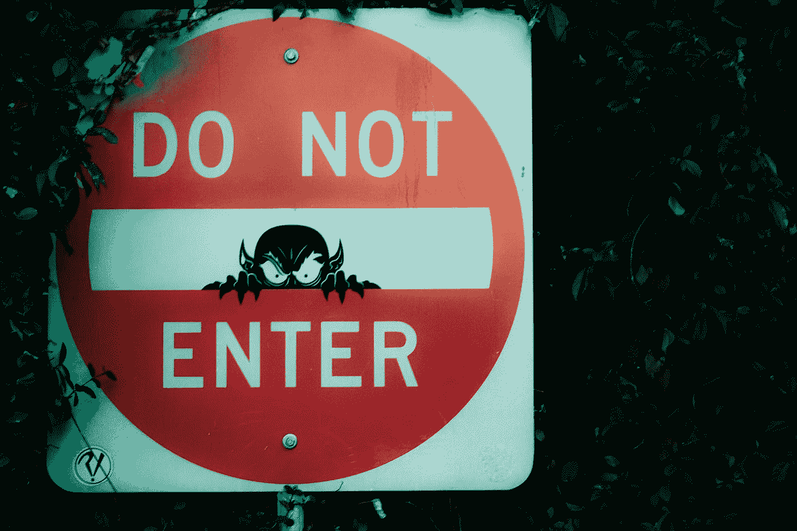

# 自由职业者提出的你不想成为自由职业者的 3 个理由

> 原文：<https://medium.datadriveninvestor.com/3-reasons-you-may-not-want-to-be-a-freelancer-by-a-freelancer-b6d4005813fe?source=collection_archive---------25----------------------->

## 这是从对自己诚实开始的

Photo by [Tech Nick](https://unsplash.com/@technick_inc?utm_source=medium&utm_medium=referral) on [Unsplash](https://unsplash.com?utm_source=medium&utm_medium=referral)

我成为自由职业者已经快 5 个月了，虽然我非常享受自由职业的自由，但我确实打算回到全职工作，因为我觉得两者都做没有坏处——也许完全的自由职业者可能不同意我，但谁在乎呢。

也就是说，自由职业并不适合所有人。有些人似乎毫不费力地从一个项目转向另一个项目，而有些人则长时间不工作。事实上，让我们说到底，有些人如果只做全职工作，做不同的活动作为副业，会好得多——这绝对没有错，而且有许多人已经有效地驾驭了企业世界。

尽管如此，我觉得我已经能够确定自由职业者的一些关键特征，并利用这些特征，我已经对不适合自由职业者的特征有了一个想法。在此，这里有一些我个人认为在自由职业世界里不会成功的人的特质——请不要把这当成人身攻击，因为那根本不是我的本意。然而，如果你觉得你符合这些特征，那么在我看来，也许你真的应该考虑一下你是否认为自由职业是你应该做的事情(我更希望人们证明我是错的)。

事不宜迟…

## #1 你挣扎着说不

当自由职业者的时候，喜欢有饥荒的时候，那会影响你从那天起如何指导你的职业生涯。说实话，这甚至不需要发生。有些人把金钱看得比你个人的幸福更重要。

与逻辑相反，不断接受合同可能会像饥荒时期那样令人紧张。你发现自己在囤积工作，越来越没有时间与朋友和家人加强社交生活——在我看来，这首先是作为自由职业者非常重要的一部分。

沃伦·巴菲特曾经说过…

> “成功人士和真正成功人士的区别在于，真正成功的人几乎对所有事情都说不”

是的，男人/女人经常很快就精疲力尽，或者变得习惯于生产低于标准的工作。(在我看来)最好的长期策略是，对你如何向雇主做出承诺，始终设定一个界限或一套流程。

## #2 你非常外向

我觉得这一点可能是我在这篇文章中提到的所有事情中最有争议的，但我觉得似乎没有人可以否认，对于内向的人来说，自由职业更好，因为他们从自己内心深处获取能量，而不是通过外部刺激(即其他人)。

尽管我“多产”写作，但我非常内向，喜欢长时间独处，尽管我的父母质疑这是否健康。当我独自一人时，我觉得我的头脑可以自由思考，这是我博客帖子、项目和未来决策的灵感来源。另一方面，我的父母要外向得多，他们经常对我的情况表示同情，因为他们觉得我可能被刺激不足，因为如果他们处于我的情况下，他们会有这种感觉，这与事实相去甚远。

作为一个内向的人，我知道我理想的工作环境可能会让外向的人无聊得流下眼泪，因为他们经常从社交场合和团队工作中汲取能量，而这在自由职业者的世界里不太常见。

但是我知道大多数人属于外向-内向型的中间，有各种各样的方法来克服作为外向自由职业者的麻烦。

## #3 你喜欢成为一名员工

最后但同样重要的是，你可能只是喜欢做一名员工。无论是你大多数最伟大的友谊都是在工作场所建立的，你被雇主的使命所说服，还是你认为在一个组织中工作是实现你职业目标的一个更无缝的过程，都有很多合理的理由让一个人决定为雇主而不是为自己工作——这样做完全没问题！

对一个人来说，成为一名雇员在各方面都会更没有压力。最明显的是，你真的不需要从管理的角度考虑如何处理金钱。如果你住在英国，在你领取工资之前，你的税收、国民保险和你缴纳的任何其他费用(如养老金，如果你缴纳的话)都会被扣除，所以你会得到净工资。

另一方面，自由职业者必须在他们所提供的技能组合中扮演专家、风险承担者、会计、销售人员、市场人员等角色。如果这听起来对那些只想专注于自己专业的人没有吸引力，那么继续做一名员工完全没问题。

## 包裹

一天结束时，它总是落在个人身上，例如，可能有外向的人在自由职业者的世界里茁壮成长，他们已经创造了让工作对自己来说令人兴奋的途径，或者他们是喜欢当雇员的人，但他们已经成功地平衡了作为雇员的激情与他们的自由职业生涯和社会生活。

我个人的建议很简单:如果你决定尝试自由职业，那么当你有另一种形式的经济保障支持你的时候，先尝试一下，而不是冒险，然后在将来后悔。

感谢阅读。在 [Twitter](https://twitter.com/KurtisPykes) 和/或 [LinkedIn](https://www.linkedin.com/in/kurtispykes/) 上与我联系，了解我关于人工智能和自由职业的最新消息。