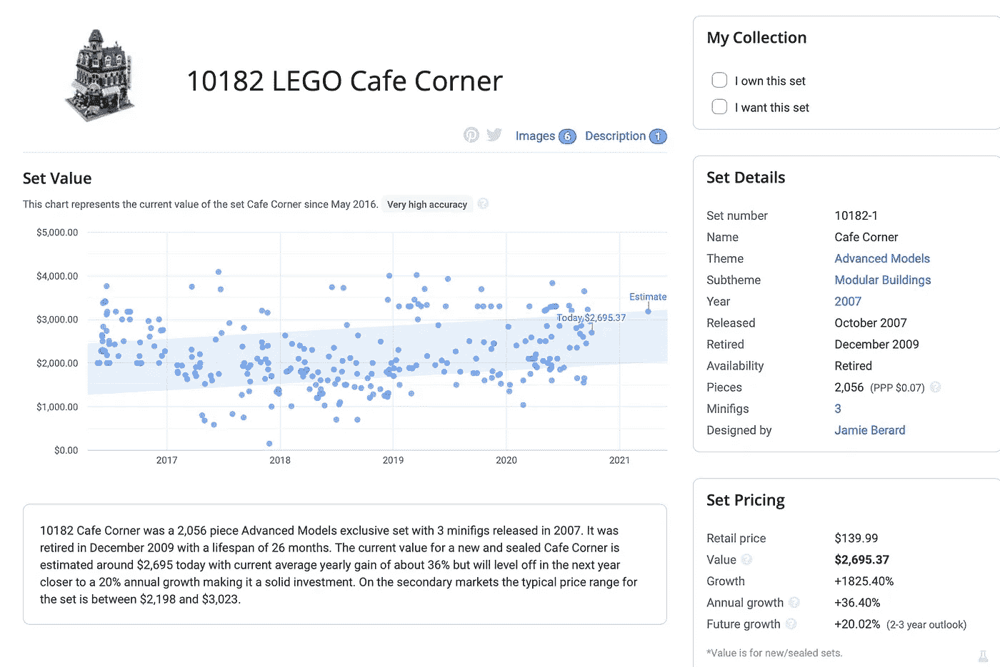

# 3 套退役的乐高玩具粉碎了股市

> 原文：<https://medium.datadriveninvestor.com/3-retired-lego-sets-that-crushed-the-stock-market-6ad7a7a3b7be?source=collection_archive---------0----------------------->

比起指数基金，你持有这些乐高玩具更好

股票市场是新投资者的常见温床。投资的便利性和长期增长的能力使股票市场引人注目。再加上指数基金，你可以在对股市一无所知的情况下获得平均市场回报，我们就有了吸引数百万投资者的秘诀。

房地产需要更多的工作，但也有很大的上升潜力。大部分人平时都听说过股票和房地产，可能也有人涉猎过比特币。

但有多种投资工具可供选择。从本质上讲，投资就是你把钱投入到某样东西中，希望它会增值。这个模糊的定义让我们的思考远远超出了股票、房地产和加密货币。

我们将使用这个模糊的定义来处理退役的乐高套装，这是一项利润惊人的投资，如果你购买并持有正确的乐高套装，你就可以摧毁股票市场。

让我们把这些碎片放在一起，这样我们就可以发现过去退役的乐高玩具为他们的投资者提供了什么类型的回报。

# 乐高埃菲尔铁塔(第 10181 号套装)

乐高埃菲尔铁塔套装于 2007 年 10 月首次推出，两年多一点就退役了。在此期间，该套装售价为 199.99 美元。

然而，如果你看看今天的套装，你会很幸运地发现一套低于 500 美元的二手套装。

根据 BrickEconomy(我们将在整篇文章中使用的来源)，一套的当前价值是 1698.89 美元。这对 13.09%的年增长率来说是不错的。

相比之下，标准普尔 500 同期增长了约 120%。

 [## 收盘，但没有雪茄-股票市场目标在停滞的 COVID 救济中创新高|数据驱动…

### 专家聊天程序:一个协作市场，在这里人们可以和能够解决他们问题的专家聊天。是……

www.datadriveninvestor.com](https://www.datadriveninvestor.com/2020/08/18/close-but-no-cigar-stock-market-targets-record-highs-amidst-stalled-covid-relief/) 

我知道你可能在想什么。2007 年 10 月正好是经济衰退之前，这将给乐高埃菲尔铁塔带来相当大的优势。但即使我们从经济衰退的底部开始，标准普尔 500 的产出还不到乐高艾菲尔铁塔总回报的一半。

早在 2020 年之前，乐高埃菲尔铁塔的估值就在 1，700 美元的水平，因此尽管增长率表明年化回报率为 13.09%，但如果你早几年卖掉它，实际上远不止这个数字。

大多数退役的乐高玩具都有一个短暂的价格高峰，然后在大约 5 年后达到顶峰。

# 乐高咖啡角(第 10182 组)

一个真正的巨人在退休的乐高产业，这一套经常去超过 2000 美元的易贝和最常用的一套去超过 1000 美元。有一些乐高爱好者得到了这套玩具的在线说明书，并购买了所有的单个玩具，而不是花几千美元买一套。

乐高咖啡馆角与乐高埃菲尔铁塔同时发布，1 个月后退役。

自退役以来，这一套取得了 36.40%的年增长率，抹杀了纳斯达克，即使我们看看经济衰退的底部。

纳斯达克的增长只代表了乐高咖啡馆迄今为止的三分之一。

# #3:乐高单轨机场班车(套装#6399)

在写这篇文章之前，我不知道乐高单轨机场穿梭套装，但 1990 年 139.99 美元的投资今天的估值将接近 4000 美元。

一些乐高玩具在退役后很久仍在升值。虽然这不是每一套的情况，乐高单轨机场班车符合这个法案。

在撰写本文时，你可以在亚马逊上以 3988.98 美元的价格买到它，但你可以在易贝上找到更便宜但仍然昂贵的选择。

虽然相对于 Cafe Corner 36.40%的年化增长率，乐高单轨机场班车的增长率并不高，但它能够在 30 年的时间里保持 11.74%的增长率。

当然，在崩盘之前，网络公司的回报要诱人得多，但如果你在这套乐高玩具发布之前投资 139.99 美元，你会做得很好。

乐高是一个受人喜爱的品牌，可以让投资者发财。选择正确的乐高组合，你的回报可以粉碎股市。你必须考虑到你投资的每一套乐高玩具的运输和储存费用，但是回报是值得的。

几乎每一套乐高玩具，最糟糕的情况是以零售价出售。你在股票上得不到同样的保证。

## 想了解更多股票投资知识吗？确保你订阅了 YouTube 上的《战胜市场》

## 获得专家视图— [订阅 DDI 英特尔](https://datadriveninvestor.com/ddi-intel)