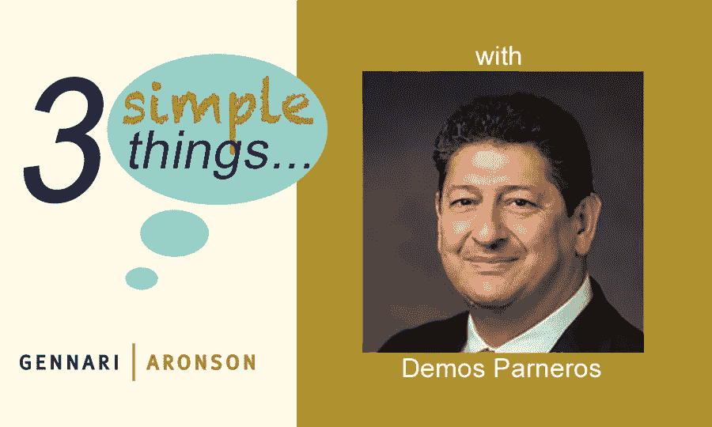

# Demos Parneros 的 3 件简单事| Gennari Aronson

> 原文：<https://medium.datadriveninvestor.com/3-simple-things-with-demos-parneros-gennari-aronson-3fa87bed23fd?source=collection_archive---------2----------------------->

## [Demos Parneros](https://www.demosparneros.com/) 是一家经验丰富的创新型零售和电子商务领导者。

*Demos Parneros is a Board member, investor, former CEO — Barnes & Noble, and former President — Staples (North American Stores & Online)*

> **在你漫长的职业生涯中，你花了很多时间思考传统和在线零售。考虑到疫情，我们将何去何从？**

一个多世纪以来，优秀的零售商已经证明了适应不断变化的顾客购物行为的能力。在过去的二十年里，许多传统零售商面临的挑战是增加有意义的在线和移动体验。如今，最具创新精神的零售商都是以客户为中心，而不是以渠道为中心，我们看到许多成功的数字化本土品牌都在建设门店，以满足客户的需求。今天的疫情推动我们去改变和适应……准备好了吗。该解决方案从一个模型开始，该模型不仅能满足业务需求，还能保证员工和客户的安全。零售商必须接受快速变化，愿意从错误中吸取教训，并接受做生意的成本会更高。迅速果断的行动将是零售商找到前进道路的关键。

这方面的一个很好的例子是 [CVS Health](https://cvshealth.com) ，它创造了一个安全、远离社交、无接触的结账过程，在这个过程中，你仍然可以通过有机玻璃隔板与你的收银员互动，并把你自己的物品装袋。

> 作为一名受欢迎的顾问、董事会成员和投资者，这些天你会看到很多商业计划——哪些是突出的？

我每天都会遇到聪明、热情、勤奋的企业家，他们分享自己的想法和商业计划。真正脱颖而出的计划，确定了一个清晰和集中的目标或他们正在解决的问题。他们也有明确的目标和独特的优势，这将有助于他们取得成功。同样重要的是坚韧和一个高度重视学习和好奇心的团结而有才华的团队。

这一点在 Wealthramp 的商业计划中表现得很明显——“简化获得个性化的信托理财建议的途径”。

> **在这个动荡时期，新产品或服务公司应该做些什么来建立自己的品牌和寻找客户？**

听，学，迭代。虽然这场危机挑战了我们的生活和工作方式，但它也是推动变革、创新和新模式的催化剂。当被迫改变时，我们被迫重新发明，并深入思考我们真正需要的是什么。我们的优先事项已经改变，所以对客户、产品和品牌的思考必须经过今天的后疫情过滤器。你的品牌能解决一个真正的问题吗？我们知道，如今的消费者对安全购物的敏感度越来越高，因此，清楚地传达您为确保他们的健康而实施的新流程对于平息他们的焦虑至关重要。当产品或服务满足真正的需求时，寻找客户就更容易了。

我喜欢 Cleancult 团队表现出的快速和灵活性。他们满足了客户的需求，保持了供应链的平稳运行，并照顾好了他们的员工。除此之外，在这个需要的时候，他们伸出手来为他们的社区捐款。

 [## Demos Parneros 的 3 件简单事| Gennari Aronson

### Demos Parneros 是董事会成员、投资者、Barnes & Noble 前首席执行官和 Staples 前总裁(北美……

galawpartners.com](https://galawpartners.com/2020/05/20/tst-demos-parneros/) 

*原载于 2020 年 5 月 20 日***。**

**

*[Demos Parneros | Innovative Retail and E-Commerce Leader.](https://www.crunchbase.com/person/demos-parneros)*

> *[Demos Parneros](https://www.crunchbase.com/person/demos-parneros) 是一位经验丰富的创新型零售和电子商务领导者，帮助 Staples 从一家初创公司成长为财富 100 强公司，并担任北美零售和电子商务业务总裁。他随后在 Barnes & Noble 担任首席执行官，领导一项重点转型计划，最终导致公司出售。除了之前在几家知名公司董事会任职之外，Demos 现在领导 CityPark LLC，他在那里投资了 15 家公司，包括几家领先的零售科技初创公司。*

*点击此处订阅 DIntel [。](https://ddintel.datadriveninvestor.com/)*

*请访问我们的网站:[https://www.datadriveninvestor.com](https://www.datadriveninvestor.com/)*

*在这里加入我们的网络:[https://datadriveninvestor.com/collaborate](https://datadriveninvestor.com/collaborate)*