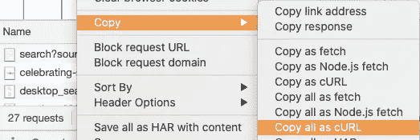

# 3 个简单的方法来抓取网页而不被阻塞

> 原文：<https://medium.datadriveninvestor.com/3-simple-ways-for-web-scraping-without-getting-blocked-34f3b1f885d1?source=collection_archive---------1----------------------->

## 防刮擦机构操作指南。


Photo by [John Matychuk](https://unsplash.com/@john_matychuk?utm_source=medium&utm_medium=referral) on [Unsplash](https://unsplash.com?utm_source=medium&utm_medium=referral)

如今，许多企业都依赖对公共数据的访问才能正常运转。不管你从事什么行业，迟早你都要从互联网上提取数据来完成任务。获取这些数据可能就像复制和粘贴数据一样简单，但是当涉及到大量数据时，web 抓取是最好的解决方案。

不幸的是，不是所有的网站都愿意被刮；这就是为什么他们会不择手段的检测你的刮刀，封杀你。在这篇文章中，我将向你展示 3 种方法来避免在抓取网站时被屏蔽。

# **抓取网站时避免被屏蔽的 3 种方法**

# 1.使用代理服务器

您的电脑有一个唯一的互联网协议(IP ),您可以将其视为电脑的街道地址。每次您导航时，互联网都会使用此 IP 地址向您的电脑发送正确的数据。

代理服务器是互联网上有自己 IP 地址的计算机。当您向 web 发送请求时，请求首先到达代理服务器，然后代理服务器代表您发出请求，收集响应，然后将您转到 web 页面，以便您可以与之交互。

如果你一次又一次地用同一个 IP 地址进行抓取，你的电脑的 IP 地址很容易被反抓取工具检测到。由于这个原因，你应该用代理服务器轮换你的 IP；所以网站认为请求是从不同的地方产生的。甚至像 HiQ 这样的公司也使用代理服务来掩盖 IP 地址[来抓取 LinkedIn](https://www.cpomagazine.com/data-privacy/what-the-hiq-vs-linkedin-case-means-for-automated-web-scraping/) 这样的网站并避免知识产权禁令。

虽然有许多免费的代理可用，他们涉及到一些问题，如收集你的数据和低性能。此外，许多人使用这些免费代理，这意味着代理已经被标记或禁止。相反，你应该考虑付费给一个能保证你的隐私、安全和高性能的代理提供商。其中有 Smartproxy，GeoSurf，Netnut。

# 2.轮换用户代理

用户代理帮助识别正在使用的浏览器、版本及其操作系统。它也促进了与网站内容的互动。例如，iPhone 上的 Chrome 用户代理如下所示:

```
Mozilla/5.0 (iPhone; CPU iPhone OS 10_3 like Mac OS X) 
AppleWebKit/602.1.50 (KHTML, like Gecko) CriOS/56.0.2924.75
Mobile/14E5239e Safari/602.1
```

要找到你的用户代理，只需在谷歌上输入“什么是我的用户代理。”

但是，除了用户代理之外，其他头都是由浏览器发送的。一些标题是:`accept, accept encoding, accept language, dnt, host, referer and upgrade-insecure-requests.`您可以创建一个字典`headers`并在抓取网站时包含它们:

你可以在这里找到一些浏览器[不同的用户代理字符串。建立一个包含几个用户代理的列表，以便以后轮换。](https://developers.whatismybrowser.com/useragents/explore/)

请记住，如果您只旋转用户代理，而其他标头保持不变，仍可能会检测到 scraper。

[](/5-things-you-should-know-to-easily-learn-web-scraping-6577bd8ebb08) [## 你应该知道的 5 件事来轻松学习网络抓取

### 降低学习网络抓取的难度。

medium.datadriveninvestor.com](/5-things-you-should-know-to-easily-learn-web-scraping-6577bd8ebb08) 

要轮换与每个用户代理关联的所有标题，请执行以下操作:

1.  打开一个隐姓埋名的窗口，转到您想要抓取的网站，然后在开发者工具中打开网络标签。

2.右键单击请求并选择*复制为 cURL*



Image by author

3.将其粘贴到 [curl 命令框](https://curl.trillworks.com/)中，将 curl 语法转换成您最喜欢的编程语言。

一旦旋度被转换，寻找变量`headers`。一旦找到它，复制字典中的元素，除了以`*X-*`开头的头

就是这样！现在，您已经有了特定网站上用户代理的正确标题。现在，按照相同的步骤收集您先前获得的用户代理字符串的头。

# 3.遵循最佳实践

糟糕的刮擦实践会影响网站的性能；这就是网站屏蔽你刮刀的原因。然而，负责任地刮擦不会损害网页，所以你可以继续刮擦而不会被阻塞。

以下是可以遵循的最佳 web 抓取实践:

*   **读取 robot.txt** :你应该经常检查‘robots . txt’文件，以了解应该如何抓取网站。要访问该文件，只需在网站的根目录中添加“robots.txt”字样，如“http://example.com/robots.txt”。该文件有一些规则，如您可以抓取的频率以及允许抓取的页面。如果发现`User-agent: * Disallow:` ，表示网站不希望被抓取，而`User-agent: * Disallow`:允许在网站内抓取。
*   **模仿人类行为**:如果你想增加你的 scraper 不被注意的机会，那么就写代码模仿人类在互联网上的冲浪行为。您可以在请求之间添加随机延迟，以便不被发现。此外，通过包括页面上的随机点击和鼠标移动来遵循不同的爬行模式。
*   **避免抓取登录后的数据**:如果你需要登录一个网站，抓取器将不得不发送信息或 cookies 以及每个查看页面的请求。因此，他们可以很容易地识别出你正在使用刮刀，你的帐户将被封锁。
*   **像安全系统一样思考**:研究网站用来检测刮刀的最新方法和工具。在这里你可以找到 [7 种保护网站免受抓取](https://webscraping.pro/7-ways-to-protect-website-from-scraping-and-how-to-bypass-this-protection/)的方法。如果你确切地知道公司用什么来保护他们的网站，你就能想出绕过他们的方法。

**你想从网络抓取中赚钱吗？**如果是的话**，c** 见鬼这篇文章我写道:

[](https://medium.com/swlh/how-to-make-money-from-web-scraping-without-selling-data-92c1f961b25) [## 如何在不出售数据的情况下从网络抓取中赚钱

### 你只需要几行代码来赚点外快

medium.com](https://medium.com/swlh/how-to-make-money-from-web-scraping-without-selling-data-92c1f961b25) 

# 摘要

现在你知道了 3 种方法来避免在抓取网站时被屏蔽。代理和标题的旋转将使反刮擦系统很难检测到你的刮擦器，而最佳做法将减少你被阻止的机会。

[**如果你想学习西班牙语的 Python，可以订阅我的 YouTube 频道。每周我都会发布类似下面这样的视频。**](https://www.youtube.com/channel/UCGKngc82bux4NIDar572E5Q/featured?sub_confirmation=1)

## 访问专家视图— [订阅 DDI 英特尔](https://datadriveninvestor.com/ddi-intel)