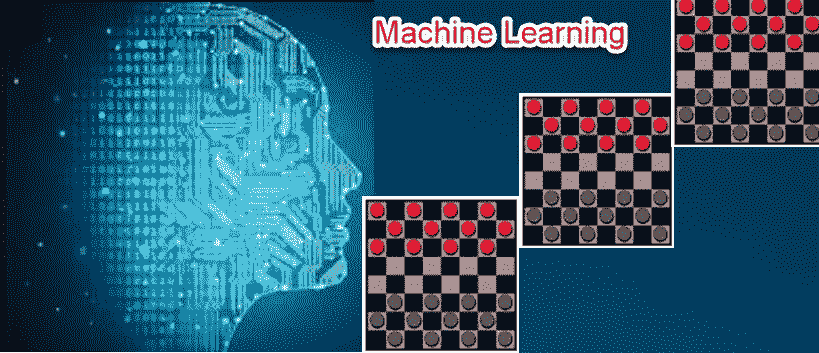
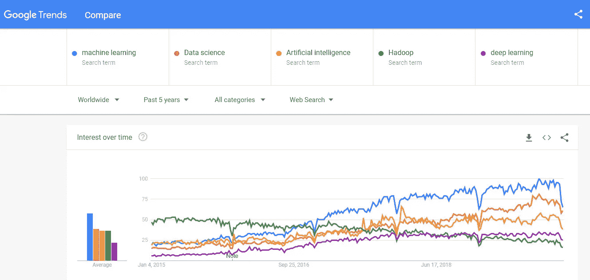
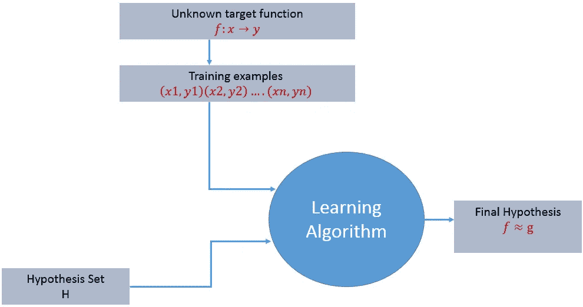
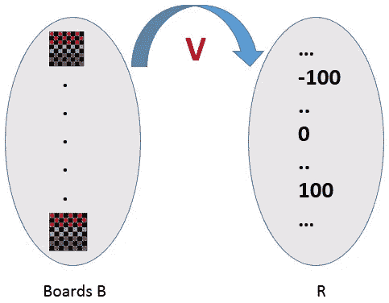
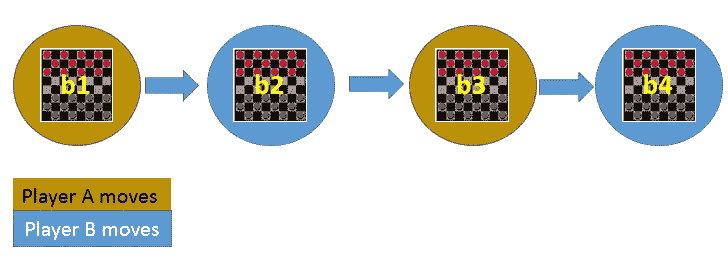
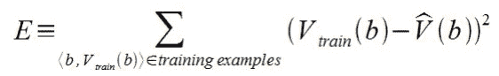
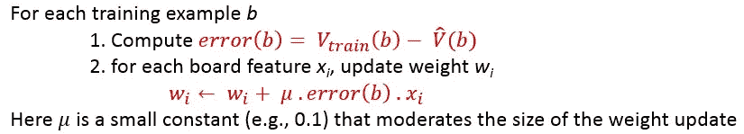

# 第 1 章—机器学习的介绍和学习系统的设计

> 原文：<https://medium.datadriveninvestor.com/3-steps-introduction-to-machine-learning-and-design-of-a-learning-system-bd12b65aa50c?source=collection_archive---------0----------------------->

让我去谷歌趋势，了解关键词的趋势——机器学习、数据科学、人工智能、Hadoop 和深度学习搜索。下面的截图显示了过去 5 年的趋势图。

在过去的 5 年里，机器学习和数据科学每天都在变得越来越高。这种增长趋势主要是由于广泛的应用，如数据挖掘、图像和语音识别、医疗诊断、产品推荐系统、自然语言处理等。在这个故事中，我试图解释机器学习，学习的过程，以及如何用一个例子来设计一个机器学习系统。

# 1.我们开始吧

在传统编程中，我们为某些任务开发算法或程序，在执行时，算法或程序接受输入并提供输出。但是在上面列出的应用中，传统的编程将不适合，取而代之的是，我们给机器输入和输出来生成算法。然后实时使用这些生成的算法。

假设我对所有这些技术都没有任何概念，并且我手头有一个问题，让我们来讨论如何设计这个问题的解决方案。关于该问题的详细信息如下:

“现在我的儿子西达尔特 4 岁了，我们都是双职工。我们一直想在没有日托或托儿所的帮助下照顾西达尔特。由于这种限制，任何人都必须在家照顾。当我在家的时候，我很困惑，不明白西达尔特为什么会哭。原因可能是感觉饿、感觉渴、由于衣服或任何东西而感到烦躁等等。我认为这对任何父母来说都是很常见的。”

> 我的问题总是，有没有什么方法可以帮助我理解他流泪背后的原因。

假设我家里有以下设备，它接收婴儿啼哭信号并对其进行分类。当婴儿因为某种原因哭泣时，如感到饥饿、口渴、因衣服而感到烦躁等，它会发出不同的音乐警报。

要设计这样的设备，需要的基础知识是对婴儿情感行为的巨大理解。这种知识变成了一种经验。利用这一经验，可以定义通用规则。例如，婴儿会因为饥饿而在睡眠后哭泣，婴儿会因为烦躁而在睡眠中哭泣，等等。所以这些一般化的规则会成为模型。该模型可以针对不同的婴儿进行测试，并且可以进行模型校正以获得更好的准确性。

 [## 金融中的机器学习|数据驱动的投资者

### 在我们讲述一些机器学习金融应用之前，我们先来了解一下什么是机器学习。机器…

www.datadriveninvestor.com](https://www.datadriveninvestor.com/2019/02/08/machine-learning-in-finance/) 

最终的模型被嵌入到设备中。该设备接收信号，提取信号的特征，并将信号的特征输入到模型中，以对婴儿的情绪进行分类。

在这个简短的想象故事中，有三个因素对我们很重要。它们是——经验、要解决的问题的任务或目标是什么，以及评估模型预测效果的性能度量。

> **机器学习的定义(Mitchell 1997)——**“如果计算机程序在某类任务 T 和性能测量 P 中的性能随着经验的增加而提高，则称其从经验 E 中学习”

我希望现在你能够将经验 E、任务类别 T 和绩效指标 P 与我们上面讨论的想象故事对应起来。

假设我们想要将收到的邮件分类为垃圾邮件。这个问题可以用以下三个要素来描述:

**垃圾邮件检测学习题**

1.  **任务 T:** 识别电子邮件并将其分类为“垃圾邮件”或“非垃圾邮件”。
2.  **性能指标 P:** 被程序正确分类为“垃圾邮件”(或“非垃圾邮件”)的邮件的总百分比。
3.  **训练经验 E:** 一组给定标签的邮件(“垃圾邮件”/“非垃圾邮件”)。

# 2.简单的学习过程

对于任何学习系统，我们都必须知道三个要素— **T(任务)**、 **P(绩效衡量)**和 **E(培训经历)**。在高层次上，学习系统的过程如下所示。

学习过程从任务 T、表现测量 P 和训练经验 E 开始，目标是找到未知的目标函数。目标函数是从训练经验及其未知中学习的精确知识。例如，在信贷批准的情况下，学习系统将具有客户申请记录，因为经验和任务将是分类给定的客户申请是否有资格获得贷款。因此，在这种情况下，训练示例可以表示为(x1，y1)(x2，y2)..(xn，yn)其中 X 代表客户申请详细信息，y 代表信贷批准状态。

**有了这些细节，从培训经历中学到的确切知识是什么？**

因此，在信贷审批学习系统中要学习的目标函数是映射函数 f:X →y。该函数表示定义输入变量 X 和输出变量 y 之间关系的确切知识

接下来，学习算法试图猜测逼近未知 f(的“假设”函数 h(X)。).假设是最好地描述目标和假设集或空间 H(.)是所有可能的法律假设的集合。这是机器学习算法将从中确定最佳可能(仅一个)的集合，该集合将最好地描述目标函数或输出。学习过程的目标是找到最接近未知目标函数的最终假设。

# 3.学习系统的设计

刚才我们看了学习过程，也理解了学习的目标。当我们想要设计一个遵循学习过程的学习系统时，我们需要考虑一些设计选择。设计选择将决定以下关键组件:

**1。培训经历类型
2。要学习的知识的确切类型(选择目标函数)。最初，目标函数是未知的。
3。这个目标知识的一个表示(为目标函数选择一个表示)
4。学习机制(为目标函数选择近似算法)**

我们将研究跳棋学习问题，并应用上述设计选择。对于跳棋学习问题，三个要素是，

*1。任务 T:玩跳棋
2。绩效评估 P:在锦标赛中赢得比赛的总百分比。
3。训练体验 E:一套自己玩的游戏*

# **培训经历**

在检查者的学习系统的设计过程中，学习系统可用的培训经验的类型将对学习的成功或失败产生重大影响。

1.  **直接或间接培训经历—** 在直接培训经历的情况下，给出了单独的板状态和每个板状态的正确移动。
    在间接训练经验的情况下，给出了一场比赛的移动顺序和多场比赛的最终结果(赢、输或平)。如何将功劳或过失分配给个人行动就是功劳分配问题。
2.  **教师与否—** 受监督—训练体验将被标记，这意味着，所有棋盘状态都将被标记为正确的移动。因此，学习是在有主管或老师在场的情况下进行的。
    无监督——训练体验将无标签，这意味着，所有棋盘状态都不会有移动。因此，学习者在没有监督或老师参与的情况下，随机生成游戏并与自己进行游戏。
    半监督式——学习者生成游戏状态，如果棋盘状态令人困惑，请老师帮助找到正确的走法。
3.  **培训体验是否良好—** 培训示例是否代表了将在其上测量最终系统性能的示例分布？
    当训练样本和测试样本来自相同/相似分布时，性能最佳。

棋手通过与自己对弈来学习。它的经历是间接的。它可能不会遇到人类专家游戏中常见的招式。一旦有了合适的培训经验，下一个设计步骤将是选择目标函数。

# 选择目标函数

在这个设计步骤中，我们需要准确地确定需要学习什么类型的知识，以及绩效计划使用什么类型的知识。

*当你在玩跳棋游戏时，在任何时候，你都要从不同的可能性中做出选择最佳走法的决定。你思考并应用从经验中获得的知识。这里的学习是，对于一个特定的棋盘，你移动一个棋子，使你的棋盘状态趋向于赢的情况。现在同样的学习必须根据目标函数来定义。*

这里有两个考虑因素——直接经验和间接经验。

**在直接体验**期间，跳棋学习系统只需要学习如何在一些大的搜索空间中选择最佳的走法。我们需要找到一个目标函数来帮助我们在各种选择中做出最佳选择。让我们调用此函数 ChooseMove，并使用符号 **ChooseMove : B →M** 来表示此函数接受合法棋盘状态 B 集合中的任何棋盘作为输入，并产生合法棋盘状态 M 集合中的一些棋作为输出。

**当有间接经验**时，学习这样的函数变得困难。给董事会分配一个真实的分数怎么样？因此函数是 **V : B →R** 表示它接受合法棋盘状态 B 集合中的任何棋盘作为输入，并产生一个实际分数的输出。此功能将较高的分数分配给较好的纸板状态。

如果系统可以成功地学习这样的目标函数 V，那么它可以很容易地使用它来从任何棋盘位置选择最佳移动。

因此，让我们定义 B 中任意板状态 B 的目标值 V(b)如下:
1。如果 b 是获胜的最终棋盘状态，则 V(b) = 100
2。如果 b 是丢失的最终棋盘状态，则 V(b) = -100
3。如果 b 是最终抽中的棋盘状态，那么 V(b) = 0
**4。如果 b 不是游戏中的最终状态，则 V(b)= V(b’)，其中 b’是从 b 开始并以最优方式玩到游戏结束所能达到的最佳最终棋盘状态。**

(4)是一个递归定义，为了确定特定棋盘状态的 V(b)的值，它执行对最佳游戏线的搜索，一直到游戏结束。所以这个定义不能被我们的跳棋程序有效地计算出来，我们说它是一个非操作定义。
**学习的目标，在这种情况下，是发现 V 的一个运算描述；也就是说，这种描述可以被玩跳棋的程序用来评估状态并在实际的时间范围内选择走法。**

要完美地学习 V 的这种运算形式，一般来说可能是非常困难的。我们期望学习算法只获得对目标函数^V.的一些近似

# 选择目标函数的表示

现在是时候选择一个表示了，学习程序将使用它来描述它将学习的函数^V。^V 的代表如下。

1.  为每种可能的板状态指定值的表？
2.  规则集合？
3.  神经网络？
4.  板特征的多项式函数？
5.  …

为了使讨论简单，让我们为任何给定的板状态选择一个简单的表示，函数^V 将被计算为以下板特征的线性组合:

*   x1(b) —棋盘 b 上黑色棋子的数量
*   x2(b)—b 上红色块的数量
*   x3(b)—b 上黑王的数量
*   x4(b)—b 上红色国王的数量
*   x5(b) —受到黑棋威胁的红色棋子的数量(即，可以在黑棋的下一个回合中被吃掉)
*   x6(b) —受红色威胁的黑色棋子的数量

^v = w0+w1 x1(b)+w2 x2(b)+w3 x3(b)+w4 x4(b)+w5 X5(b)+w6 X6(b)

其中 w0 至 w6 是通过学习算法获得的数值系数或权重。权重 w1 至 w6 将决定不同板特征的相对重要性。

**目前机器学习问题的规范—** 到目前为止，我们一直致力于选择训练体验的类型，选择目标函数及其表示。跳棋学习任务可以总结如下。

*   **任务 T:玩跳棋**
*   **业绩衡量:在世界锦标赛中赢得游戏的百分比**
*   **训练经验 E:与自己对战的机会**
*   **目标功能:V:板→ R**
*   **目标函数表示:^v = w0+w1 x1(b)+w2 x2(b)+w3 x3(b)+w4 x4(b)+w5 X5(b)+w6 X6(b)**

上面的前三项对应于学习任务的规范，而最后两项构成了学习程序实现的设计选择。

# 为目标函数选择近似算法

## **生成训练数据—**

为了训练我们的学习程序，我们需要一组训练数据，每个数据描述一个特定的棋盘状态 b 和 b 的训练值 V_train (b)。每个训练示例是一个有序对

**例如，训练示例可能是。这是一个例子，由于 x2 = 0 或红色没有剩余棋子，黑色赢得了游戏。然而，V_train (b)的这种干净的值只能对于明显赢、输或平的棋盘值 b 获得。**

**在上述情况下，为干净利落地赢、输或平的特定棋盘 b 分配训练值 V_train(b)是直接的，因为它们是直接的训练经验。但是在间接训练经验的情况下，为中间板分配训练值 V_train(b)是困难的。在这种情况下，使用时间差异学习来更新训练值。**时间差异(TD)学习是强化学习的核心概念，在强化学习中，学习是通过对你的估计回报进行迭代修正，以达到更准确的目标回报。****

**Let Successor(b)表示 b 之后的下一个棋盘状态，再次轮到该程序移动。^V 是学习者对 v 的当前近似值。使用这些信息，为任何中间板状态 b 指定 V_train(b)的训练值如下:
**v _ train(b)←^v(successor(b)****

****

**上图中，V_train(b1) ← ^V(b3)，其中 b3 是 b1 的后继。一旦游戏开始，就会生成训练数据。对于每个训练示例，计算 V_train(b)。**

# **调整重量**

**现在是时候定义学习算法来选择权重和最适合的训练样本集了。一种常见的方法是将最佳假设定义为使训练值和由假设^V.预测的值之间的平方误差 e 最小的假设**

****

**随着更多的训练示例可用，学习算法应逐渐改进权重，并且需要对训练数据中的错误具有鲁棒性
最小均方(LMS)训练规则是一种训练算法，它将在减少错误的方向上少量调整权重。**

**LMS 算法定义如下:**

****

# **跳棋学习系统的最终设计**

1.  **性能系统——接受一个新的棋盘作为输入，输出它与自己对弈的轨迹。**
2.  **评论家—将游戏的轨迹作为输入，并输出一组目标函数的训练示例。**
3.  **概化器-将训练示例作为输入，并输出估计目标函数的假设。对新案例的良好概括至关重要。**
4.  **实验生成器——将当前假设(当前学习的函数)作为输入，并输出新问题(初始棋盘状态)供绩效系统探索。**

## **参考文献—**

1.  **汤姆·米切尔的《机器学习》**
2.  **从数据中学习亚塞尔·阿布·穆斯塔法**