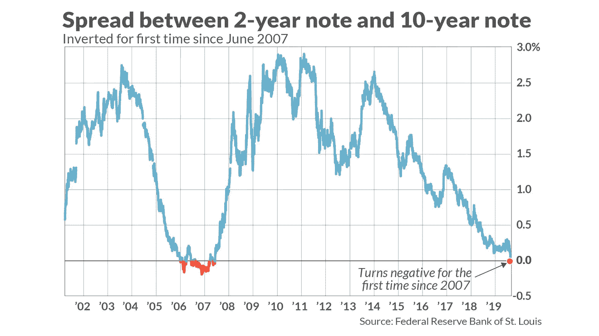
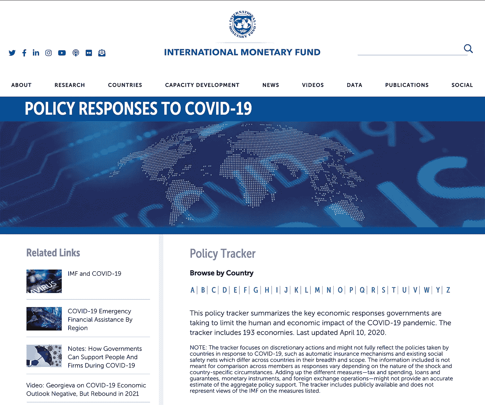
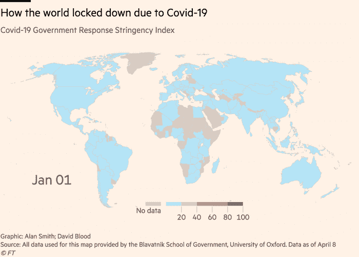
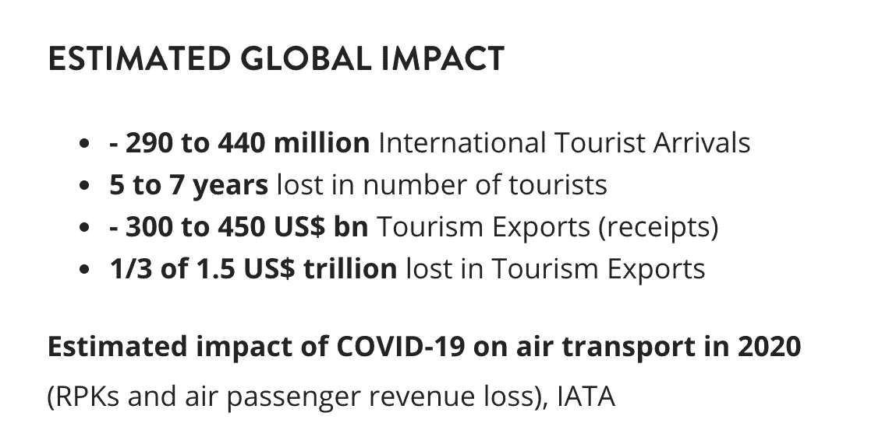

# 在经济危机中评估货币政策的三个步骤。

> 原文：<https://medium.datadriveninvestor.com/3-steps-to-assessing-monetary-policy-amidst-an-economic-crisis-480b42d3c166?source=collection_archive---------8----------------------->

我们需要了解政府决策的影响。

政府有责任监督和保护他们的人民，这是理所当然的，即使在贫穷的国家，人们也有一种固有的期望，即他们的政府会给予人民无与伦比的支持，但不幸的是，现实远非无与伦比。你看，对你我来说可以接受的，对另一个人来说不一定可以接受，这就是为什么[世界银行](https://medium.com/u/6ed2e6ddbb88?source=post_page-----480b42d3c166--------------------------------)将*极端贫困*指标确定为衡量现状的标准。鉴于事态的发展，无论新冠肺炎与否，国内和政治动荡都不再是一个选项，我们在 2019 年第四季度出现了收益率曲线反转，这是所有预测指标之母-不是一件好事。

理解收益率曲线和反转的影响:

所以我们看到了自 2007 年以来的第一次反转:

Universa Investments，一家由纳西姆·尼古拉斯·塔勒布提供咨询的基金，在他们与世界的赌注中获得了高达 4144%的收益。如果我的假设是正确的，该基金的年份是 2017 年，2017 年的 100 美元投资将在今天价值 4144 美元，复合增长率为 154%！！这种投资工具一般人是买不到的。

《泰晤士报》曾向著名作家发出一份调查，问了这样一个问题:当今世界怎么了？G.K .切斯特顿回答道:

> “亲爱的先生，
> 
> 我是。
> 
> 你的，G.K .切斯特顿。"

我们是时候通过明智的货币和财政政策携起手来了——这对少数人来说是一种安慰，但对许多人来说却是一场噩梦。对我们的政府来说，寻求众多的顾问是很重要的，因为那是安全之所在。

 [## 现金为王，比我们想象的更强大|数据驱动的投资者

### 2020 年 3 月 12 日，在川普总统宣布新冠肺炎进入国家紧急状态的前夕，纽约时报报道…

www.datadriveninvestor.com](https://www.datadriveninvestor.com/2020/03/26/cash-is-king-more-potent-than-we-think/) 

我们从源头开始，在所有信息超载的情况下，测试来源至关重要——国际货币基金组织的网站有一个跟踪器，跟踪世界各地为应对危机而实施的货币和财政政策。选择你感兴趣的国家。

[https://www.imf.org/en/Topics/imf-and-covid19/Policy-Responses-to-COVID-19#U](https://www.imf.org/en/Topics/imf-and-covid19/Policy-Responses-to-COVID-19#U)

接下来，我们开始思考应对政策如何在三个方面产生影响:

**1。在宏观层面上**，这有助于我们理解政府和经济的观点，在这一层面上我们能做的很少，但是，重要的是要接受教育，以辨别和解释政府的反应，这将有助于做出合理的决策。

到目前为止，我们大多数人都知道世界在封锁方面所处的位置，截至 4 月 8 日，世界在这段时间内如何发展的地图如下图所示。对政府的挑战是巨大的，许多政府已经迅速采取行动，这取决于我们，人民系好安全带，认真倾听，最脆弱的群体需要最大的保护。

这种情况的连锁反应包括:

— —在接下来的 6 个月里，增长前景明显恶化， [S & P Global 将增长削减至 0.4%](https://www.spglobal.com/ratings/en/research/articles/200330-economic-research-the-escalating-coronavirus-shock-is-pushing-2020-global-growth-toward-zero-11413969) ，可能在 2021 年复苏。

— —中国经济放缓导致大宗商品供需短缺，同时冲击了供应链。

[Source: UNWTO](https://www.unwto.org/impact-assessment-of-the-covid-19-outbreak-on-international-tourism)

— —全球许多严重依赖旅游支出和航空公司收入的经济体都遭受了重大打击。一个很好的做法是了解不同行业部门对 GDP 的贡献，以估计潜在影响。

———最后，我在另一篇文章中写了关于[零利率](https://medium.com/datadriveninvestor/making-sense-of-zero-interest-rates-9d34c126b48d)的影响。

**2。在微观层面上**，这有助于我们理解当地的问题以及我们为之奔走或工作的组织的潜在反应。

据我们所知，这项工作已经彻底改头换面，这意味着消费者的消费已经碰壁。快消品和公用事业等基本行业的消费有所上升，但远未抵消消费水平，我们过去一直处于。

在未来的几个月里，除了基本服务之外，预计企业不会增加投资，至少不会增加对私营部门的投资。这意味着进一步裁员，增加成本和规模经济的下降。正如国际货币基金组织网站上指出的那样，政府刺激方案只能影响他们愿意的程度——关注政府正在努力改善的流动性，这是这段时间的一项关键措施。

**3。最后是**，在个人层面，我们可以采取积极措施来应对即将到来的经济衰退。在货币面临下行压力的情况下，这种情况的一个好框架是考虑避险资产——黄金、美元，当然还有普通的现金。我发现下面提到的宽泛的哲学对不执着于我所拥有的特别有帮助:

> 你们要谨慎，防备一切的贪心，因为人的生命不在乎家业丰富。给需要的人。
> 
> ——路加福音(公元 63-70 年)

对我们来说，重要的是要认识到这种需要，并尽可能地削减开支，然而，不要生活在对明天的恐惧或焦虑中，因为恐惧和焦虑永远不能满足当前的需要。

我们生活在过去 2-3 代人前所未闻的时代——这很复杂，我们必须应对。怎么会？互相保护。在一个主要由农业驱动的社会中，我们播种什么就收获什么，然而，在今天的世界中，情况并非如此。这是一个零和游戏，我们大多数人将财富委托给机构，这没什么，但当财富被贪婪所驱动时，问题就出现了，过去导致金融危机的事件就证明了这一点。财富的再分配是合理的。

> **我们如何赚钱很重要，因为如果我们以他人为代价获得财富，而不是创造财富，我们就把别人得到的东西拿去管理，从而剥夺了他们的机会。**
> 
> **—约翰·派珀**

有一个故事，一个富有的税吏，被要求重新分配他所拥有的作为一种报复，他把他所拥有的一半给了穷人，如果他欺骗了任何人，他会偿还 4 倍的钱，他很高兴这样做。据说他在剥夺自己的财富中找到了生活。这估计发生在公元 30-33 年之间。我们生活在消费主义的时代，一切都很容易得到。鉴于当前全球经济复苏的时间和深度预计将比此前预期的更长，我想知道，如果发生这种情况，我们的社会会发生什么样的根本性转变。