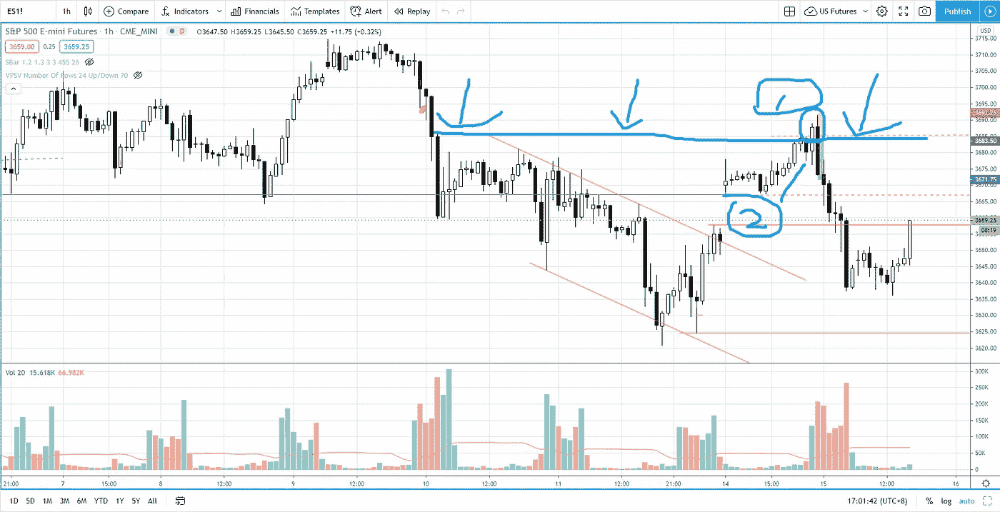

# 从交易供应区获利的 3 个步骤——标准普尔 500 日交易

> 原文：<https://medium.datadriveninvestor.com/3-steps-to-profit-from-trading-supply-zone-s-p-500-day-trading-e7be0f6a3105?source=collection_archive---------19----------------------->

了解如何遵循这 3 个简单的步骤从供应区交易中获利(大多数交易者忽略了这些)。

观看视频，了解 2020 年 12 月 15 日交易时段标准普尔 500 指数期货的**每日市场分析。在这个视频中，你将看到上一个交易日的市场回顾和三分钟的交易回顾(包括进场、出场和背后的原理)。展望未来，我将涵盖偏见，要注意的关键水平，我稍后的交易计划。**

## 时间戳

*   [1:16](https://www.youtube.com/watch?v=dQk8Pjt9J1c&t=76s) 市场回顾
*   [4:05](https://www.youtube.com/watch?v=dQk8Pjt9J1c&t=245s) 贸易回顾
*   [5:30](https://www.youtube.com/watch?v=dQk8Pjt9J1c&t=330s) 供应区说明
*   是供应还是需求在起主导作用
*   [13:40](https://www.youtube.com/watch?v=dQk8Pjt9J1c&t=820s) 努力与结果和数量分布分析
*   [16:09](https://www.youtube.com/watch?v=dQk8Pjt9J1c&t=969s) 当前股市展望

如果你还没有看我在上一次会议中的[市场分析视频](https://www.youtube.com/watch?v=pmxy6mDT9sc)，以便更好地与市场回顾和贸易评论相关联。

**偏向** —中性(日内交易)；看涨(长期)

**关键水平** —阻力:3750；支持电话:3697–3705，3670

**潜在设置** —在关键级别寻找潜在反转。

# 资源

**每周市场展望&最佳交易建议**直达您的收件箱:[https://www.tradeprecise.com/](https://www.tradeprecise.com/)

**职业免费**制图平台:创建账户→[www.TradingView.com](https://bit.ly/2U2Femd)

**非美国居民？** ( **马来西亚、新加坡**、澳大利亚、新西兰、欧洲等):[点击此处，存款 2000 新加坡元](https://ji.hn/sgtiger)即可获得**免费股票(价值 100++美元&老虎经纪**的欢迎礼物)

美国居民？[点击此处，存款 1500 美元](https://ji.hn/ustradeup)，就有机会在 TradeUP 获得**份免费的 AMZN 股票(价值 3000++** ) & **份欢迎礼物**

**从媒体获取无限文章** —加入以下:[https://priceactiontrading.medium.com/membership](https://priceactiontrading.medium.com/membership)

# 进一步阅读

 [## ARK Invest 的 Cathie Wood 预测基因组股表现优于特斯拉？

### 方舟投资公司的首席执行官凯西·伍德预测，最大的上涨惊喜可能来自基因组股票，尤其是…

medium.com](https://medium.com/datadriveninvestor/ark-invests-cathie-wood-predicts-genomic-stocks-outperform-tesla-b67f3c4bbc68)  [## 低估的可操作高成长股第 2 部分— FVRR、优步、PYPL、JMIA

### 这些高成长股很可能在几天内被触发。找出我的交易计划与进入和止损…

medium.com](https://medium.com/datadriveninvestor/underhyped-actionable-high-growth-stocks-part-2-fvrr-uber-pypl-jmia-b24183668d20)  [## 2021 年这些绿色能源股会涨 400%-1300%吗？

### 2021 年第 3 周市场回顾

medium.com](https://medium.com/datadriveninvestor/will-these-green-energy-stocks-gained-400-1300-in-2021-3f7288227c76) 

Photo by Author — Ming Jong Tey

Photo by Author — Ming Jong Tey

披露:如果您点击本文中的链接进行购买或开立账户，并将所需金额存入推荐的经纪人账户，我们将免费为您赚取佣金。

免责声明:本演示中的信息仅用于教育目的，不应作为投资建议。