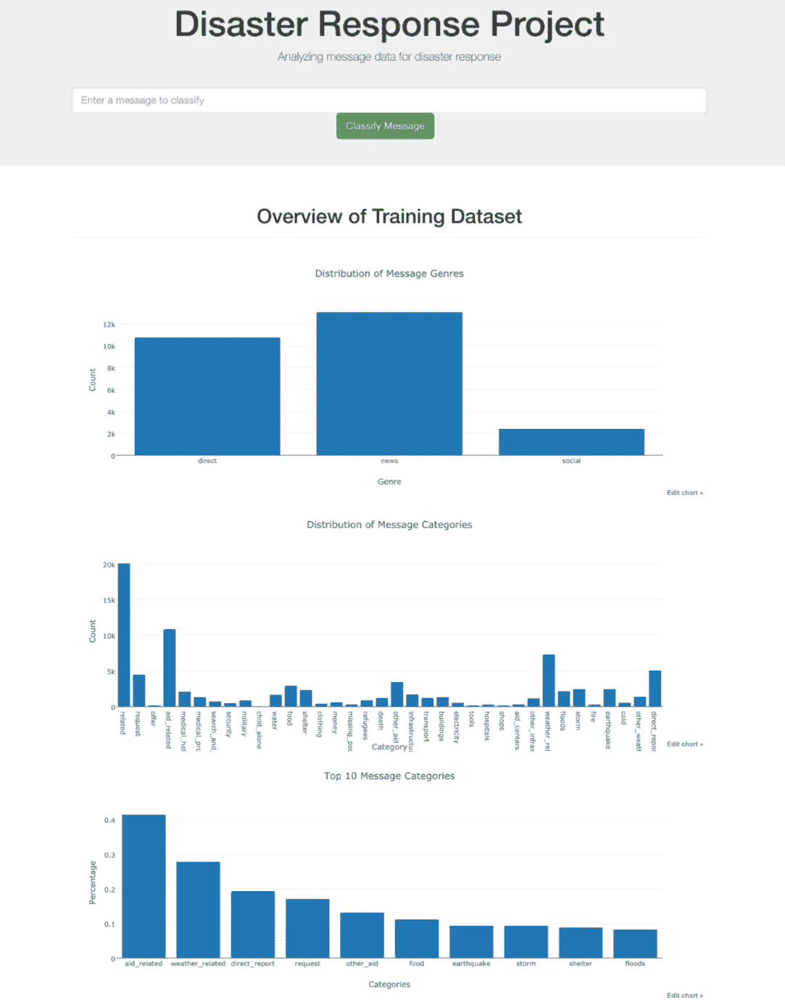
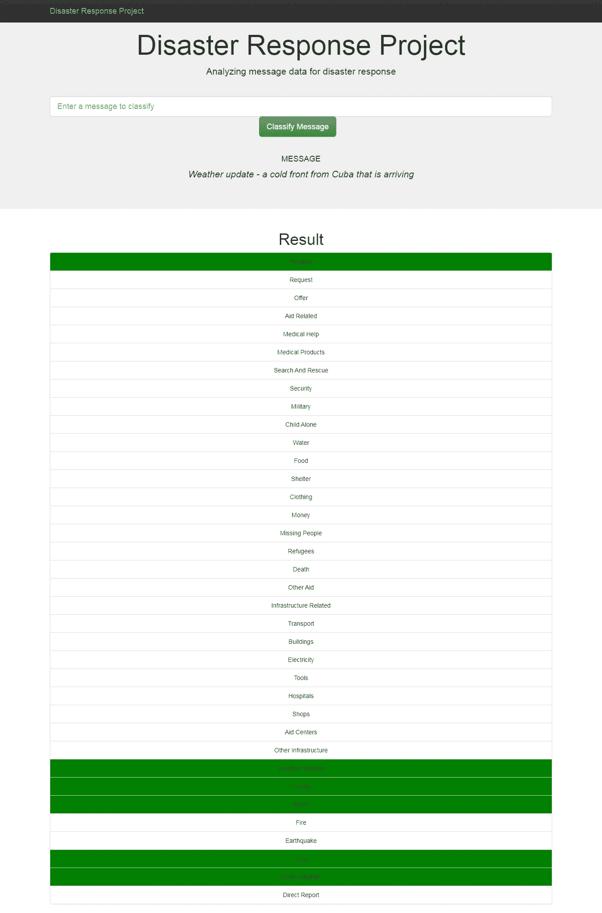

# 使用机器学习解决自然灾害的 3 个步骤

> 原文：<https://medium.datadriveninvestor.com/3-steps-to-tackle-any-natural-disaster-using-machine-learning-d114ba779a88?source=collection_archive---------14----------------------->

## 内部人工智能

怎么想的？抓紧了！并提前阅读。

任何国家都可以使用这种方法来减少对社会的影响。这个项目的主要目的是对灾难期间出现的信息进行分类，以便各个救援机构更好地了解哪里需要他们的帮助。

听起来很困惑，不是吗？让我们一步一步来…

# 第一步:获取数据

人们可以从众包或拦截社交媒体网站获得数据。我从图八收集数据。数据包含消息及其类别，无论它是与财政援助、医疗还是军事相关。

但这里的数据并不直截了当。它是混杂的。例如，类别没有以正确的方式给出。例如，如果消息与财政援助有关，那么财政援助-1，医疗-0，军事-0。所以值 1 表示消息的类别。

 [## 认知计算——一套被广泛认为是……

### 作为它的用户，我们已经习惯了科技。这些天几乎没有什么是司空见惯的…

www.datadriveninvestor.com](https://www.datadriveninvestor.com/2020/02/19/cognitive-computing-a-skill-set-widely-considered-to-be-the-most-vital-manifestation-of-artificial-intelligence/) 

然后，我把它简化了，为每一个类别做了一个新的栏目，并相应地进行了估值。现在数据集有了消息和 32 个包含类别的其他列。一些微小的操作完成了要求。

为了提取重要的特征，我将消息标记化为标记，然后将其剥离以避免不必要的空格，为了简单起见，将整个文本数据转换为小写。

清理完数据后，我将清理后的数据放入 SQLite 数据库以保证可靠性。

# 第二步:建立机器学习管道

想知道这条管道吗？

不…是来自 sklearn 库的机器学习管道。
在调整超参数时，组合几个可以交叉验证的转换。

这里我依次有三个转换，计数矢量器，TF-IDF 矢量器，最后是 MultiOutputClassifier。
前两个转换是为了找出哪个单词在整个消息中具有更高的重要性，可以用于进一步预测。最后一个 MultiOutputClassifier 是因为我想要所有有概率的类别的输出。(对于了解 ML 的人来说很专注，但如果不理解也不用担心。)

现在我们使用的是流水线，所以我们必须定义一系列超参数来迭代检查算法。我给了这些参数来玩。
' tfi df _ _ smooth _ IDF ':[真，假]，' clf _ _ estimator _ _ estimator _ _ C ':[1，2，5]
它将测试两者的所有组合，以优化算法。

使用流水线的优势:
更少的代码，更少的时间
易于优化算法
调整超参数的定义方法

在这里，我使用了 OneVsRestClassifier 和 LinearSVC 作为分类器。它给了我 95%的准确率。我认为对于这种任务来说已经足够了。

此外，我已经将该模型保存到 pickle 文件中，并将其部署在 Flask web-app 中。

> 另请参阅:[推荐引擎系列(第 1 部分)](https://medium.com/@prashantjadiya/recommendation-engines-a-to-z-part-1-3ab585c11324)

# 步骤 3:分析并在各机构之间划分任务

我想给我的网络应用一些见解。这是数据可视化。

Data visualization

Prediction of message

在上面的截图中，输入的消息是*天气更新—来自古巴的冷锋即将到达……*这只是消息的一部分，模型将此消息分类为天气相关、洪水、风暴、寒冷和其他天气类别。

因此，这个 API 可以用于对灾难时传播的消息进行分类。

政府将访问社交网站，并将所有信息分类。例如，消息是关于食物短缺，那么这个消息将被传递给只关注食物问题的救援机构。他们会接触到发出信息的人，这就是如何解决问题，同时对社会产生较小影响的方法。

这就是我们如何将机器学习应用于大范围的问题。我们可以把这与当前新冠肺炎的全球疫情联系起来。这在当前情况下非常有用。

如果你喜欢我的作品，请鼓掌并在 [LinkedIn](http://www.linkedin.com/in/prashant-jadiya) 上与我联系。