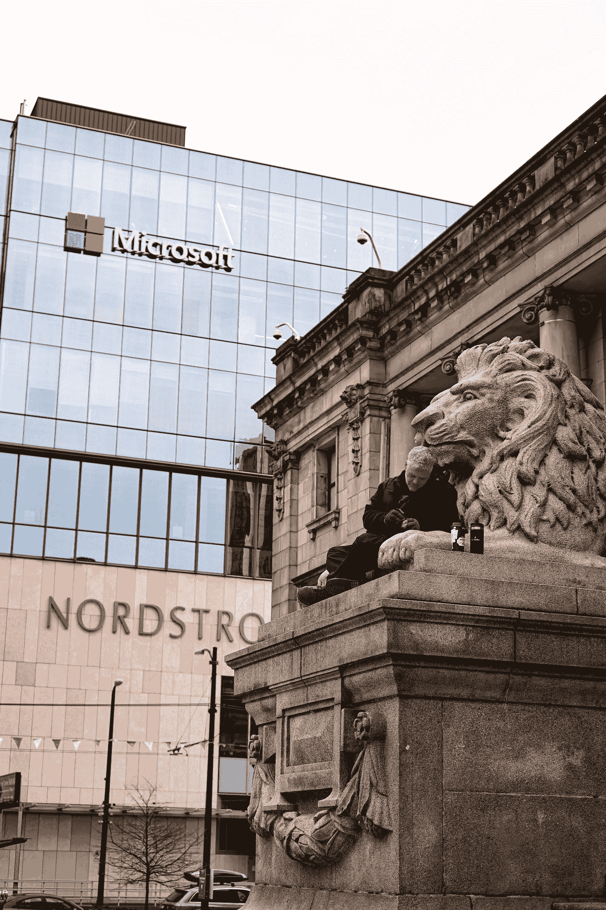
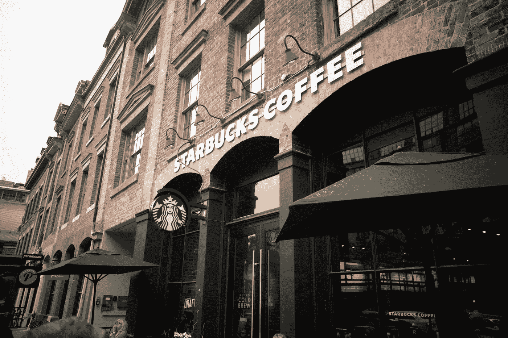

# 3 购买股票并长期持有

> 原文：<https://medium.datadriveninvestor.com/3-stocks-to-buy-and-hold-long-term-2e6edafd415e?source=collection_archive---------6----------------------->

由于冠状病毒和对全球经济的打击，股票市场在过去的 5 周里遭受了巨大的打击。美国数百万人申请失业救济，因为许多企业暂时关闭。如果你有稳定的收入和工作，你就有机会投资那些能在新一轮衰退中幸存下来的伟大品牌和公司。

这里有 3 家公司值得买入并长期持有。

Photo by [Medhat Dawoud](https://unsplash.com/@medhatdawoud?utm_source=medium&utm_medium=referral) on [Unsplash](https://unsplash.com?utm_source=medium&utm_medium=referral)

# 1.苹果公司:(纳斯达克代码:AAPL)

我投资苹果已经很多年了，我向我的朋友和家人推荐这只股票。苹果已经证明，他们能够经受住经济衰退，并迅速反弹。在 2008 年至 2009 年的金融危机中，苹果股票跌至每股 12 美元左右的低点。自那以后，该公司推出了令人惊叹的产品和服务，深受世界各地人们的喜爱。即使在这次新的冠状病毒危机期间，对新设备的需求仍然很大，因为人们在家工作或休息时用苹果产品玩游戏。就在 2020 年 2 月，苹果股票达到了每股 327 美元的峰值。它遭受了重大打击，最近跌至 224 美元，目前每股交易价格约为 239 美元。

 [## 投资区块链前要问的三个简单问题(也是一个困难的问题)|数据…

### 现在是了解区块链的最佳时机。不同货币之间的增长率，比如…

www.datadriveninvestor.com](https://www.datadriveninvestor.com/2020/03/12/three-simple-questions-and-one-difficult-one-to-ask-before-investing-in-a-blockchain/) 

最终，随着病毒病例数量的下降，工厂和商店将重新开业。中国的苹果商店已经重新开业，那里对产品的需求仍然很高。苹果有品牌、需求和现金来战胜这种病毒。根据美国消费者新闻与商业频道的说法，苹果手头有超过 2000 亿美元的现金，这将使他们能够留住最好的员工。如果你是长期投资，现在是为你的投资组合购买苹果的好时机。

> 你有机会投资那些在新一轮衰退中幸存下来的伟大品牌和公司。

Photo by [Mohammad Rezaie](https://unsplash.com/@heinrich_boll?utm_source=medium&utm_medium=referral) on [Unsplash](https://unsplash.com?utm_source=medium&utm_medium=referral)

# 2.微软公司:(纳斯达克代码:MSFT)

在过去的 7 年里，微软的领导团队帮助公司转型，以跟上企业的新数字趋势。微软向我们展示了他们也能经受住经济不确定性的风暴，并且仍然能给投资者带来价值。在金融危机期间，微软在 2009 年跌至每股 16 美元的低点。他们恢复了元气，自那以来一直保持正增长，最近股价攀升至每股 188 美元。

我喜欢投资微软，因为他们在数字和云领域有很好的产品和服务。公司正在投资像微软团队这样的工具来帮助他们的员工保持生产力和效率。公司和政府也在投资像 Azure 这样的云服务，这已经成为微软增长最快的部门之一。3 月 23 日，微软股票触及每股 135 美元的低点。该公司已经开始复苏，目前股价为每股 153 美元。长期投资者有机会以低于 2020 年初的价格购买微软。像微软这样的公司可以抵御这种病毒，他们可以动用手头超过 1300 亿美元的现金。

Photo by [TR](https://unsplash.com/@trance?utm_source=medium&utm_medium=referral) on [Unsplash](https://unsplash.com?utm_source=medium&utm_medium=referral)

# 3.星巴克公司:(纳斯达克股票代码:SBUX)

星巴克在世界各地有超过 30，000 家分店，它们的标志人人都知道。在冠状病毒爆发之前，星巴克的股票高达每股 93 美元，遭受了巨大的打击。它一路跌至每股 56 美元，现在徘徊在 62 美元左右。我加大了对星巴克的投资，因为他们的品牌能够生存下来。星巴克手头有现金，这使他们能够关闭商店，但仍然支付员工工资。一些地方仍然开放外卖订单，包括我家附近的一家。

星巴克最终会重新开业，他们的忠诚计划会很快带回他们的老顾客。他们将能够渡过难关，并随着时间的推移反弹，我相信我们将看到股票在未来 12-18 个月内回升到 85-90 美元。大品牌可以从经济困境中复苏，星巴克将从冠状病毒中复苏。现在是把价格在 60 美元左右的星巴克加入你的投资组合的好时机。

# 投资组合提示:

一个强大的投资组合包括基金和全球公司。查看我的另一篇关于 [4 只基金立即购买](https://medium.com/datadriveninvestor/the-stock-market-is-down-4-funds-to-buy-now-4be0a9554aba)的文章。我建议你的投资组合中有 10-15 家不同的公司，它们横跨不同的行业。如果你要在你的投资组合中加入一家新公司，从你资产的 1-3%开始。随着时间的推移，你总是可以购买更多的股票。如果你刚刚开始投资，考虑从你每月税后工资的 5-10%开始。随着时间的推移，你将能够看到有多少你可以定期投资于股票和基金。需要更多股票和推荐？看看我的另一篇文章，关于在这个疫情期间购买的 [9 只股票。](https://medium.com/makingofamillionaire/9-stocks-to-buy-during-the-coronavirus-pandemic-2ccbf1d6c28a)

祝你在市场上好运，请保持健康和安全！

*声明:我是一名个人投资者和作家，本文仅用于教育和娱乐目的。这不是专业的财务建议。我目前持有文章中列出的所有公司的股票:AAPL、MSFT 和 SBUX。*