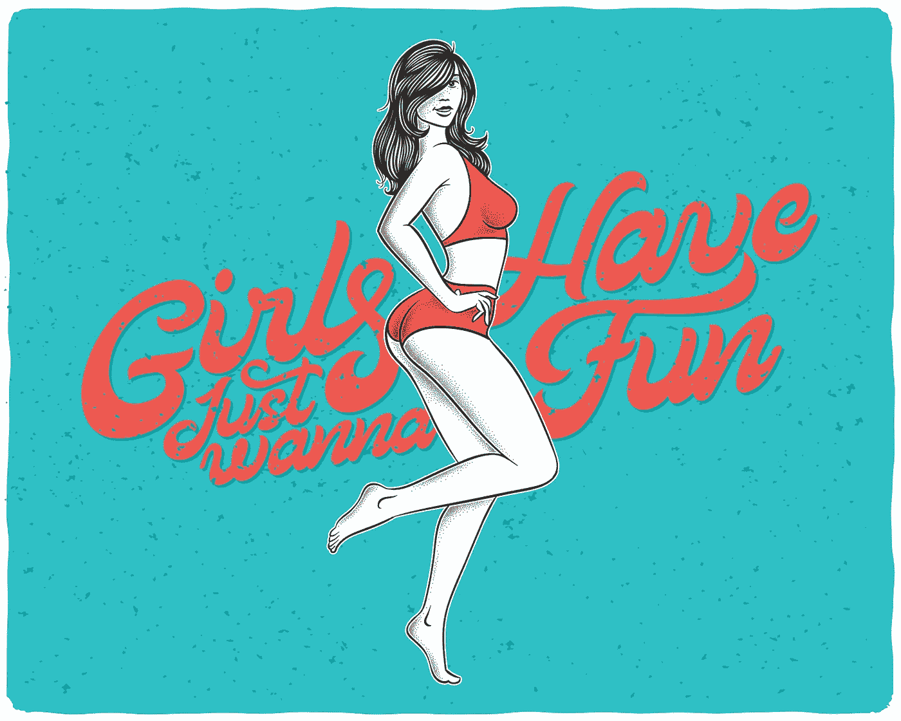
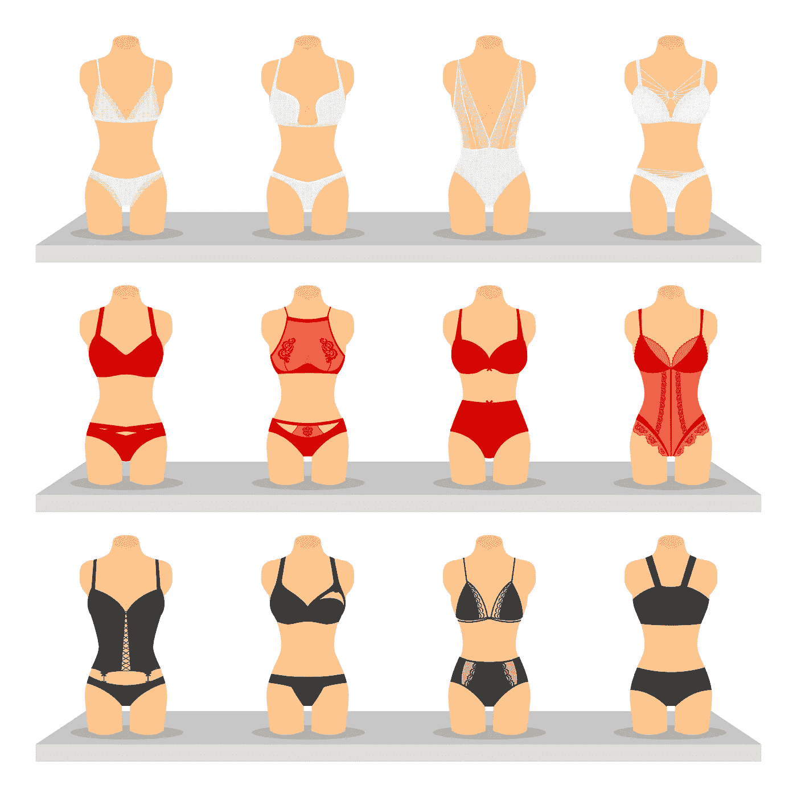
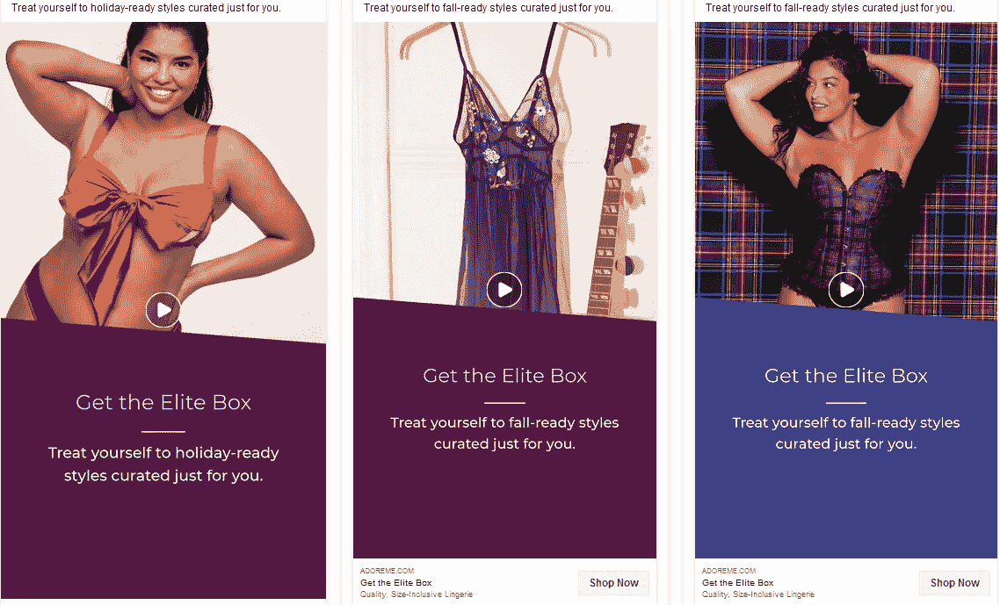
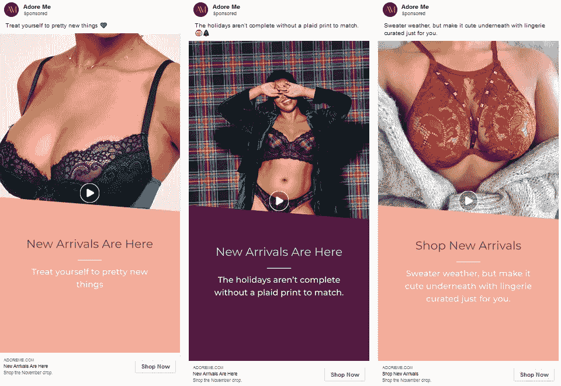
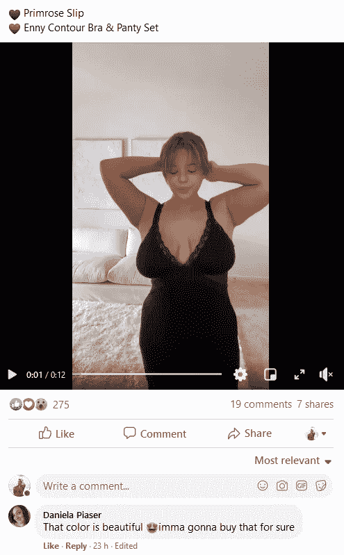
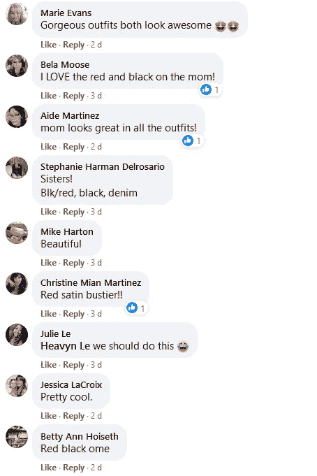
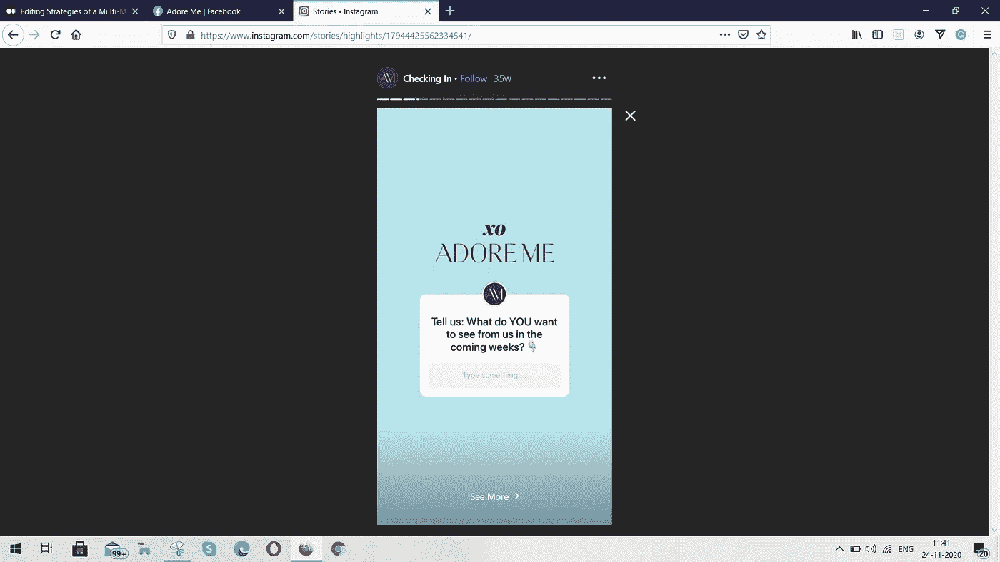

# 一个价值数百万美元的内衣品牌实现 1 亿美元销售额的 3 个策略

> 原文：<https://medium.datadriveninvestor.com/3-strategies-used-by-a-multi-million-dollar-lingerie-brand-to-beat-its-competitors-aa4252c29d70?source=collection_archive---------6----------------------->

## 一个在竞争激烈的市场中依然繁荣的内衣店的品牌故事

A Lingerie Brand Which Makes Millions (Source: [Freepik](https://www.freepik.com/gleb-guralnyk))

过去十年，多种电子商务业务出现了指数级增长。与大型巨头不同，有许多小型电子商务企业正在蓬勃发展，并为自己创造良好的收入。

根据 WpForms 的数据，全球互联网上有超过 1000 万个电子商务网站(T2)。电子商务领域存在明显的竞争，这就是我们不断看到新的电子商务网站推出的原因，其中大多数网站要么致力于[一种产品](https://medium.com/better-marketing/how-teeth-whitening-kit-snow-became-the-apple-of-oral-care-975e905817a9?source=search_popover-------------------------------------)(或[只是一个利基市场](https://medium.com/better-marketing/this-20-year-old-makes-over-1-million-by-selling-custom-dog-socks-dad6f981f649)。

今天的企业主已经变得更加聪明，意识到瞄准更广阔的市场是没有意义的，尤其是当亚马逊、易贝、沃尔玛等巨头在市场上占有相当份额的时候。

因此，专注于一种利基产品的企业更有可能增长更快，而不会受到大企业的巨大冲击。

一个这样的电子商务业务，在过去的十年中成功增长，似乎突出集中在一个利基是'崇拜我'。

这家电子商务商店据说逐年快速增长，并且连续三年(2014 年、2015 年、2017 年)该品牌被列入 5000 强企业****。****

****在这篇文章中，我想谈谈是什么让 Adore Me 在竞争中脱颖而出，成为一个成功的内衣品牌。****

# ****专注于妇女赋权的品牌建设****

********

****Lingerie Which Suits Every Women (Source: [Freepik](https://www.freepik.com/macrovector))****

****自 2012 年 Adore Me 成立以来，该品牌专注于为女性驱动和提供创新产品。很快它就变成了女性内衣的一站式商店。****

****他们的目标是设计和制造适合各种身材的女性的内衣。他们崇拜真实的女性，欣赏她们的独特之处。****

****最好的例子就是他们最近在情人节前开展的“我爱你”活动。****

****这个[视频](https://www.youtube.com/watch?v=ExPUNAtbNNs)有超过 1000 万的浏览量，描述了每个女性的选择。在视频的结尾，标语是****

> ****无论你想穿我们的内衣做什么****

****这个视频的灵感来自于 Reddit 上的一个帖子:“情人节你想要什么？”****

****关于这场运动，Morgan Hermand-Waiche，Adore Me [的首席执行官和创始人说](https://www.prnewswire.com/news-releases/adore-me-is-here-for-what-women-really-want-for-valentines-day-301002261.html)****

> ****无论你是谁，或者你梦想成为谁，我们都会支持你。我们承诺永远不会告诉你该怎么做——而你身上所有肮脏、诚实的部分正是让你成为人类的原因。我们是为此而来的。所有的****

****从第一天起,“爱慕我”就与其他内衣公司[的竞争对手](http://buytheway.ascjclass.org/victorias-secret-versus-adore-me/)区别开来，并专注于通过网络赋予女性权力。****

# ****充分利用社交媒体****

********

****Photo by [Christian Wiediger](https://unsplash.com/@christianw?utm_source=unsplash&utm_medium=referral&utm_content=creditCopyText) on [Unsplash](https://unsplash.com/s/photos/social-media?utm_source=unsplash&utm_medium=referral&utm_content=creditCopyText)****

****如今，在线销售的品牌不可避免地要利用社交媒体来获得优势。****

****Adore Me 在社交媒体上拥有强大的粉丝群，尤其是在 Pinterest、Snapchat、脸书和 Instagram 上。****

****到目前为止，这个内衣品牌的社交媒体策略似乎是正确的，尽管没有证据表明他们从社交媒体中赚了多少钱。人们很容易注意到他们在社交媒体上杀死它，并知道他们在这些平台上的游戏。****

****崇拜我社交媒体处理有助于他们的业务的多个方面****

1.  ****[品牌塑造](https://medium.com/swlh/how-this-billion-dollar-salad-company-took-branding-to-the-next-level-ffe8628e6380?source=search_popover-------------------------------------)****
2.  ****反馈****
3.  ****意识****
4.  ****销售****

## ****用于品牌、认知和销售的社交媒体广告****

****“今日崇拜我”将女性赋权信息与社交媒体广告相结合，并将其作为主要营销策略。****

****他们在脸书和 Instagram 上的视频广告清楚地展示了“崇拜我”实验时不时会出现的情况。而不是针对每个广告文案的一组个性化受众。Adore Me 采用创建广告副本的方式，与所有潜在客户保持一致。****

****看看这些广告文案****

********

****Adore Me Facebook Ad Copies (Source: [Facebook Ad Library](https://www.facebook.com/ads/library))****

****[每个广告](https://rahulthakursingh.medium.com/zomato-india-ruined-its-most-viral-campaign-of-2020-1c79e202e080?source=search_popover-------------------------------------)在视觉上都与品牌保持一致，并传递出这样的信息:他们的产品适合每一位寻找优质内衣的女性。****

****崇拜我运行新的广告活动时，他们有一个令人兴奋的新产品发布，就像这些产品****

********

****Adore Me Facebook Ad Copies 2 (Source: [Facebook Ad Library](https://www.facebook.com/ads/library))****

> ****爱慕我喜欢视频内容。他们以获奖的电视广告和最佳网络广告而闻名。****

****关于这些社交媒体广告。Ranjan Roy，[Adore Me 网站的内容主管说](https://www.glossy.co/fashion/how-digital-first-lingerie-companies-aimed-to-cut-through-the-clutter-of-valentines-day-ads/)****

> ****65 秒的广告每内容观看成本低 29%，这意味着我们的花费比 9 秒的广告多三分之一****

## ****客户反馈的社交媒体****

****社交媒体是与客户互动和建立联系的绝佳来源。****

****根据[尼尔森的研究，](https://www.nielsen.com/us/en/insights/report/2012/state-of-the-media-the-social-media-report-2012/)超过 30%的客户使用社交媒体作为联系企业的客户支持渠道。****

**** [## 规划和建立您的房地产业务|数据驱动的投资者

### 房地产行业是有史以来最受欢迎的五大职业之一。原因很简单。它确实…

www.datadriveninvestor.com](https://www.datadriveninvestor.com/2020/12/14/plan-and-build-your-real-estate-business/) 

除了曝光之外，品牌现在可以利用社交媒体建立信任，并将其用于自己的武器库中。Adore Me 非常了解这一点，以及他们在 Instagram 和脸书上展示自己的方式。自动从他们的追随者那里获得反馈。

看看这些故事和顾客对帖子的反馈:-

Adore Me’s Facebook Post (Source: [Facebook](https://www.facebook.com/adoremeofficial))

People Commenting on Adore Me’s Facebook Post (Source: [Facebook](https://www.facebook.com/adoremeofficial))

Adore Me Instagram Story — Asking Followers For Any Suggestions — (Source: [Instagram](https://www.instagram.com/adoreme/))**** 

****为了给他们的社交媒体游戏增添更多趣味，Adore Me 创建了一个名为 [creators](https://creators.adoreme.com/) 的平台，内容创作者可以在这里加入并推广 Adore Me 产品。****

****平台本身就是他们自己的影响者中心。到目前为止，他们已经能够注册 500 多个有影响力的人，他们已经发布了 1400 多个帖子。所有加入平台的小创作者都有 1000 到 100000 的关注者。****

****Adore Me 在 Tiktok 也显示出了有希望的品牌增长。从他们的影响者平台，40 多名创作者在 Tiktok 上传视频。作为一个现代的千禧一代和 GenZ 品牌，Adore Me 在社交媒体方面取得了成功。****

# ****集成人工智能以理解客户洞察****

********

****Photo by [Blake Wisz](https://unsplash.com/@blakewisz?utm_source=unsplash&utm_medium=referral&utm_content=creditCopyText) on [Unsplash](https://unsplash.com/s/photos/customer-feedback?utm_source=unsplash&utm_medium=referral&utm_content=creditCopyText)****

****作为一个在线品牌和依赖技术的企业，不使用人工智能意味着浪费金钱和时间。****

****在这个时代，使用人工智能对任何企业都至关重要。因为集成人工智能不仅会让你的客户生活更加舒适，还会节省大量的手工劳动时间，这些时间可以用在其他事情上。****

****因为据说《爱我》每年为[带来数百万](https://www.crainsnewyork.com/awards/adore-me-fast-50-2018)的收入。仅仅依靠一个软件并不能满足他们的业务规模。****

****他们不得不尝试多种平台，以获得决策驱动和用户生成的见解。崇拜我的人说，他们的业务实现的一些工具是:-****

*   ****约特波****
*   ****Optimove****
*   ****萌芽社交****

****Adore Me 分析客户及其与产品关系的第一个重要步骤是阅读和分析客户评论。****

****最初，当 Adore Me 呈指数级增长时，手动读出每条评论和报告是一项耗时的活动，而且[也没有效率](https://medium.com/live-your-life-on-purpose/follow-these-7-routines-to-notch-up-your-creativity-levels-a3686822edc8)。****

****为了解决这个令人头痛的问题，Adore Me 使用 Yotpo 平台来分析客户评论，并提供见解，这些见解可以为关键决策带来更好、精确和数据驱动的要点。****

****当他们开始使用 [**Yotpo**](https://www.yotpo.com/blog/how-adore-me-skyrocketed-growth-with-reviews/) 进行客户评论时，他们很快就获得了最初的成功。****

*****一个例子*是当 Adore Me 营销团队发现一部分客户正在搜索“情侣”,并希望与情侣相关。这为新[产品](https://medium.com/makingofamillionaire/top-10-list-of-bizarre-products-that-made-millions-9ddfa8dd4e4d?source=search_popover-------------------------------------)系列的推出铺平了道路，并取得了巨大的成功。****

****这种洞察力让 Adore Me 清楚地了解了顾客对他们的产品和品牌的看法，****

> ****分析超过 61，000 条评论，确定消费者提到的 452 个关键话题。这不仅能帮助他们每月节省 20 个小时。****

****Adore Me collaborate 的另一个机会是为其社交媒体客户洞察开发社交工具。****

****他们发现他们潜在的社交媒体追随者正在询问模特工作的机会。Soon Adore Me 在这方面采取了行动，与[团队合作](https://www.instagram.com/galore/)，举办了一场在线竞赛。****

****这场[比赛](https://media.sproutsocial.com/uploads/2019/03/adore-me.pdf)被证明是成功的，他们收到了 500 多份提交材料，一名获胜者获得了一次昂贵的纽约之旅和 1400 美元购买 Adore Me 产品。****

> ****迄今为止，Adore 钦佩并实施人工智能驱动的见解，以更好地了解他们的客户。作为一个品牌，Adore Me 已经证明，他们的数据帮助他们在几年内实现了业务增长，并使业务增长翻了一番。****

# ****现在，我在哪里？****

****爱慕之旅并不总是阳光和彩虹。他们在商业模式和营销策略上也遇到了不少麻烦。****

****像 Adore Me 这样的品牌每次进入市场时都必须采取独特的举措、创新和方法。创新有时甚至会让一个价值十亿美元的品牌损失一大笔钱，同时，如果它符合他们的商业目标和道德规范，冒这个风险是值得的。****

****[mor gan Hermand-wai che](https://medium.com/u/1c5c58d67939?source=post_page-----aa4252c29d70--------------------------------)[关于《爱慕我》的未来计划，](https://medium.com/adore-me-group/resilient-retail-how-adore-me-approaches-ecommerce-305012ac1906)****

> ****我总是专注于学习尽可能好地管理不确定性，而不是精心制定复杂的长期计划。****

****访问专家视图— [**订阅 DDI 英特尔**](https://datadriveninvestor.com/ddi-intel)****