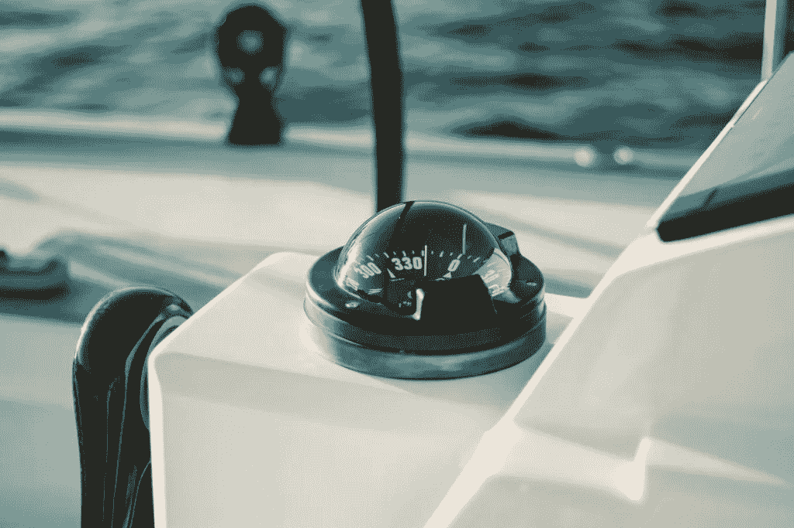

# 3 道家修炼心流

> 原文：<https://medium.datadriveninvestor.com/3-taoist-practices-to-cultivate-flow-cdd4a947ad1c?source=collection_archive---------2----------------------->

Photo by [Matt Hardy](https://unsplash.com/@matthardy?utm_source=unsplash&utm_medium=referral&utm_content=creditCopyText) on [Unsplash](https://unsplash.com/s/photos/flow?utm_source=unsplash&utm_medium=referral&utm_content=creditCopyText)

从我第一次坐下来写这篇文章到现在已经过了大约四个小时了。我经历了无数次“开始-停止-删除-一切-重新开始”的循环。

我想出了几十个原创的方法来开始这件事，并在其他作家的几篇文章中寻找灵感。我甚至查阅了一些伟大的美国总统的精彩语录——我就是这么努力的。然而，似乎什么都不管用。我写的都是垃圾。

然后电话响了。“感谢上帝！这太可怕了。”我以为。在与朋友交谈并喝了一杯咖啡后，整个情况的讽刺性终于击中了我。我一直在努力强迫自己写一篇关于不强迫的文章。我笑了。我是一个多么虚伪的人…

然而，就在那一刻，我突然明白了什么。我又坐了下来，我突然知道该写些什么，甚至不用想。事实上，现在这些话在某种程度上正从我口中流出。我感觉像是被某种外力推动着前进——就像在机场的自动人行道上。

很有可能，你会感同身受。当你处于心流中时，你运作的效率超过了你仅仅试图强迫它时所能达到的。但是除了提高效率之外，还有另一个根本的不同——它突然变得有趣了。当你随波逐流时，你实际上是在享受做那些你强迫自己时害怕做的事情。

*Photo by* [*Tim Gouw*](https://unsplash.com/@punttim?utm_source=unsplash&utm_medium=referral&utm_content=creditCopyText) *on* [*Unsplash*](https://unsplash.com/s/photos/hard-work?utm_source=unsplash&utm_medium=referral&utm_content=creditCopyText)

# 强制不起作用的三个原因

尽管如此，我们大多数人的默认是试图强迫它。在西方文化中，我们非常强调努力工作来实现我们的目标。孩子们从很小的时候就被教导，当他们足够努力的时候，他们可以把他们的意志强加给这个世界。有人认为，成就是最终导致幸福的东西——尤其是我们努力工作的成果。

 [## 如何让人们真正倾听你|数据驱动的投资者

### 没有神奇的五步公式。这可能不是你现在想听到的，但相信我，从长远来看，这是…

www.datadriveninvestor.com](https://www.datadriveninvestor.com/2020/03/22/how-to-get-people-to-really-listen-to-you/) 

这种将我们的意志强加给世界的观念在我们的文化中根深蒂固。事实上，我们所有的故事——无论是言情小说还是超级英雄电影——都赞美了经历逆境以达到目标并最终获得幸福的痛苦。不幸的是，虽然这是一个伟大的故事，但在生活中遵循这一策略是一个很好的痛苦处方。原因如下:

## 1.你不能控制结果

如果我们真的诚实，我们的成功通常更多地取决于运气而不是努力。如果这伤害了你的自尊，我很抱歉。也许你可以用我今天早些时候听到的一句美国总统名言来更好地理解它:“生活中的一切都是运气”。即使是谦逊的唐纳德·特朗普也承认，这个宇宙中存在他无法控制的力量。在成就中寻求快乐有点像在天气中寻求快乐:如果你运气好，你会有一些好日子，但你也可能以相当悲惨的结局告终。不过，至少你可以责怪某个人。

## 2.从来没有你想的那么好

即使我们实现了自己设定的目标，现实也无法满足我们的期望。我们都知道那种微妙的失望会悄悄潜入我们宝贵的成功时刻。更糟糕的是，过了一段时间，我们就习惯了新的现状。在这一点上，我们通常会寻找下一次冒险，在结束时最终会实现——lol。一旦我们足够频繁地重复这种循环，我们就赢得了激烈的竞争，并获得了一个不错的中年危机。

## 3.你错过了生活

我们在中年危机中意识到的最糟糕的事情是，当我们忙于做当时非常重要的事情时，我们错过了发生在我们周围的所有奇迹。这就是 FOMO 变得真实的时候:害怕错过生活。这就是我们真正意识到我们一直在欺骗自己的地方。因为实现更多的是关于旅程而不是目的地。幸福来自于享受我们所拥有的，而不是试图改变它并把我们的意志强加给世界。

*Photo by* [*Fab Lentz*](https://unsplash.com/@fossy?utm_source=unsplash&utm_medium=referral&utm_content=creditCopyText) *on* [*Unsplash*](https://unsplash.com/s/photos/hard-work?utm_source=unsplash&utm_medium=referral&utm_content=creditCopyText)

# 道家的无为观

这些问题的解药可以在道教中找到。中国古代哲学认识到，真正满足的关键在于接受而不是抗拒当下。我们抵抗的唯一结果就是让自己痛苦。然而，如果我们能够放下对生活应该如何的期望，事情就会变得简单得多。当我们不再试图将我们的意志强加给世界时——无论如何，世界会为所欲为——我们开始实践道家所说的无为。

重要的是要明白，接受世界的本来面目并不意味着成为被动的植物人。更确切地说，这是方式上的变化。与无为一致的生活意味着选择行动，当它确实有所作为时，而不是不知疲倦地对我们控制之外的事情做出反应。事实上，这种方法不仅非常有效，而且通常比使用武力更有效。

> *“武威是航海的艺术而不是划船的艺术。”*
> 
> [艾伦·沃茨](https://www.youtube.com/watch?v=ZzaUGhhnlQ8)

这句话很好地诠释了术语“无为”的字面意思:毫不费力的行动。利用大自然的运作让我们的行动变得毫不费力。因此，通过直觉选择正确的方法和时机，我们不仅可以获得更多，而且可以微笑着去做。

以我上面的例子为例。当我试图强迫它的时候，我什么也没有实现。如果我继续努力，这个婴儿的字数现在仍然是零。到现在，我要么把我的愤怒发泄在别人身上，要么把一整块巧克力塞进我的喉咙里——也许两者都有。相反，通过等待合适的时机，我现在正享受着一段美好的时光，同时写得更快更好，这是我以前强迫自己写的。

# 将流作为默认设置

你可能会想，这种随大流的废话听起来不错，但在我们的生活中有一些任务，我们没有时间等待灵感的神圣闪现。例如，你的房东可能很难理解你还没付房租的原因是你不想付。

你是对的！有时候，不管我们喜不喜欢，都有必要忍气吞声去做一些事情。对我们大多数人来说，100%顺其自然的生活是不现实的。我们毕竟不再是孩子了。然而，我希望你更多地把它看作一个光谱，而不是黑白的。

考虑到生活简单地更令人愉快，我们花越多的时间顺应潮流，我们的目标应该是逐渐地将我们的默认转向光谱的那一端。有时，使用武力似乎是不可避免的，然而当我们真正诚实时，我们有更多的选择，尽管我们不愿意承认。因此，尽管 24/7 心流可能不可行，但每增加一分钟实际上都有助于更快乐的一天——当坚持练习时，最终会有更快乐的生活。

*Photo by* [*Fab Lentz*](https://unsplash.com/@fossy?utm_source=unsplash&utm_medium=referral&utm_content=creditCopyText) *on* [*Unsplash*](https://unsplash.com/s/photos/sailing?utm_source=unsplash&utm_medium=referral&utm_content=creditCopyText)

# 给生活带来更多流动的三种方法

因为我们大多数人在成长的过程中已经放弃了活在“心流”中，所以需要一些工作来将我们自己重新调整回我们的自然状态。然而，随着路上的每一步，生活将变得更容易和更快乐。

下面是一些你可以在生活中应用吴维的事情。虽然选择的顺序是经过深思熟虑的，但你不必在进入下一个之前掌握一个。实际上，这三种实践是相互加强的，这意味着你在任一方面的进步都会帮助你更容易地在其他方面取得进步。

## 1.放开你的“应该清单”

拥抱当下的最大障碍是“应该”这个词。放下我们认为世界应该是怎样的，这是一种难以置信的解放，也是一种难以置信的艰难。我们对周围的人应该如何行为，我们自己应该做什么和不应该做什么有如此多的信念——见鬼，我们甚至希望我们的宠物的行为符合我们的期望。

要摆脱对世界应该如何的信念的依赖，第一步也是最重要的一步是意识到这些信念。这就像列出你一天中所有“应该”想到的事情一样简单——关于你的收入、体重、父母、伴侣、老板，最重要的是你宝贵的自我。

一旦你对你的附件有了一个大概的了解，是时候放下它们了。显然有很多方法可以做到这一点。我遇到的最简单有效的方法是拜伦·凯蒂的作品。我不会在这里详述它——这本身就是一整篇文章——但是你可以在网上和拜伦·凯蒂的书中找到大量关于这个方法的资料。

## 2.沉思

我希望现在你已经明白，幸福只能在当下找到。想想看:在你生命中最美好、最难忘的时刻，你是在想第二天早餐要吃什么，还是在思考国家的经济状况？大概不会。可能你什么都没想。你只是在场。

活在当下，而不是不停地思考过去和未来，已经被无数灵性导师认定为更平和生活的关键。为了培养存在感，几乎所有人都推荐某种形式的冥想。依我拙见，冥想可能是让你过上更正念、更快乐生活的最大催化剂。

哪种冥想对你最有效，只有你自己才能发现。我个人练习[内观](https://www.dhamma.org)，但是你可能会发现禅、超然或者其他类型的冥想更适合你。对于初学者来说，像[顶空](https://www.headspace.com)或[冷静](https://www.calm.com)这样的应用程序也非常棒。

无论你选择哪种冥想方式，成功的关键总是在于你练习的持续性。我建议将日常冥想(可以短至 10 分钟)和自发尝试将意识带入日常活动相结合。散步、吃饭或淋浴时的“冥想”有助于将你的实践融入现实生活。

## 3.学会相信你的直觉

最终，培养心流意味着将你的控制点从头部转移到心脏。这主要是一个足够信任自己的问题，让你自发地跟随自己的直觉，而不是制作复杂的 Excel 电子表格，精确地权衡每一种可能结果的利弊。

"如果我不知道我的直觉在告诉我什么？"你可能会问。好消息是你总是有一种直觉。这是你面临决定时的第一个冲动——在大脑接管并开始过度思考和分析之前。如果我们一开始就错过了那种冲动，我们通常可以通过平静我们的大脑来再次获得它。关于我让自己平静下来的常用方法，请看这篇文章。

 [## 如何发掘独处的超能力

### 不仅仅是一个人

medium.com](https://medium.com/swlh/how-to-tap-into-the-solitude-superpower-ccc2fd5006ee) 

一旦你知道你的内心在告诉你什么，就只需要相信内心的声音，忠于自己——这可能意味着放弃你珍贵的 Excel 电子表格。如果你很难相信你的直觉，试着先在小的决定上跟着直觉走，然后再做大的决定。毕竟，信任是我们需要时间来建立的。不过有一点是肯定的:你内心的指南针不会背叛你——永远不会。

*Photo by* [*Griffin Wooldridge*](https://unsplash.com/@dzngriffin?utm_source=unsplash&utm_medium=referral&utm_content=creditCopyText) *on* [*Unsplash*](https://unsplash.com/s/photos/compass?utm_source=unsplash&utm_medium=referral&utm_content=creditCopyText)

这篇文章的目的是给你介绍无为的概念，并涵盖一些必要的步骤，可以帮助你在生活中更多地使用流而不是力。在接下来的几周里，我会分享一些我是如何成功实现这一转变的故事，以及我是如何与之斗争的，从而让一些观点变得更加清晰。敬请关注🙂

感谢您的阅读

*原载于 2020 年 5 月 1 日***。**