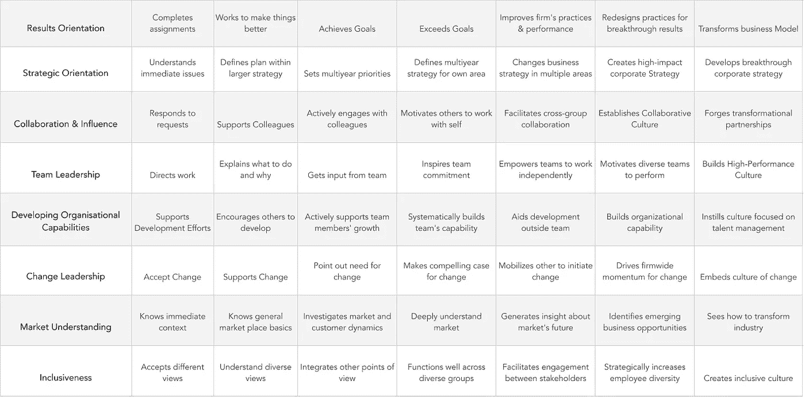

# 提高领导力发展的 3 种技巧

> 原文：<https://medium.datadriveninvestor.com/3-techniques-to-improve-leadership-progression-c157a4d0fe8?source=collection_archive---------11----------------------->

Photo by [Ian Schneider](https://unsplash.com/@goian?utm_source=medium&utm_medium=referral) on [Unsplash](https://unsplash.com?utm_source=medium&utm_medium=referral)

我很久以来一直感兴趣的一个问题是*你如何有效地将员工从一个有贡献的团队成员提升到领导职位*。

从我的个人经历来看，我见过一些领导者被提升后发现他们不喜欢这个角色，在经历的压力下完全筋疲力尽，而其他人则因为原本是高效和富有成效的团队成员而完全失去了自信。

并不是所有的组织都有能力建立完整的领导力发展框架，包括培训、结构和职业道路。当你想让员工在组织中担任领导角色时获得最佳成功，在考虑关键因素时，我想到的就是这些公司。

 [## 想知道领导是谁？请他决定。数据驱动的投资者

### 一个有效的领导者能为组织提供的最有价值的东西之一是决策能力…

www.datadriveninvestor.com](https://www.datadriveninvestor.com/2019/01/25/want-to-know-who-the-leader-is-ask-him-to-decide/) 

这些是我对一个组织需要做些什么的观察和建议，以 a)促进向领导层的发展，b)在这样做的同时给员工最好的成功机会。最重要的是，如果你是一个正在寻求晋升到领导职位的人，在采取行动之前，这里有一些关于你应该要求什么的建议。

# 准备好。

每当有人被提升到任何职位时，他们都会表现得很热情。我的意思是，他们想弄脏自己的手，摸索绳索。

使他们能够有效地做到这一点；从一开始就有一大堆工作等着他们去咀嚼。据推测，他们是因为你认为适合领导的某些品质、技能或知识而得到提升的，所以为他们提供几个项目来学习这些技能。

> 确保从一开始就明确定义角色和期望。

作为领导者，你需要让员工有能力对某个决定说是或不是。这样做将使其他工作人员了解这位新领导的未来职责。

通常在较小的公司，角色定义是宽松的，能够理解领导的位置是非常重要的。对个人来说，角色不清晰会让他们非常困惑，无法准确理解他们每天应该做什么。久而久之，这会损害自我价值感，让他们觉得自己为团队做出了成功的贡献。

我最近看到的一个矩阵涉及到你如何围绕组织中领导者的期望与员工保持一致。你可以使用这个工具来了解未来的领导者需要在哪些方面做出努力来满足公司的期望。

这样做的目的是让你对领导角色的期望保持一致。例如，您可以在第 4 列中画一条线，并制定一个总体政策，所有领导人员都应该坐在第 4 列中，至少具备 5 种品质。然后，你可以利用这一点，通过潜在的领导人员谈论他们应该在哪些方面努力或投入工作，以达到这一水平。

虽然框架可能被视为过于简单或主观，但为角色期望启用期望设置的能力是至关重要的，这可以提供一种机制来做到这一点。

# 给予控制。

让他们明白他们的控制变量现在已经改变了。以前，他们控制着实施细节，现在这一视野应该随着他们的新位置而上移。

> 他们控制执行，但不一定控制实现。

“我怀念把手弄脏的感觉”这是新上任的员工的普遍反应。这是一种迹象，表明他们在工作时没有产生应有的影响。这表明他们可能感觉没有效率和生产力。

如果他们是基于他们的技术优势而被提升；确保他们能尽可能建设性地弯曲肌肉。不要让他们处于项目管理工作的位置，因为这将不可避免地导致对角色的不满。

记住，当“实干家”被提升到领导职位时，他们被认为是“主题专家”。正因为如此，他们已经搞清楚了‘规则’。他们了解并被赋予对环境的控制权，他们的意见受到尊重，他们的贡献往往基于逻辑和现实。

确保你让他们接触的环境也能提供同等水平的执行潜力。如果做不到这一点，就有必要让他们了解自己的控制环境。

# 提供支持。

对个人来说，这将是一个重大的变化。确保他们有定期联系的人来验证或消除角色中的任何顾虑。这对于员工的支持至关重要，以满足我新提拔的领导通常会遇到的一些问题。

一些领导者带着一堆预设的假设进入新的角色。因此，他们需要能够有效地传达这些信息，并了解利用/向正确的人推广这些信息所需的网络。

为他们提供一个蔻驰将会突出同辈关系网的机会，帮助领导者走向成功。促使领导者了解其团队的构成，鼓励和参与其团队，并对其整体团队交付和绩效负责。这些是他们以前可能不需要的品质，因此在业务中有人能够提供这种洞察力是至关重要的。

说完；提供反馈和成长计划，以确保成功过渡到该角色。创建框架或紧密的反馈机制来展示其领导能力的发展和成果，可以极大地帮助建立信心，并从他们的角色中获得乐趣。

通过这一切，事实是要明白这是一个完全不同的角色。在职业生涯的某个阶段表现出色的人可能不会在担任领导角色后继续同样的轨迹，所以不要忽视他们是很重要的。他们会感到不知所措和/或无能为力，因此在这一转变过程中支持和密切关注他们非常重要。

领导力是大多数人在职业生涯中都会遇到的一个领域，有些人会接受，有些人不会。很重要的一点是，要理解这不是一个人们能立刻理解的简单过程。框架和培训可能是一个很好的入门，但是公司的跟进和支持将使向领导层的过渡取得成功。

我敦促你仔细考虑那些你提拔的人，那些被提拔的人，并准备好支持、奖励和授权你组织的未来领导者。