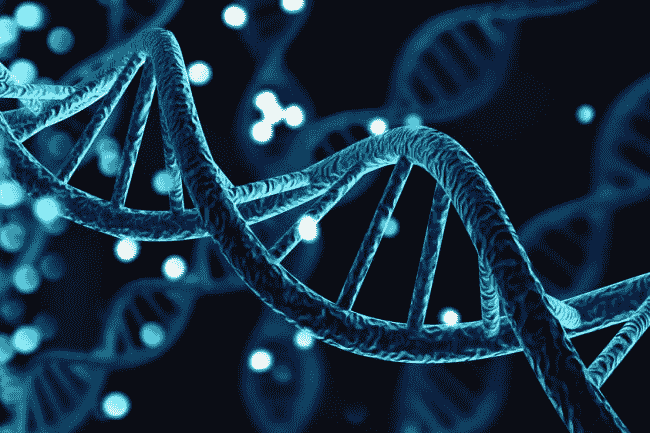
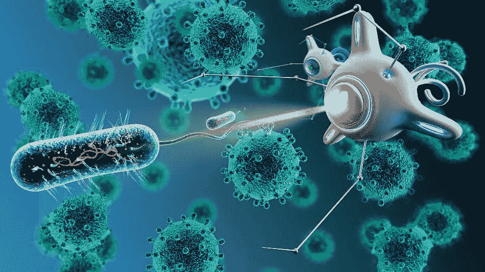
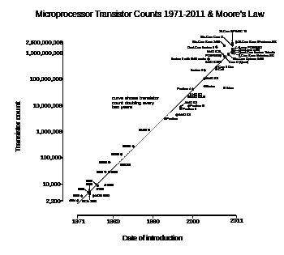
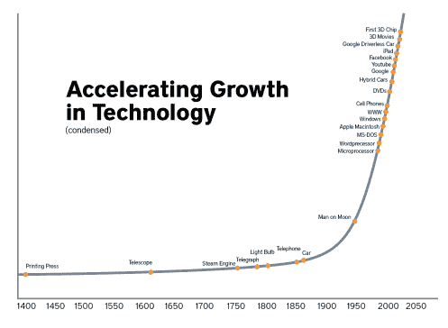
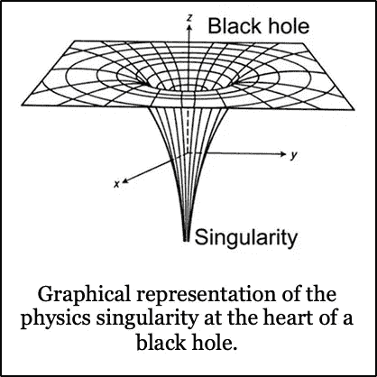

# 将加速我们走向未来的 3 次技术革命

> 原文：<https://medium.datadriveninvestor.com/3-technological-revolutions-that-will-accelerate-us-into-the-future-c68dcd86da6c?source=collection_archive---------17----------------------->

## GNR 介绍(遗传学、纳米技术和机器人学)

*Provided by* [*Emerie Apodaca*](https://tr.pinterest.com/emerie4a/)

作为一个同样相信科技加速发展的人，也是受人尊敬的未来学家 [*雷·库兹韦尔*](https://www.kurzweilai.net/) *的粉丝，我将会写一个关于他对 GNR 的预测以及这些预测现在如何的 4 集系列文章。这是第 1 部分，共 4 部分，享受吧！*

**奇点临近！我们正越来越接近我们的生物学将变得过时的时候，我们将超越进入进化的下一个阶段。这种对未来的超越将由三项技术革命推动，这三项技术革命由一个首字母缩略词 **GNR** 组成。雷·库兹韦尔认为 GNR 将是一系列重叠的革命，将定义人类的未来。**

## GNR 是什么？

*Credit:* [*Billion Photos/Shutterstock*](https://www.discovermagazine.com/planet-earth/race-is-real-but-its-not-genetic)

G 代表遗传学，我们生物学的信息系统。遗传学已经提上日程有一段时间了，但在这十年里，我们将看到生物技术产业的爆炸性增长。在那里我们将能够确定我们是否能够重新编程我们的生物学。随着这一领域的最新发展，我们已经展示了未来可以减缓甚至停止生物衰老的美好前景。

*Image Credits:* [*shutterstock.com/g/gorbovoi81*](https://www.azonano.com/article.aspx?ArticleID=5113)

n 代表**纳米技术**，在纳米尺度(10^-9 米及更小)进行的工程。在接下来的几十年里，我们将拥有**纳米机器人**，血细胞大小的设备，可以在分子水平上与你的身体互动。这些机器人将能够进入你的身体，通过对抗现代医学无法对抗的疾病来保持你的健康。凭借甚至在原子水平上操纵物质的能力，这些机器人可以进入你的大脑，与你的生物神经元互动，并允许我们与非生物智能融合。

*Image Credits:* [*CNN*](https://blog.trginternational.com/a-new-robotic-revolution-in-manufacturing)

最后， [R](https://www.datadriveninvestor.com/glossary/r/) 代表**Robotics**(w/smart[AI](https://www.datadriveninvestor.com/glossary/artificial-intelligence/))机器能够与人类智能相匹配的时候。最重要的革命。这场革命的一个关键区别是，机器人不仅会自动接管重复的手工任务，甚至还会接管需要认知决策的任务。

按照我们目前的创新速度，由于加速回报定律，我们一定会看到这些奇迹比我们想象的更快地定义我们的未来。

## 创新步伐的改变

加速回报法则是进化速度呈指数增长的趋势。这种对加速度的信念直到最近才开始流行。

在 20 世纪下半叶，我们相信技术在以恒定的速度发展，正如摩尔定律所定义的那样(由英特尔公司的联合创始人 T2 戈登·摩尔 T3 撰写)。摩尔定律描述了微处理器(或微芯片)上的晶体管数量每两年翻一番，而计算机的成本[减半](https://www.datadriveninvestor.com/glossary/halving/)。微处理器是计算机的中央单元，它执行算术逻辑运算，向计算机发出指令。

如果你只看下面的图表，它显示了从 20 世纪 70 年代到 2011 年的技术进步。

[https://www.gqlifesciences.com/how-the-acceleration-of-innovation-is-impacting-ip-strategy-the-ever-faster-pace-of-innovation/](https://www.gqlifesciences.com/how-the-acceleration-of-innovation-is-impacting-ip-strategy-the-ever-faster-pace-of-innovation/)

然而，如果你回过头来看看过去 6 个世纪以来技术发展的全部范围，你会发现人类历史上的创新实际上是指数级的。

[*https://cadburycommunications.wordpress.com/2016/05/19/technological-accelerated-change/*](https://cadburycommunications.wordpress.com/2016/05/19/technological-accelerated-change/)

技术增长不会因为创新的实际速度而放缓，而是因为政策和接受变化的速度，正如马尔特克定律所示。

[Pic: a revision of Martec’s law, by [Scott Brinker](https://www.linkedin.com/in/sjbrinker/) of [chiefmartec.com](https://chiefmartec.com/2020/08/bending-martecs-law-2020-taught-us-agile-thought/)]

由于创新的速度不会停止，GNR 将继续呈指数增长。

这三次技术革命将对我们的生活产生巨大的影响，但我们还不知道事情会如何发展。随着它们继续收敛，它们的加速度将会增加。在技术的指数增长和对这些变化的对数适应之间，我们将开始看到奇点的曙光，一个不确定点。

## 奇点，一个不确定点

> GNR 将提供克服疾病和贫困等古老问题的方法，但它也会助长破坏性的意识形态。当我们应用这些快速发展的技术来提升我们的人类价值时，我们别无选择，只能加强我们的防御，尽管对这些价值应该是什么缺乏共识

奇点是一个假设的时间点，在这个时间点上**技术增长变得不可控和不可逆**。我们将这个不可预见的点命名为奇点，因为在黑洞中有一个一维点，在这个点上物理定律不再起作用，我们无法超越它。

在这一点上，即使是世界上最聪明的人也只能对人类会发生什么做出假设。然而，如果我们开始接受这种不可预见的变化，预测往往是乐观的。

最终，GNR 将赋予我们以下能力:

*   结束人类衰老
*   逆转疾病
*   消除世界饥饿
*   极端贫困
*   甚至可能治愈死亡

批评者指责雷过于乐观，并认为奇点的危险远远大于好处，指出一旦机器实现意识，我们可能无法控制它们。无论雷有争议的观点激起兴奋还是恐惧，这一事件将永远改变我们作为一个物种的命运。

随着时间的流逝，我们越来越接近那个不确定的时代，一个如果我们在物理上与技术融合，似乎最有利的未来。

# 共生的未来

[https://www.cas.org/blog/evolving-partnership-future-man-and-machine](https://www.cas.org/blog/evolving-partnership-future-man-and-machine)

我相信未来学家[彼得·h·迪亚曼蒂斯](https://www.diamandis.com/blog/neuralink-ai-mind-merger)所说的完美社会，

> *“人类最好的选择是与机器共生。不是人类对抗 AI，而是人类与 AI 合作。”*

想象一下，

有朝一日，我们只需在大脑中植入芯片，就能把我们上传到云端。我们将拥有一个巨大的知识库，我们可以以数据的速度即时收集，但同时处理它的速度要快得多。像 [Neuralink](https://neuralink.com/) (由埃隆·马斯克创立) [Neurable](https://www.neurable.com/) 和 [Kernal](https://www.kernel.com/) 这样的公司已经开始用[脑机接口](https://www.technologynetworks.com/informatics/news/first-ever-non-invasive-brain-computer-interface-developed-320941)构建共生解决方案。如果我们应该与 GNR 融合，我们将开始回答一些人类一直想揭示的问题。

*我们能长生不老吗？*

作为一名科学家，我想说，在科学的规则范围内，一切皆有可能。

我们真的想长生不老吗？

我想这取决于你认为什么能给生活带来价值，以及你认为它应该在什么时候开启或关闭。这是一个个人的哲学问题，到时候由你来决定，而且只能由你来决定。

请继续关注本系列的下一部分，因为我们将揭开 GNR 中的 G，遗传学。信息储存在我们生物体内的过程。

*原载于 2021 年 2 月 16 日*[*【https://www.datadriveninvestor.com】*](https://www.datadriveninvestor.com/2021/02/16/3-technological-revolutions-that-will-accelerate-us-into-the-future/)*。*