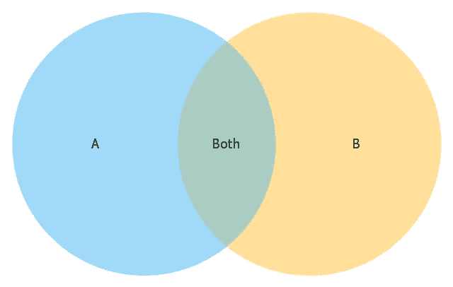
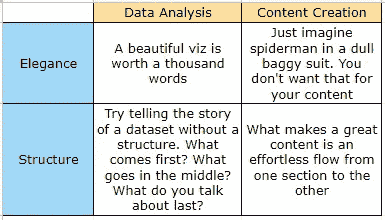

# 内容创建和数据分析有三个共同点

> 原文：<https://medium.datadriveninvestor.com/3-things-content-creation-and-data-analysis-have-in-common-81bdb137dadf?source=collection_archive---------17----------------------->

## #2:他们都试图讲述一个故事

Photo by [Conceptdraw](https://www.google.com/url?sa=i&url=https%3A%2F%2Fwww.conceptdraw.com%2Fexamples%2F2-set-venn-diagram-template&psig=AOvVaw14P9i-gRyqxgMCLI0Dvi8U&ust=1591454924779000&source=images&cd=vfe&ved=0CAMQjB1qFwoTCMi9y-z16ukCFQAAAAAdAAAAABAt)

一年多来，我的生活主要围绕两件事:

1.  内容创作
2.  弄懂一团乱麻

我意识到*‘弄懂一团乱麻’*听起来好像我在为回收公司选择要收集的垃圾，但这类似于数据分析。

你像猎犬一样在看起来毫无意义的数据海洋中嗅来嗅去，通过调查和询问来理解它，然后你把它转了又转，寻找某种形式的意义。

当你完成时，你会看到结果，你不会再认识到最初的混乱，因为已经发生了转变。

这种转化就是创造之美。

这就是从混乱中创造事物的美妙之处。

我习惯于在不被注意的地方寻找模式，因此，我发现自己在寻找这两件事之间的重叠——内容创作和数据分析——我已经参与了一段时间。

 [## 大数据颠覆了我们所知的信贷应用|数据驱动的投资者

### 融合是金融领域的最新流行词，由于支付和贷款之间的关系，我们现在…

www.datadriveninvestor.com](https://www.datadriveninvestor.com/2020/03/19/big-data-disrupts-credit-applications-as-we-know-them/) 

# 重叠#1:它们都是探索性的

目前，我创造了一种形式的内容，那就是写作。当我想写一个想法时，我会深入思考。

我探索它。

我抓表面，然后越抓越深，直到我对自己的发现感到满意。

例如，在我开始充实这篇文章之前，我想了想我注意到了什么。然后我深入思考我可能错过了什么。我问自己，*“我该如何展示这个？我应该如何最好地解决这个问题？”*我探索并思考了各种选择，决定看看会有什么结果。

每个内容创作者都这样做。播客们在录制之前会研究他们将要讨论的内容。

YouTubers 在录制之前会探索他们想要制作视频的特定主题。即使录音不是完全计划好的(这种情况很少发生)，他们也一定已经研究了他们想要谈论的内容，然后在播客中详细阐述。

事实上，艺术家有时并不确定他们到底要创作什么；他们只是让想法流动，然后探索它。

所以，这就像你知道你在找什么，但你仍然想保持选择的开放，以防你发现一些其他有趣的东西你想探索。

**数据分析**也是如此。你用一种探究的心态对待你想要分析的数据。

你研究它。

你观察它。

你清理它。

你为分析做准备。

你质疑它。

您甚至可能已经有了想要回答的问题，但是您仍然会探索数据的其他部分，以便不会错过一些其他有趣的见解。

所以，无论你创造什么，探索是准备创造它的材料的核心。

无论你分析什么样的数据，在得出任何结论之前，你都要探索它。

这就是为什么我认为它们都需要大量的探索。

# 重叠#2:他们都试图讲述一个故事

> 你的数据有故事。与世界分享。

那不是我。那就是数据可视化软件公司 *Tableau* 。

每次我分析一个数据集，我的目标都是帮助数据讲述它的故事。你怀疑这个吗？

> 数据不会说话——你是它的声音。

好的，和我在一起。如果你是数据分析师，问问自己:

*为什么这些客户要我分析这些数据？*

*他们在找什么？*

他们想从中得到什么？

你可以用类似于*【洞见】*的话来回答。是的，我们喜欢用“洞察力”这个词——它很奇特。那么，什么是洞察力呢？*了解正在发生的事情？*爽。那么，如何向客户展示数据的变化呢？

你怎么解释？

你讲个故事来描述一下吧！数据不会说话——你是它的声音。直到你讲述了数据试图讲述的故事，分析才算完整。你是叙述者，你是讲故事的人。

你可能认为你没有用你的洞察力给他们讲故事，但是你讲了。就像奥森·斯科特·卡德的《死者代言人》中的主角安德一样，你是数据的代言人。你客观地讲述数据的故事。

无论你创作什么形式的内容，你都想讲述一个故事。你的内容在谈论一个想法或主题。以玛丽亚·波波娃的大脑精选为例。她热衷于艺术和科学。当然，她用诗歌、口语等不同的方式讨论这个问题，但她每次都试图讲述的故事是艺术和科学的交汇点。那是她的内容的故事。

艺术家的画作或插画呢？背后总有一个故事。某些东西激发了它，它也试图激发你的某些东西。

总有一个故事。

# 重叠#3:它们都是关于结构和优雅

这种重叠是重叠#2 的结果——它们都试图讲述一个故事。

如果你有一个故事，你必须有一些流程或结构。优雅是为了美观，但我认为它同样重要。

穿着沉闷的睡衣式西装，很难爱上蜘蛛侠。事实上，闪亮的花式西装是我喜欢蜘蛛侠的原因之一。*氨纶。一切，氨纶…*

我在下图中总结了它们是如何既关于结构又关于优雅的。

Illustration by Nurein Akindele

用精美的图表和插图来展示一组数据的分析结果是一种美。俗话说，一图胜千言。

“结构”是内容创作的基石之一。

虽然一些艺术家这样做，但当一张专辑的主题是，比方说， *La Vida Loca* 但专辑中的一首或多首歌曲谈论的可能是*一名女仆、*或*一名学校教师、*或其他与专辑主题*毫无关系的东西时，这并不酷。如果学校老师过着一种生活，那很好，但如果不是，为什么要把它收录到专辑里呢？*

这超出了范围，会让你的听众感到困惑。

这就是当你的内容结构没有考虑好的时候会发生的事情。听起来好像你一分钟前说的和你现在说的之间有一个脱节，所以你试图讲述的故事被弄糟了。这是糟糕的结构。

当应该放在中间的东西先出现时，故事也可能被数据分析搞得一团糟。

想象一下，在上图的单元格中混合数据。听起来会像垃圾。

这看起来不像是你已经完成了你的工作，因为你试图弄清楚的混乱仍然存在。

**访问专家视图—** [**订阅 DDI 英特尔**](https://datadriveninvestor.com/ddi-intel)