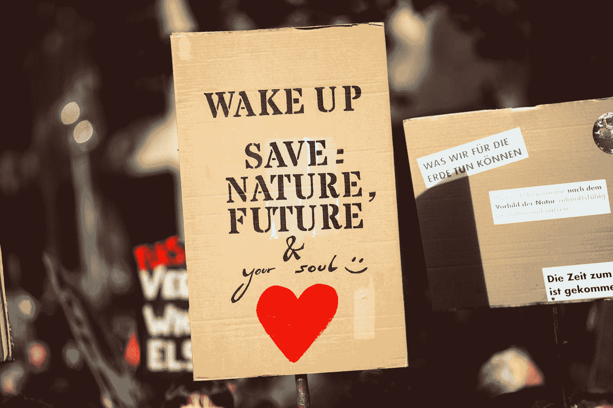

# 我希望 Grata Thunberg 多做的三件事

> 原文：<https://medium.datadriveninvestor.com/3-things-i-wished-grata-thunberg-would-do-more-of-a47c18305f96?source=collection_archive---------20----------------------->

## 说有它的位置，但行动更响亮

Photo by [Markus Spiske](https://unsplash.com/@markusspiske?utm_source=medium&utm_medium=referral) on [Unsplash](https://unsplash.com?utm_source=medium&utm_medium=referral)

我不是激进分子。

像许多人一样，我只是一个旁观者。

像许多人一样，我不喜欢政治。

为什么？

政客们说得太多了，不合我的口味！

我只在新闻上知道格拉塔·图恩伯格。我对她知之甚少。但是我听说她变得越来越像政客了。

我希望看到她少说多做。

这里有一些想法。

# 1.种一些树

> “树木为我们呼气，这样我们就可以吸入它们来维持生命。我们能忘记吗？让我们每一次呼吸都爱护树木，直到我们灭亡。”―穆尼亚·汗

有一个视频，格里塔激励人们种树。然而，制作一个视频是不够的。带上你的追随者，去做吧！种一些树。我们整天被视频轰炸。现实生活中的经历是我们今天所坚持的。

我有一个想法；*人造沙漠*是人类造成的沙漠；让我们建造一些*人造森林来代替。*收集一些钱，带上你的追随者，去哪里种一片森林，葛丽塔！

 [## 保护主义、政治和经济动荡|数据驱动的投资者

### 美国股市昨日出现 400 多点的大幅反转，为未来的事情发出了警告信号。市场…

www.datadriveninvestor.com](https://www.datadriveninvestor.com/2018/06/28/protectionism-politics-economic-turmoil/) 

# 2.教育

> 教育是你可以用来改变世界的最强大的武器。
> 
> 纳尔逊·曼德拉

教育下一代解决问题是非常好的。但是下一代需要学习如何创造新的未来。

如果我知道这个世界在受苦，但我除了每天花两个小时通勤上班之外别无选择，我该怎么办？开电动车，会给环境带来哪些挑战？

下一代需要开发全新的想法。

我们如何帮助他们？

*   告诉他们如何学得更快
*   向他们展示如何更有创造性地思考
*   告诉他们如何管理恐惧和压力
*   告诉他们如何吃饭和睡觉
*   …

# 3.持久的动力

> 人们常说，动力不会持久。嗯，洗澡也不会——这就是为什么我们建议每天都洗。——金克拉

恐惧是一种巨大的动力。但这就像毒品一样。为了保持其有效性，我们必须不断增加剂量。

你和我在战区都会感到恐惧。一个战地摄影师已经适应了危险，能够胜任自己的工作。

向年轻人展示如何在拯救环境的同时获得事业成功，可能会对他们产生更持久的影响。