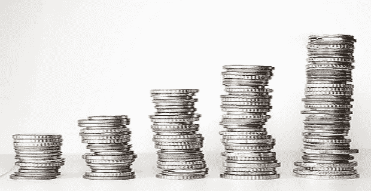

# 3 件可能毁掉你财务生活的事情。

> 原文：<https://medium.datadriveninvestor.com/3-things-that-can-ruin-your-financial-life-36b584e6830c?source=collection_archive---------20----------------------->

我们都喜欢创造财富。我们努力工作，尽我们所能挽救一切。我们遵循基本的个人理财建议。我们花的比挣的少，我们把存款存入银行账户，我们投资债券和股票。

然而，所有这些都不足以确保我们保持财务偿付能力。不幸的是，危险会毁掉我们所有辛苦赚来的积蓄。

但有好消息:我们可以保护自己，在可能威胁我们财务的风险和事件中恢复元气

这里有 3 个潜在的最大的危险，以及你如何保护自己。

Image by [Kevin Schneider](https://pixabay.com/users/kschneider2991-4936815/?utm_source=link-attribution&utm_medium=referral&utm_campaign=image&utm_content=2180330) from [Pixabay](https://pixabay.com/?utm_source=link-attribution&utm_medium=referral&utm_campaign=image&utm_content=2180330)

**掌控你的健康**

在美国，医疗账单将是美国破产案件中最关键的罪魁祸首。不幸的是，我们可以做很多来避免它们。我们每个人都可以尽最大努力吃好和锻炼——健康的生活方式会减少你受伤或生病的机会——但有些伤害是不可避免的。

Image by [Steve Buissinne](https://pixabay.com/users/stevepb-282134/?utm_source=link-attribution&utm_medium=referral&utm_campaign=image&utm_content=385506) from [Pixabay](https://pixabay.com/?utm_source=link-attribution&utm_medium=referral&utm_campaign=image&utm_content=385506)

你可以通过投资良好的健康保险和受益于税收优惠的健康储蓄账户来保护自己。

你也可以有合法的选择。如果一次事故由于他人的疏忽而导致你的医疗费用，你可能有权获得赔偿。你应该找一个专门研究人身伤害法的律师，为你的权利而战。

 [## 金融犯罪、合规和新冠肺炎|数据驱动型投资者

### 非法行为者利用全球经济紧张的脆弱性和供应链中断造成的…

www.datadriveninvestor.com](https://www.datadriveninvestor.com/2020/08/20/financial-crimes-compliance-and-covid-19/) 

**没有多样化就不要出门**

如果你想积累财富，投资是其中一个强有力的方法。然而，并不是所有的投资都是一样的。有些风险较低；有的高，有的超高。(无风险投资是神话)

明智的投资意味着将你的财富放入多元化的投资组合中，平衡风险和增长潜力**。这和把你所有的钱都投入到细价股或风险资产中是两码事。**

Image by [TheDigitalWay](https://pixabay.com/users/TheDigitalWay-3008341/?utm_source=link-attribution&utm_medium=referral&utm_campaign=image&utm_content=1604921) from [Pixabay](https://pixabay.com/?utm_source=link-attribution&utm_medium=referral&utm_campaign=image&utm_content=1604921)

遗憾的是，大多数投资者缺乏构建平衡投资组合所需的金融知识或自我控制能力。在这种情况下，你需要一个财务顾问来帮助你使你的投资组合变得明智和多样化。

远离债务陷阱

债务是金融领域最危险的事情之一。然而，许多人都有债务。一项研究表明，超过 80%的美国公民陷入了债务循环。

但是，只有在为你工作的时候，债务才是一件健康的事情。

然而，大多数债务通常都带有高额利息，如失控的信用卡，个人贷款等。

Image by [PublicDomainPNG](https://pixabay.com/users/PublicDomainPNG-7249387/?utm_source=link-attribution&utm_medium=referral&utm_campaign=image&utm_content=3223246) from [Pixabay](https://pixabay.com/?utm_source=link-attribution&utm_medium=referral&utm_campaign=image&utm_content=3223246)

当你的债务有大量本金和高利率时，它的增长速度可能会超过你偿还债务的速度。即使你继续支付，你的债务会越来越多，而不是越来越少。这就是众所周知的债务陷阱，它足以摧毁你的整个财务旅程，洗去你有一天成为富人的梦想。

摆脱债务陷阱可能具有挑战性；然而，财务顾问可以帮助你找到前进的道路。

你也可能有法律选择:破产律师可以帮助你在破产中清偿一些债务，或者与债权人达成协议以合并债务。如果你的债务是因为人身伤害，你可能有能力通过人身伤害诉讼获得救济。

**进入专家视角—** [**订阅 DDI 英特尔**](https://datadriveninvestor.com/ddi-intel)