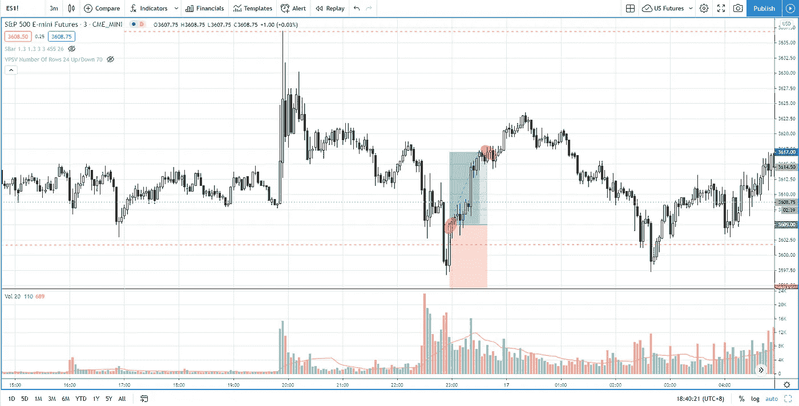

# 在你交易假突破之前要注意 3 件事——标准普尔 500 日交易

> 原文：<https://medium.datadriveninvestor.com/3-things-to-look-for-before-you-trade-the-false-breakout-s-p-500-day-trading-5fd2d63f6a79?source=collection_archive---------19----------------------->

在你交易假突破之前，确保你已经检查了这三件事，以便过滤掉早期或无效的交易，增加你的胜率。

观看视频，了解 2020 年 11 月 17 日交易时段标准普尔 500 指数期货的**每日市场分析。在这个视频中，你将看到最后一节的市场回顾和三分钟内的交易回顾(包括进场、出场和背后的原理)。展望未来，我将涵盖偏见，要注意的关键水平，我稍后的交易计划。**

## 时间戳

*   [1:23](https://www.youtube.com/watch?v=dkV5unIb93M&t=83s) 市场回顾
*   [3:23](https://www.youtube.com/watch?v=dkV5unIb93M&t=203s) 贸易回顾
*   [5:59](https://www.youtube.com/watch?v=dkV5unIb93M&t=359s) 第一件事
*   [9:20](https://www.youtube.com/watch?v=dkV5unIb93M&t=560s) 其次——供应与需求决定方向偏差
*   [10:00](https://www.youtube.com/watch?v=dkV5unIb93M&t=600s) 威科夫法律的努力与结果
*   [11:30](https://www.youtube.com/watch?v=dkV5unIb93M&t=690s) 第三件事——确认
*   [15:23](https://www.youtube.com/watch?v=dkV5unIb93M&t=923s) 当前股市展望

如果你还没有看我的[每日市场分析视频](https://www.youtube.com/watch?v=EBuBpU-_9T8)，为了更好地了解市场回顾和交易回顾。

**偏向** —中性(日内交易)；看涨(长期)

**关键点位** —阻力:3660；支持:3587，3500

**潜在设置** —在关键级别寻找潜在反转。

# 资源

**每周市场展望&最佳交易建议**直达您的收件箱:[https://www.tradeprecise.com/](https://www.tradeprecise.com/)

**职业免费**制图平台:创建账户→[www.TradingView.com](https://bit.ly/2U2Femd)

**非美国居民？** ( **、新加波**、澳洲、纽西兰、欧洲等……):[点击此处，存款 2000 新币](https://ji.hn/sgtiger)即可获得**免费股票(价值 100++ &美元)老虎经纪公司的欢迎礼物**

美国居民？[点击此处，当您存入 1500 美元](https://ji.hn/ustradeup)时，就有机会在 TradeUP 上获得一份**免费的 AMZN 股票(价值 3000++美元** ) & **欢迎礼物**

**无限制访问媒体文章** —加入以下:[https://priceactiontrading.medium.com/membership](https://priceactiontrading.medium.com/membership)

# 进一步阅读

 [## ARK Invest 的 Cathie Wood 预测基因组股表现优于特斯拉？

### 方舟投资公司的首席执行官凯西·伍德预测，最大的上涨惊喜可能来自基因组股票，尤其是…

medium.com](https://medium.com/datadriveninvestor/ark-invests-cathie-wood-predicts-genomic-stocks-outperform-tesla-b67f3c4bbc68)  [## 将失败的信号识别为最佳交易入口——标准普尔 500 日交易

### 失败的信号是交易进场的最好信号。了解如何识别失败的交易信号…

medium.com](https://medium.com/datadriveninvestor/identifying-failed-signal-as-best-trading-entries-s-p-500-day-trading-682171cbeb8)  [## 火眼公司和太阳风公司被黑-网络安全股票牛市的开始？

### 2021 年第 1 周市场回顾

medium.com](https://medium.com/datadriveninvestor/fireeye-solarwinds-hacked-start-of-the-bull-run-for-cyber-security-stocks-31e99fd2b8c1) 

Photo by Author — Ming Jong Tey

Photo by Author — Ming Jong Tey

披露:如果您点击本文中的链接进行购买或开立账户，并将所需金额存入推荐的经纪人账户，我们将免费为您赚取佣金。

免责声明:本演示中的信息仅用于教育目的，不应作为投资建议。