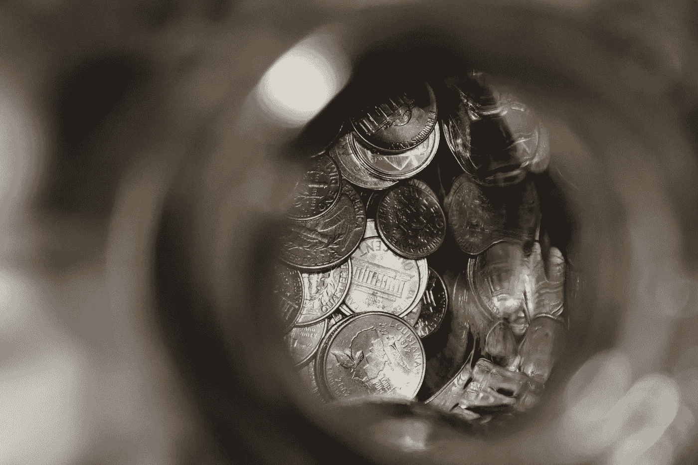
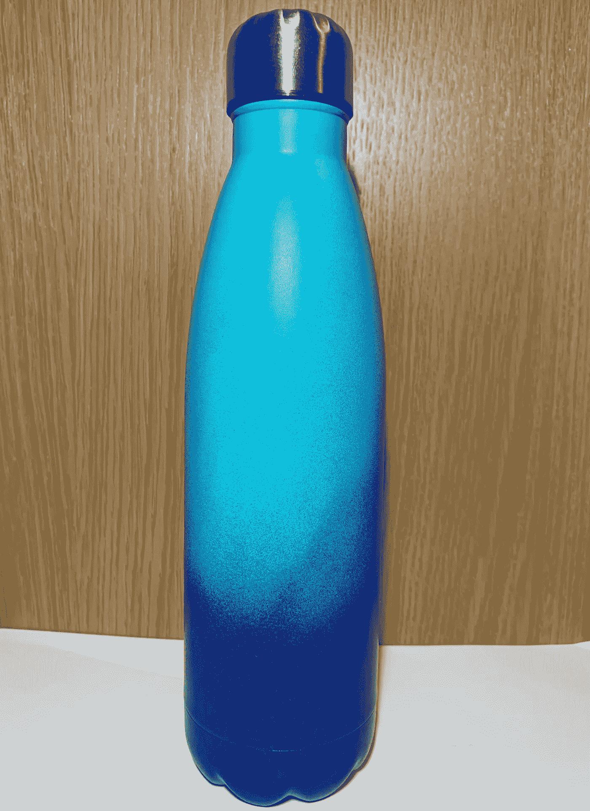
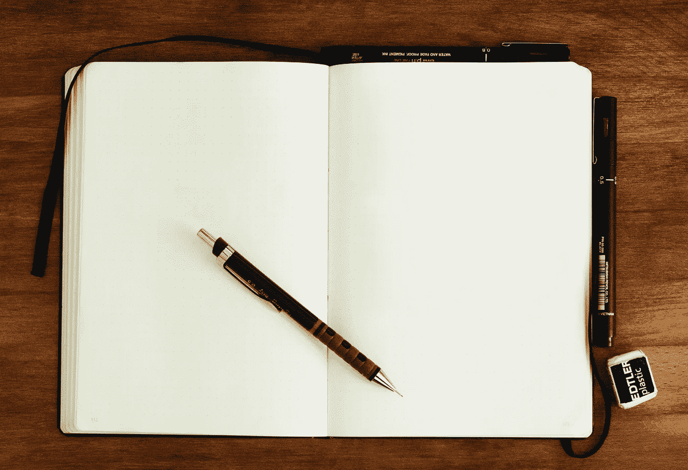

# 你不应该害怕花钱的三件事

> 原文：<https://medium.datadriveninvestor.com/3-things-you-shouldnt-be-afraid-to-spend-money-on-fccfd6248b0e?source=collection_archive---------21----------------------->

## 甚至比你的车、房子和衣服更基本

Photo by [Eric Muhr](https://unsplash.com/@ericmuhr?utm_source=unsplash&utm_medium=referral&utm_content=creditCopyText) on [Unsplash](https://unsplash.com/s/photos/money?utm_source=unsplash&utm_medium=referral&utm_content=creditCopyText)

我看过几篇关于 Medium 的文章，列出了你应该觉得可以挥霍的东西。经典的例子是鞋子、房子和汽车，此外还有其他一些东西。

虽然我同意这些是你在买便宜货之前应该三思的事情，但是有很多理由让你别无选择。

很明显，如果你真的在财务上挣扎，你会很难在任何东西上挥霍。这些文章并不是真正针对那些预算很少的人，而是针对那些有合理数量的钱，但需要一些关于如何投资的指导的人。

然而，这篇文章是关于一些简单而相对便宜的物品，你不应该害怕花一点钱，而不是去寻找最低的价格。

但关键是没有一个会要求你花费超过 40/50 美元。我会提供一个选项，它的成本大约是这个的两倍，但这更多是为了强调我的观点，而不是你需要做的事情。

所以，如果你正在寻找可以投资的生活领域，看看下面的项目。

## 1.高质量、可重复使用的水瓶

这是一个我怎么推荐都不为过的。它对地球的好处不需要真正的介绍，但它显然比每天在工作或学校通过一个塑料瓶要好得多。

一个可重复使用的瓶子可以让你花费几英镑/美元，甚至 30 多美元。我在一个上面花的最多的是 17/21 美元，但在过去，还不到这个数字的一半。

顺便多次购买这些可重复使用物品的原因:**傻**。

我把一个忘在大学的考场上，当我回去的时候它不见了。另一个我放弃了，因为我对购物后从车到家的旅程太过雄心勃勃。那个最终开始漏水，所以我不得不买第三个。我保证好好照顾这一个！

这是一种花费不到 10/10 美元的东西，从长远来看可以为你节省很多钱。想想你每周或每月购买多少塑料瓶水，你会意识到瓶子在少数几次使用中就收回了成本。

当然，你也知道你在为地球尽自己的一份力量，这总是一件好事。另外，如果你选择保温瓶类型的瓶子，你可以期待你的水一整天都保持凉爽。这也是我买我的一个主要原因。

所以，去拿一个可重复使用的水瓶，不要害怕多花一点钱买一个看起来也很棒的水瓶！(显然像我的一样)

This one is being kept safe that’s for sure

## 2.书写工具

下一个可能看起来只是针对作家，但它也适用于任何思考任何事情的人。毕竟，写作不仅仅是那些自称为作家的人的事，一会儿还会有更多关于这方面的内容。

如果你是一名作家，你可能会有自己喜欢的做事方式，对我来说，通常是在笔记本电脑上打字。但是我最近给自己买了一个外接显示器，所以我把笔记本电脑合上，藏在桌子旁边，用无线键盘打字。

这个装置试了好几次才做好。

我决定买一个便宜的，机械风格的键盘(看起来是机械的，但是*不是真正的*机械的，这个我买的时候就知道了)，一开始我觉得很棒！我可以用我的笔记本电脑作为传统的个人电脑，也有一个更大的屏幕。

但是仅仅过了几天，我就意识到我犯的错误比我想象的要多得多，我的手也比平时更快地变得疲劳。我很高兴我设法以低于 20/25 美元的价格买到了一个像样的键盘，但我很快意识到**像样可能有点言过其实。**

我最近也买了一台新的笔记本电脑，还有一张新的桌子(早就应该对我的设备进行一次彻底的检查了)，所以我不太愿意再花钱了。但是这个键盘不适合我。

所以，我咬紧牙关，全押了(相对而言)。我花了 80/$100 左右买的微软 Surface 键盘(很遗憾这里没有赞助)，相信我是花了很多心思的。

我花了几个小时寻找其他选择，以避免花那么多钱。但最终，我做到了。

## 快速免责声明:

这是我在开始时谈到的昂贵的选择。你不需要花 100 美元买一个新键盘来从这篇文章中获益！

还有其他价格低于 50 美元的选择，如果我没有选择我的第一个选择，或者如果我最终没有决定选择 Surface 键盘，我会选择它。我的第一次经历很糟糕，所以我愿意花更多的钱来得到我想要的东西。

我建议先从 30-40 美元/40-50 美元开始，这对键盘来说还是相当可观的，然后再决定你是否需要更好的。

天哪，我真高兴我买了它！这正是我一直在寻找的键盘，它立即让打字变得更加容易和高效。我的单词/分钟打字速度又回到了我想要的位置，我只是觉得更舒服了。

这通过更快的打字速度提高了生产率，我很快就忘记了我担心在键盘上花那么多钱的事实。就像我说的，你不需要花这么多，但是如果你想的话，你也可以花更多。

我没有尝试任何更昂贵的选择，但如果你看到你认为正是你想要的东西，你做了所有的研究，**把它当成一项投资**。

我在键盘上的投资让我打字速度更快，时间更长，所以这绝对是有回报的。当你在 15 美元的基本选项和你真正想要的 50 美元以上的键盘之间争论时，考虑一下这个问题。

但不一定是键盘。我还在笔和笔记本上花了相当多的钱，因为它们比普通的廉价垃圾更好写。

这使得写作体验更加愉快，从而导致更多的写作。如果你喜欢先在纸上完成写作，投资一些高质量的写作工具。你不会后悔的。

但是如果你不是作家呢？这和你有什么关系？

好吧，如果你还不是一个作家，但想做更多，这些投资将帮助你到达你想去的地方。

如果你没有写作的欲望，你可能还有很多你记下的想法和观点。因此，拥有一些像样的工具来做笔记也会让记笔记的过程变得更加愉快。

如果你是学生，这也适用，因为你希望你的笔记和作业看起来尽可能整洁，它们不会自己写。

所以，不管你的写作需求是什么，找一些好的工具来帮助你简化写作。

Photo by [Mike Tinnion](https://unsplash.com/@m15ky?utm_source=unsplash&utm_medium=referral&utm_content=creditCopyText) on [Unsplash](https://unsplash.com/s/photos/pens?utm_source=unsplash&utm_medium=referral&utm_content=creditCopyText)

## 3.组织

最后，你生活中最重要的花钱领域之一是组织。这有很多种形式，但不评论行为的改变，让我们看看你可以购买的实物，给你的生活带来更多的秩序。

你可以采纳第二步的建议，拿一些好的笔记本和笔，因为它们可以为组织创造奇迹。你也可以得到计划者或日记，这些可能相当便宜，但非常有效。

我个人最喜欢的是日记、小白板和公告板。日记可能是这里最大的开销，总计 10/13 美元。

它让我提前计划好每一天，我相信你已经知道了——大多数日记都是这样的！

所以，我发现记录每天“必须做”的任务是很重要的，我把它放在我的桌子上，随时准备添加新的任务，并检查旧的任务。

接下来，白板大约有一张 A4 纸大小，它和其他东西一起放在我的桌子上。它花了我大约 3/$4，这本身根本不是一个大的购买。

我确实用它来写下一天需要完成的任何任务，但是我把它作为一个更一般的任务清单，而不是一个每天要做的事情清单。这让我可以很容易地跟踪后台任务，那些没有我日记中的任务紧急的任务。

最后，公告板是抵御混乱的第三道防线。这是我贴上任何随机便利贴或写有想法的纸片的地方，以备日后重温。

这对于我想到的还没有完全形成的想法或主意来说是超级方便的，并且不需要紧急关注。

它挂在我的桌子旁边，所以我可以根据需要方便地添加和取出。它花了我大约 3/4 美元，因此我的桌面组织总成本为 16/20 美元。我知道这不是一大笔钱。

但这并不是我所掌握的组织工具的详尽清单。我也有一个沙子计时器，我用它来记录任务的时间，各种保持东西整洁的文件夹，笔记本电脑支架，装钢笔和铅笔的杯子等，以及其他让事情看起来更整洁的小物品。

总的来说，我每天使用的组织费用可能达到 40/50 美元左右，但每样东西都是随着时间的推移而获得的。他们又一次为自己付出了代价。

在你的工作场所保持秩序是至关重要的，因为它会让你感觉更有效率，更放松，更不容易对你周围的混乱感到紧张。没有去充分约旦彼得森，秩序绝对值得花一些额外的钱。

你还可以做很多其他的小采购来帮助你简化生活，让你感觉更好。但是，这些只是我发现为了得到最适合这份工作的东西，额外的钱是值得的。

都是我一两年前可能有点犹豫要不要花钱的东西。但现在我认为每一个都是必不可少的，它们比我去年的生产力水平更高。

所以，下次你不确定是否要在你觉得需要的东西上多花一点钱，就把它当作一项投资。你认为这会对你的生活产生积极的影响吗？更好的是，你能看到它有助于更有利可图的生活方式吗？如果这两个问题的答案都是肯定的，那就去做吧！