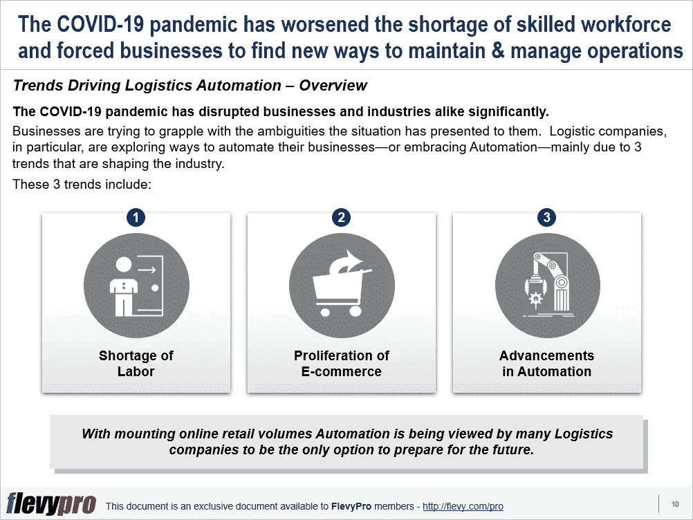

# 推动物流领域自动化的 3 大趋势

> 原文：<https://medium.datadriveninvestor.com/3-trends-driving-automation-in-the-logistics-sector-fb7f7be4b8b0?source=collection_archive---------23----------------------->

技术进步已经走过了漫长的道路。[人工智能](https://flevy.com/business-toolkit/artificial-intelligence)正在负责大量重复性的物流任务。组织正从[自动化](https://flevy.com/business-toolkit/robotic-process-automation)中受益，简化了他们繁琐的流程，缩短了交付时间。

自动化正在深刻地影响着[物流](https://flevy.com/business-toolkit/logistics)的处理方式。它正在扰乱整个物流供应链，而不仅仅是仓储、拣货和分拣功能。自动化对公路、铁路和港口的影响是巨大的。港口越来越接受自动化，但他们还没有开始获得投资回报。

在物流方面，海运和空运具有自动化的潜力——这肯定正在进行中——但其对提高吞吐量的作用还有待观察。随着新的模式、概念和产品的快速发展，物流业务正在以相当快的速度发生转变。以目前技术发展的速度，专家们相信在不太遥远的将来，物流操作将会自动完成。

新冠肺炎疫情严重扰乱了商业和工业。企业正试图解决这种情况给他们带来的模糊性。许多物流公司认为自动化是为未来做准备和生存的唯一选择。

物流公司正在探索实现业务自动化的方法，这主要是因为塑造其行业的 3 个趋势。这三个趋势包括:

1.  **劳动力短缺**
2.  **电子商务的扩散**
3.  **自动化的进步**

让我们稍微详细地谈谈这些趋势。

# 劳动力短缺

全球劳动力市场正趋于稳定，失业率最低，工资高。各地的在线零售商对熟练工人有巨大的需求。这种需求在假日季节急剧上升。相当数量的劳动力从事与供应链相关的工作——仅在美国就有大约 400 万人从事包装工、搬运工和仓库主管。这相当于 1000 亿美元的工资成本。自动化肯定会降低这个成本头。然而，这将对劳动力产生影响。

# 电子商务的扩散

另一个对物流业产生巨大影响的趋势是电子商务零售商的爆炸性增长。电子零售商的销售额每年都在稳步增长。在这种趋势下，产品范围大幅增长，物流企业从中受益。物流公司从大量的网上订单中获得了可观的利润——每销售 100 美元可以节省 12 到 20 美元。

有兴趣了解更多塑造物流运作的趋势吗？你可以在[Flevy documents market place](https://flevy.com/browse)上[下载**推动物流自动化**的三大趋势的可编辑 PowerPoint 演示文稿](https://flevy.com/browse/flevypro/logistics-automation-5488)。

# 你在这个框架中找到价值了吗？

您可以从 [FlevyPro 库](https://flevy.com/pro/library)下载关于这个和数百个类似业务框架的深入介绍。FlevyPro 得到了数千名管理顾问和企业高管的信任和使用。有些人不得不说:

> *“我的 FlevyPro 订阅为我提供了当今市场上最受欢迎的框架和平台。它们不仅增加了我现有的咨询和辅导产品和服务，还让我跟上了最新的趋势，为我的实践激发了新产品和服务，并以其他解决方案的一小部分时间和金钱教育了我。我强烈推荐 FlevyPro 给任何认真对待成功的顾问。”*

*——比尔·布兰森，Strategic Business Architects 创始人*

> *“作为一家利基战略咨询公司，Flevy 和 FlevyPro 框架和文档是一个持续的参考，可帮助我们为客户构建我们的发现和建议，并提高他们的清晰度、力度和视觉效果。对我们来说，这是增加我们影响力和价值的宝贵资源。”*

*–Cynertia 咨询公司咨询区域经理 David Coloma*

> *“作为一个小企业主，FlevyPro 提供的资源材料已被证明是非常宝贵的。根据我们的项目事件和客户要求按需搜索材料的能力对我来说很棒，并证明对我的客户非常有益。重要的是，能够针对特定目的轻松编辑和定制材料有助于我们进行演示、知识共享和工具包开发，这是整个计划宣传材料的一部分。虽然 FlevyPro 包含任何咨询、项目或交付公司都必须拥有的资源材料，但它是小公司或独立顾问工具箱中必不可少的一部分。”*

*–变革战略(英国)董事总经理迈克尔·达夫*

在 [**科技**](https://app.ddichat.com/category/science-and-technology) **:** 安排一次 DDIChat 会话

 [## 专家-科学和技术- DDIChat

### DDIChat 允许个人和企业直接与主题专家交流。它使咨询变得快速…

app.ddichat.com](https://app.ddichat.com/category/science-and-technology) 

在这里申请成为 DDIChat 专家。
与 DDI 合作:[https://datadriveninvestor.com/collaborate](https://datadriveninvestor.com/collaborate)
点击此处订阅 DDIntel [。](https://ddintel.datadriveninvestor.com/)