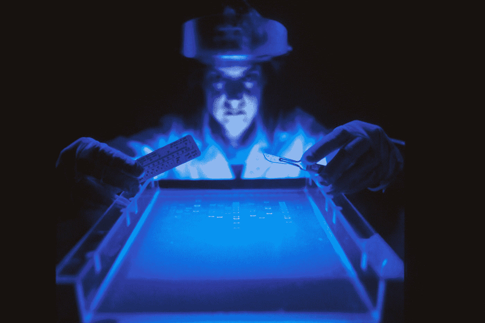

# CRISPR 用于对抗冠状病毒的 3 种方式

> 原文：<https://medium.datadriveninvestor.com/3-ways-crispr-is-used-to-fight-the-coronavirus-3319eddd6906?source=collection_archive---------0----------------------->

## 投入到你从未听说过的最强大的技术中。



Photo by [National Cancer Institute](https://unsplash.com/@nci?utm_source=medium&utm_medium=referral) on [Unsplash](https://unsplash.com?utm_source=medium&utm_medium=referral)

在上个世纪，人类经历了九次大流行(全球性疾病爆发)，其中三次仍在持续。

如果我们算上[流行病](https://www.who.int/emergencies/diseases/en/)(一种疾病的意外增加)，这个名单会膨胀到包括[基孔肯雅病](https://www.who.int/emergencies/diseases/chikungunya/en/)、[霍乱](https://www.who.int/cholera/en/)、[克里米亚-刚果出血热](https://www.who.int/emergencies/diseases/crimean-congo-haemorrhagic-fever/en/)、[亨德拉病毒](https://www.who.int/emergencies/diseases/hendra-virus/en/)、[拉沙热](https://www.who.int/emergencies/diseases/lassa-fever/en/)、[马尔堡病毒](https://www.who.int/csr/disease/marburg/en/)、[脑膜炎](https://www.who.int/emergencies/diseases/meningitis/en/)、[猴痘](https://www.who.int/emergencies/diseases/monkeypox/en/)、[尼帕病毒](https://www.who.int/csr/disease/nipah/en/)

在这篇文章中，我将探索一种叫做“CRISPR”的令人兴奋的新技术是如何被用来对抗新冠肺炎的。

```
· [Background](#f3bf)
  ∘ [How Health Organizations Respond to Outbreaks](#8e5d)
  ∘ [How Can We Prevent Pandemics?](#702d)
  ∘ [Can Vaccines Prevent Outbreaks?](#a155)
  ∘ [What is CRISPR?](#548c)
· [CRISPR For Detecting Coronavirus](#6b56)
· [Can CRISPR Be Used to Kill COVID-19?](#8245)
  ∘ [Additional PAC-MAN Applications](#0b93)
  ∘ [PAC-MAN Effectiveness](#f04d)
  ∘ [What Else is Needed](#2b26)
· [Using CRISPR to Re-Program Genes to Fight Coronavirus](#0aeb)
  ∘ [CRISPR Delivery Mechanisms](#d2b2)
· [Three-Part Summary](#515e)
```

# 背景

## 卫生组织如何应对疫情

这种无休止的疾病冲击引出了一个问题:我们如何应对这些疾病的爆发？

像世界卫生组织这样的组织以下列方式回应:

*   现场调查
*   诊断的确认
*   危险病原体的处理
*   病例检测
*   病人管理
*   包含
*   提供物流(员工和物资)

我们可以现场看到世卫组织如何应对新冠肺炎，[包括](https://www.who.int/westernpacific/emergencies/covid-19)研究疾病，公共交流，以及倡导缓解措施。

WHO, March 1, 2020.

## 我们如何预防流行病？

硬币的另一面是*预防*:在疾病演变成流行病或疫情之前阻止其发展。关于反应和预防的讨论不是从前者转向后者，因为预防所有疾病永远不可能。

毕竟大自然本来就不可预测。T4 2012 年的一项研究描述道:

> “大多数主要的人类传染病都源于动物，我们继续受到新的动物病原体的轰击。”

大约有 800 万种动物物种，监控和防止来自动物的新型病原体传播的努力不可能 100%有效。

当然，在新疾病出现后防止人际传播总是有保证的，这可能包括社交距离、洗手、避免触摸面部和接种疫苗等。

## 疫苗能预防疾病爆发吗？

正如世界卫生组织[写的](https://www.who.int/bulletin/volumes/86/2/07-040089/en/):

> "疫苗接种大大减轻了传染病的负担."

疫苗根除了天花等疾病，在美洲局部消灭了麻疹等疾病，每年防止近 600 万人死亡，通过“群体免疫”挽救未接种疫苗者的生命，等等。

随着新冠肺炎让世界屈服，疫苗的好处显而易见。成千上万的人正在死去，数万亿美元在全球股票市场上损失，整个社会陷入缓慢的困境。

然而，疫苗的研发需要很长时间。如果你要给大量人群注射一种化学混合物，你会想确保它是安全的，这就是为什么我们可能在大约 12 个月内看不到冠状病毒疫苗。

同样，正如世卫组织的一份报告所解释的那样，“对于大多数新出现的疾病，还没有疫苗或治疗方法”。**最终，疫苗不能防止所有的疾病爆发。**

除了疫苗，另一个潜在的疾病预防途径是一种叫做 CRISPR 的技术，一种革命性的基因编辑工具。

## CRISPR 是什么？

正如斯坦福医学院[写的](https://stanmed.stanford.edu/2018winter/CRISPR-for-gene-editing-is-revolutionary-but-it-comes-with-risks.html):

> “[CRISPR]允许科学家快速锁定、删除和修复任何基因中任何突变的 DNA 序列。”

CRISPR 不是唯一的基因编辑工具，但它是目前最精确、成本最低、最有用的工具。这种直接操纵 DNA 的能力将会产生巨大的影响。

# 用于检测冠状病毒的 CRISPR

如上所述，CRISPR 允许靶向任何基因序列。它是通过依赖发现其互补靶序列的指导 RNA 来做到这一点的，就像 GPS 一样，使用“切割工具”核酸酶 Cas 在精确的位点切割。

例如，猛犸生物科学公司[创造了](https://www.ft.com/content/5e9377fa-693c-11ea-800d-da70cff6e4d3)一种新冠肺炎测试，使用 CRISPR Cas12 来搜索和突出病毒的遗传物质。

猛犸象生物科学公司的首席执行官[将](https://mammoth.bio/news/the-future-of-healthcare-using-crispr-to-build-the-search-engine-for-biology-with-trevor-martin-ceo-of-mammoth-biosciences/)的工作描述为“使用 CRISPR 来构建生物学的搜索引擎”，而不是作为生物学的作者。

虽然新冠肺炎的测试已经存在，猛犸的建议是“快速(<30 min), practical (available immediately from international suppliers), and validated using contrived samples,” according to their [白皮书](https://mammoth.bio/wp-content/uploads/2020/03/Mammoth-Biosciences-A-protocol-for-rapid-detection-of-SARS-CoV-2-using-CRISPR-diagnostics-DETECTR.pdf)的主题。

他们的[方法](https://www.forbes.com/sites/johncumbers/2020/03/14/with-its-coronavirus-rapid-paper-test-strip-this-crispr-startup-wants-to-help-halt-a-pandemic/#2a9bd2a27631)被称为检测器，因其简单性而大放异彩。首先，患者提供鼻腔或口腔拭子。样本中的 RNA 被放大并转化为 DNA。CAS12 被输入新冠肺炎指导序列，搜索 DNA 样本寻找匹配。如果有一个，CAS12 结合到匹配，通过切割报告分子发出信号，并改变猛犸象侧流带的颜色。

猛犸象的投资者之一[将 DETECTR 比作](https://www.nfx.com/post/introducing-mammoth-biosciences/)一种疾病妊娠测试。

猛犸象生物科学公司并不是唯一建立这种系统的公司。夏洛克生物科学[的联合创始人独立开发了](https://mcgovern.mit.edu/2020/02/14/enabling-coronavirus-detection-using-crispr-cas13-an-open-access-sherlock-research-protocol/)一种 CRISPR Cas13 协议，用于从合成 RNA 片段样本中检测新冠肺炎 RNA。其功能非常相似，主要区别在于所用的 Cas 核酸酶。

# CRISPR 能用来杀死新冠肺炎吗？

我们探索了 CRISPR 如何针对**并删除**任何基因序列。那么，同样的原理可以用来删除基因中的新冠肺炎序列吗？

斯坦福大学生物工程系的一个团队正在研究这种方法，他们创造了一种“PAC-MAN”(人类细胞中的预防性抗病毒 CRISPR)，将 Crispr 导向新冠肺炎的基因序列，攻击它，并使用它自己的机制进行自我复制。

与基于 CRISPR 的基因序列检测方法一样，PAC-MAN 系统使用 Cas 酶和一条指导 RNA。引导 RNA 被喂以新冠肺炎链，然后引导 Cas-13d 酶，直到它与那些链匹配。

这种方法将测试溶液中的病毒量减少了 90%。

然而，就像基于 CRISPR 的新冠肺炎检测系统一样，这更多的是一个概念验证，而不是一个生产就绪的系统。

此外，这种方法遇到了与传统疫苗相同的问题，即有一个漫长的临床试验期。

一个特别的问题是冠状病毒有大约 30，000 个核苷酸，而 CRISPR guide RNA 只能靶向 22 个核苷酸的区域进行切割，正如 [WIRED 文章](https://www.wired.com/story/could-crispr-be-the-next-virus-killer/)中所讨论的。

纽约基因组中心和纽约大学的一个团队创建了一个系统，可能有助于缓解这个问题，他们使用 Cas13 在 RNA 水平上建立了大规模的遗传筛选，针对 RNA 转录物中的数千个位点，用预测模型来识别最有效的 Cas13 指导 RNA。

然而，即使及时解决了上述问题，另一个问题实际上是向人类细胞提供基于 CRISPR 的治疗。一种潜在的输送方法是喷雾器，或者简单地说是一种类似吸入器的装置，允许受试者将治疗药物吸入他们的肺部，在那里可以找到新冠肺炎。

事实上，在[的几项试验](https://www.smithsonianmag.com/science-nature/four-us-crispr-trials-editing-human-dna-for-new-medical-treatments-180973029/)中，人类细胞已经被注射了 CRISPR，尽管结果仍有待观察，一些试验计划到 21 世纪 30 年代。

最终，理论上 CRISPR*可以用来杀死新冠肺炎，尽管我们离看到它在现实世界中使用还有很长的路要走。希望基于 CRISPR 的治疗方法的安全性和有效性将在下一次疫情袭击时得到证明。*

## 其他 PAC-MAN 应用程序

甚至在 SARS-COV-2 之外，这种 Cas13 风格的方法也被发现成功地对抗流感病毒株:研究人员[写道](https://www.cell.com/cell/pdf/S0092-8674(20)30483-9.pdf?_returnURL=https%3A%2F%2Flinkinghub.elsevier.com%2Fretrieve%2Fpii%2FS0092867420304839%3Fshowall%3Dtrue)“cas 13d PAC-MAC 可以减少呼吸上皮细胞中的 H1N1 IAV 负荷。”

H1N1 通常被称为猪流感。在世界范围内，这个疫情可能已经杀死了超过 50 万人。

[](https://www.verywellhealth.com/what-is-h1n1-swine-flu-770496) [## 了解猪流感(H1N1 流感)

### 猪流感是影响猪的 A 型流感病毒的名称。虽然猪流感通常不会…

www.verywellhealth.com](https://www.verywellhealth.com/what-is-h1n1-swine-flu-770496) 

当然，流感和冠状病毒是完全不同的病原体，所以这显示了基于 CRISPR 方法的灵活性。

[](https://www.fredhutch.org/en/news/center-news/2020/04/covid-19-coronavirus-primer.html) [## 冠状病毒生物学简明入门

### “这很复杂，我们还不知道，”艾默曼说。有许多因素会影响…的消长

www.fredhutch.org](https://www.fredhutch.org/en/news/center-news/2020/04/covid-19-coronavirus-primer.html) 

## 吃豆人的有效性

传统疫苗虽然是科学奇迹，但在短期内不会有帮助。开发一种安全有效的疫苗将需要大约 12 个月的时间，到那时，新冠肺炎的大部分破坏将已经完成。因此，如果像 PAC-MAN 这样的解决方案能够更快地部署到未来的大流行中，它们可能会彻底改变我们的反应。

此外，冠状病毒是一个巨大的问题，甚至远不止引起新冠肺炎。冠状病毒也引起了最初的 SARS 疫情和 MERS，并将引起未来的病毒疫情。

如前所述，MERS 被认为是一种持续的疫情，与艾滋病和新冠肺炎并列。

## 还需要什么

作为一种抗病毒策略，搜寻 SARS-Cov-2 基因序列的 CRISPR Cas13 系统需要一种有效的传递方法，特别是到呼吸道。

作者提出了一些方法，如在化学聚合物或脂质纳米颗粒中以 RNA 形式递送 Cas13d 及其同源 crRNAs。

在实践中，脂质纳米粒可以通过注射和其他形式进行[递送，尽管](https://www.liebertpub.com/doi/full/10.1089/nat.2018.0721)[有效递送](https://www.cell.com/cell/pdf/S0092-8674(20)30483-9.pdf?_returnURL=https%3A%2F%2Flinkinghub.elsevier.com%2Fretrieve%2Fpii%2FS0092867420304839%3Fshowall%3Dtrue)可能需要不同的方法:

> “[这些]策略有可能通过雾化器系统或鼻腔喷雾剂作为抗病毒策略用于患者或健康人群。”

# 利用 CRISPR 重新编程基因对抗冠状病毒

我们已经报道了 CRISPR 是如何被用于**测试**和**攻击** SARS-COV-2 的。最近，第三个用例出现在桑迪亚国家实验室由 DARPA 资助的研究项目中:重新编程基因以对抗新冠肺炎。

如上所述，CRISPR 不仅仅是一把“分子剪刀”，或者换句话说，它并不严格用于剪切和直接编辑。它还可以被用作一种工具来控制基因调控方法，并对细胞进行重新编程以阻止感染。

[](https://www.nextgov.com/emerging-tech/2020/05/national-lab-scientists-work-reprogram-genes-fight-covid-19/165240/) [## 国家实验室科学家致力于重新编程基因以对抗新冠肺炎

### 基因测序工具和基于 CRISPR 的技术有助于科学家彻底探索体内最微小的变化…

www.nextgov.com](https://www.nextgov.com/emerging-tech/2020/05/national-lab-scientists-work-reprogram-genes-fight-covid-19/165240/) 

这项研究实际上在几年前就开始了，研究的是像伊波拉病毒和尼帕病毒这样的传染病。随着新冠肺炎的出现，团队的努力转向创造一个更通用的工具。

虽然 CRISPR " [基因子弹](https://share-ng.sandia.gov/news/resources/news_releases/crispr_coronavirus/)"可以消灭 SARS-COV-2，但更广泛的目标是将其应用于各种病毒爆发。

> “我们的目标是为病毒爆发找到新的‘可重载’对策，而不必每次都重新发明。”

由于 CRISPR 可以让你安全地编辑 DNA 和 RNA 的特定序列，CRISPR 可以应用于 DNA 和 RNA 病毒，也可以用于提高身体抵抗病毒感染的能力。

这些对策可以被认为是你的身体用来抑制病毒感染的“临时重编程代码”。

## CRISPR 交付机制

CRISPR 解决方案的输送机制极其重要，因为 CRISPR 必须瞄准正确的细胞才能产生影响。

例如，SARS-COV-2 的 CRISPR 解决方案可能需要定制的输送机制来进入 II 型肺细胞，因为肺是相关的生物战场。

[](https://www.vox.com/2020/5/8/21251899/coronavirus-long-term-effects-symptoms) [## 新冠肺炎的长期并发症，解释说

### 起初，劳伦·尼科尔斯试图解释她的症状。三月初，这位健康的 32 岁男子感到一种强烈的…

www.vox.com](https://www.vox.com/2020/5/8/21251899/coronavirus-long-term-effects-symptoms) 

桑迪亚国家实验室的团队正在开发纳米粒子传输系统，以保护 CRISPR 系统，直到它们到达体内正确的细胞。

# 三部分总结

考虑到我们在 2021 年年中之前不太可能看到传统的 SARS-COV-2 疫苗，以及针对一般冠状病毒(不仅仅是 SARS-COV-2)的方法的吸引力，我希望我们能在相对较短的时间内看到基于 CRISPR 的治疗方法，这有助于防止未来的大流行。

总之，有三项发展可能实现基于 CRISPR 的 SARS-COV-2(和更广泛的抗病毒)解决方案。

第一步是制造一个 CRISPR-Cas 系统，该系统在细胞培养物和培养皿中调节基因，以适当地阻断 SARS-COV-2。下一步是安全地将其转移到人体内，例如通过核酸疫苗。

传统疫苗包括制造病毒成分、纯化病毒成分并将其注射到人体内，而 CRISPR 核酸疫苗将发送代码(信使 RNA)让身体产生自己的病毒抗原，以刺激免疫反应。

最后一步是确保有效的输送机制(在这种情况下，到肺部)。前面提到的“纳米颗粒输送系统”可以是一种解决方案，因为核酸在进入人体后可能会降解。

这听起来可能需要实现很多目标:功能性 CRISPR-Cas 系统，转移到人类，以及有效的传递机制，但 CRISPR 的快速进展是一个伟大的标志。