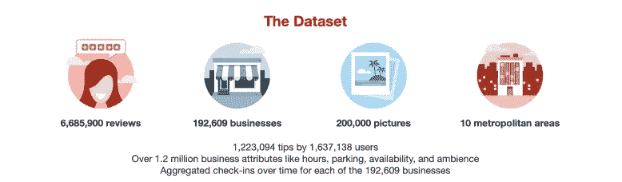
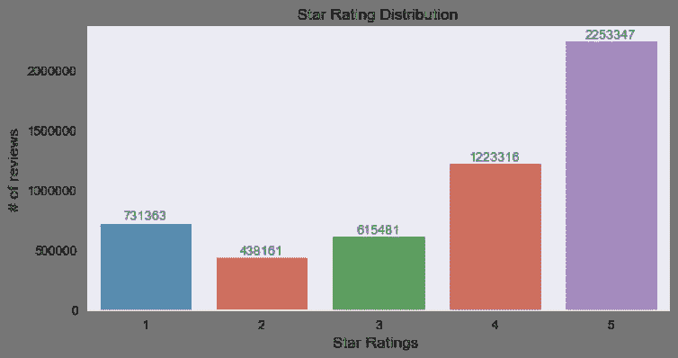
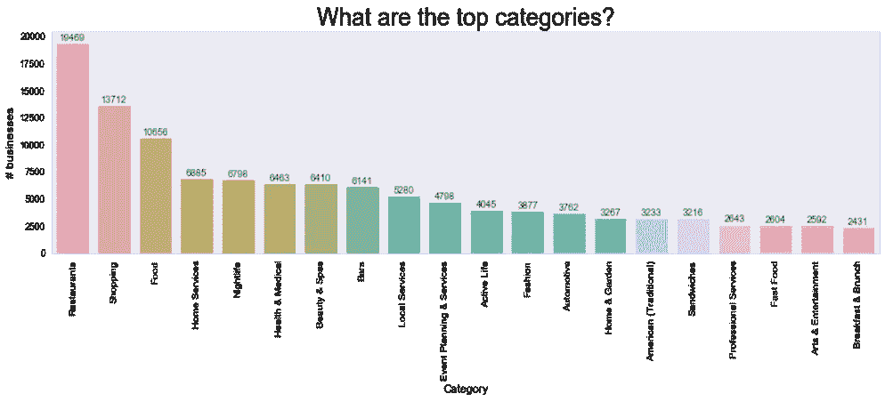
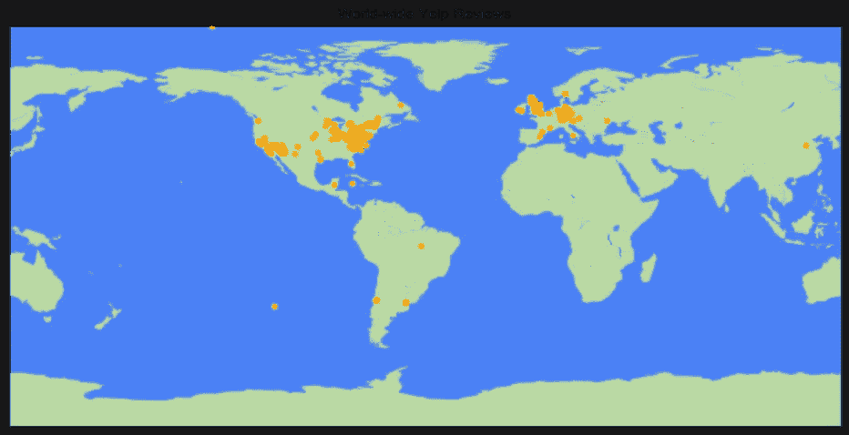
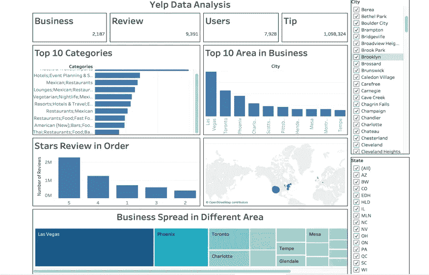

# 数据分析可以让你进步的 3 种方式:EMV - Python + Tableau

> 原文：<https://medium.datadriveninvestor.com/3-ways-data-analysis-can-make-u-invincible-emv-5ebaa6b89733?source=collection_archive---------8----------------------->

## 在交互式仪表板中提取、建模和可视化:赋予原始数据意义

D 数据在全球范围内是巨大的，并且从数据中提取意义，使其可视化，使其更有吸引力，更容易被他人理解。在这里，我们将使用著名的 Yelp 数据集来做我们的分析和可视化。社交网络数据正以非常快的速度增长，如果恰当地利用它来提取意义，它会影响业务增长。

# 关于数据集

Yelp 提供了一个平台，消费者可以通过自由格式的文本和 1 到 5 的数字评分来发布他们对企业、产品或服务的用户体验。星级 1 到 3 意味着用户体验不好，而 4 或 5 意味着用户体验好。
因此，对于企业来说，专注于获得客户的高度评价是至关重要的。许多企业面临的一个重要问题是，是否有办法通过有针对性地改变他们的产品来鼓励更高的评级。数据集包含业务、评论、用户、签到和提示。

> Yelp 数据集由用户评论、商业数据、签到和缩短评论的提示组成。这个数据集是 Json 格式的。

More detail about Dataset

# 我们的目标

1.  通过探索性数据分析评估公众对 Yelp 上餐馆的看法
2.  建立准确预测评论情感的机器学习模型

让我们一起分三步走:EDA、机器学习和可视化

# 探索性数据分析

我们有以下文件:业务

**用户**:用户数据，包括用户的好友映射和所有与用户相关的元数据。

**评论**:包含完整的评论文本数据，包括撰写评论的 user_id 和撰写评论的 business_id。评分在 1-5 分之间。

**业务**:包含业务数据，包括位置数据、属性和类别。

**提示**:用户写的关于业务的提示。提示比评论短，倾向于传达快速的建议。

**登记**:登记业务
不考虑本次分析的照片。

> B 业务和审核数据集与 business_id 字段相关，可以结合起来进行进一步分析。

数据分布在不同的评论中。显示更多数据的三种不同的可视化方式:1 .审查评级 2。工业评论。评论的地理分布。

Data Spread as per ratings

Top Categories in Reviews

Geographically reviews varied from different locations

# ML 建模

**数据转换和预处理**:将数据转换成矢量，以便进一步分析。

**数据清理**:将所有单词转换为较低等级(以避免重复)，移除停用词、词性标注和词条化以减少形态变化

**矢量化**:评论文本转换成矢量形式。这个想法是相似的单词在它们的向量之间有最小的距离。总共 146616 个向量被导出以形成因变量。

**数据拆分**:数据集被拆分为训练集和测试集，其中 70/30 拆分为训练/测试数据。

**模型和结果**:多项式朴素贝叶斯在本项目中使用的分类器(即 K-Neighbor 和 SVM)中提供了最好的性能。朴素贝叶斯具有 76%的准确性，其中 77%的结果是相关的(精确的), 76%的相关结果被正确分类。多项式朴素贝叶斯然后将被用于星级预测引擎。

> 在高斯上使用多项式朴素贝叶斯，因为对于稀疏数据，高斯朴素贝叶斯假设不满足，并且数据上的简单高斯拟合不会给我们提供良好的拟合或预测

# 使用仪表板的可视化

仪表板有助于以 [*的视觉方式*](https://public.tableau.com/profile/laxman.singh#!/vizhome/Dashboard_15733645113070/YelpDataAnalysis?publish=yes) 提供以下信息的概述

该控制面板是交互式控制面板，允许根据所做的地理选择来可视化数据。此外，它还具有独特性，可以根据需要进一步利用。

1.  **业务:**它将给出为该报告选择的业务的计数。如果在参数中选择了任何城市，这将提供该城市 yelp 数据集中现有的不同企业的数量。
2.  **评论**:这将给出与上述选择的城市和州相关的业务的评论。
3.  **用户**:这是给商家评论的用户数量
4.  **提示**:这是用户给商家的提示。
5.  **十大类** : **商业**，**领域**商业，**明星点评**以及各自的**统计**。
6.  **数据的地理分布**:被审核的不同业务的区域分布。该报告也将成为仪表板中的行驶报告。如果您点击特定区域，所有其他相应的报告将相应改变。
7.  **地理业务分布**:该报告给出了 yelp 数据集中不同业务的另一种可视化。

# 结论和进一步建议

Y elp 数据评论大多是正面的，平均而言，情感极性与用户的星级一致。从数据中提取意义，预测情绪，然后利用可视化来呼吁理解数据，是产生影响的关键技能。这种理解将有助于你轻松塑造 ML 的任何项目。**编码快乐！**

> 预测偏向于正面评论，因此数据集可以归一化为具有相同数量的评论，以在训练 ML 模型之前消除偏差。此外，还可以探索每个商业机构的各个方面，以了解是什么驱动了客户的感知。

多项式奈斯贝叶斯，K 近邻和支持向量机模型用于数据集。在图 12 中，结果显示多项式朴素贝叶斯在预测评级方面提供了最佳性能。企业可以将未评级评论分为正面和负面回应。

Final Dashboard (Interactive)

## 获得专家观点— [订阅 DDI 英特尔](https://datadriveninvestor.com/ddi-intel)