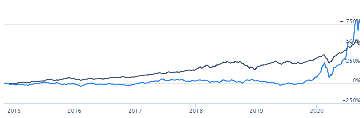
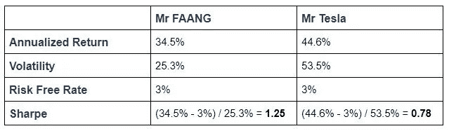
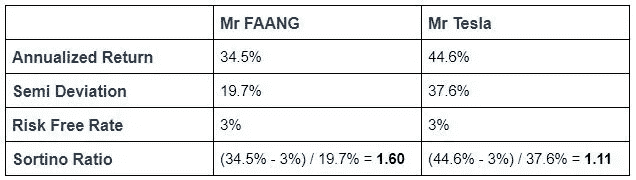
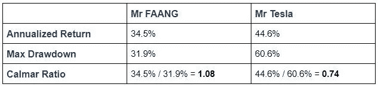

# 评估投资策略表现的三种方法

> 原文：<https://medium.datadriveninvestor.com/3-ways-to-evaluate-the-performance-of-your-investment-strategy-ac3783a38929?source=collection_archive---------5----------------------->

pyinvesting.com

你知不知道有一个人只投资一只股票，因为它是市场上最热门的股票？这家伙通常是房间里声音最大的人，总是吹嘘他把全部身家投入特斯拉股票赚了多少钱。我们给他打电话吧，泰斯拉先生。

另一个你可能认识的人，喜欢投资科技公司。他是那种排队几个小时，只为在最新款 iPhone 上市当天拿到它的人。由于他对技术和 IT 设备的痴迷，他最喜欢投资的股票是脸书、苹果、亚马逊、网飞和谷歌，也称为 FAANG 股票。我们给他打电话吧，方先生。FAANG 先生持有同等权重的 FAANG 股票投资组合，并使用[战略配置回溯测试](https://pyinvesting.com/backtest/strategic-allocation/)每年重新平衡一次他的投资组合。

一天，特斯拉先生和法昂先生在一家酒吧偶遇，喝得酩酊大醉，并开始为谁是更好的投资者而相互争论。

pyinvesting.com

特斯拉先生:“我的回报更高！”

方先生:“但是你的风险也更高！”

他们都有道理。特斯拉的回报率较高，为 44.6%，而 FAANG 的回报率较低，为 34.5%。然而，FAANG 先生的投资组合的波动率为 25.3%，低于 Tesla 先生的 53.5%。

那么谁是更好的投资者呢？

 [## 将数据隐私转化为你的优势，重建消费者的信任:下一个投资前沿

### 疫情期间，抖音的使用量激增，全球约有 8 亿用户使用该平台…

www.datadriveninvestor.com](https://www.datadriveninvestor.com/2020/09/18/turn-data-privacy-to-your-advantage-and-rebuild-consumers-trust-the-next-investment-frontier/) 

# 引入风险调整回报

虽然特斯拉的年化回报率确实比法昂高得多，但他的年化回报率是法昂的两倍多。为了比较特斯拉和法昂的表现，我们需要使用一个奖励高回报投资策略、惩罚高风险策略的表现指标。这就是所谓的风险调整后的策略回报。与单纯的高回报相比，投资者通常更喜欢高风险调整后的回报，因为这说明了不同策略之间的风险差异。

# 夏普比率

夏普比率是最常见的风险调整回报衡量标准之一。它是你的策略的超额回报除以它的波动性。超额回报可以通过从您的策略的年化回报中减去无风险利率来获得。无风险利率是投资于安全工具的回报，如美国国债的收益率。

夏普比率=(年化回报率-无风险利率)/波动率

策略的回报越高，分子越大，夏普比率越高。波动率越高，分母越大，夏普比率越低。

对这两种策略进行计算后，FAANG 先生以 1.25 比 0.78 的夏普比率领先于 Tesla 先生。

# Sortino 比率

风险调整回报率的下一个衡量标准是排序比率。这个比率与夏普比率略有不同，夏普比率不是将超额收益除以波动率，而是将超额收益除以半离差。半离差是通过衡量策略的投资组合收益为负时的波动率计算的。

排序比率=(年化收益率-无风险率)/半离差

使用半离差是有意义的，因为任何投资者都应该欢迎上行波动，因为这意味着更高的回报。通过区分有害波动性和策略的整体波动性，Sortino 比率比 Sharpe 比率更好地代表了风险调整后的回报。

回到法昂先生和特斯拉先生的投资策略，我们可以看到法昂先生仍然以 1.60 比 1.11 的较高投资比率领先于特斯拉先生

# 卡尔马尔比率

卡尔马尔比率是另一个衡量风险调整后回报的指标。与依赖于波动性的夏普比率和索蒂诺比率不同，卡尔马尔比率着眼于策略的最大缩减。

最大亏损是指在达到新的峰值之前，投资组合价值从峰值到谷值的最大损失。例如，标准普尔 500 的最高提款率为 56%，从 2007 年 10 月的峰值到 2009 年 3 月，在从全球金融危机中复苏之前，损失了 56%。卡尔马尔比率的计算方法是将你的策略的年化回报除以它的最大提款。

卡尔马尔比率=年化回报/最大提款

卡尔马尔比率可能对一些投资者更有吸引力，因为最大提款是你的策略风险的更好指标。虽然波动性通常被用作风险的代表，但它不会让投资者知道在黑天鹅事件中他会损失多少，就像我们在最近的 Covid 危机中看到的那样。

比较 FAANG 先生和 Tesla 先生的投资策略，我们可以看到 FAANG 先生以 1.08 比 0.74 的较高卡尔马尔比率胜出

# 你如何提高你的风险调整回报？

总体而言，与特斯拉相比，法昂的投资策略具有更高的风险调整回报率。FAANG 先生的策略的所有 3 个绩效指标(Sharpe、Sortino 和 Calmar 比率)都较高。

FAANG 先生的策略之所以在风险调整后回报率更高的情况下表现出色，有三个关键原因。

1.  多样化。每个人都知道，华尔街唯一的免费午餐是多样化，我们永远不应该把所有的鸡蛋放在一个篮子里。通过将赌注分散在 5 只不同的股票上，FAANG 先生能够降低他的投资组合的风险，相比之下，Tesla 先生只投资一只股票。这背后的逻辑是，通过投资不同的股票，投资组合的波动性较低，因为不同的股票以不同的方向和速度移动，不同股票之间的相关性小于 1。
2.  同等权重。通过在 5 只不同的股票中平均分配投资组合的权重，投资组合中的集中风险比持有一只股票要小得多。通过在不同股票之间平均分配权重，它确保了即使其中一只股票表现不佳，对整体投资组合的影响也将是有限的。我们赌的是投资组合中每只股票的平均表现，而不是一只股票为我们打出本垒打。
3.  重新平衡。重新平衡的目的是将投资组合中每只股票的权重调整回其目标权重，以便我们可以随着时间的推移保持相等的权重。由于投资组合中的不同股票具有不同的表现，随着时间的推移，这种回报差异越来越大，导致每只股票之间的权重不同于每只股票 20%的目标分配。再平衡包括从一些表现良好的股票中获利，并将这些利润再投资于价值下跌的股票。这使我们能够在一段时间内保持不同股票之间的权重相等，并降低我们投资组合中的集中风险。

祝你投资愉快，并祝你好运。

如果你想制定一个有效的投资策略，学习如何利用回溯测试的结果可能是你做过的最好的决定之一，因为回溯测试可以帮助你在你的钱被押上之前识别出一个不正确或正确的投资。[*py investing*](https://pyinvesting.com/)*是一个回溯测试平台，帮助投资者在云上创建自己的机器人顾问，而无需编写一行代码。*

**访问专家视图—** [**订阅 DDI 英特尔**](https://datadriveninvestor.com/ddi-intel)