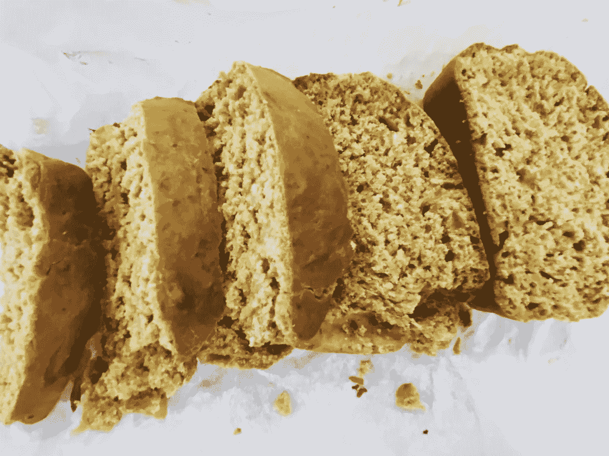

# 在充满挑战的时代寻找感恩的 3 种方法

> 原文：<https://medium.datadriveninvestor.com/3-ways-to-look-for-gratitude-in-challenging-times-a0f79ededc30?source=collection_archive---------16----------------------->

By [Giftpundits.com](https://www.pexels.com/@giftpundits-com-551816) from [Pexels](https://www.pexels.com/photo/2072165)

选择寻找好的一面…即使感觉不到任何好的一面。

尤其是当我们受到挑战时，我们很容易陷入相同思维的怪圈。这些想法一直在循环往复，结果，你会变得更加沮丧和疲惫。

有时候，我陷入了这样一个循环，我所能想到的就是重复的同一个想法(不同的变化)。*你们谁能体会这种感觉？*

打破这种循环很有挑战性，尤其是在你没有意识到的情况下。为了更清楚地意识到自己的想法，我一直在挑战自己，让自己更多地走出自己的大脑，回到自己的身体里。我一直在寻找其他创造性的方法来摆脱我脑海中的想法，比如用语音发短信来代替打字。

 [## 疫情期间临床试验的一线希望|数据驱动的投资者

### 没有书本而学医的人航行在未知的大海上，但是没有病人而学医的人却不去…

www.datadriveninvestor.com](https://www.datadriveninvestor.com/2020/12/14/the-silver-lining-for-clinical-trials-during-the-pandemic/) 

将我的挫折转化为有成效的事情对我的身心都有帮助。就在本周，我受到了一款[抹茶绿茶蛋糕](https://www.instagram.com/p/CHNytuXnjoc/)的启发，决定自己重新制作它。使用我的其他感官，如嗅觉和触觉，让我摆脱了头脑，开始从零开始创造东西。

这里有三种在日常生活中寻找感恩的方法:

1.  查看内部发生了什么。身体扫描有助于更好地了解你目前的感受。这教会了我要更活在当下，意识到哪些地方让我感到紧张，哪些地方我需要继续放手。专注于我的呼吸也很平静，除了专注于我的呼吸之外没有其他事情可做。当我有压力的时候，我的身体会紧张，我会忘记关注我的呼吸。所以进行身体扫描，即使很快，也能帮助我重置，回到当下。
2.  记住一天中充满灵感的小瞬间。我是几个烹饪社区团体的一员，看到人们在隔离期间烹饪的食物让我很受鼓舞。上面我说的抹茶绿茶蛋糕配方是[倪](https://www.instagram.com/barenakedwaffle/)大方贴出来的。她的蛋糕颜色非常鲜艳，这启发了我去寻找更多。我喜欢花点时间看看她的 Instagram，从新食谱中获得灵感。*在你的社区中，你感激谁？谁给了你鼓励、灵感和/或支持，让你心存感激？在你的社区里，你能回馈给谁呢？*
3.  感谢你自己。在[面临激烈挑战的时刻](https://medium.com/datadriveninvestor/3-ideas-to-remember-your-inner-resilience-in-moments-of-challenge-9bdcc867c95b)，人们很容易忘记自己已经走了多远，尤其是当你正经历负面情绪的时候。想想你朝着目标迈出的一小步。*白天你是怎么出现的？你是如何出现在自己和他人面前的？你的行为符合你的价值观吗？你与他人交流需求的能力如何？花点时间感谢你的身体在一天中为你所做的一切——呼吸、消化食物、更新细胞。感谢自己一天中做出的健康的选择，庆祝小小的胜利。庆祝自己是一个很好的提醒，让你关注内心的美好，这样你才能继续前进。即使是朝着正确方向迈出的一小步，也要对自己微笑，不断提醒自己做得很好。在最具挑战性的日子里，知道自己做得很好是最令人欣慰的感觉，能让你放松和放下。*

感谢阅读。希望你有一个愉快的周末！

**订阅** [**卡罗琳咨询**](https://www.carolynconsulting.com/) **了解更多更新。**

## 访问专家视图— [订阅 DDI 英特尔](https://datadriveninvestor.com/ddi-intel)