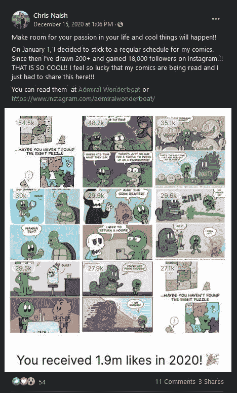

# 让自己在 2021 年成功的 3 种方法

> 原文：<https://medium.datadriveninvestor.com/3-ways-to-set-yourself-up-for-success-in-2021-25b1919fafc4?source=collection_archive---------28----------------------->

## 你可以做些简单的事情来让你的生意更好

Photo by [bruce mars](https://unsplash.com/@brucemars?utm_source=medium&utm_medium=referral) on [Unsplash](https://unsplash.com?utm_source=medium&utm_medium=referral)

对我来说，2020 年的最后四个月有点难熬。也就是说，我仍然学到了很多东西，这些东西现在让我受益匪浅。

在这篇文章中，我想与你分享我的一些发现。如果你把这些放在心上，并在你的创造性工作流程中实施它们，你将在 2021 年为自己赢得更多的成功。

# 1.提升你的联想

我曾经说过我以前是如何不小心戒掉社交媒体的。

但是现在当我在社交媒体上时，我把它看作是一个和我的[梦想 100](https://www.musicentrepreneurhq.com/how-to-build-your-dream-100/) 一起闲逛并向他们学习的机会。

例如:

在 Twitter 上，[泰·弗兰克尔](https://twitter.com/THETYFRANKEL)(你可以在这里找到我对泰的播客采访)总是在如何建立一个六位数的机构上投下价值炸弹。我从 Ralph Smart 分享和推广他的内容的方式中学到了很多。

关于[媒介](https://davidandrewwiebe.com/how-to-4x-your-medium-traffic-in-80-days-or-less/)，我从[汤姆·库格勒](https://tomkuegler.medium.com/)和他的媒介策略中学到了很多(是的，他们正在工作！).我也从他的标题和内容理念中学习。

> 关键是，虽然社交媒体可能是愚蠢的黑洞，但如果你追随并模仿正确的人，并与他们互动，你就可以学到很多东西并建立有价值的联系。

管理你的 feed 需要一些工作(这也是我应该写一篇文章的事情)，但是如果你这样做了，你会想得更多，设定更大的目标，完成更多。这就是提升你的联想的力量。

# 2.每日出版

对我来说，[出版日报不是一个决定](https://davidandrewwiebe.com/publishing-daily-is-not-a-decision/)。我每天醒来都知道我会出版。这是为我未来的自己服务的，因为我知道我以后会很高兴我做了这个决定。

这并不是说你必须一直出版长篇的、权威的、全面的摩天大楼指南。对我来说，他们的转化率有点可疑。

我的平均帖子在 900 到 1300 字的范围内，但我甚至没有说你一定要那么长。我也发表我那份 100 到 500 字的帖子。

如果需要的话，你的帖子可以长而详细，也可以短小精悍。这是你需要多少单词来表达你的观点的问题，而不是你能填充多少内容的问题。

> 这是你需要多少单词来表达你的观点的问题，而不是你能填充多少内容的问题。[(点击发微博](https://twitter.com/intent/tweet?url=https%3A%2F%2Fdavidandrewwiebe.com%2F3-ways-to-set-yourself-up-for-success-in-2021%2F&text=It%E2%80%99s%20a%20matter%20of%20how%20many%20words%20you%20need%20to%20get%20your%20point%20across%20%E2%80%93%20not%20how%20much%20you%20can%20pad%20your%20content.&via=davidawiebe&related=davidawiebe))

[德里克·西弗斯](https://sive.rs/)和[塞斯·戈丁](https://seths.blog/)发表了他们分享的简短形式的内容，你会发现这正是他们使用的方法——他们专注于信息，而不是字数！

你可以从 Sivers 或 Godin，甚至奥斯汀·克莱恩那里得到启示，他们倾向于分享更多的视觉内容，并附上一些评论。

但是每天出版有什么好处呢？

我的朋友[克里斯·奈什](http://scratchbuffalo.com/bio/)于 2020 年 1 月 1 日开始出版漫画。12 月 15 日，他宣布自己已经画了 200 多幅漫画，并在 Instagram 上获得了 18000 名粉丝(恭喜你，伙计)！

我不打算对《每日出版》能为你做什么做出任何承诺，因为在连续出版 161 天后，我自己没有任何突出的结果可以报告。

话又说回来，我仍在不断完善，我能够将我的中等收入提高 5 倍，尽管它仍然很少。

关键是，如果你是一个创意者或创造者，你总会有一些东西要推广或与世界分享。每天发布可以帮助你建立追随者，让更多人看到你的[项目。](https://davidandrewwiebe.com/projects/)

> 每天发布可以帮助你建立一个追随者，让更多的人看到你的项目。([点击发微博](https://twitter.com/intent/tweet?url=https%3A%2F%2Fdavidandrewwiebe.com%2F3-ways-to-set-yourself-up-for-success-in-2021%2F&text=Publishing%20daily%20can%20help%20you%20build%20a%20following%20and%20get%20your%20projects%20in%20front%20of%20more%20people.&via=davidawiebe&related=davidawiebe))

# 3.规划你的周

到现在为止，我已经做了一个多月的战略周日计划会议。我甚至分享了[这些课程如何改善你的生活](https://davidandrewwiebe.com/how-to-use-sunday-planning-sessions-to-improve-your-life/)。

尽管我非常相信跟随自己的内心，运用自己的直觉，甚至在我的时间表中留下大量未计划的空白，但不可否认的是，计划让我[总体上更有效率。](https://davidandrewwiebe.com/productive-procrastination-is-a-must-in-your-creative-efforts/)

再说一次，我并不是建议你以我为榜样，在周日做计划。你可以做对你有用的事。

周日对我来说很合适，因为我的出版时间表，我已经在我的“关于”页面上详细说明了。

虽然我相信行动，但退一步想想也是好的。当您这样做时，您可以:

*   决定如何安排你的一周来提高效率
*   更加明确[你的目标](https://davidandrewwiebe.com/why-youre-not-achieving-your-goals/)
*   集体讨论策略和想法
*   从你的待办事项列表中删除那些优先级不高的任务
*   对你需要做的所有事情以及对你最重要的事情有一个全面的了解
*   创建一个为你服务的常规
*   削减不必要的开支，增加在制胜策略上的支出
*   更多

只是不要强迫自己做一些出于义务的事情。你可能不会坚持到底。

按照你自己的方式做每一件事(或尽你所能)。这样，你所有的努力都会为你服务，而不是相反。

> 一切按你自己的方式去做。这样，你所有的努力都会为你服务，而不是相反。([点击发微博](https://twitter.com/intent/tweet?url=https%3A%2F%2Fdavidandrewwiebe.com%2F3-ways-to-set-yourself-up-for-success-in-2021%2F&text=Do%20everything%20on%20your%20own%20terms.%20That%20way%2C%20all%20your%20efforts%20will%20be%20in%20service%20of%20you%20and%20not%20the%20other%20way%20around.&via=davidawiebe&related=davidawiebe))

# 最后的想法

当你打算在 2021 年创造新习惯时，保持简单，不要贪多嚼不烂。在大多数情况下，养成一个高层次的习惯(直到完全融入)，比试图同时养成 10 个习惯对你更有好处，因为你很有可能会放弃。

找到适合你的方法并坚持下去，因为在一天结束的时候，适合别人的方法可能不适合你。

为了在 2021 年取得成功，你在做什么？

*请在下面的评论中告诉我。*

**访问专家视图—** [**订阅 DDI 英特尔**](https://datadriveninvestor.com/ddi-intel)

*原载于 2021 年 1 月 4 日 https://davidandrewwiebe.com***。**