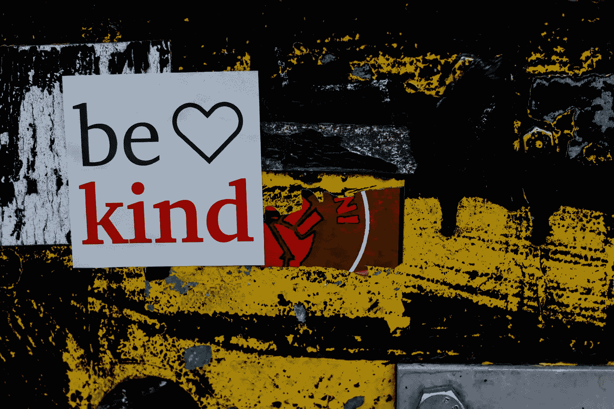

# 你可以用善意对抗新冠肺炎的三种方式

> 原文：<https://medium.datadriveninvestor.com/3-ways-you-can-fight-covid-19-with-kindness-1903d04a4306?source=collection_archive---------24----------------------->

Photo by [Randalyn Hill](https://unsplash.com/@randalynhill?utm_source=unsplash&utm_medium=referral&utm_content=creditCopyText)

灾难的非凡之处，新冠肺炎也不例外，是在这些毁灭性的时刻之中和之后，我们看到了人类令人难以置信的善举。人们开始自我组织，意想不到的社区聚集在一起，公司介入提供他们的商品、服务和人才。

我们不知道新冠肺炎会持续多久，也不知道后果会如何，但不管我们的文化、气候或环境如何，我们都在寻求真正的快速恢复。然而，作为一个社会，我们仍然努力导航什么是需要的，什么是可用的，以及这些需求和资源如何随着时间的推移而发生巨大变化。

 [## 摔倒不是失败。数据驱动的投资者

### 你只有在放弃的时候才会失败。每个英雄都会倒下，我们活着就是为了失败者出现的时刻；上升到…

www.datadriveninvestor.com](https://www.datadriveninvestor.com/2019/01/17/falling-isnt-failing/) 

[珠穆朗玛峰效应](https://www.everesteffect.com/)是一个简单的现代市场，旨在解决这一复杂的挑战。我们认为，虽然从灾难中恢复极其困难，但访问关键资源应该不难。

口罩和医疗用品正在成为头条新闻，但也有数百万人无法工作或购买关键物资。

**这里有三种方法可以让你用善意(和影响力)对抗新冠肺炎**

1.  **共享可信的信息和资源。**从远程医疗到电子学习，再到小型企业贷款，我们精心策划了一系列[可靠资源](https://www.everesteffect.com/events/)来帮助您完成各种类型的恢复。
2.  **通过我们的救济市场从沃尔玛购买重要物品。从新泽西州到加利福尼亚州，弱势群体急需物资。与沃尔玛合作，[查看](https://www.everesteffect.com/baskets/)一个实时资源列表，在该列表中，您的购买将 100%用于人们迫切需要的物品。**
3.  **展现个人和组织的新需求。**如果您认识某人或已受到新冠肺炎的严重影响，请访问[获取帮助](https://www.everesteffect.com/events/)查看并请求更多资源。如果你知道某个组织需要关键物资，向[hello@everesteffect.com](mailto:hello@everesteffect.com)发送请求，附上联系人姓名和潜在需求清单(如肥皂、尿布)。

让我们站起来。让我们团结起来。让我们一起用善良来终结新冠肺炎。