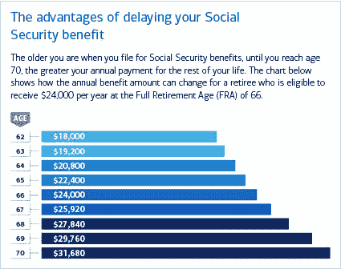
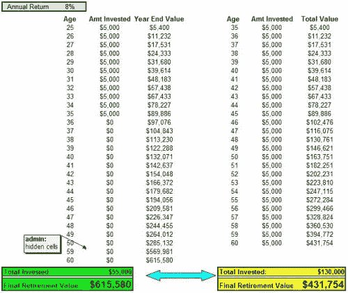

# 为退休生活投资的 3 种方式

> 原文：<https://medium.datadriveninvestor.com/3-ways-you-can-invest-for-a-great-retirement-859570a14c4d?source=collection_archive---------12----------------------->

## 没有比今天更好的开始时间了

Photo by [Toa Heftiba](https://unsplash.com/@heftiba?utm_source=unsplash&utm_medium=referral&utm_content=creditCopyText) on [Unsplash](https://unsplash.com/s/photos/beach?utm_source=unsplash&utm_medium=referral&utm_content=creditCopyText)

随着冠状病毒的持续，你可能已经忘记开始为即将到来的退休生活投资了。如果你还没有开始，这是开始的最佳时机。这场危机可能会让你偏离轨道一段时间，但现在是时候重新聚焦了。退休就在眼前，你需要开始为此做计划。

根据盖洛普民意测验，在美国，大约 55%的人投资于股票市场。根据人口普查，截至 2019 年 12 月，共有 3.3 亿公民，因此这些个人中大约有一半没有投资股票。希望这些人有另一项投资，可以在退休后动用。

确实有些人有公司的退休计划。美国人口普查局估计，三分之一的美国人投资 401K 计划。你可能有一个 401 K，一个针对联邦政府工作人员的节俭储蓄计划(TSP ),或者你公司类似的退休计划。根据 Edelman Financial Engines (EFE)的数据，大约一半有退休计划的人，这些工人没有为他们的退休做充分投资。埃菲社监管着近 300 家上市和私有公司。

富达估计，夫妇需要投资 285，000 美元来支付退休前和医疗费用。这个数字因人而异，取决于他们的生活方式和健康需求。根据[美国消费者新闻与商业频道](https://www.cnbc.com/2020/01/23/heres-how-much-americans-have-saved-for-retirement-at-different-ages.html)的数据，截至 2020 年 6 月，38%的 60 岁至 69 岁的人退休储蓄不足 10 万美元。

## 社会保障

你能靠每月 1400 美元生活吗？嗯，这是人们领取社会保障的平均金额。对于 24 个州来说，退休人员平均每月不到 1400 美元，三个州平均每月超过 1500 美元。没有一个州的平均收入超过 1600 美元。会有一些人收入高于平均水平，他们在工作期间可能有更高的收入。

如果你有自己的房子，汽车费用也付清了，1400 美元是可以应付的，但是有点紧。如果你想每个月都去旅行，这不会给你留下太多的余地。

延迟你的社会保障对你有利。你等待的时间越长，你从社会保险中得到的就越多。

Image by Merrill Edge

上图只是一个例子，并不能保证你在那个年龄能挣多少钱。社会保障是基于你工作时挣了多少钱。所以你的收益可能比显示的要高或低。

# 社会保障不是你的退休计划

如果你的国家为你制定了退休计划，你总是需要第二个退休计划，因为第一个可能并不总是足够的。社保也是一样。这说不通，但是社会保障从来没有打算在你 80 岁之前覆盖你，而现在我们看到人们活到 100 岁以上。根据维基百科的数据，1950 年，美国人的预期寿命是 69 岁。

随着人们寿命的延长，你有更大的机会花更多的时间接受医疗护理，这可能会变得非常昂贵。

花时间练习延迟满足，为你的退休做准备。许多人在 62 岁左右停止工作，这也是他们可以申请 T2 社会保障的最早年龄。这也是人们归档最多的年龄。

申请社会保障的时间越长，你的社会福利就越高。从今年开始，如果你等到 70 岁，你将得到最大可能的金额。

# 你越早投资，退休后就越好

如果你很早就开始投资，那很好。这将在以后的生活中得到回报。如果你还没有开始投资，不用担心。你还有时间。

当你 50 岁时，美国国税局允许你在个人退休账户上投资更多的钱。在 49 岁之前，你可以每年投资 6000 美元或每月 500 美元。在 50 岁时，有一个追补条款，允许你每年投资 7000 美元或每月 583.33 美元。

一个人越早投资，他们的钱复利和增长的时间就越长。你投资的钱总是在增加，尽管市场会有下跌或崩溃的时候。这是你想保持耐心，让你的钱继续投资的时候，因为市场通常会回到以前的位置。

Image by Darwins Finance

我总是认为投资就像坐过山车。上升的东西，必须下降才能再次上升。投资也是如此。你的投资会上升，下降，然后再上升。所以如果你不是一个有经验的投资者，最好不要管你的钱，不要关注你投资的不断波动。

# 迟到总比不到好

如果你还没有开始投资，这是开始投资的最佳时机。退休是你无法获得贷款的一个领域。

确保你有你的优先次序。一些父母可能想为他们的孩子上大学提供资金，但首先应该考虑他们的退休账户。学生总是可以得到一两笔贷款，并且有时间还清。

试图为退休申请贷款是不太可能的。正如我之前提到的，你首先需要支付自己。把你的一部分收入分配给你的退休，就像你必须支付你的抵押贷款、租金、汽车和电话账单一样。投资应该是对你的一个要求。

# 投资选择

你可能在想，你需要投资但不知道去哪里。今天有这么多的选择。你可以与金融专业人士合作，也可以自己投资。

## 股票经纪人或银行

你可以通过你的银行或金融机构，如美林、查尔斯·施瓦布或富达，去找投资经纪人。最近技术改变了这一点，人们可以通过电脑或手机进行投资。

一些独立的金融经纪人是罗宾汉、威布尔或 M1，他们都提供零基础交易。所以你可以在不产生费用的情况下进行交易。

## 标准普尔 500 指数

大多数股票分析师甚至那些有多年经验的人都很难战胜市场。因此，一个简单的选择是投资标准普尔 500，它跟踪当今的主要股票。标准普尔 500 代表标准普尔 500 指数，该指数包含纽约证券交易所或纳斯达克最大的 500 家公司。标准普尔 500 的公司是他们行业的领导者。

不要试图跑赢市场，只要投资市场目前正在做的事情。我们这个时代最伟大的投资者之一，沃伦·巴菲特，推荐这个。

## 个股

如果你有时间，那么你可以研究一下个股。根据你的年龄，这可能会有更大的风险，因为退休即将来临。所以这个我不能替你回答。

花点时间学会专注于为你的未来投资。不管你的国家有没有退休计划，你都需要自己的退休计划。

我写了几篇关于最佳股票的文章，如果你想投资个股，这些文章会给你一些选择。

 [## 6 月份投资的最佳股票

### 五只股票跑赢市场

medium.com](https://medium.com/datadriveninvestor/the-best-stocks-to-invest-in-june-9eb92961bf6d)  [## 7 月份投资的最佳股票

### 2020 年五只股票跑赢大盘

medium.com](https://medium.com/datadriveninvestor/the-best-stocks-to-invest-in-july-87bfd16e5b90) 

你有你的个人退休计划吗？

[**汤姆·汉迪**](https://medium.com/@tomhandy1) 是一位顶尖的投资和比特币作家，也是两个孩子的父亲。他从军队退役，并在几个非营利委员会任职。他出现在几个社交媒体频道上，你可以在 Twitter[*@ tomhandy 1*](http://www.twitter.com/tomhandy1)*和 Instagram [@tomhandy1](http://www.instagram.com/tomhandy1) 上找到他。*

*本文仅供参考。不应将其视为财务或法律建议。并非所有信息都是准确的。在做出任何重大财务决定之前，请咨询财务专家。*