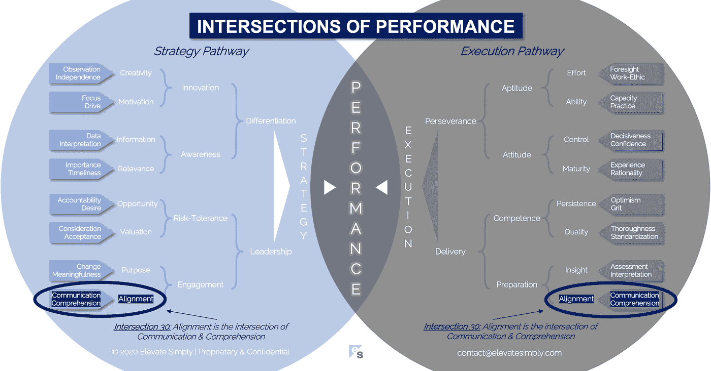

# 30.对齐:沟通与理解的交汇点

> 原文：<https://medium.datadriveninvestor.com/30-alignment-the-intersection-of-communication-comprehension-dc982a6d2b2?source=collection_archive---------16----------------------->

Image from 123rf.com

对于刚接触足球的人来说，最令人困惑的规则之一就是越位。这也是我鄙视坐在其他观众旁边看我女儿玩耍的原因之一。不理解它的人会在他们认为它要么发生了，要么没有发生的时候，不停地对裁判或球员大喊大叫。在这两种情况下，他们的意见都没有帮助。

当球传给对方时，如果他/她在对方半场最后一名防守队员的后面，那他/她就是越位。这是为了防止在对方球门前摘樱桃。这种混乱来自于这样一个事实，即越位发生在传球的球员一传球，而不是接球的球员接球的时候。大多数人只看到接发球球员拿到球的那一点，并且在那个时间点在最后一个防守球员的后面。

聪明的进攻球员会保持平衡或一步不越位，直到他们的队友传球，然后他们会试图超越防守队员拿到球。因此，如果他们足够快，就会出现他们一直越位的情况。

越位是防守使用的一个非常有效的工具。然而，与通常只有一名球员参与接球的进攻不同，在防守中，整条防守线必须同步，以便将对方困在越位位置。首席防守队员有责任让其他防守队员在精神上和身体上保持一致。没有对齐，几乎不可能困住对方越位，从而使减缓对方进攻的最佳战术工具之一失效。

团队合作，尤其是领导团队合作，在商业中也是至关重要的。如果领导者不一致，很可能团队的其他成员也不一致，这会导致低效、浪费、缺乏方向、沟通不畅和混乱。

**什么是线形交点？**

对齐是交流和理解的交集*(见下图 30 路口)*。没有理解的交流是空谈。没有交流的理解，就是把正确的答案留给自己。

协调是关于平衡你的领导团队的焦点、方向和节奏。它不总是意味着同意，但它意味着理解。

*通讯*

沟通似乎是结盟的一个明显组成部分。然而，根据我的经验，它的潜在效用经常被忽视或低估。人们渴望交流，并且经常觉得交流不够。具有讽刺意味的是，领导者只会通过更多的沟通和倾听来了解感知到的或实际的沟通问题。

沟通的关键是确保其与受众的相关性。与高层领导团队或董事会沟通不同于与中层管理团队、交付团队或外部利益相关者沟通。造成这种差异的原因不是因为能力，而是因为角色和最大化该角色绩效所需的信息。

交集 30:对齐=沟通+理解

Image by [Brett Simpson](https://medium.com/u/191cf90a65d7?source=post_page-----dc982a6d2b2--------------------------------)

*理解*

理解是指确保所传达的信息对受众来说是相关和适当的，并且能够被理解。当交流混乱，理解受到影响时，错位的可能性就会增加。理解是让团队在相同的结果和方法上达成一致。

当团队按照预期运行和交付时，可以观察到成功的理解。这将表明事实上理解了什么、为什么、何时、何地和如何的通信。每个人都有自己的角色，并理解这个角色及其在团队中的位置。当这种情况发生时，混乱和低效率被最小化。

**领导者能做什么？**

领导者必须沟通、沟通、沟通……考虑信息、受众、语气、相关性和细节。他们这样做不一定是为了获得认可，而是为了建立意识和理解。我的观察是，与那些缺乏沟通和/或理解的团队相比，具有强大沟通实践和高理解能力的团队能够更好地执行设计。

协调始于高层领导。领导者可以从确保领导团队内部的一致性开始，并为组织的其他成员树立榜样。

**总结&下一个**

结盟是关于焦点和共同前进的道路。结盟并不总是一致的同义词。有效的沟通和相关的理解创造了自上而下的一致。

这是性能系列交叉点中的第 30 个也是最后一个交叉点。感谢您的阅读。

在这一系列文章中，我们探索了性能的交叉点，共有 30 个。绩效的交叉点*框架基于*[*Brett Simpson*](https://www.linkedin.com/in/brettjsimpson/)*[*董事总经理*](https://www.linkedin.com/company/elevatesimply/) *的经验和见解，以及他作为企业家、顾问和投资者在大大小小的组织中 20 多年的领导经验。**

*点击订阅 DIntel [。](https://ddintel.datadriveninvestor.com/)*

*在这里加入我们的网络:[https://datadriveninvestor.com/collaborate](https://datadriveninvestor.com/collaborate)*