# 31 个如此相关的编程迷因，你会感到很有趣

> 原文：<https://medium.datadriveninvestor.com/31-programming-memes-that-are-so-relatable-and-you-will-rofl-9bf7aa0678d3?source=collection_archive---------0----------------------->

## 虽然听起来很好笑…

Burn Freddy Burn (Pic credits : Pinterest)

程序员的生活很艰难。有时我们是理智的，但其他时候太多的疯狂发生了。

下面是一些有趣的编程迷因，你可以完全理解。

# 其他一些最好的系列—

> [**三十天的机器学习 Ops**](https://medium.com/coders-mojo/day-1-of-30-days-of-machine-learning-ops-7c299e4b09be?sk=4ab48350a5c359fc157109e48b1d738f)
> 
> [**30 天自然语言处理(NLP)系列**](https://medium.com/coders-mojo/quick-recap-30-days-of-natural-language-processing-nlp-with-projects-series-ceb674e3c09b?sk=ca09b27b3d5867f23ab4dc367b6c0c32)
> 
> [**30 天数据工程与项目系列**](https://medium.com/coders-mojo/day-1-of-30-days-of-data-engineering-894822fcb128?sk=76ba558bfe2d9f85cbe741e505295531)
> 
> [**数据科学与机器学习研究(论文)简体**](https://medium.com/coders-mojo/day-1-data-science-and-ml-research-papers-simplified-a68b00a3b1c4?sk=56136229ff738bd734f19d2b6953f78c) ******
> 
> [**60 天数据科学与 ML 系列带项目**](https://medium.com/coders-mojo/day-1-day-60-quick-recap-of-60-days-of-data-science-and-ml-6fc021643d1?sk=4e75e043b7630a9f963562ebac94e129)
> 
> [**100 天:你的数据科学与机器学习学位系列与项目**](https://medium.com/coders-mojo/100-days-your-data-science-and-ml-degree-part-3-c621ecfdf711?sk=1a8c7b0c204d73432d56b7d1a3a26474)
> 
> [**你应该知道的 23 个数据科学技巧**](https://ai.plainenglish.io/23-data-science-techniques-you-should-know-61bc2c9d1b3a?sk=1680c36193eb22198974c9008d62a33c)
> 
> [**技术面试系列—编码问题精选清单**](https://medium.com/coders-mojo/mega-post-tech-interview-the-only-list-of-questions-you-need-to-practice-ee349ea197bb?sk=fac3614684daff4b50a70c0a71e4d528)
> 
> [**用最热门的问题系列**](https://medium.com/coders-mojo/system-design-made-easy-quick-recap-of-complete-system-design-34af7e3aedfb?sk=bdd6a19edc1f3ce4a5064923f5b68721) 完成系统设计
> 
> [**完成数据可视化及预处理系列与项目**](https://medium.com/coders-mojo/complete-data-preprocessing-and-data-visualization-with-projects-mega-compilation-part-2-41584ef0920e?sk=842390da51689b8d43148c3980570db0)
> 
> [**完成 Python 系列与项目**](https://medium.com/coders-mojo/complete-python-and-projects-mega-compilation-7ec8f7adfe71?sk=ee0ecf43f23c6dd44dd35d984b3e5df4)
> 
> [**完成高级 Python 系列与项目**](https://medium.com/coders-mojo/complete-advanced-python-with-projects-mega-compilation-part-6-729c1826032b?sk=7faffe20f8039fa57099f7a372b6d665)
> 
> [**Kaggle 最会教你的笔记本**](https://medium.com/coders-mojo/my-list-of-kaggle-best-notebooks-topic-wise-data-science-and-machine-learning-part-2-84772863e9ae?sk=5ed02e419854a6c11add3ddc1e52947f)
> 
> [**Git 开发人员完整指南**](/the-complete-developers-guide-to-git-6a23125996e1?sk=e30479bbe713930ea93018e1a46d9185)
> 
> [**打赏 Github Repos**](https://medium.com/coders-mojo/6-exceptional-github-repos-for-all-developers-part-1-21e8fa04e150?sk=9140b249af6fe73d45717185fad48962)**—Part 1**
> 
> [**打赏 Github Repos**](https://medium.com/coders-mojo/6-exceptional-github-repos-for-all-developers-part-2-3eec9a68c31c?sk=8e31d0eb7eb1d2d0bbbcecaa66bd4e7e) **—第二部**
> 
> [**所有数据科学和机器学习资源**](/best-resources-for-data-science-and-machine-learning-full-list-5ceb9a2791bf?sk=cf85b2cef95560c58509877a794577ff)
> 
> [**210 机器学习项目**](/210-machine-learning-projects-with-source-code-that-you-can-build-today-721b035649e0?sk=da5f593572a0261a6314afad99a0356c)

## 科技时事通讯—

> 如果你感兴趣，你可以加入我的时事通讯，通过它我向超过 30，000 名读者发送技术面试技巧，技术，模式，黑客——软件开发，ML，数据科学，创业公司和技术项目。可以订阅 **Tech Brew :**

 [## 点火器

### 数据科学，人工智能，人工智能和更多…点击阅读由 Naina Chaturvedi 撰写的 Ignito，子堆栈出版物。推出 7 个月…

naina0405.substack.com](https://naina0405.substack.com/) 

## Github —

 [## 编码器-world 04-概述

### 此时您不能执行该操作。您已使用另一个标签页或窗口登录。您已在另一个选项卡中注销，或者…

github.com](https://github.com/Coder-World04) 

给你—

## 1.因为我是 G-root

Pic credits : Pinterest

 [## 编写高效的 Python 代码—第 2 部分

### 使用这些技巧和技术…

naina0412.medium.com](https://naina0412.medium.com/writing-efficient-python-code-part-2-4bf876712677) 

## 2.堆栈溢出是救世主。同意吗？

Pic credits : Pinterest

 [## Python 中的统计简介—第 1 部分

### 统计很容易…真的吗？

medium.datadriveninvestor.com](/introduction-to-statistics-in-python-part-1-14e69ef05abe) 

Pic credits : Pinterest

 [## 使用 Python、OpenCV 和 NumPy 分析视频

### 通过代码实现…

naina0412.medium.com](https://naina0412.medium.com/analyzing-video-using-python-opencv-and-numpy-5471cab200c4) 

Pic credits : Reddit

## 3.是我的代码吗？

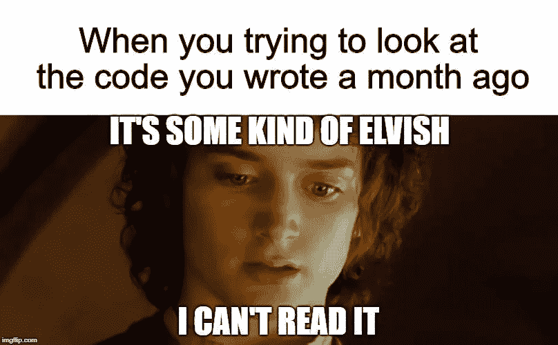

Image credits : Imgflip

 [## 程序员 vs 普通人

### 用 20 幅图像概括…你能理解吗？

medium.datadriveninvestor.com](/programmers-vs-normal-people-bf387b5be11c) 

## 4.男生女生还是程序员？

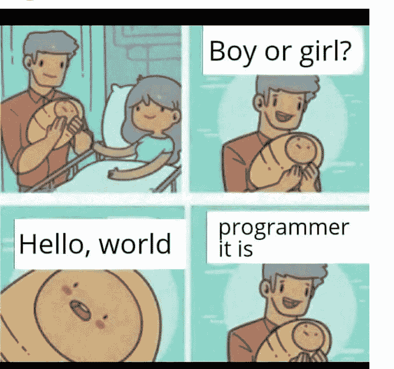

Pic credits : Pinterest

奖金—

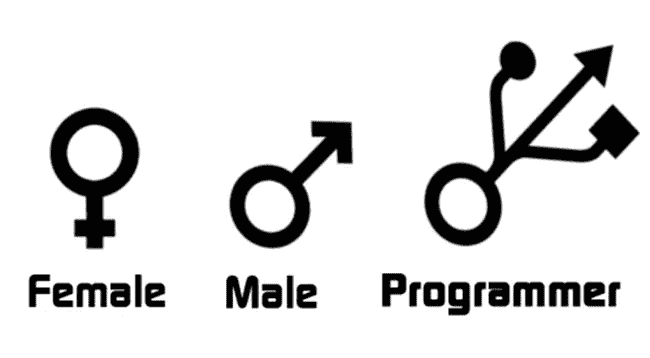

Pic credits : Pinterest

 [## 如果编程语言是《权力的游戏》中的角色会怎样

### 最后一个很搞笑…

medium.com](https://medium.com/datadriveninvestor/what-if-programming-languages-were-game-of-thrones-characters-ffc2c3018841) 

## 5.关于编程语言的一切

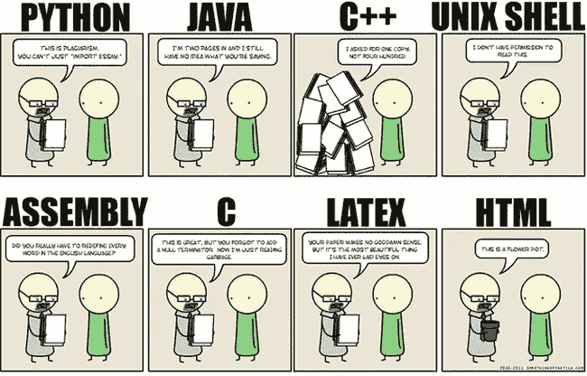

Pic credits : Pinterest

 [## 6 面向所有开发者的特殊 GitHub 回购—第二部分

### 把它加入书签…它会给你很大的帮助

naina0412.medium.com](https://naina0412.medium.com/6-exceptional-github-repos-for-all-developers-part-2-3eec9a68c31c) 

## 6.编程的真正阶段

Pic credits : Pinterest

 [## 这个清洁工在被脸书拒绝后，花了 190 亿美元开发了这个应用

### 难以置信的鼓舞人心的旅程…

medium.com](https://medium.com/datadriveninvestor/this-cleaner-built-19-billion-app-after-getting-rejected-from-facebook-9efc884746a7) 

## 7.Linux 就是爱！

Pic credits : Pinterest

 [## Stack Overflow 分析了来自 60，000 多名软件开发人员的数据，包括他们的工作时间、语言…

### 以下是他们的发现…

medium.com](https://medium.com/datadriveninvestor/stack-overflow-analyzed-data-from-60-000-software-developers-hours-they-work-languages-they-476ac6ca0197) 

## 8.魔门传奇

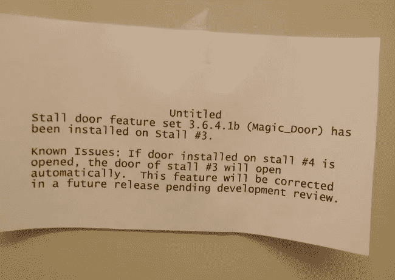

Pic credits : Pinterest

 [## 6 面向所有开发者的特殊 GitHub 回购—第 1 部分

### 把它加入书签…它会给你很大的帮助

medium.com](https://medium.com/coders-mojo/6-exceptional-github-repos-for-all-developers-part-1-21e8fa04e150) 

## 9.我们存在的故事

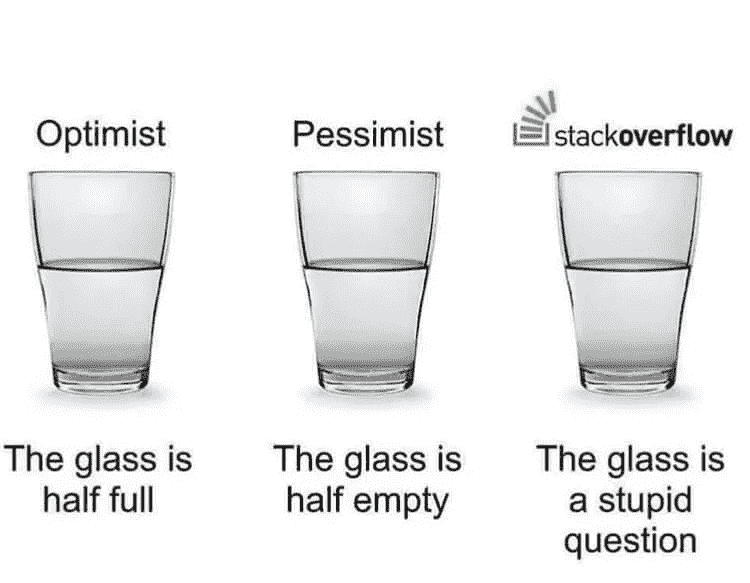

Pic credits : Pinterest

## 10.初始化？

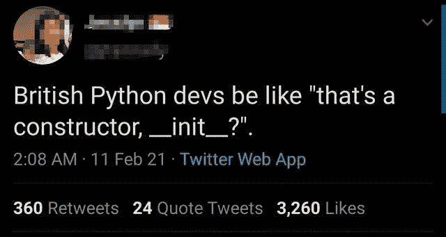

Pic credits : Pinterest

## 11.鸡蛋谢谢！

Pic credits : Pinterest

## 12.困扰我们的梦

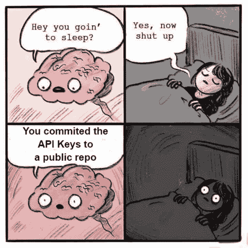

Pic credits : Pinterest

## 13.Github 确实有贡献！

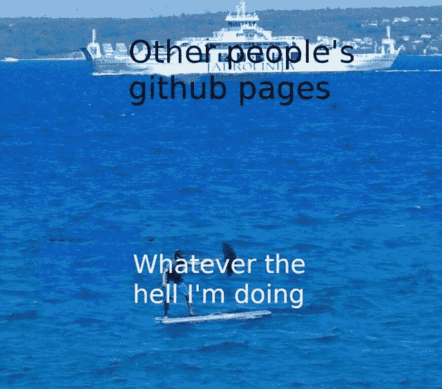

Pic credits : Pinterest

## 14.搞什么鬼？

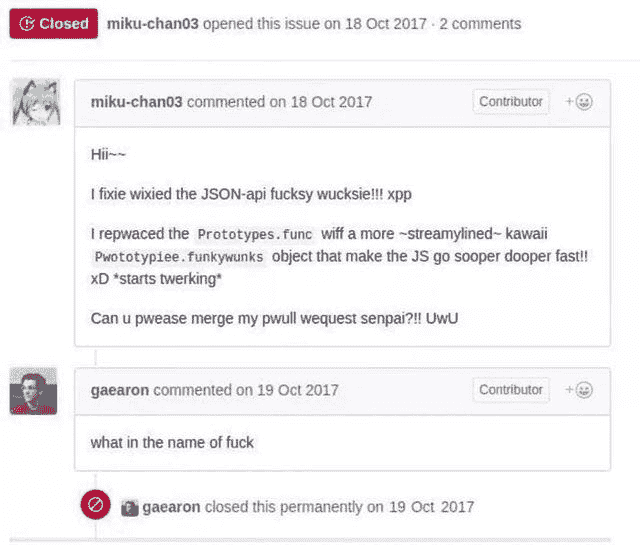

Pic credits : Reddit

 [## Hacker Rank 分析了来自 10 万多名开发人员和招聘经理的数据——以下是我的发现

### 来自 100，000 多名开发人员和招聘经理的出色分析结果

medium.com](https://medium.com/datadriveninvestor/hacker-rank-analyzed-data-from-100k-developers-and-hiring-managers-here-is-what-i-found-a374b98e937e) 

## 15.git 推送来源管理

Pic credits : Pinterest

## 16.这些“不断”的战斗

Pic credits : Pinterest

## 17.知道这种感觉吗？

Pic credits : Pinterest

## 18.采用

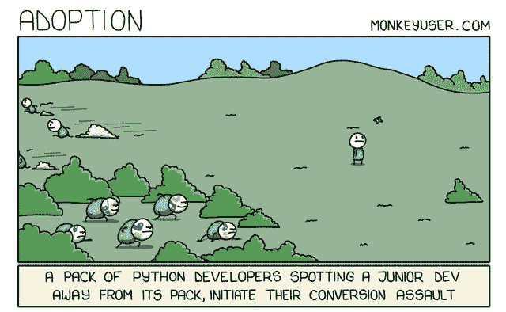

Pic credits : Monkeyuser

## 19.标题如下…

Pic credits : Pinterest

## 20.大学请注意这一点

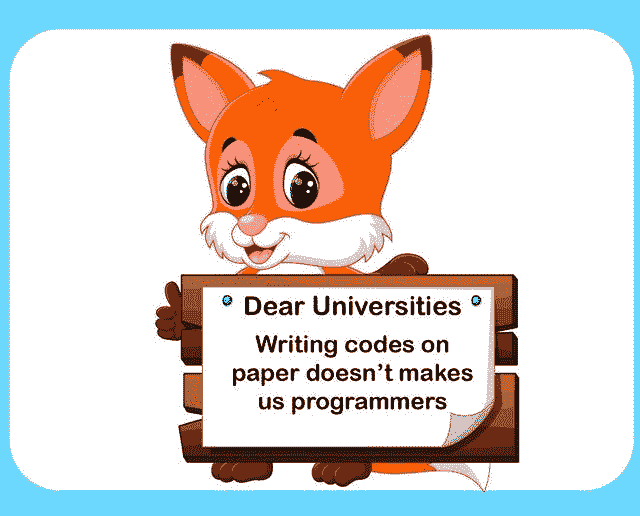

Pic credits : Pinterest

## 21.知道这种感觉吗？

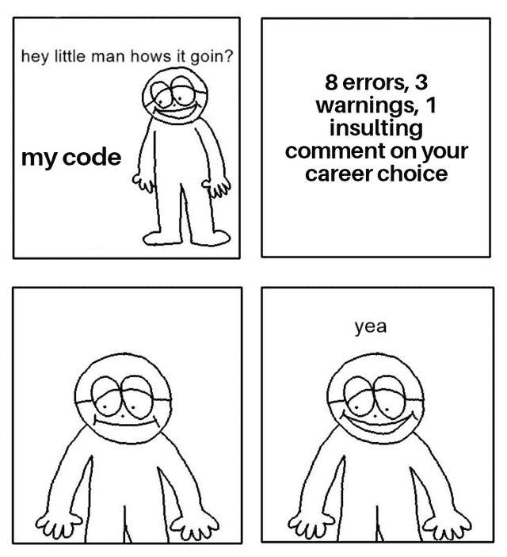

Pic credits : Reddit

## 22.Windows shits

Pic credits : Pinterest

## 23.复制粘贴并执行；)

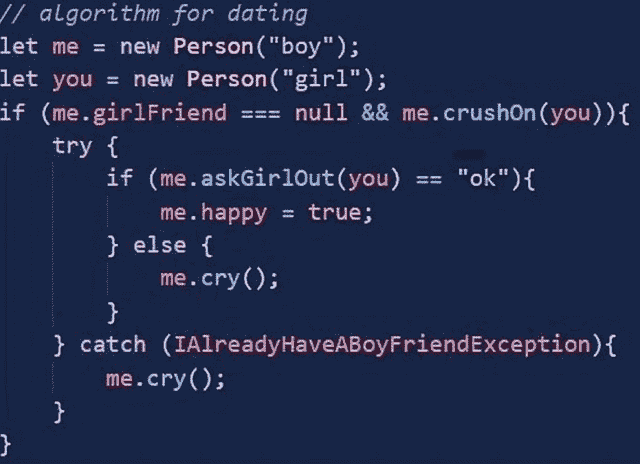

Pic credits : Reddit

## 24.重要的信息

Pic credits : Pinterest

## 25.该死的。

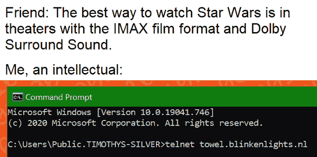

Pic credits : Pinterest

## 26.ML 就像

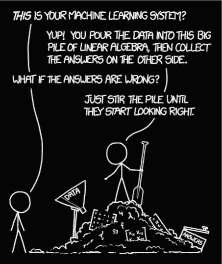

Pic credits : Reddit

## 27.疫苗接种运动

Pic credits : Pinterest

## 28.提示

Pic credits : Reddit

## 29.电晕前的场景

Pic credits : Reddit

## 30.回路

Pic credits : Reddit

## 31.JS 纲要

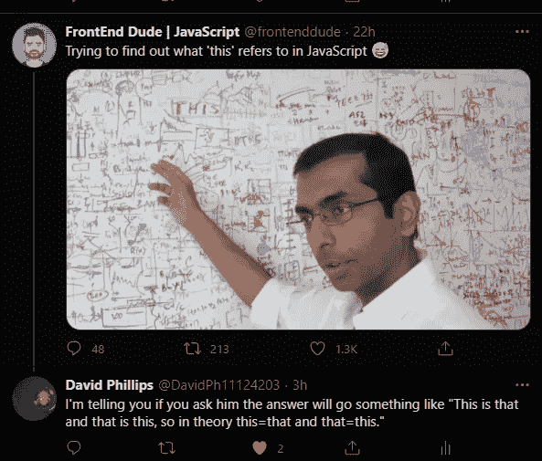

Pic credits : Reddit

*感谢阅读。继续编码:)*

*演职员表:Reddit*

# 想看程序员幽默？

 [## 编程幽默第 2 部分

### 继续笑，因为太搞笑了…

medium.com](https://medium.com/datadriveninvestor/programming-humor-part-2-f92cf5a26f2b)  [## 史上最搞笑的代码注释

### 程序员幽默:是的，实际上是程序员写的！

medium.com](https://medium.com/datadriveninvestor/the-most-hilarious-code-comments-ever-bae3cb1030b5)  [## 编码原罪:令人捧腹的开发者自白

### “白板”是如何被嘲笑的

medium.com](https://medium.com/datadriveninvestor/coding-sins-hilarious-developer-confessions-f55eb342454e)  [## 10 个让你着迷的诙谐编程笑话

### 这些太搞笑了…

medium.com](https://medium.com/datadriveninvestor/10-witty-programming-jokes-that-will-make-you-go-rofl-a53fbfb91943) 

# 推荐文章-

 [## Python 迭代器、生成器和装饰器变得简单

### 快速实施指南

medium.com](https://medium.com/python-in-plain-english/python-iterators-generators-and-decorators-made-easy-659cae26054f)  [## 你应该知道的 23 种数据科学技术！

### 使用这些技巧来节省你的宝贵时间

medium.com](https://medium.com/ai-in-plain-english/23-data-science-techniques-you-should-know-61bc2c9d1b3a)  [## 编码原罪:令人捧腹的开发者自白

### “白板”是如何被嘲笑的

medium.com](https://medium.com/datadriveninvestor/coding-sins-hilarious-developer-confessions-f55eb342454e)  [## 面向数据科学家的 5 项酷炫先进熊猫技术

### 使用这些技巧…

medium.com](https://medium.com/datadriveninvestor/5-cool-advanced-pandas-techniques-for-data-scientists-c5a59ae0625d)  [## Stack Overflow 分析了来自 60，000 多名软件开发人员的数据，包括他们的工作时间、语言…

### 以下是他们的发现…

medium.com](https://medium.com/datadriveninvestor/stack-overflow-analyzed-data-from-60-000-software-developers-hours-they-work-languages-they-476ac6ca0197)  [## 高级 Python 变得简单—第 4 部分

### 使用这些技巧和技术…

medium.com](https://medium.com/datadriveninvestor/advanced-python-made-easy-part-4-a4996ba9fe19)  [## 高级 Python 变得简单—第 1 部分

### 使用这些技巧和技术…

medium.com](https://medium.com/datadriveninvestor/advanced-python-made-easy-part-1-ce1e2f17431e)