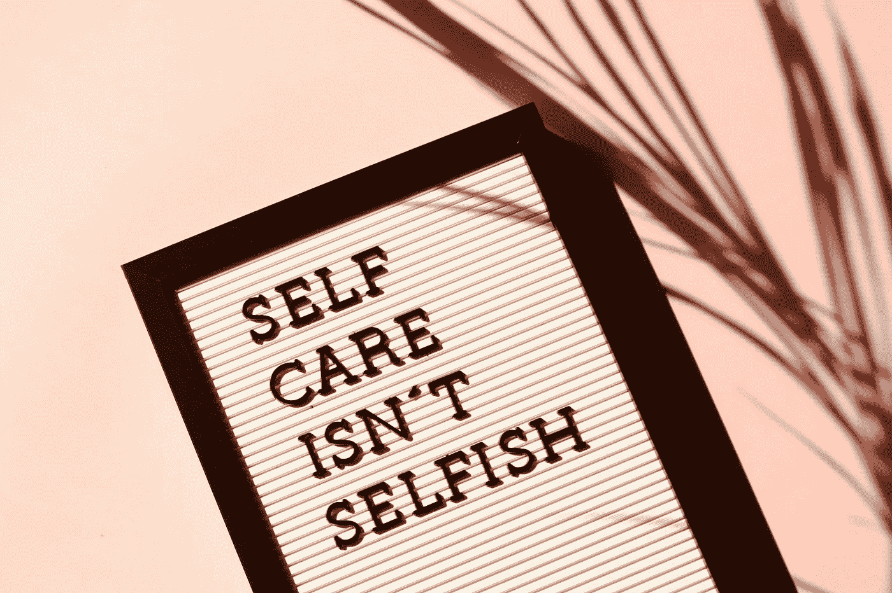
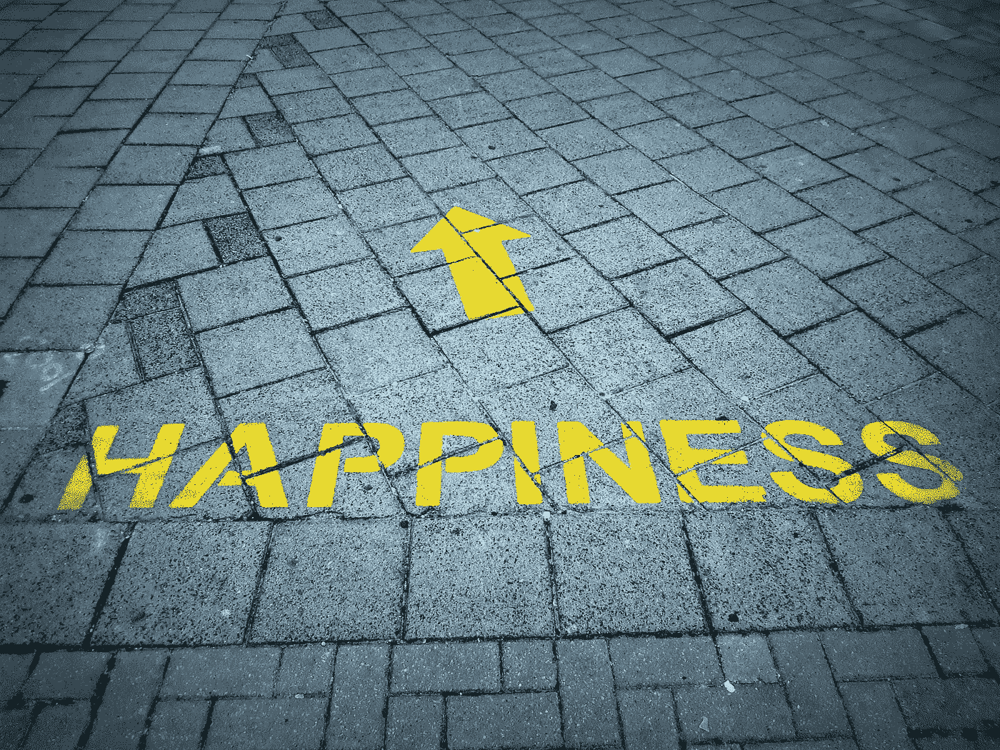

# 你应该为自己做的 35 件有益的事情

> 原文：<https://medium.datadriveninvestor.com/35-beneficial-things-you-should-do-for-yourself-7824dda0c44?source=collection_archive---------7----------------------->

#24.成为乐观的镜子。

Photo by [Madison Inouye](https://www.pexels.com/@mdsnmdsnmdsn?utm_content=attributionCopyText&utm_medium=referral&utm_source=pexels) from [Pexels](https://www.pexels.com/photo/self-care-isn-t-selfish-signage-2821823/?utm_content=attributionCopyText&utm_medium=referral&utm_source=pexels)

跟着我说——为了支持你关心的人，你也必须支持你自己。

我相信你已经知道了。但是理解和遵循这个建议是有区别的。

我们都处在疫情的正中央，在家工作，加班做重要的工作，或者，如果时局艰难，在经济低迷时期寻找新的工作。在疯人院里挤出时间来照顾自己可能感觉有点自私、不必要，甚至是不负责任。

然而，如果不加更多的油，你就开不了多远。也就是说，每个人都很紧张，不知所措。就像高中毕业生在舞会之夜一样，事情进展得有点太快了。

如果你不能对自己表示同情，就不可能成为你想成为的父母、配偶、上司和朋友。因此，给自己留一点余地至关重要——有机会偿还你所有的精神、情感和身体贷款，这样你就可以假装一切都没有发生过。

不，我不是说放弃你的事业和家庭或者以娱乐的名义忽略你的承诺。但并不是所有事情都必须像激光一样专注和高效。你可以抽出时间来培养专注的习惯，尝试新的爱好，中午散步，给朋友打电话，离开舒适区——所有这些行动都可以让你得到改善。

 [## 当谈到个人发展|数据驱动的投资者时，不要再用这些借口了

### "百分之九十九的失败来自那些习惯找借口的人."―乔治·华盛顿·卡弗……

www.datadriveninvestor.com](https://www.datadriveninvestor.com/2019/11/25/stop-using-these-excuses-when-it-comes-to-personal-development/) 

因为这个世界还需要另一个物品，我已经炮制了 35 个有意识的行动，你可以在这些最糟糕的时候送给自己。我试图避开一些老生常谈的建议——你已经知道你应该每天喝 5000 加仑的水，T2 应该更经常地微笑。我的许多想法不会吸引你。有些可能会让你觉得我是个书呆子(罪名成立)。IDGAF。我希望你能在这里找到*的东西*，带你回到最好的、真实的自己，并在现代生活的混乱中找到一点安慰。

1.允许自己有创造力。掸掉你阁楼上吉他的灰尘，创作一首新歌。发掘你未完成的小说并完成它。和你的孩子一起用手指画。把你内心孩子的标记还给你，给你窒息的感觉一个呼吸的机会。

2.停止等待完美的时刻。开始你的挑战，让事情从那里开始。

3.每周至少穿一次野袜子，一条古怪的领带，一顶可笑的帽子，或者一件可笑的 t 恤。这会帮助你不要把自己看得太重。

4.打开你的手机和社交媒体账户。删除你所有的有毒联系人。继续前进，过好自己的生活。过会儿谢谢我。

5.分享好消息而不是流言蜚语。人们会先把你的名字写在谣言里，然后再把你的名字写在祈祷词里。尽你的一份力量来阻止这个循环。

6.[走出去尖叫](https://forge.medium.com/my-anxiety-relief-is-a-5-minute-scream-every-morning-543957da6cde)或哭一场，因为 2020 年糟透了，你应该得到一次情感释放。

7.解决每天困扰你的一件小事:润滑吱嘎作响的门，拧紧松动的把手，擦掉窗台上舒适的灰尘，或者归还你借的工具。解决这些让你抓狂的小细节。一个月后，你会惊奇地发现生活改善了，烦恼少了 30 件。

Photo by [madison lavern](https://unsplash.com/@yogagenapp?utm_source=unsplash&utm_medium=referral&utm_content=creditCopyText) on [Unsplash](https://unsplash.com/s/photos/self-care-black-people?utm_source=unsplash&utm_medium=referral&utm_content=creditCopyText)

8.[每个月至少尝试一种新的食谱。](https://southtree.com/blogs/artifact/did-you-know-cooking-a-meal-is-actually-good-for-your-mind-not-just-your-stomach)不知道做饭或者烘焙？好吧，这将会给你一个慢慢学习的开始。

9.失信招致心碎。重新致力于信守诺言。

10.不要用虚伪的谦逊把自己变成一个合成的烈士。停止收集谦虚点和假装满足。你在欺骗自己和这个世界。别说了。求你了。

11.把你两年或两年以上没穿过的衣服都装起来，捐赠出去。你会欣赏减少的杂乱，而处于奋斗模式的人会在你被抛弃的时尚宝石中找到快乐。尤其是有外套的时候。外面有人需要你没用过的外套。

12.不要害怕承认你想从生活中得到什么。拥有你的雄心。

13.当你回忆往事时，每听一张旧唱片，就听一张对你来说完全陌生的唱片；继续拓展你的视野，不要只活在过去。实现和看电影一样的概念。虽然令人欣慰，但怀旧是一种虚假的安全感。戒掉它。

14.想想你有一段时间没联系的朋友或亲戚，给他们打个电话或发条信息。不要低估即兴谈话或自发文本的乐趣。

15.不要一直跑，直到你的电池耗尽。正如妮娜·西蒙曾经说过的，“你用尽你所拥有的一切，试图给每个人他们想要的。”了解自己的极限，让自己不要筋疲力尽——永远为自己留些能量。有时候，我们不得不说“是”,这很难，因为我们都想成为每个人的一切，但就是做不到。

16.晒晒太阳。散步，做运动，或者做园艺工作。只要你泡在一些光线里就没关系。如果你能想出如何在白天工作的同时享受阳光，那就加分了。

17.永远不要错过学习新事物或发展才能的机会。自我提升永远是明智的投资。

18.[当你生气的时候，去吃个苹果。](https://www.fatherly.com/love-money/fight-better-relationship-if-you-hate-conflict/)如果你没有苹果，那就赶紧开车去买一个。一旦你啃完了水果的核心，评估一下你是否还在生气。如果你是，那就让那个冒犯你的人听到，不加审查。如果没有，就和他们谈一谈。

19.重新教你自己如何做梦，以便退出你可能被困在里面的任何噩梦。

20.花 15 分钟清理你的汽车或者整理你家里杂乱的抽屉。你知道我说的是哪个抽屉。

Photo by [Denise Jones](https://unsplash.com/@cooljonez?utm_source=unsplash&utm_medium=referral&utm_content=creditCopyText) on [Unsplash](https://unsplash.com/s/photos/happiness?utm_source=unsplash&utm_medium=referral&utm_content=creditCopyText)

21.拥抱与他人一起工作。孤独天才的概念是一个神话。我们不能独自完成最好的工作。与他人合作，学习交流新思想。

22.破译你的道德准则。确保它没有矛盾和双重标准。你不会想用逆向逻辑来逆向设计一些无力的理由来安抚你的良心。

23.午饭后小睡 20 分钟来补充能量。在下午的崩溃有机会破坏你的动力之前，阻止它。

24.[成为乐观的镜子。吸收你需要的所有正能量，然后反射剩余的光，让世界尽情狂欢。](https://medium.com/datadriveninvestor/choose-optimism-even-when-nobody-else-is-6e41c467c7b9?source=friends_link&sk=e5d927fb83b6298c8f82f2fe28840729)

25.杂乱=压力。在开始新的一天之前，收拾好工作场所的杂物，为你的生活增添一丝快乐。你的精力和态度会因此变得更好。

26.给自己打打气。你可能会花时间激励你的伴侣、孩子、员工和伙伴。给自己一些赞美和灵感也是可以的。

27.决心不要想太多。不要让怀疑阻止你去尝试那些可以缓解你的紧张、焦虑和沮丧的事情。让自己有机会获得你应得的平静和满足的感觉，不管你的想法有多分散。

28.向年长的人寻求建议。那些人很久以前就知道如何接受他们到来的祝福，以及如何度过他们永远不会到来的日子。从他们的剧本中借鉴几页对我们都有好处。

29.读一本看起来很有挑战性的书或者报一个看起来很难的班。不要回避那些促进学习和成长的事情。

30.停止消费互联网上的所有东西。观察你的思想和情绪，淡化所有增加你负面情绪的内容——社交媒体、YouTube、迷因、论坛、新闻或任何其他在线内容。

31.限制你说“对不起”的频率只有在真正需要道歉的时候才道歉。

32.在一天开始的时候优先安排一个好的热身活动，为你将要面对的挑战做好身心准备。伸展运动、冥想、祈祷、填字游戏、快速锻炼——任何对你有用的事情。只要你在表演前调好乐队。

33.开始认真对待健身。但是永远不要向别人提及你的新锻炼养生法或饮食。让结果为你说话。

34.当你饿了或者没有购物清单的时候，不要去购物。你最终会购买各种各样的垃圾——垃圾食品和你家里不需要的垃圾(即杂物，见第 25 条)。

35.像原谅别人一样原谅自己。与其责备自己，不如发誓下次会做得更好。它更健康，关注未来(你可以改变)，而不是过去(固定不变)。

**阿德里安·s·波特**是一名作家、工程师、顾问和演说家。他写诗歌、短篇小说和各种主题的文章，包括创造力和个人成长。他是诗集《T4》和散文集《自我手册》的作者。在[http://adrianspotter.com/](http://adrianspotter.com/)在线拜访他。

# 附加文字

[你真了不起](https://medium.com/datadriveninvestor/you-are-amazing-274651127432?source=friends_link&sk=34312c5fa72f2109d6031c2a4b7c2e4c)

[选择乐观(即使别人都不乐观)](https://medium.com/datadriveninvestor/choose-optimism-even-when-nobody-else-is-6e41c467c7b9?source=friends_link&sk=e5d927fb83b6298c8f82f2fe28840729)

[重拾你的微笑](https://medium.com/datadriveninvestor/reclaim-your-smile-581299776ab6?source=friends_link&sk=0d817a588351a9f25ba89096bea526f4)

**访问专家视图—** [**订阅 DDI 英特尔**](https://datadriveninvestor.com/ddi-intel)