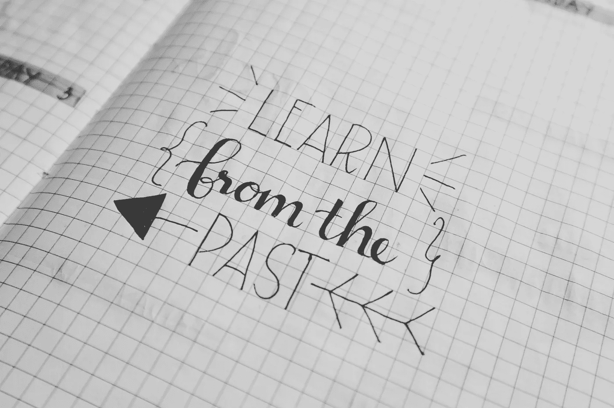
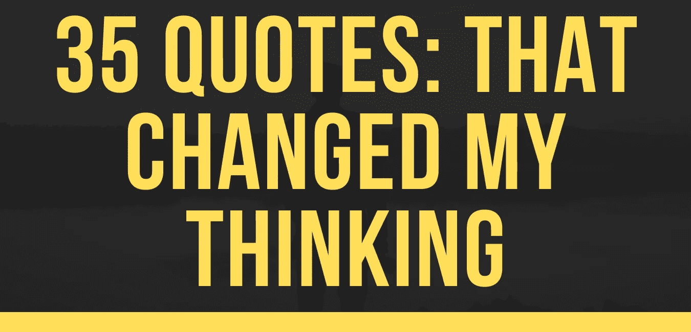

# 35 句名言:这彻底改变了我的想法。

> 原文：<https://medium.datadriveninvestor.com/35-quotes-that-revolutionised-my-thinking-e9dac6cc979d?source=collection_archive---------14----------------------->

这些年来，我遇到了太好的文学作品，以至于不能不坚持下去，但因为这几乎不可能带着一大堆书到处走，我开始转录对我来说最突出的引文。这里是我多年来收集的 35 条引文，它们极大地改变了我的思维方式。它们没有特定的顺序，只是我收集它们的顺序。

*带着问候，*[Aneeqe a . Khan](http://aneeqekhan.com)

> “那些疯狂到认为自己可以改变世界的人，才是真正改变世界的人。”— **史蒂夫·乔布斯**
> 
> “如果你总是做你一直做的事情，你就会一直得到你一直得到的东西。”— **亨利·福特**
> 
> 活着就是受苦，生存就是在苦难中寻找意义。— **弗里德里希·尼采**
> 
> “成为你想在世界上看到的改变。”— **圣雄甘地**
> 
> “尽管相信自己总是最好的，但来自他人的一点点帮助也可能是一大幸事。”— **艾罗叔叔**
> 
> “优于你的同伴没有什么高贵的；真正的高尚是超越过去的自己。”― **欧内斯特·海明威**
> 
> “我们是朋友吗？还是我们是敌人？那种事你们自己决定吧！”——**路飞**
> 
> “我们就是我们反复做的事情。那么，优秀不是一种行为，而是一种习惯”——亚里士多德
> 
> "哪里没有笑声，哪里就没有成功。"安德鲁·卡内基
> 
> "如果试图排外，任何文化都无法生存。"— **圣雄甘地**
> 
> "当你期待事情发生时——奇怪的是——它们真的发生了。"— **摩根大通**
> 
> “只有把问题简化成某种简单的形式，问题才能得到解决。将模糊的困难转化为具体的、具体的形式是思维中一个非常重要的因素。”— **摩根大通**
> 
> “如果非要问多少钱，你是买不起的。”— **摩根大通**
> 
> 如果你认为你能做一件事或认为你不能做一件事，你是对的。— **亨利·福特**
> 
> 不要挑毛病，找补救办法；任何人都可以抱怨。— **亨利·福特**
> 
> "没有纪律和一致性，就无法实现通往成功之路的目标."——**丹泽尔·华盛顿**
> 
> 生活吧，就像你有了第二次生命，就像你第一次做错了什么。维克多·e·弗兰克
> 
> 如果你想改变世界，从整理床铺开始- **威廉·h·麦克雷文**
> 
> “你没有达到你的目标。你会下降到你的系统的水平。”― **詹姆斯清除**
> 
> 找到平衡是赢得生活的关键— **我的妈妈。**
> 
> 剪个漂亮的发型——**我 9 岁的妹妹**
> 
> "专注于高效而不是忙碌."― **蒂姆·菲利斯**
> 
> 你应该问的问题不是，“我想要什么？”或者“我的目标是什么？而是“什么会让我兴奋？”― **蒂莫西·费里斯**
> 
> “权力来自于需求，而不是欲望。你必须创造这种需求。”— **悟空**
> 
> 当你想要某样东西时，整个宇宙都会帮你实现它。”― **保罗·柯艾略**
> 
> “所有人都有恐惧，但勇敢的人会放下恐惧，勇往直前，有时会走向死亡，但总会走向胜利。”戴尔·卡内基
> 
> “最高尚的艺术是使他人快乐的艺术”――p . t .巴纳姆
> 
> 黑暗不能驱逐黑暗；只有光能做到。仇恨不能驱逐仇恨；只有爱能做到。— **马丁·路德·金**
> 
> “我们不需要魔法来改变世界，我们内心已经拥有了所有我们需要的力量:我们有能力想象得更好。”J.K .罗琳
> 
> 成功是一种从失败走向失败而不丧失热情的能力。”——**温斯顿·丘吉尔**
> 
> 如果你仔细观察，你会发现大多数一夜成名都需要很长时间。”——**史蒂夫·乔布斯**
> 
> 永远不要后悔任何让你微笑的事情。马克·吐温
> 
> 当坚不可摧的岩石不再那么坚固，钢铁之门不再那么坚固，但时间会腐朽——威廉·莎士比亚
> 
> “未来属于那些相信梦想之美的人。”埃莉诺·罗斯福